# Mybatis

- JDBC
- Mysql
- Java基础
- Maven
- Junit

框架：配置文件，最好的方式：看官网

## 1、简介

### 1.1、什么是Mybatis

- MyBatis 是一款优秀的**持久层框架**
- 它支持自定义 SQL、存储过程以及高级映射。
- MyBatis 免除了几乎所有的 JDBC 代码以及设置参数和获取结果集的工作。
- MyBatis 可以通过简单的 XML 或注解来配置和映射原始类型、接口和 Java POJO（Plain Old Java Objects，普通老式 Java 对象）为数据库中的记录。

- MyBatis本是apache的一个[开源项目](https://baike.baidu.com/item/开源项目/3406069?fromModule=lemma_inlink)iBatis，2010年这个项目由apache software foundation迁移到了[google code](https://baike.baidu.com/item/google code/2346604?fromModule=lemma_inlink)，并且改名为MyBatis。
- 2013年11月迁移到[Github](https://baike.baidu.com/item/Github/10145341?fromModule=lemma_inlink)。

如何获取Mybatis？

- maven仓库

```xml
<dependency>
    <groupId>org.mybatis</groupId>
    <artifactId>mybatis</artifactId>
    <version>3.5.15</version>
</dependency>
```

- GitHub

### 1.2、持久化

数据持久化

- 持久化就是将程序的数据在持久状态和瞬时状态转化的过程
- 内存：**断电即失**

- 数据库（jdbc），io文件持久化

**为什么要持久化**？

有一些对象，不能让他丢掉

- 内存太贵了

### 1.3、持久层

Dao层，Service层，Controller层

- 完成持久化工作的代码块
- 层是界限十分明显的

### 1.4、为什么需要mybatis

- 帮助程序员将数据存入数据库

- 方便
- 传统的jdbc代码太复杂，简化，框架。自动化
- 不用Mybatis也可以，只是更容易上手，技术没有高低之分，只有使用之人
- 优点：
  - 简单易学
  - 灵活
  - sql和代码的分离，提高了可维护性
  - 提供映射标签，支持对象与数据库的orm字段关系映射
  - 提供对象关系映射标签，支持对象关系组建维护
  - 提供xml标签，支持编写动态sql

最重要的一点还是：使用的人多

## 2、第一个mybatis程序

思路：搭建环境-->导入mybatis-->编写代码-->测试

### 2.1、搭建环境

**2.1.1、搭建数据库**

```mysql
create database `Mybatis`;
use `Mybatis`;
CREATE TABLE `user`(
	`id` INT(20) NOT NULL,
    `name` VARCHAR(30) DEFAULT NULL,
    `pwd` VARCHAR(30) DEFAULT NULL,
    primary key (`id`)
)engine=INNODB DEFAULT charset=utf8;

INSERT INTO `user` (`id`,`name`,`pwd`) values
(1,'张三','12'),
(2,'李四','1234'),
(3,'王五','123456')
```

**2.1.2、新建项目**

1. 新建一个普通的Maven项目

2. 删除src项目
3. 导入maven依赖

```xml
<!--        mysql驱动-->
<dependency>
    <groupId>mysql</groupId>
    <artifactId>mysql-connector-java</artifactId>
    <version>8.0.33</version>
</dependency>
<!--        mybatis-->
<dependency>
    <groupId>org.mybatis</groupId>
    <artifactId>mybatis</artifactId>
    <version>3.5.15</version>
</dependency>
<!--        junit-->

</dependencies>
<build>
    <!-- 资源目录 -->
    <resources>
        <resource>
            <!-- 设定主资源目录  -->
            <directory>src/main/java</directory>

            <!-- maven default生命周期，process-resources阶段执行maven-resources-plugin插件的resources目标处理主资源目下的资源文件时，只处理如下配置中包含的资源类型 -->
            <includes>
                <include>**/*.xml</include>
            </includes>

            <!-- maven default生命周期，process-resources阶段执行maven-resources-plugin插件的resources目标处理主资源目下的资源文件时，不处理如下配置中包含的资源类型（剔除下如下配置中包含的资源类型）-->
            <excludes>
                <exclude>**/*.yaml</exclude>
            </excludes>

            <!-- maven default生命周期，process-resources阶段执行maven-resources-plugin插件的resources目标处理主资源目下的资源文件时，指定处理后的资源文件输出目录，默认是${build.outputDirectory}指定的目录-->
            <!--<targetPath>${build.outputDirectory}</targetPath> -->

            <!-- maven default生命周期，process-resources阶段执行maven-resources-plugin插件的resources目标处理主资源目下的资源文件时，是否对主资源目录开启资源过滤 -->
            <filtering>true</filtering>
        </resource>
    </resources>
</build>
```

### 2.2、创建一个模块

- 配置mybatis的核心配置文件

```xml
<?xml version="1.0" encoding="UTF-8" ?>
<!DOCTYPE configuration
        PUBLIC "-//mybatis.org//DTD Config 3.0//EN"
        "http://mybatis.org/dtd/mybatis-3-config.dtd">
<!--核心配置文件-->
<configuration>
    <environments default="development">
        <environment id="development">
            <transactionManager type="JDBC"/>
            <dataSource type="POOLED">
                <property name="driver" value="com.mysql.cj.jdbc.Driver"/>
                <property name="url" value="jdbc:mysql://localhost:3306/Mybatis?useSSL=true&amp;useUnicode=true&amp;characterEncoding=utf-8&amp;serverTimezone=GMT"/>
                <property name="username" value="root"/>
                <property name="password" value="123456"/>
            </dataSource>
        </environment>
    </environments>
</configuration>
```

- 编写mybatis工具类

```java
public class MybatisUtils {
    private static SqlSessionFactory sqlSessionFactory;
    //使用mybatis的第一步：获取sqlsessionfactory对象
    
    static {
        try {
            String resource="mybatis-config.xml";
            InputStream inputStream= Resources.getResourceAsStream(resource);
            sqlSessionFactory=new SqlSessionFactoryBuilder().build(inputStream);
        } catch (IOException e) {
            throw new RuntimeException(e);
        }
    }
    
    //既然有了sqlSessionFactory ，就可以从中获取sqlsession的实例
    //sqlsession完全包含了面向数据库执行SQL命令所需的所有方法
    public static SqlSession getSqlSession(){
        return sqlSessionFactory.openSession();
    }
}
```

2.3、编写代码

- 实体类

```java
public class User {
    //变量名要与数据库保持一致
    private String id;
    private String name;
    private String pwd;

    public User() {
    }

    public User(String id, String name, String pwd) {
        this.id = id;
        this.name = name;
        this.pwd = pwd;
    }

    public String getId() {
        return id;
    }

    public void setId(String id) {
        this.id = id;
    }

    public String getName() {
        return name;
    }

    public void setName(String name) {
        this.name = name;
    }

    public String getPwd() {
        return pwd;
    }

    public void setPwd(String pwd) {
        this.pwd = pwd;
    }

    @Override
    public String toString() {
        return "User{" +
                "id='" + id + '\'' +
                ", name='" + name + '\'' +
                ", pwd='" + pwd + '\'' +
                '}';
    }
}
```

- dao接口

```java
public interface UserDao {
    List<User> getUserList();
}
```

- dao接口实现类，由原来的UserDaoImpl转变为一个Mapper配置文件

```xml
<?xml version="1.0" encoding="UTF-8" ?>
<!DOCTYPE mapper
        PUBLIC "-//mybatis.org//DTD Mapper 3.0//EN"
        "http://mybatis.org/dtd/mybatis-3-mapper.dtd">
<!--namespace=绑定一个对应的Dao/Mapper接口-->
<mapper namespace="com.xiaoke.dao.UserDao">
    <!--    select查询语句-->
    <select id="getUserList" resultType="com.xiaoke.pojo.User">
        select * from mybatis.user
    </select>
</mapper>
```


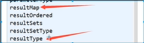

返回类型要写全限定名

### 2.4、测试

注意点：

` Cause: java.io.IOException: Could not find resource com/xiaoke/dao/UserMapper.xml`

在maven中没有配置build，

```xml
<build>
    <!-- 资源目录 -->
    <resources>
        <resource>
            <!-- 设定主资源目录  -->
            <directory>src/main/java</directory>

            <!-- maven default生命周期，process-resources阶段执行maven-resources-plugin插件的resources目标处理主资源目下的资源文件时，只处理如下配置中包含的资源类型 -->
            <includes>
                <include>**/*.xml</include>
            </includes>

            <!-- maven default生命周期，process-resources阶段执行maven-resources-plugin插件的resources目标处理主资源目下的资源文件时，不处理如下配置中包含的资源类型（剔除下如下配置中包含的资源类型）-->
            <excludes>
                <exclude>**/*.yaml</exclude>
            </excludes>

            <!-- maven default生命周期，process-resources阶段执行maven-resources-plugin插件的resources目标处理主资源目下的资源文件时，指定处理后的资源文件输出目录，默认是${build.outputDirectory}指定的目录-->
            <!--<targetPath>${build.outputDirectory}</targetPath> -->

            <!-- maven default生命周期，process-resources阶段执行maven-resources-plugin插件的resources目标处理主资源目下的资源文件时，是否对主资源目录开启资源过滤 -->
            <filtering>true</filtering>
        </resource>
    </resources>
</build>
```

`org.apache.ibatis.binding.BindingException: Type interface com.xiaoke.dao.UserDao is not known to the MapperRegistry.`

这是因为

- junit

```java
@Test
public void Test(){
    //第一步：获取SqlSession对象
    SqlSession sqlSession = MybatisUtils.getSqlSession();
    //第二部：执行SQL
    UserDao mapper = sqlSession.getMapper(UserDao.class);
    List<User> userList = mapper.getUserList();
    for (User user : userList) {
        System.out.println(user);
    }
    //关闭sqlsession
    sqlSession.close();

}
```

遇到的问题：

1. 配置文件没有注册

```xml
<mappers>
    <!--        每一个Mapper.xml都需要在Mybatis核心配置文件中注册-->
    <mapper resource="com/xiaoke/dao/UserMapper.xml"/>
    <!--        注意这里的路径是通过/进行加载的不是.-->
</mappers>
```

2. 绑定接口错误

`<mapper namespace="com.xiaoke.dao.UserDao">`

3. 方法名不对

 `id="getUserList"`

4. 返回类型不对

`resultType="com.xiaoke.pojo.User"`

5. maven导出资源问题

`build`

## 3、CRUD

### 1、namespace

namespace中的包名要和Dao/mapper接口的包名一致！

### 2、Select

选择、查寻语句

- id：就是对应的namespace中的方法名
- resultType：sql语句执行的返回值
- paramterType：参数类型

1. 编写接口

```java
List<User> getUserList();
List<User> getUser(int id);
```

2. 编写对应的mapper中的sql语句

```xml
<!--    select查询语句-->
<select id="getUserList" resultType="com.xiaoke.pojo.User">
    select * from mybatis.user
</select>
<!--    select查询特定人物-->
<select id="getUser" resultType="com.xiaoke.pojo.User" parameterType="int">
    select * from mybatis.user where id=#{id};
</select>
```

3. 测试

```java
@Test
public void Test_Query(){
    //第一步：获取SqlSession对象
    SqlSession sqlSession = MybatisUtils.getSqlSession();
    //方式一：第二部：执行SQL
    UserDao mapper = sqlSession.getMapper(UserDao.class);
    List<User> userList = mapper.getUserList();
    //方式二：
    //List<User> userList = sqlSession.selectList("com.xiaoke.dao.UserDao.getUserList");

    for (User user : userList) {
        System.out.println(user);
    }

    //关闭sqlsession
    sqlSession.close();

}
@Test
public void Test_QueryUser(){
    //第一步：获取sqlsession对象
    SqlSession sqlSession = MybatisUtils.getSqlSession();
    UserDao mapper = sqlSession.getMapper(UserDao.class);
    List<User> user = mapper.getUser(1);
    System.out.println(user);
    sqlSession.close();
}
```

### 3、Insert

```xml
<!--  insert一个用户  -->
<insert id="insertUser" parameterType="com.xiaoke.pojo.User">
    insert into mybatis.user(id,name,pwd) values (#{id},#{name},#{pwd});
</insert>
```

### 4、update

```xml
<!--    delete一个用户-->
<delete id="deleteUser" parameterType="int">
    delete from mybatis.user where id=#{id};
</delete>
```

### 5、Delete

```xml
<!--    update一个用户-->
<update id="updateUser" parameterType="com.xiaoke.pojo.User">
    update mybatis.user set name=#{name},id=#{id},pwd=#{pwd} where id=#{id};
</update>
```


注意点：增删改需要提交事务

### 6、分析错误

- namespace包名，标签不要写错
- mybatis-config.xml中绑定mapper，需要使用路径
- 程序配置文件必须符合规范
- NullPointerException,没有注册到资源
- maven资源没有导出

>程序读错要从下往上

### 7、万能Mapper

假设，实体类还在数据库中的表，字段或者参数过多，应当考虑使用mapper

```java
//万能的Map
int updateUser2(Map<String,Object> map);
```

```java
<!--    对象中的属性，可以直接取出来，传递Map的key-->
    <update id="updateUser2" parameterType="map">
    update mybatis.user set pwd=#{pwd} where id=#{id};
</update>
```

```java
@Test
public void Test_updateUser_Map(){
    SqlSession sqlSession = MybatisUtils.getSqlSession();
    UserDao mapper = sqlSession.getMapper(UserDao.class);
    Map<String, Object> map = new HashMap<String, Object>();
    map.put("id",1);
    map.put("pwd","11111");
    mapper.updateUser2(map);
    sqlSession.commit();
    sqlSession.close();
}
```

Map传递数据，直接在sql中取出key即可	`parameterType="map"`

对象传递参数，直接在sql中取出对象即可	`parameterType="com.xiaoke.pojo.User`

只有一个基本类型参数的情况下，可以使用Map中取到

多个参数用Map，或者注解

### 8、思考题

模糊查询怎么写？

字符串拼接会导致sql注入

1.java代码执行的时候，传递通配符%%

参数写死

```java
map.put("name1","%李%");
```

```java
select * from mybatis.user where name like #{name1};
```

2.在sql拼接中使用通配符

拼接写死

```sql
select * from mybatis.user where name like "%"#{name1}"%";
```

## 4、配置解析

Mybatis的配置文件包含了会深深影响Mybatis行为的设置和属性信息

### 1、核心配置文件

- mybatis-config.xml

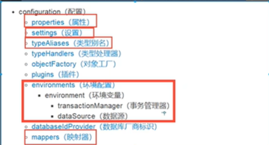

### 2、环境配置

Mybatis可以配置成适应多种环境

**不过要记住：尽管可以配置多个环境，但每个SqlSessionFactory实例只能选择一种环境**


Mybatis默认的事务管理器（transactionMa）：JDBC

Mybatis默认的数据源类型（连接池）：POOLED

### 3、属性（properties）

可以通过properties属性来实现引用配置文件

这些属性都是可以外部配置且可以动态替换的，即可以在典型的java属性文件中配置，亦可通过properties元素的子元素来传递

[db.properties]

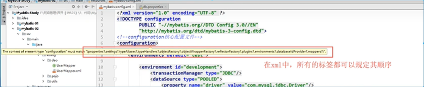

properties的引用已经规定好了放置的位置，所以不能乱放

编写一个配置文件

db.properties

```properties
driver=com.mysql.cj.jdbc.Driver
url=jdbc:mysql://localhost:3306/Mybatis?useSSL=true&useUnicode=true&characterEncoding=utf-8&serverTimezone=GMT
username=root
password=123456
```

在核心配置文件中引入

```xml
<!--    引入外部配置文件-->
<properties resource="db.properties">
    <property name="username" value="root"/>
    <property name="pwd" value="123456"/>
    <!--        首先读取在 properties 元素体内指定的属性。-->
</properties>
<environments default="development">
    <environment id="development">
        <transactionManager type="JDBC"/>
        <dataSource type="POOLED">
            <property name="driver" value="${driver}"/>
            <property name="url" value="${url}"/>
            <property name="username" value="${username}"/>
            <property name="password" value="${pwd}"/>
        </dataSource>
    </environment>
</environments>
```

- 可以直接引入外部文件
- 可以在其中增加一些属性
- 如果两个文件有同一个字段，优先使用外部配置文件

### 4、类型别名（typeAliases）

- 类型别名是为java类型设置一个短的名字
- 存在的意义仅在于减少类完全限定名的冗余

```xml
<!--可以给一个实体类起别名-->
<typeAliases>
    <typeAlias type="com.xiaoke.pojo.User" alias="User"/>
</typeAliases>
```

也可以指定一个包名，Mybatis会在包名下搜索需要的java bean

扫描实体类的包，它的默认别名就为这个类的类名，首字母小写

```xml
<!--可以给一个实体类起别名-->
<typeAliases>
    <package name="com.xiaoke.pojo"/>
</typeAliases>
```

在实体类较少的时候，使用第一种方式

如果实体类十分多，建议使用第二种

第一种可以diy别名，第二种则·不行·如果非要修改需要在实体类上加上注解

```java
@Alias("user")
public class User {
}
```

### 5、设置（setting）

这是mybatis中纪委重要的调整设置，它们会改变mybatis的运行时行为

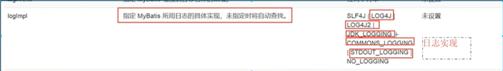

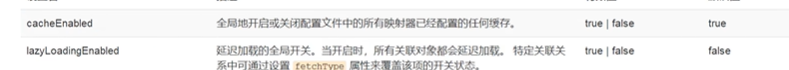

### 6、其他配置

- typeHandlers（类型处理器）
- objectFactory（对象工厂）
- plugins插件
  - mybatis-generous-core
  - mybatis-plus
  - 通用mapper

### 7、映射器

MapperRegistry：注册绑定mapper文件

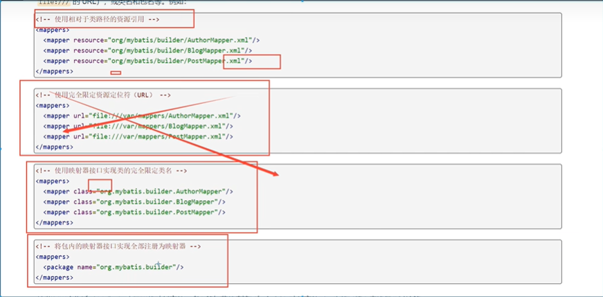

方式一：使用相对于类路径的资源引用

```xml
<mappers>
    <!--        每一个Mapper.xml都需要在Mybati核心配置文件中注册-->
    <mapper resource="com/xiaoke/dao/UserMapper.xml"/>
    <!--        注意这里的路径是通过/进行加载的不是.-->
</mappers>
```

方式二：使用class文件绑定注册

```xml
<mappers>
     <!--        每一个Mapper.xml都需要在Mybati核心配置文件中注册-->
    <mapper class="com.xiaoke.dao.UserMapper"></mapper>
</mappers>
```

注意点：

- 接口和它的mapper配置文件必须同名
- 接口和它的mapper配置文件必须同一个包下

方式三：使用是扫描包进行注入绑定

```xml
<mappers>
     <!--        每一个Mapper.xml都需要在Mybati核心配置文件中注册-->
    <package name="com.xiaoke.dao"/>
</mappers>
```

注意点：

- 接口和它的mapper配置文件必须同名
- 接口和它的mapper配置文件必须同一个包下

### 8、生命周期和作用域

生命周期、作用域是至关重要的，因为错误的使用会导致非常严重的**并发问题**

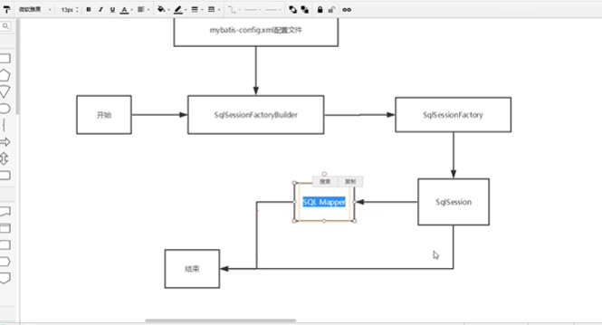

**SqlSessionFactoryBuilder：**

- 一旦创建了SqlSessionFactory，就不需要SqlSessionFactoryBuilder
- 局部变量

**SqlSessionFactory：**

- 说白了就是可以想象为：数据库连接池
- SqlSessionFactory一旦被创建就应该在应用的运行期间一直存在，**没有任何理由丢弃它或者重新创建另一个实例**
- 因此SqlSessionFactory的最佳作用域是应用作用域
- 最简单的就是使用**单例模式**或者静态单例模式

**sqlSession**

- 连接到连接池的请求
- SqlSession的实例不是线程安全的，因此是不能被共享的，所以它的最佳的作用域是请求或方法作用域
- 用完之后需要赶紧关闭，否则资源被占用

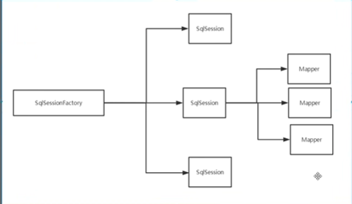

这里的每一个mapper，都代表一个具体的业务

## 5、解决属性名和字段名不一致的问题

### 1、问题

数据库中的字段

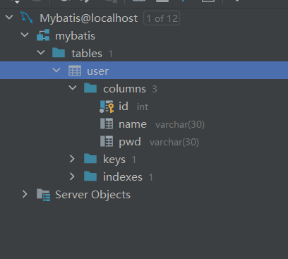

创建一个新的项目，测试实体类字段不一致的情况

```java
public class User {
    private int id;
    private String name;
    private String password;
}
```

测试出现问题：

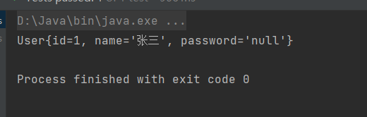

```sql
select * from mybatis.user where id=#{id};
select id,name,pwd as password from mybatis.user where id=#{id};
```

解决方案：

- 起别名

```xml
<select id="getUserById" resultType="com.xiaoke.pojo.User" parameterType="int">
    select id,name,pwd as password from mybatis.user where id=#{id};
</select>
```

### 2、resultMap

结果集映射

```
id	name	pwd
id 	name	password
```

```xml
<!--    select查询特定人物-->
<resultMap  id="UserMap" type="user">
    <result property="id" column="id"/>
    <result property="name" column="mame"/>
    <result property="password" column="pwd"/>
</resultMap>
<select id="getUserById" resultMap="UserMap"  parameterType="int">
    select * from mybatis.user where id=#{id};
</select>
```

- resultMap元素是Mybatis中最重要最强大的元素
- ResultMap的设计思想是，对于简单的语句根本不需要配置显示的结果映射，而对于复杂一点的语句只需要描述它们的关系就行了
- `ResultMap`最优秀的地方在于，虽然你已经对它相当了解，但是根本就不需要显示地用到它们


一对多

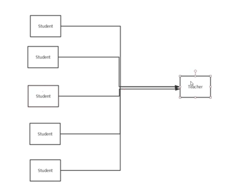

## 6、日志

### 6.1、日志工厂

如果一个数据库操作，出现了异常，需要排错。日志就是最好的助手

曾经：sout、debug

现在：日志工厂


- SLF4J 
-  LOG4J 【掌握】
-  LOG4J2 
-  JDK_LOGGING 
-  COMMONS_LOGGING 
-  STDOUT_LOGGING 【掌握】
-  NO_LOGGING

在mybatis中具体使用那个日志实现，在设置中设定

 **STDOUT_LOGGING 【掌握】**

在mybatis核心配置文件中，配置日志

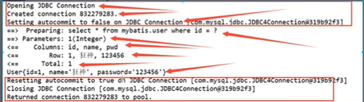

```xml
<!--    设置打印日志-->
<settings>
    <!--        标准的日志工厂实现-->
    <setting name="logImpl" value="STDOUT_LOGGING"/>
</settings>
```

### 6.2、LOG4J

LOG4J是什么：

- 可以控制日志信息输送的目的地是控制台、文件、GUI组件
- 可以控制每一条日志的输出格式
- 通过定义每一条日志信息的级别，能够更加细致地控制日志的生成过程
- 这些可以通过一个配置文件来灵活地进行配置，而不需要修改应用的代码。

1、先导入LOG4J的包

```xml
<dependency>
    <groupId>org.apache.logging.log4j</groupId>
    <artifactId>log4j-core</artifactId>
    <version>2.23.1</version>
</dependency>
```

2、配置文件

```properties
#将等级为DEBUG的日志信息输出到console和file这两个目的地，console和file的定义在下面的代码
log4j.rootLogger=DEBUG,console,file

#控制台输出的相关设置
log4j.appender.console = org.apache.log4j.ConsoleAppender
log4j.appender.console.Target = System.out
log4j.appender.console.Threshold=DEBUG
log4j.appender.console.layout = org.apache.log4j.PatternLayout
log4j.appender.console.layout.ConversionPattern=[%c]-%m%n

#文件输出的相关设置
log4j.appender.file = org.apache.log4j.RollingFileAppender
log4j.appender.file.File=./log/kuang.log
log4j.appender.file.MaxFileSize=10mb
log4j.appender.file.Threshold=DEBUG
log4j.appender.file.layout=org.apache.log4j.PatternLayout
log4j.appender.file.layout.ConversionPattern=[%p][%d{yy-MM-dd}][%c]%m%n

#日志输出级别
log4j.logger.org.mybatis=DEBUG
log4j.logger.java.sql=DEBUG
log4j.logger.java.sql.Statement=DEBUG
log4j.logger.java.sql.ResultSet=DEBUG
log4j.logger.java.sql.PreparedStatement=DEBUG
```

3、配置log4j为日志实现

```xml
<!--    设置打印日志-->
<settings>
    <setting name="logImpl" value="LOG4J"/>
</settings>
```

4、log4j的使用，直接测试运行

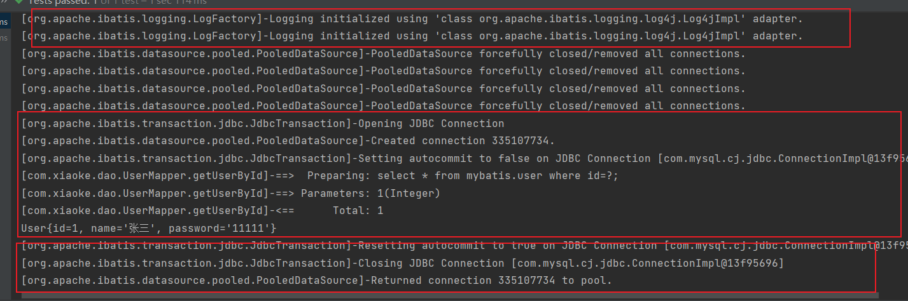

**简单使用**

1. 在要使用Log4j的类中，导入import org.apache.log4j.Logger;
2. 日志对象，参数为当前类的class

```java
static Logger logger = Logger.getLogger(UserDaoTest.class);
```

3. 日志级别

```java
logger.info("info进入了TestLog4j");
logger.debug("debug进入了TestLog4j");
logger.error("error进入了TestLog4j");
```

## 7、分页

思考：为什么要使用分页？

- 减少数据的处理量

### 7.1、使用limit分页

```sql
select * from user limit startIndex,pageSize;
select * from user limit 3; #[0,n]
```

使用mybatis实现分页，核心SQL

1. 接口

```java
//分页
List<User> getUserByLimit(Map<String,Integer> map);
```

2. Mapper.xml

```xml
<select id="getUserByLimit" resultMap="UserMap"  parameterType="map">
    select * from mybatis.user limit #{startPage},#{pageSize};
</select>
```

3. 测试

```java
@Test
public void TestLimit(){
    SqlSession sqlSession = MybatisUtils.getSqlSession();
    UserMapper mapper = sqlSession.getMapper(UserMapper.class);
    HashMap<String,Integer> map=new HashMap<String, Integer>();
    map.put("startPage",2);
    map.put("pageSize",2);
    List<User> userByLimit = mapper.getUserByLimit(map);
    for (User user : userByLimit) {
        System.out.println(user);
    }
    sqlSession.close();
}
```

### 7.2、RowBounds分页


不在使用sql分页

1. 接口

```java
List<User> getUserByRowBounds(Map<String,Integer> map);
```

2. mapper.xml

```xml
<select id="getUserByRowBounds" resultMap="UserMap">
    select * from mybatis.user;
</select>
```

3. 测试

```java
@Test
public void TestLimit_RowBounds(){
    SqlSession sqlSession = MybatisUtils.getSqlSession();
    RowBounds rowBounds = new RowBounds(1,2);
    List<User> users = sqlSession.selectList("com.xiaoke.dao.UserMapper.getUserByRowBounds", null, rowBounds);
    for (User user : users) {
        System.out.println(user);
    }
    sqlSession.close();
}
```

### 7.3、分页插件

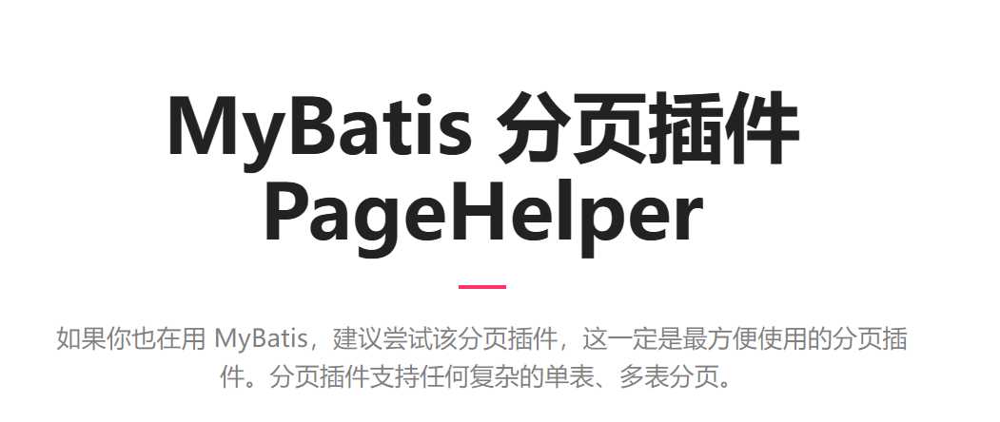

了解即可

## 8、使用注解开发

### 8.1、面向接口编程

**本质就是为了解耦**

定义与实现的分离

**接口应有两类**：

- 第一类是对一个个体的抽象，它可对应位一个抽象类(abstract class)
- 第二类是对一个个体某方面的抽象，即形成一个抽象面(interface)
- 一个体有可能有多个抽象面，抽象体与抽象面是有区别的

**三个面向区别**

- 面向对象是指：考虑问题时，以对象为单位，考虑它的属性及方法
- 面向过程是指：考虑问题时，以一个具体的流程为单位，考虑它的实现
- 接口设计与非接口设计时针对复用技术而言，与面向对象(过程)不是一个问题，更多的体现就是对系统整体的架构

### 8.2、使用注解开发

1. 注解在接口上实现

```java
//使用注解进行查询
@Select("select * from user")
List<User> getUsers();
```

2. 需要在核心配置文件中绑定接口

```xml
<mappers>
    <mapper class="com.xiaoke.dao.UserMapper"/>
</mappers>
```

3. 测试

```java
public class UserDaoTest {
    @Test
    public void Test_Query(){
        //第一步：获取SqlSession对象
        SqlSession sqlSession = MybatisUtils.getSqlSession();
        //方式一：第二部：执行SQL
        UserMapper mapper = sqlSession.getMapper(UserMapper.class);
        List<User> users = mapper.getUsers();
        for (User user : users) {
            System.out.println(user);
        }
        sqlSession.close();
    }
}
```

` UserMapper mapper = sqlSession.getMapper(UserMapper.class);`

本质：反射机制实现

底层：动态代理


mybatis使用的是jdk动态代理，spring使用的是cglib动态代理

cglib动态代理无需实现同一接口，被代理对象可以是类

**Mybatis详细的执行流程**

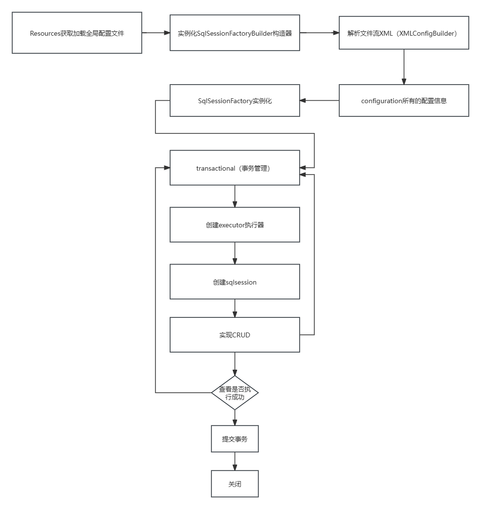


8.3、CRUD

可以在工具类创建的时候实现自动提交事务

```java
public static SqlSession getSqlSession(){
    return sqlSessionFactory.openSession(true);
}
```

编写接口，增加注解

```java
public interface UserMapper {
    //使用注解进行查询
    @Select("select * from user")
    List<User> getUsers();

    //查询指定用户
    //方法有多个参数，必须要加上@Param("")
    @Select("select * from user where id=#{id}")
    User getUserById(@Param("id") int id);
    @Insert("insert into user(id,name,pwd) values(#{id},#{name},#{password})")
    int addUser(User user);

    @Update("update user set name=#{name},pwd=#{password} where id=#{id}")
    int updateUser(User user);
    @Delete("delete from user where id=#{uid}")
    int deleteUser(@Param("uid") int id);
}
```

测试类

```java
@Test
public void Test_Query(){
    //第一步：获取SqlSession对象
    SqlSession sqlSession = MybatisUtils.getSqlSession();
    //方式一：第二部：执行SQL
    //底层主要应用反射原理进行执行
    UserMapper mapper = sqlSession.getMapper(UserMapper.class);
    //        List<User> users = mapper.getUsers();
    //        for (User user : users) {
    //            System.out.println(user);
    //        }
    User userById = mapper.getUserById(1);
    System.out.println(userById);
    //方式二：
    //List<User> userList = sqlSession.selectList("com.xiaoke.dao.UserDao.getUserList");
    //        System.out.println(user);
    //select * from mybatis.user where id=#{id};
    //select id,name,pwd from mybatis.user where id=#{id};
    //关闭sqlsession
    sqlSession.close();
}
@Test
public void Test_Add(){
    SqlSession sqlSession = MybatisUtils.getSqlSession();
    UserMapper mapper = sqlSession.getMapper(UserMapper.class);
    int num = mapper.addUser(new User(6, "李六", "16"));
    System.out.println(num);
    sqlSession.close();
}
@Test
public void Test_Update(){
    SqlSession sqlSession = MybatisUtils.getSqlSession();
    UserMapper mapper = sqlSession.getMapper(UserMapper.class);
    int num = mapper.updateUser(new User(6, "李六1", "161"));
    System.out.println(num);
    sqlSession.close();
}
@Test
public void Test_Delete(){
    SqlSession sqlSession = MybatisUtils.getSqlSession();
    UserMapper mapper = sqlSession.getMapper(UserMapper.class);
    int num = mapper.deleteUser(6);
    System.out.println(num);
    sqlSession.close();
}
```

注意：必须要将接口注册绑定到核心配置文件中

```xml
<mappers>
    <mapper class="com.xiaoke.dao.UserMapper"/>
</mappers>
```

关于@Param("")注解

- 基本类型的参数或者String类型，需要加上
- 引用类型不需要加上
- 如果只有一个基本类型的话，可以忽略，但是建议加上
- 在SQL中引用的就是这里@Param中设定的属性名


**#{}	${}区别**

相同点：

都能取到变量的值。

不同点：

**#可以实现预编译，会先把#{变量}编译成?，在执行时再取值，可以防止sql注入。**

**$是直接进行字符串替换。**

## 9、Lombok

roject Lombok is a java library that automatically plugs into your editor and build tools, spicing up your java.
Never write another getter or equals method again, with one annotation your class has a fully featured builder, Automate your logging variables, and much more.

-  java library
- plugs 
- editor and build tools
- one annotation your class


使用步骤：

1. 在IDEA中安装Lombok插件

2. 在项目中导入Lombok的jar包

```xml
<dependency>
    <groupId>org.projectlombok</groupId>
    <artifactId>lombok</artifactId>
    <version>1.18.32</version>
</dependency>
```

3. 在实体类上加注解

```java
@Data
@AllArgsConstructor
@NoArgsConstructor
public class User {
    private int id;
    private String name;
    private String password;
}
```


```java
@Getter and @Setter
@FieldNameConstants
@ToString
@EqualsAndHashCode
@AllArgsConstructor, @RequiredArgsConstructor and @NoArgsConstructor
@Log, @Log4j, @Log4j2, @Slf4j, @XSlf4j, @CommonsLog, @JBossLog, @Flogger, @CustomLog
@Data
@Builder
@SuperBuilder
@Singular
@Delegate
@Value
@Accessors
@Wither
@With
@SneakyThrows
@StandardException
@val
@var
experimental @var
@UtilityClass
Lombok config system
```

说明

```java
@Data：无参构造、get、set、tostring、hashcode、equals
@AllArgsConstructor：有参构造
@NoArgsConstructor：无参构造
@EqualsAndHashCode 
@ToString
@Getter
```

## 10、多对一处理

多对一：

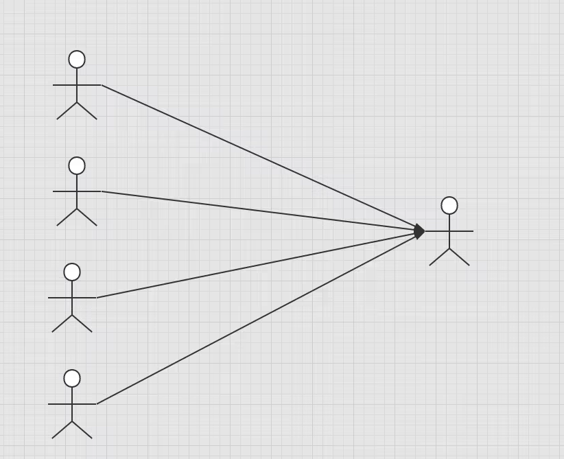

- 多个学生，对应一个学生
- 对于学生这边而言，关联    多个学生关联一个老师【多对一】
- 对于老师而言，集合，一个老师，有很多学生【一对多】

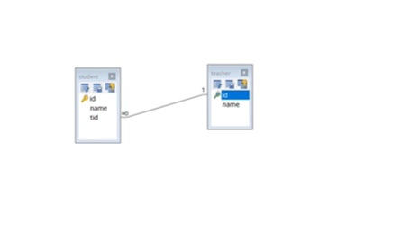

SQL：

```sql
CREATE TABLE `teacher` (
    `id` INT(10) NOT NULL,
    `name` VARCHAR(30) DEFAULT NULL,
    PRIMARY KEY (`id`)
) ENGINE=INNODB DEFAULT CHARSET=utf8;
insert into teacher(`id`, `name`) VALUES (1, '秦老师'); 
CREATE TABLE `student` (
    `id` INT(10) NOT NULL,
    `name` VARCHAR(30) DEFAULT NULL,
    `tid` INT(10) DEFAULT NULL,
    PRIMARY KEY (`id`),
    KEY `fktid` (`tid`),
    CONSTRAINT `fktid` FOREIGN KEY (`tid`) REFERENCES `teacher` (`id`)
) ENGINE=INNODB DEFAULT CHARSET=utf8studentstudent;
Insert into `student` (`id`, `name`, `tid`) VALUES ('1', '小明', '1'); 
INSERT INTO `student` (`id`, `name`, `tid`) VALUES ('2', '小红', '1'); 
INSERT INTO `student` (`id`, `name`, `tid`) VALUES ('3', '小张', '1'); 
INSERT INTO `student` (`id`, `name`, `tid`) VALUES ('4', '小李', '1'); 

```


### 测试是环境搭建

1. 导入lombok
2. 新建实体类Teacher、Student
3. 建立Mapper接口
4. 建立mapper.XML文件
5. 在核心配置文件中绑定注册Mapper接口或者文件！【】
6. 测试查询是否能够成功

按照查询嵌套处理

```xml
<!--
    思路：
        1. 查询所有学生的信息
        2. 根据查询出来的学生的tid，寻找对应的老师！ （子查询 ）
-->
<select id="getStudent" resultMap="StudentTeacher" >
    select * from student
</select>
<select id="getTeacher" resultType="teacher">
    select * from teacher
</select>
<resultMap id="StudentTeacher" type="Student">
    <result property="id" column="id"/>
    <result property="name" column="name"/>
    <!--        复杂的属性，需要单独处理 对象：association 集合：collection-->
    <association property="teacher" column="tid" javaType="Teacher" select="getTeacher"/>
</resultMap>
```

按照结果嵌套处理

```xml
<select id="getStudent2" resultMap="StudentTeacher2">
    select s.id sid,s.name sname,t.name tname
    from student s,teacher t
    where s.tid=t.id
</select>
<resultMap id="StudentTeacher2" type="Student">
    <result property="id" column="sid"/>
    <result property="name" column="sname"/>
    <association property="teacher" javaType="Teacher" >
        <result property="name" column="tname"/>
    </association>
</resultMap>
```


回顾Mysql多对一查询方式：

- 子查询
- 联表查询


## 11、一对多处理

一个老师拥有多个学生

对于老师而言，就是一对多的关系

### 1、搭建环境

实体类：

```java
@Data
public class Student {
    private int id;
    private String name;
    private int tid;
}
```

```java
@Data
public class Teacher {
    private int id;
    private String name;
    //一个老师对应多个学生
    private List<Student> students;
}
```

### 2、按照结果嵌套处理

```xml
<!--    按结果嵌套查询-->
<select id="getTeacher1" resultMap="TeacherStudent">
    select s.id sid,s.name sname,t.id tid,t.name tname from student s,teacher t
    where s.tid=t.id and t.id=#{tid}
</select>
<resultMap id="TeacherStudent" type="teacher">
    <result property="id" column="tid"/>
    <result property="name" column="tname"/>
    <!--        复杂的属性，需要单独处理 对象：association 集合：collection
            javatype="" 指定属性的类型！
            集合中的泛型信息用oftype获取
-->
    <collection property="students" ofType="Student">
        <result property="tid" column="tid"/>
        <result property="name" column="sname"/>
        <result property="id" column="id"/>
    </collection>
</resultMap>
```

### 3、按照查询嵌套处理

```xml
```


### 小结

1. 关联 - association	【多对一】
2. 集合 - collection       【一对多】
3. javaType    &      oftType
   1. javaType    用来指定实体类中属性的类型
   2. ofType    用来指定映射到List或者集合中的pojo集合，泛型中的约束类型


注意点：

- 保证SQL的可读性，尽量保证通俗易懂
- 注意一对多和多对一属性名和字段的问题
- 如果问题不好排查错误，可以使用日志，建议使用Log4j


面试高频：

- Mysql引擎
- InnoDB底层原理
- 索引
- 索引优化


## 12、动态SQL

==什么是动态SQL：动态SQL就是指根据不同的条件生成不同的SQL语句==

```XML
如果你之前用过 JSTL 或任何基于类 XML 语言的文本处理器，你对动态 SQL 元素可能会感觉似曾相识。在 MyBatis 之前的版本中，需要花时间了解大量的元素。借助功能强大的基于 OGNL 的表达式，MyBatis 3 替换了之前的大部分元素，大大精简了元素种类，现在要学习的元素种类比原来的一半还要少。
if
choose (when, otherwise)
trim (where, set)
foreach
```

### 搭建环境

```sql
CREATE TABLE `blog`(
    `id` VARCHAR(50) NOT NULL COMMENT '博客id',
    `title` VARCHAR(100) NOT NULL COMMENT '博客标题',
    `author` VARCHAR(30) NOT NULL COMMENT '博客作者',
    `create_time` DATETIME NOT NULL COMMENT '创建时间',
    `views` INT(30) NOT NULL COMMENT '浏览量'
)ENGINE=INNODB DEFAULT CHARSET=utf8
```


创建一个基础工程

1. 导包
2. 编写配置文件

3. 编写实体类

```java
@Data
public class Blog {
    private String id;
    private String title;
    private String author;
    private Date createTime;
    private int views;
}
```

4. 编写实体类对应的Mapper和Mapper.xml文件

一般数据库中的id存放的值，使用uuid进行生成就行

```java
public static String getId(){
    return UUID.randomUUID().toString().replaceAll("-","");
}
@Test
public void test(){
    System.out.println(IdUtils.getId());
    System.out.println(IdUtils.getId());
    System.out.println(IdUtils.getId());

}
```

```xml
<setting name="mapUnderscoreToCamelCase" value="true"/>
```

**mapUnderscoreToCamelCase**

是否开启驼峰命名自动映射，即从经典数据库列名 A_COLUMN 映射到经典 Java 属性名 aColumn。


### IF

```xml
<select id="queryBlogIF" parameterType="map" resultType="Blog">
    select * from blog where 1=1
    <if test="title!=null">
        and title=#{title}
    </if>
    <if test="author!=null">
        and author=#{author}
    </if>
</select>
```

### choose (when, otherwise)

```xml
<select id="queryBlogChoose" parameterType="map" resultType="Blog">
    select * from blog
    <where>
        <choose>
            <when test="title!=null">
                title=#{title}
            </when>
            <when test="author!=null">
                and author=#{author}
            </when>
            <otherwise>
                and views=#{views}
            </otherwise>
        </choose>
    </where>
</select>
```


### trim(where，set)

```xml
<select id="queryBlogIF" parameterType="map" resultType="Blog">
    select * from blog
    <where>
        <if test="title!=null">
            title=#{title}
        </if>
        <if test="author!=null">
            and author=#{author}
        </if>
    </where>
</select>
```


```xml
<update id="updateBlogSet" parameterType="map">
    update blog
    <set>
        <if test="title!=null">
            title=#{title},
        </if>
        <if test="author!=null">
            author=#{author}
        </if>
    </set>

    where id=#{id}
</update>
```

>*set* 元素会动态地在行首插入 SET 关键字，并会删掉额外的逗号

你也可以通过自定义 trim 元素来定制 *where* 元素的功能。比如，和 *where* 元素等价的自定义 trim 元素为：

```xml
<trim prefix="WHERE" prefixOverrides="AND |OR ">
  ...
</trim>
<trim prefix="SET" suffixOverrides=",">
  ...
</trim>
```

*prefixOverrides* 属性会忽略通过管道符分隔的文本序列（注意此例中的空格是必要的）。上述例子会移除所有 *prefixOverrides* 属性中指定的内容，并且插入 *prefix* 属性中指定的内容。

==**所谓的动态SQL，本质上还是SQL语句，只是可以在SQL层面，去执行一个逻辑代码**==

if 

where，set，choose，when

### SQL片段

有的时候会将一些公共部分抽取出来，方便复用

1. 使用sql标签抽取公共部分

```xml
<sql id="sql_title_author">
    <if test="title!=null">
        title=#{title}
    </if>
    <if test="author!=null">
        and author=#{author}
    </if>
</sql>
```

2. 在需要使用的地方使用include标签引用

```xml
<select id="queryBlogIF_1" parameterType="map" resultType="Blog">
    select * from blog
    <where>
        <include refid="sql_title_author"></include>
    </where>
</select>
```

注意事项：

- 最好基于单表来定义SQL片段
- 不要存在where标签

### foreach

```xml
<select id="selectPostIn" resultType="domain.blog.Post">
  SELECT *
  FROM POST P
  WHERE ID in
  <foreach item="item" index="index" collection="list"
      open="(" separator="," close=")">
        #{item}
  </foreach>
</select>
```

```sql
select * from user where 1=1 and 

<foreach item="id" collection="ids"
      open="(" separator="," close=")">
        #{id}
  </foreach>

(id=1 or id=2 or id=3)
```

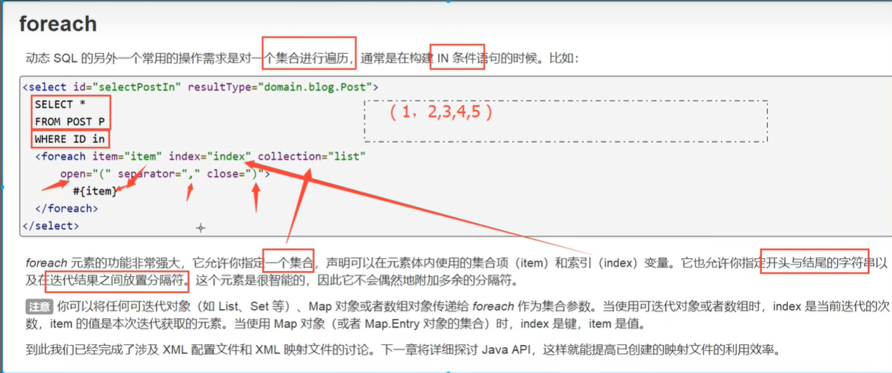

```xml
<!--
    select * from blog where (id=1 or id=2 or id=3)
    传递一个万能的map，这map中可以存放一个集合
-->
<select id="queryBlogForeach" parameterType="map" resultType="Blog">
    select * from blog
    <where>
        <foreach collection="ids" item="id" open="and (" close=")" separator="or">
            id=#{id}
        </foreach>
    </where>
</select>
```

==动态SQL就是在拼接SQL语句，只要保证SQL的正确性，按照SQL的格式去排列组合就可以了==

建议：

- 先在Mysql中写出完整的SQL，在对应的去修改成动态SQL实现通用即可

## 13、缓存

### 13.1、简介

```
查询	：	连接数据库，耗资源
	一次查询的结果，给他暂存在一个可以直接取到的地方	-->内存：缓存
	再次查询相同数据时，直接走缓存，不用走数据库了
```

1. 什么是缓存[Cache]
   - 存在内存中的临时数据
   - 讲用户经常查询的数据放在缓存（内存）中，用户去查询数据就不用从磁盘（关系型数据库数据文件）查询，从缓存中查询，从而提高查询效率，**解决了高并发系统的性能问题**（三高：高并发，高可用，高性能）

2. 为什么使用缓存？
   - 减少和数据库的交互次数，减少系统开销，提高系统效率

3. 什么样的数据能使用缓存？
   - 经常查询并且不经常改变的数据【可以使用缓存】

### 13.2、Mybatis缓存

- Mybatis包含一个非常强大的查询缓存特性，它可以非常方便地定制和配置缓存，缓存可以极大的提升查询效率
- Mybatis系统中默认定义了两级缓存：一级缓存和二级缓存
  - 默认情况下，只有一级缓存开启（SqlSession级别的缓存，也称为本地缓存）
  - 二级缓存需要手动开启，它是基于namespace级别的缓存
  - 为了提高扩展性，Mybatis定义了缓存接口Cache，可以通过实现Cache接口来自定义二级缓存

### 13.3、一级缓存

- 一级缓存也叫本地缓存：SqlSession
  - 与数据库同一次会话期间查询到的数据会放在本地缓存中
  - 以后如果需要获取相同的数据，直接从缓存中拿，没有必要再去数据库查找

测试步骤：

1. 开启日志
2. 测试在一个Session中查询两次相同的记录
3. 查看日志输出

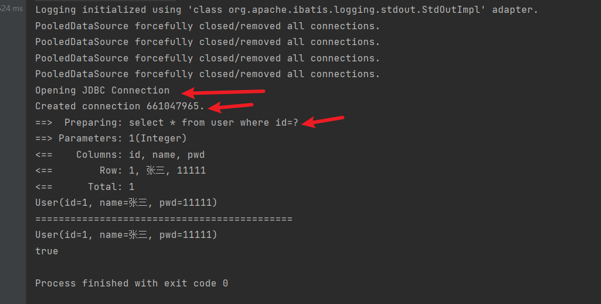

缓存失效的情况：

1. 查询不同的东西

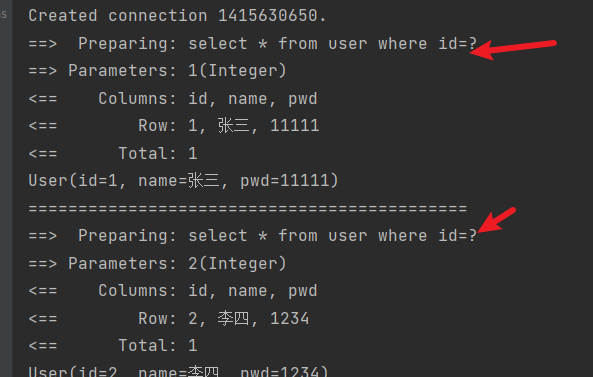

2. 增删改操作，可能会改变原来的数据，所以必定会刷新缓存

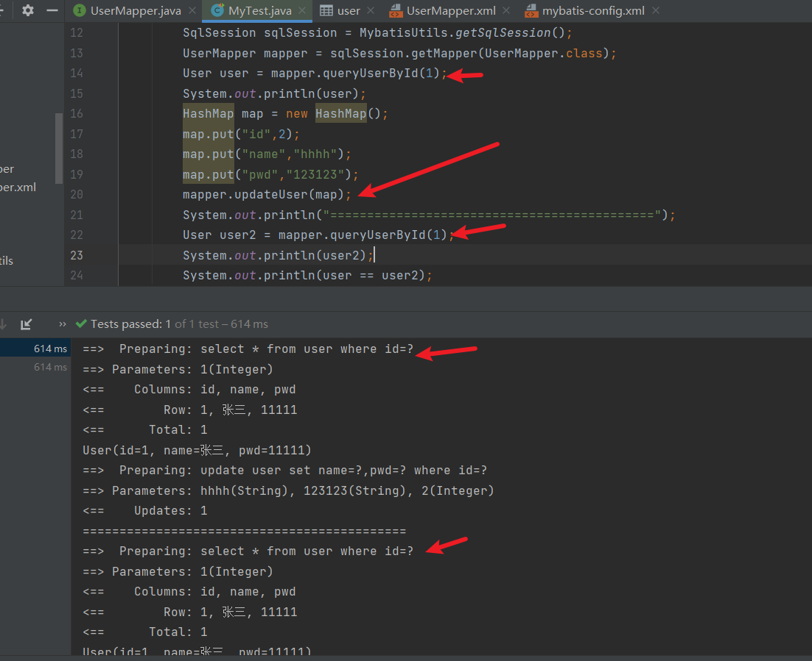

3. 查询不同的mapper.xml

4. 手动清理缓存

```
sqlSession.clearCache();
```

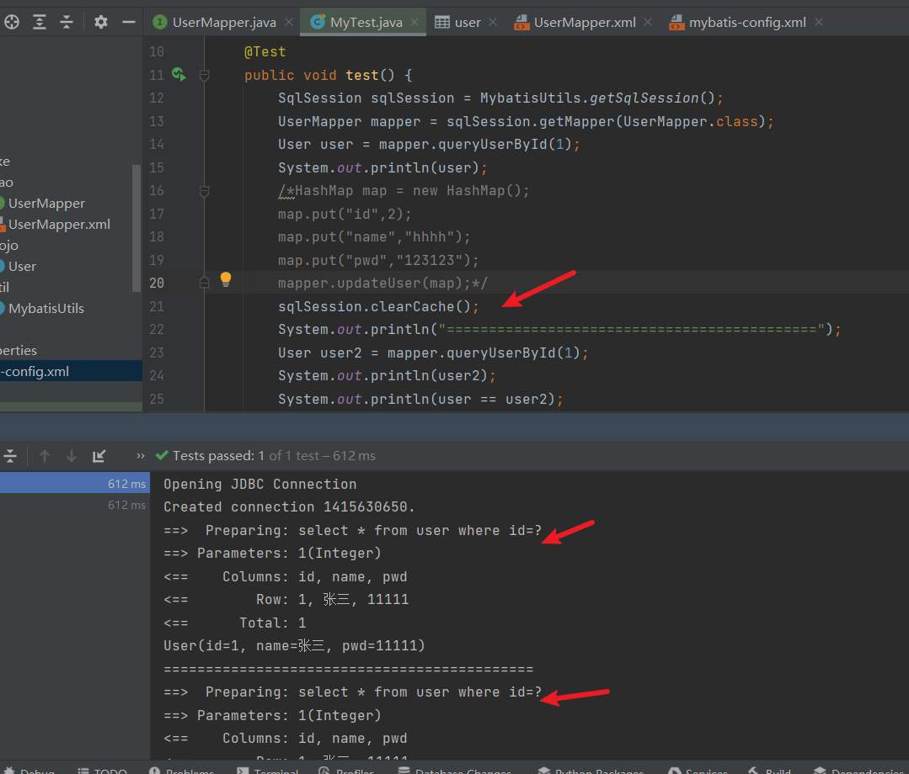

小结：

- 一级缓存默认是开启的，只在一次SqlSession中有效，也就是拿到连接到关闭连接这个区间

- 一级缓存相当于一个map

### 13.4、二级缓存

- 二级缓存也叫全局缓存，一级缓存作用域太低，所以诞生二级缓存
- 基于namespace级别的缓存，一个命名空间，对应一个二级缓存
- 工作机制
  - 一个会话查询一条数据，这个数据就会被放在当前会话的一级缓存中
  - 如果当前会话结束，这个会话对应的一级缓存就会没有了，但是我们想要的是，会话关闭了，一级缓存中的数据被保存到了二级缓存中
  - 新的会话查询信息，就可以从二级缓存中获取内容
  - 不同的mapper查出的数据会放在自己对应的缓存中


步骤：

1. 开启全局缓存

```xml
<setting name="cacheEnable" value="true"/>
```

2. 在使用二级缓存的mapper中开启

```xml
<cache/>
```

也可以自定义参数

```xml
<!--    在当前mapper.xml中使用二级缓存-->
<cache eviction="FIFO"
       flushInterval="60000"
       size="512"
       readOnly="true"/>
```

3. 测试

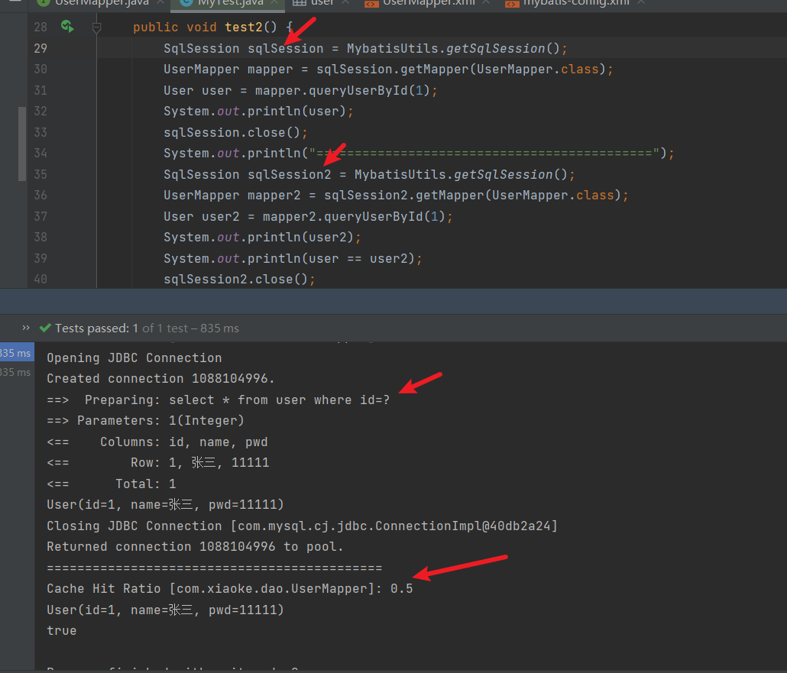

	1. 问题：需要将实体类序列化：实现Serializable接口implements Serializable

小结：

- 只要开启了二级缓存，在同一个Mapper下就有效
- 所有的数据都会放在一级缓存中，只有当会话结束时候，才会提交到二级缓存中（转存）

### 13.5、缓存原理

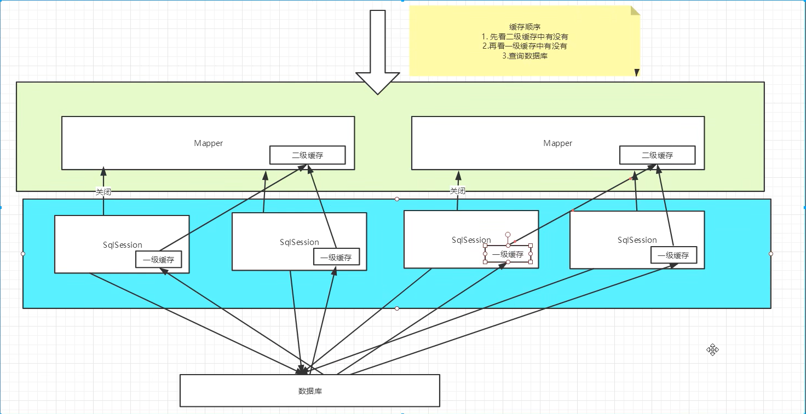

### 13.6、自定义缓存--ehcache（现在使用redis）

```xml
Ehcache是一种广泛使用的开源java分布式缓存，主要面向通用缓存
```

要在程序中使用，先导包

```xml
<dependency>
    <groupId>org.mybatis.caches</groupId>
    <artifactId>mybatis-ehcache</artifactId>
    <version>1.2.3</version>
</dependency>
```

```xml
<cache type="org.mybatis.caches.ehcache.EhcacheCache"/>
```

