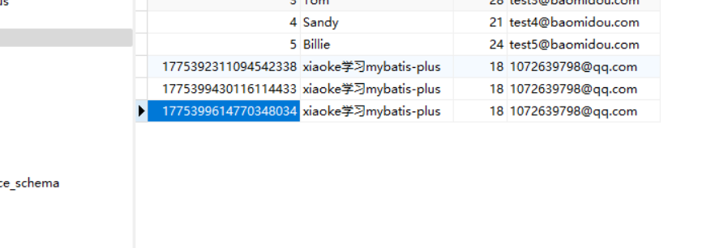

# MybatisPlus概述

MybatisPlus可以节省大量的工作时间，所有的CRUD代码它都可以自动化完成

JPA、tk-mappe、MybatisPlus

> 简介

是什么？mybatis：本来就是为了简化JDBC操作

官网：[MyBatis-Plus (baomidou.com)](https://baomidou.com/)MybatisPlus简化mybatis


[MyBatis-Plus (opens new window)](https://github.com/baomidou/mybatis-plus)（简称 MP）是一个 [MyBatis (opens new window)](https://www.mybatis.org/mybatis-3/)的增强工具，在 MyBatis 的基础上只做增强不做改变，为简化开发、提高效率而生。

特性：

- **无侵入**：只做增强不做改变，引入它不会对现有工程产生影响，如丝般顺滑
- **损耗小**：启动即会自动注入基本 CURD，性能基本无损耗，直接面向对象操作    ==**BaseMapper<>**自动会生成相应的CRUD操作==
- **强大的 CRUD 操作**：内置通用 Mapper、通用 Service，仅仅通过少量配置即可实现单表大部分 CRUD 操作，更有强大的条件构造器，满足各类使用需求，==以后简单的CRUD操作。它不用自动编写了==
- **支持 Lambda 形式调用**：通过 Lambda 表达式，方便的编写各类查询条件，无需再担心字段写错
- **支持主键自动生成**：支持多达 4 种主键策略（内含分布式唯一 ID 生成器 - Sequence），可自由配置，完美解决主键问题
- **支持 ActiveRecord 模式**：支持 ActiveRecord 形式调用，实体类只需继承 Model 类即可进行强大的 CRUD 操作
- **支持自定义全局通用操作**：支持全局通用方法注入（ Write once, use anywhere ）
- **内置代码生成器**：采用代码或者 Maven 插件可快速生成 Mapper 、 Model 、 Service 、 Controller 层代码，支持模板引擎，更有超多自定义配置等您来使用，==自动生成代码==
- **内置分页插件**：基于 MyBatis 物理分页，开发者无需关心具体操作，配置好插件之后，写分页等同于普通 List 查询
- **分页插件支持多种数据库**：支持 MySQL、MariaDB、Oracle、DB2、H2、HSQL、SQLite、Postgre、SQLServer 等多种数据库
- **内置性能分析插件**：可输出 SQL 语句以及其执行时间，建议开发测试时启用该功能，能快速揪出慢查询
- **内置全局拦截插件**：提供全表 delete 、 update 操作智能分析阻断，也可自定义拦截规则，预防误操作

# 快速入门

地址：[快速开始 | MyBatis-Plus (baomidou.com)](https://baomidou.com/pages/226c21/#初始化工程)

使用第三方组件：

1. 导入对应依赖
2. 研究依赖如何配置
3. 代码如何编写
4. 提高扩展技术能力

>步骤：

1. 创建数据库`mybatis_plus`
2. 创建user表

```sql
DROP TABLE IF EXISTS `user`;
CREATE TABLE `user`
(
    id BIGINT NOT NULL COMMENT '主键ID',
    name VARCHAR(30) NULL DEFAULT NULL COMMENT '姓名',
    age INT NULL DEFAULT NULL COMMENT '年龄',
    email VARCHAR(50) NULL DEFAULT NULL COMMENT '邮箱',
    PRIMARY KEY (id)
);
#真实开发 ，version（乐观锁） 、deleted（逻辑删除）、gmt_create、gmt_modified
#插入数据
INSERT INTO `user` (id, name, age, email) VALUES
(1, 'Jone', 18, 'test1@baomidou.com'),
(2, 'Jack', 20, 'test2@baomidou.com'),
(3, 'Tom', 28, 'test3@baomidou.com'),
(4, 'Sandy', 21, 'test4@baomidou.com'),
(5, 'Billie', 24, 'test5@baomidou.com');
```

3. 编写项目，初始化项目，使用springboot

导入依赖

```xml
<!--		数据库驱动-->
<dependency>
    <groupId>com.mysql</groupId>
    <artifactId>mysql-connector-j</artifactId>
    <version>8.3.0</version>
</dependency>
<!--mybatis-plus-->
<dependency>
    <groupId>com.baomidou</groupId>
    <!--3.5.4开始,支持SpringBoot3使用此版本-->
    <artifactId>mybatis-plus-spring-boot3-starter</artifactId>
    <version>3.5.5</version>
</dependency>
<dependency>
    <groupId>com.baomidou</groupId>
    <artifactId>mybatis-plus-generator</artifactId>
    <version>3</version>
</dependency>
```

使用mybatisplus可以节省大量的代码，尽量不要导入mybatis

5. 连接数据库与mybatis一样

```yaml
spring:
  application:
    name: mybatis_plus
  datasource:
    username: root
    password: 123456
    url: jdbc:mysql://localhost:3306/mybatis_plus?autoReconnect=true&useUnicode=true&characterEncoding=utf8&serverTimezone=UTC
    driver-class-name: com.mysql.cj.jdbc.Driver
```

6. pojo-dao-service-controller

传统方式：pojo-dao（连接mybatis，配置mapper.xml）-service-controller

现代方式：pojo-mapper接口-使用

注意点：

```yaml
mybatis-plus:
  config-location:
  mapper-locations: 
```

这个的作用就是扫描mapper的配置位置，和加载mapper类的位置

@Repository与@MapperScan("com.xiaoke.mapper")一起配合使用

@Mapper单独与上面的作用一样,通过使用@MapperScan可以指定要扫描的Mapper类的包的路径

三种方式配置mapper，但是都要写mapper.xml配置文件

但是现在MybatisPlus出现，直接在mapper类中继承BaseMapper即可

继承后只需写实现的类型不用自己配置xml文件了

pojo

```java
@Data
@AllArgsConstructor
@NoArgsConstructor
public class User {
    private Long id;
    private String name;
    private Integer age;
    private String email;
}
```

Mapper：==需要在主启动类上去扫描mapper包下所有接口==`@MapperScan("com.xiaoke.mapper")//扫描mapper文件夹`

```java
//对应的mapper上面继承接口：BaseMapper
@Repository
public interface UserMapper extends BaseMapper<User> {
    //所有的CRUD都编写完成了
    //不需要像以前配置UserMapper.xml写sql语句了
}
```

7. 测试

```java
//继承了BaseMapper所有的方法都来自父类，
// 也可以编写自己的扩展方法
@Resource
UserMapper userMapper;
@Test
void contextLoads() {
    //参数是一个Wapper，条件构造器，这里先不用
    List<User> users = userMapper.selectList(null);
    users.forEach(System.out::println);
}
```

注意：

继承了BaseMapper之后可以自己扩展方法

结果：


>思考问题？

1. SQL谁帮我们写的？Mybatis-plus

2. 方法哪里来的？Mybatis-Plus都写好了


# 配置日志

> 所有的SQL是不可兼得，希望知道SQL如何执行的

```yaml
#配置日志
mybatis-plus:
  configuration:
    log-impl: org.apache.ibatis.logging.stdout.StdOutImpl
```

配置完日志之后，后面的学习需要注意这个自动生成的SQL


# CRUD扩展

## 插入用户：

```java
@Test
void testInsert() {
    // "xiaoke学习mybatis-plus",18,"1072639798@qq.com"
    User user = new User();
    user.setName("xiaoke学习mybatis-plus");
    user.setAge(18);
    user.setEmail("1072639798@qq.com");
    //参数是一个Wapper，条件构造器，这里先不用
    int result = userMapper.insert(user);//帮我们自动生成了id
    System.out.println(result);//受影响的行数
    System.out.println(user);//发现id会自动回填
}
```


> 数据库插入的id的默认值：全局的唯一id

主键生成策略：

```java
//对应数据库中的主键(uuid、自增id、雪花算发、redis、zookeeper)
private Long id;
```

雪花算法：分布式系统唯一id生成

## 分布式ID的特点

### 全局唯一性

不能出现有重复的ID标识，这是基本要求。

### 递增性

确保生成ID对于用户或业务是递增的。

### 高可用性

确保任何时候都能生成正确的ID。

### 高性能性

在高并发的环境下依然表现良好。


## 主键生成策略

> 默认ID_WORKER全局唯一ID

```java
@TableId(type = ASSIGN_ID)
private Long id;
```

**雪花算法：**

**1.第一位** 占用1bit，其值始终是0，没有实际作用。 **2.时间戳** 占用41bit，精确到毫秒，总共可以容纳约69年的时间。 **3.工作机器id** 占用10bit，其中高位5bit是数据中心ID，低位5bit是工作节点ID，做多可以容纳1024个节点。 **4.序列号** 占用12bit，每个节点每毫秒0开始不断累加，最多可以累加到4095，一共可以产生4096个ID。

>主键自增

需要配置主键自增

```java
@TableId(type = AUTO)
private Long id;
```

1. 实体类字段上要有注解@TableId(type = AUTO)
2. 数据库字段一定要是自增的


3. 测试

```java
public enum IdType {
    AUTO(0),//数据库自增：要在数据库配上自增
    NONE(1),//未设置主键
    INPUT(2),//手动输入
    ASSIGN_ID(3),//默认的全局唯一id
    ASSIGN_UUID(4);//全局唯一uuid
}
```

## 更新操作


```java
//测试更新
@Test
public void testUpdate(){
    User user = new User();
    //通过条件自动拼接动态sql
    user.setId(6L);
    user.setName("努力学习mybatis-plus");
    user.setAge(20);
    //注意：updateById但是参数是一个User对象
    int i = userMapper.updateById(user);
    System.out.println(i);
}
```

所有的sql都是动态配置的


## 自动填充

创建时间、修改时间！这些都是自动化完成的，不希望手动更新

阿里巴巴开发手册：所有数据库表：gmt_create、gmt_modified几乎所有的表都要配置上，而且需要自动化（gmt全球性的时间修改）

> 方式一：数据库级别（工作中不允许使用）

1. 在表中新增字段create_time、update_time
2. 测试插入方法，需要先把实体类同步

```java
private Date createTime;
private Date updateTime;
```

3. 再次更新查看结果


> 方式二：代码级别

1. 删除数据库的默认值

   

2. 实体类字段属性上需要增加注解

```java
@Data
@AllArgsConstructor
@NoArgsConstructor
public class User {
    //对应数据库中的主键(uuid、自增id、雪花算法、redis、zookeeper)
    @TableId(type = NONE)
    private Long id;
    //字段添加填充内容
    @TableField(fill= FieldFill.INSERT)
    private Date createTime;
    @TableField(fill = FieldFill.INSERT_UPDATE)
    private Date updateTime;
}
```

3. 需要编写一个处理器处理注解即可

```java
@Component
@Slf4j
public class MyMetaObjectHandler implements MetaObjectHandler {
    //插入时的填充策略
    @Override
    public void insertFill(MetaObject metaObject) {
        log.info("start insert fill...");
        this.strictInsertFill(metaObject,"createTime", Date.class, new Date());
    }
    //更新时的填充策略
    @Override
    public void updateFill(MetaObject metaObject) {
        log.info("start update fill...");
        this.strictUpdateFill(metaObject,"updateTime",Date.class, new Date());
    }
}
```

4. 测试


## 乐观锁

在面试过程中，经常被问到乐观锁，悲观锁

类似于原子引用（JUC的内容）

>乐观锁：顾名思义十分乐观，总是认为不会出现问题，无论干什么都不去上锁，如果出现了问题，就再次更新值测试
>
>version、new version
>
>悲观锁：顾名思义十分悲观，总是认为会出现问题，无论干什么都去上锁，再去操作

乐观锁机制

当要更新一条记录的时候，希望这条记录没有被别人更新
乐观锁实现方式：

> - 取出记录时，获取当前 version
> - 更新时，带上这个 version
> - 执行更新时， set version = newVersion where version = oldVersion
> - 如果 version 不对，就更新失败

```sql
乐观锁：1. 先查询、获得版本号version=1
-- A线程
update user set name="xiaoke",version=version+1 where id=2 and version=1
-- B线程抢先完成，这个时候version=2 会导致A修改失败
update user set name="xiaoke",version=version+1 where id=2 and version=1
```

> 测试mybatis-plus的乐观锁插件

1. 给数据库中增加version字段


2. 实体类加上对应的字段

```java
@Version//代表这个是一个乐观锁注解
private Integer version;
```

3. 注册组件

```java
//配置类
@Configuration
@MapperScan("com.xiaoke.mapper")//扫描mapper文件夹
public class MybatisPlusConfig {
    @Bean
    public MybatisPlusInterceptor mybatisPlusInterceptor() {
        MybatisPlusInterceptor interceptor = new MybatisPlusInterceptor();
        interceptor.addInnerInterceptor(new OptimisticLockerInnerInterceptor());
        return interceptor;
    }
}
```

4. 测试

```java
//测试乐观锁成功！
	@Test
	public void testOptimisticLocker(){
		//查询用户信息
		User user = userMapper.selectById(6L);
		//修改用户信息
		user.setName("xiaoke");
		user.setAge(29);
		//执行更新操作
		userMapper.updateById(user);
	}
```


6. 模拟多线程进行测试乐观锁失败

```java
//测试乐观锁失败
@Test
public void testOptimisticLocker2(){
    //线程1
    User user = userMapper.selectById(6L);
    user.setName("xiaoke1111");
    user.setAge(29);

    //模拟另一个线程执行了插队操作
    User user2 = userMapper.selectById(6L);
    user2.setName("xiaoke2222");
    user2.setAge(29);
    userMapper.updateById(user2);
    //自旋锁可以来多次尝试提交
    userMapper.updateById(user);//没有乐观锁就是覆盖插队线程的值
}
```

## 查询操作

```java
//测试查询
@Test
public void testSelectById(){
    User user = userMapper.selectById(6L);
    System.out.println(user);
}
//测试批量查询
@Test
public void testSelectBatchIds(){
    List<User> users = userMapper.selectBatchIds(Arrays.asList(5, 6));
    for (User user : users) {
        System.out.println(user);
    }
}

//条件之一使用HashMap查询
@Test
public void testSelectByMap(){
    HashMap<String, Object> map = new HashMap<>();
    //自定义查询条件
    //map.put("name","xiaoke2222");
    map.put("age",18);
    List<User> users = userMapper.selectByMap(map);
    for (User user : users) {
        System.out.println(user);
    }
}
```

## 分页查询

分页查询使用十分之多

1. 原始的limit进行分页
2. pageHelper插件
3. MybatisPlus也内置了分页插件

>如何使用

配置方法：

```java
@Configuration
@MapperScan("scan.your.mapper.package")
public class MybatisPlusConfig {

    /**
     * 添加分页插件
     */
    @Bean
    public MybatisPlusInterceptor mybatisPlusInterceptor() {
        MybatisPlusInterceptor interceptor = new MybatisPlusInterceptor();
        interceptor.addInnerInterceptor(new PaginationInnerInterceptor(DbType.MYSQL));//如果配置多个插件,切记分页最后添加
        //interceptor.addInnerInterceptor(new PaginationInnerInterceptor()); 如果有多数据源可以不配具体类型 否则都建议配上具体的DbType
        return interceptor;
    }
}
```

2. 直接使用page对象即可

```java
//测试分页查询
@Test
public void testPage(){
    //参数一：当前页
    //参数二：页面大小
    Page<User> userPage = new Page<>(1,5);
    userMapper.selectPage(userPage,null);
    for (User record : userPage.getRecords()) {
        System.out.println(record);
    }
}
```


## 删除操作

1. 根据id删除记录

```java
//测试删除
@Test
public void testDeleteById(){
    userMapper.deleteById(1775392311094542338L);
}
//通过id批量删除
@Test
public void testDeleteBatchIds(){
    userMapper.deleteBatchIds(Arrays.asList(1775399430116114433L,1775399614770348034L));
}
//通过map删除
@Test
public void testDeleteByMap(){
    HashMap<String, Object> map = new HashMap<>();
    map.put("name","Billie");
    userMapper.deleteByMap(map);
}
```

在工作中会遇到一些问题：逻辑删除

## 逻辑删除

>物理删除 : 从数据库中直接俄删除
>
>逻辑删除 : 在数据库中没有移除,而是通过变量来让他失效  deleted=0    => deleted=1

管理员可以查看被删除的记录! 防止数据的丢失,类似于回收站

测试一下:

1. 在数据表中增加一个deleted字段默认值为0


2. 实体类中增加字段

```java
@TableLogic//逻辑删除
private Integer deleted;
```

3. 配置

```yaml
mybatis-plus:
  global-config:
    db-config:
      logic-delete-field: flag # 全局逻辑删除的实体字段名(since 3.3.0,配置后可以忽略不配置步骤2)
      logic-delete-value: 1 # 逻辑已删除值(默认为 1)
      logic-not-delete-value: 0 # 逻辑未删除值(默认为 0)
```

4. 测试

```java
//逻辑删除
@Test
public void testDeleteTableLogic(){
    userMapper.deleteById(1L);
}
```


记录依旧在数据库,但是值已经变化了


查询会自动拼接deleted逻辑删除字段


# 执行SQL分析打印

平时开发中,会遇到一些慢SQL,就需要进行测试(Druid进行揪出来)

MybatisPlus也提供了性能分析插件,如果超过这个时间就停止允许

1. 导入插件

```xml
<dependency>
    <groupId>com.github.gavlyukovskiy</groupId>
    <artifactId>p6spy-spring-boot-starter</artifactId>
    <version>1.9.0</version>
</dependency>
```

2. 配置

```yaml
decorator:
  datasource:
    p6spy:
      # 全部可用参数参照该类：com.p6spy.engine.spy.appender.CustomLineFormat
      log-format: "\ntime:%(executionTime) || sql:%(sql)\n"
      # 自定义日志类的作用仅仅是改变了打印的颜色，如果不需要可以不加
      logging: custom
      custom-appender-class: com.example.testinit.config.StdoutLogger

```

```java
public class StdoutLogger extends com.p6spy.engine.spy.appender.StdoutLogger {
    public StdoutLogger() {
    }

    public void logText(String text) {
        System.err.println(text);
    }
}
```


# 条件构造器

Wrapper十分重要

写一些负责的sql就可以使用它来替代

测试1:

```java
@Test
public void testWrapper1(){
    //查询name不为空的用户，并且邮箱不为空的用户，年龄大于12的
    QueryWrapper<User> wrapper = new QueryWrapper<>();
    wrapper
        .isNotNull("name")
        .isNotNull("email")
        .ge("age",18);
    List<User> users = userMapper.selectList(wrapper);
    users.forEach(System.out::println);
}
```

测试2:

```java
@Test
public void testWrapper2(){
    //名字等于xiaoke的
    QueryWrapper<User> wrapper = new QueryWrapper<>();
    wrapper.eq("name","xiaoke");
    User user = userMapper.selectOne(wrapper);//查询一个数据，出现多个结果使用List或者Map
    System.out.println(user);
}
```

测试3:

```java
@Test
public void testWrapper3(){
    //查询用户在20-30的用户
    QueryWrapper<User> wrapper = new QueryWrapper<>();
    wrapper.between("age",20,30);
    Long aLong = userMapper.selectCount(wrapper);//查询一个数据，出现多个结果使用List或者Map
    System.out.println(aLong);
}
```

测试4:记住查看输出的SQL进行分析

```java
@Test
public void testWrapper4(){
    //模糊查询
    QueryWrapper<User> wrapper = new QueryWrapper<>();
    wrapper
        .notLike("name","x")
        .likeRight("email","t");
    List<Map<String, Object>> maps = userMapper.selectMaps(wrapper);//查询一个数据，出现多个结果使用List或者Map
    maps.forEach(System.out::println);
}
```

测试5:内查询

```java
@Test
public void testWrapper4(){
    //子查询
    QueryWrapper<User> wrapper = new QueryWrapper<>();
    wrapper
        .inSql("id","select id from user where id<3");
    List<Map<String, Object>> maps = userMapper.selectMaps(wrapper);//查询一个数据，出现多个结果使用List或者Map
    maps.forEach(System.out::println);
}
```

```sql
SELECT  id,name,age,email,create_time,update_time,version,deleted  FROM user  WHERE deleted=0     AND (id IN (select id from user where id<3));
```

测试6:

```java
@Test
public void testWrapper6(){
    //通过id进行排序
    QueryWrapper<User> wrapper = new QueryWrapper<>();
    wrapper.orderByDesc("id");
    List<Map<String, Object>> maps = userMapper.selectMaps(wrapper);//查询一个数据，出现多个结果使用List或者Map
    maps.forEach(System.out::println);
}
```


# 代码自动生成器

dao,pojo,service,controller自动编写

官网:[代码生成器配置新 | MyBatis-Plus (baomidou.com)](https://baomidou.com/pages/981406/#service-策略配置)

1. 全局设置
2. 设置数据源
3. 包的配置
4. 策略配置
5. 自动填充配置
6. 乐观锁