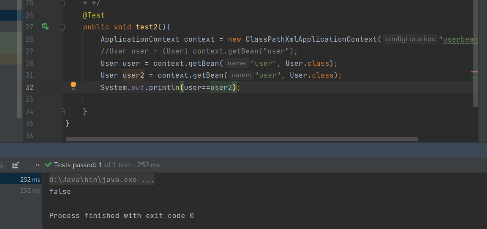

# 1、Spring

## 1.1、简介

- Spring：春天
- 2002年，spring的雏形interface21
- 2004年诞生
- Spring理念：使现有的技术更加容易使用，本身是一个大杂烩，整合了现有的技术框架


- SSH：Struct2+Spring+Hibernate
- SSM：SpringMVC+Spring（融合剂）+Mybatis

官网：[Spring Framework Overview :: Spring Framework](https://docs.spring.io/spring-framework/reference/overview.html)

Github：[spring-projects/spring-framework: Spring Framework (github.com)](https://github.com/spring-projects/spring-framework)

```xml
<dependency>
    <groupId>org.springframework</groupId>
    <artifactId>spring-webmvc</artifactId>
    <version>6.1.5</version>
</dependency>
<dependency>
    <groupId>org.springframework</groupId>
    <artifactId>spring-jdbc</artifactId>
    <version>6.1.5</version>
</dependency>
```

```xml
<beans xmlns="http://www.springframework.org/schema/beans"
       xmlns:xsi="http://www.w3.org/2001/XMLSchema-instance"
       xmlns:p="http://www.springframework.org/schema/p"
       xsi:schemaLocation="http://www.springframework.org/schema/beans
                           https://www.springframework.org/schema/beans/spring-beans.xsd">

</beans>
```

## 1.2、优点

- Spring是一个开源的免费的框架（容器）
- Spring是一个轻量级的，非入侵式的框架（集成了spring原项目不会产生影响）
- **控制反转（IOC）、面向切片编程（AOP）**
- 支持事物的处理，对框架整合的支持

总结：

==Spring就是一个轻量级的控制反转（IOC）面向切片（AOP）编程的框架==

## 1.3、组成


## 1.4、扩展

在Spring官网有这个介绍：现代化的java开发：基于Spring的开发


- Spring Boot
  - 一个快速开发的脚手架
  - 基于Spring Boot可以快速的开发单个微服务
  - 约定大于配置
- Spring Cloud
  - SpringCloud基于SpringBoot实现的

学习SpringBoot前提：需要完全掌握Spring及SpringMVC

**弊端：配置十分繁琐**

# 2、IOC理论推导

1. UserDao接口


2. UserDaoImpl实现类


3. UserService业务接口


4. UserServiceImpl业务实现类

在之前业务中，用户的需求可能会影响原来的代码，需要根据用户的需求修改源代码，如果程序代码量十分大，修改一次的成本代价十分昂贵


使用set接口实现：已经发生了革命性的变法

```java
private UserDao userDao;

public void setUserDao(UserDao userDao) {
    this.userDao = userDao;
}
```

- 之前，程序是主动创建对象，控制权在程序员
- 利用set注入后，程序不再具有主动性，而是被动接收对象

控制反转：主动创建对象-->被动的接收对象

这种思想，本质上解决了问题，程序员不用再去管理对象的创建，系统的耦合性大大降低，可以更加专注业务的实现，这是IOC的原型


采用XML方式配置Bean的时候，Bean的定义信息是和实现分离的，而采用注解的方式看把两者合为一体，Bean的定义信息直接以注解的形式定义在实现类中，从而达到了零配置的目的

**控制反转是一种通过描述（XML或注解）并通过第三方去生产或获取特定对象的方式，在Spring中实现控制反转的是IOC容器，其实现方式是依赖注入**

# 3、HelloSpring

通过配置文件的class的全类名获取，通过反射获取类并创建实例对象，再通过property调用setter函数并赋值

- hello是谁创建的？
  - hello对象是由Spring创建的
- hello对象的属性是怎么设置的
  - hello对象的属性是由Spring容器设置的

这个过程就是控制反转

反转：程序本身不创建对象，而变成被动的接收对象

依赖注入：就是利用set方法来进行注入的

IOC是一种编程思想：主动的编程-->被动的编程

要实现不同的操作，只需要在xml配置文件中进行修改，所谓的IOC就是：对象由Spring创建，管理，装配

# 4、IOC创建对象的方式

1. 使用无参构造创建对象，默认！

2. 要使用有参构造创建对象

   1. 下标赋值

   ```xml
   <bean id="user" class="com.xiaoke.pojo.User">
       <!--            方式一：index进行传入参数-->
       <constructor-arg index="0" value="xiaoke_index"/>
   </bean>
   ```

   2. 类型

   ```xml
   <bean id="user" class="com.xiaoke.pojo.User">
       <!--            方式二：type类型进行传参，但是不推荐如果有两个一样类型就不好解决了-->
       <constructor-arg type="java.lang.String" value="xiaoke_type"/>
   
   </bean>
   ```

   3. 参数名

   ```xml
   <bean id="user" class="com.xiaoke.pojo.User">
       <!--            方式三：直接通过参数名来设置-->
       <constructor-arg name="name" value="xiaoke_name"/>
       <property name="name" value="xiaokeke"/>
   </bean>
   ```

   总结：在配置文件加载的时候，容器中管理的对象就已经实例化了

​		

# 5、Spring配置

## 5.1、别名

```xml
<!--    别名，如果添加了别名，也可以使用别名获取到这个对象-->
<alias name="user" alias="userNew"/>
```

## 5.2、Bean的配置

```xml
<!--
    id：bean的唯一标识符，也就是相当于学的变量名
    class：bean对象所对应的全限定命名（包名+类名）
    name：也是别名而且name可以同时取多个别名可以使用，；空格进行分割
-->
<bean id="user2" class="com.xiaoke.pojo.UserT" name="t1 t2,t3;t4">
    <property name="name" value="123"/>
</bean>
```

## 5.3、import

这个import一般用于团队开发使用，可以将多个配置文件，导入合并为一个

假设，现在项目有多个人开发，这三个人负责不同的类开发，不同的类需要注册在不同的bean中，可以利用import将所有人的beans.xml合并为一个总的applicationContext.xml

- 张三
- 李四
- 王五

使用的时候直接使用一个总的配置就行

```xml
<import resource="bean.xml"/>
<import resource="bean2.xml"/>
<import resource="bean3.xml"/>
```

# 6、DI依赖注入

## 6.1、构造器注入

```java
private UserDao userDao;

public void setUserDao(UserDao userDao) {
    this.userDao = userDao;
}
```

```java
UserService userService = new UserServiceImpl();
((UserServiceImpl) userService).setUserDao(new UserDaoMysqlImpl());
userService.getUser();
```

```xml
<bean id="user" class="com.xiaoke.pojo.User">
    <!--            方式一：index进行传入参数-->
    <!--            <constructor-arg index="0" value="xiaoke_index"/>-->
    <!--            方式二：type类型进行传参，但是不推荐如果有两个一样类型就不好解决了-->
    <!--            <constructor-arg type="java.lang.String" value="xiaoke_type"/>-->
    <!--            方式三：直接通过参数名来设置-->
    <constructor-arg name="name" value="xiaoke_name"/>
    <property name="name" value="xiaokeke"/>
</bean>
```

## 6.2、set方式注入【重点】

- 依赖注入：Set注入
  - 依赖：bean对象的创建依赖于容器
  - 注入：bean对象中的所有属性，由容器来注入

环境搭建

1. 复杂类型

```java
public class Address {
    private String address;

    public String getAddress() {
        return address;
    }

    public void setAddress(String address) {
        this.address = address;
    }
}
```

2. 真实测试对象

```java
package com.xiaoke;

import org.springframework.scheduling.support.SimpleTriggerContext;
import java.util.*;
public class Student {
    private String name;
    private Address address;
    private String[] books;
    private List<String> hobbies;
    private Map<String,String> card;
    private Set<String> games;
    private String wife;
    private Properties info;
}
```

3. beans.xml

```xml
<beans xmlns="http://www.springframework.org/schema/beans"
       xmlns:xsi="http://www.w3.org/2001/XMLSchema-instance"
       xmlns:p="http://www.springframework.org/schema/p"
       xsi:schemaLocation="http://www.springframework.org/schema/beans
	https://www.springframework.org/schema/beans/spring-beans.xsd">
    <bean id="student" class="com.xiaoke.Student">
<!--        第一种，普通值注入，value-->
        <property name="name" value="小柯"/>
    </bean>
</beans>
```

4. 测试类

```java
public class Mytest {
    public static void main(String[] args) {
        ApplicationContext context = new ClassPathXmlApplicationContext("beans.xml");
        Student student = (Student) context.getBean("student");
        System.out.println(student.getName());
    }
}
```

完善注入信息：

```xml
<beans xmlns="http://www.springframework.org/schema/beans"
       xmlns:xsi="http://www.w3.org/2001/XMLSchema-instance"
       xmlns:p="http://www.springframework.org/schema/p"
       xsi:schemaLocation="http://www.springframework.org/schema/beans
	https://www.springframework.org/schema/beans/spring-beans.xsd">
    <bean id="address" class="com.xiaoke.Address">
        <property name="address" value="深圳"/>
    </bean>
    <bean id="student" class="com.xiaoke.Student">
<!--        第一种，普通值注入，value-->
        <property name="name" value="小柯"/>
<!--        第二种：bean注入，ref-->
        <property name="address" ref="address"/>
<!--        第三种：数组注入-->
        <property name="books">
            <array>
                <value>红楼梦</value>
                <value>水浒传</value>
                <value>西游记</value>
                <value>三国演义</value>
            </array>
        </property>
<!--        第四种：list注入-->
        <property name="hobbies" >
            <list>
                <value>听歌</value>
                <value>敲代码</value>
                <value>看电影</value>
            </list>
        </property>
<!--        第五种：map注入-->
        <property name="card">
            <map>
                <entry key="身份证" value="44522420010221320"/>
                <entry key="银行卡" value="12345678987654345"/>
            </map>
        </property>
<!--        第六种：set注入-->
        <property name="games">
            <set>
                <value>LOL</value>
                <value>COC</value>
                <value>BOB</value>
            </set>
        </property>
<!--        第七种：null注入-->
        <property name="wife">
            <null/>
        </property>
<!--        第八种：properties-->
        <property name="info">
            <props>
                <prop key="学号">12005010089</prop>
                <prop key="性别">男</prop>
                <prop key="姓名">小柯</prop>
            </props>
        </property>
    </bean>
</beans>
```

```java
//输出结果：
/*
    * Student{
    *         name='小柯',
            * address=Address{address='深圳'},
            * books=[红楼梦, 水浒传, 西游记, 三国演义],
            * hobbies=[听歌, 敲代码, 看电影],
            * card={身份证=44522420010221320,
            *        银行卡=12345678987654345},
            * games=[LOL, COC, BOB],
            *  wife='null', 
            * info={姓名=小柯, 学号=12005010089, 性别=男}
    * }
    * */
```


## 6.3、拓展方式注入

可以使用p命名空间和c命名空间进行注入

官方解释：

[依赖关系和配置详解 ：： Spring Framework](https://docs.spring.io/spring-framework/reference/core/beans/dependencies/factory-properties-detailed.html#beans-p-namespace)

测试：

```xml
<!--    p命名空间注入，可以直接注入属性的值：property-->
<bean id="user" class="com.xiaoke.User" p:name="xiaoke" p:age="18"/>
<!--    c命名空间注入，可以直接注入构造器的值：constructor-
    <bean id="user2" class="com.xiaoke.User" c:_0="xiaoke" c:_1="123"/>
```

```xml
xmlns:p="http://www.springframework.org/schema/p"
xmlns:c="http://www.springframework.org/schema/c"
```

## 6.4、bean的作用域


1. singleton（单例模式）spring默认机制


```xml
<bean id="user" class="com.xiaoke.User" p:name="xiaoke" p:age="18" scope="singleton"/>
```

prototype（原型）


```xml
<bean id="user" class="com.xiaoke.User" p:name="xiaoke" p:age="18" scope="prototype"/>
```



加上了prototype那两个user就不是同一个对象了

每次从容器中get的时候，都会产生一个新的对象

3. 其余的requestion、session、application，这些只能在web上才能使用

# 7、Bean的自动装配

- 自动装配是Spring满足bean依赖的一种
- Spring会在上下文中自动寻找，并自动给bean装配属性

在Spring中有三种装配方式：

1. 在xml中显示配置
2. 在java中显示配置
3. 隐式的自动装配bean【重点】

所谓的自动装配-->是自动获取容器里的实例并返回

## 7.1、测试

搭建环境：一个人有两个宠物

## 7.2、byName自动装配

```xml
    <bean id="cat" class="com.xiaoke.Cat"/>
    <bean id="dog" class="com.xiaoke.Dog"/>
<!--
    ByName：会自动在容器上下文中查找，和自己对象set方法后面的值对应的beanid
-->
    <bean id="people" class="com.xiaoke.Person" autowire="byName">
        <property name="name" value="小柯呀"/>
    </bean>
```

## 7.3、byType自动装配

```xml
    <bean class="com.xiaoke.Cat"/>
    <bean class="com.xiaoke.Dog"/>
<!--
    ByType：会自动在容器上下文中查找，和自己对象属性类型相同的bean
-->
    <bean id="people" class="com.xiaoke.Person" autowire="byType">
        <property name="name" value="小柯呀"/>
    </bean>
```

小结：

- byName的时候，需要保证所有bean的id唯一，并且这个bean需要和自动注入的属性的set方法的值一致
- byType的时候，需要保证所有的bean的class唯一，并且这个bean需要和自动注入的属性类型要保持一致

## 7.4、使用注解实现自动装配

jdk1.5支持的注解，Spring2.5就支持注解

要使用注解须知

1. 导入约束	context约束
2. 配置注解支持：`   <context:annotation-config/>  `【重要】

```xml
<?xml version="1.0" encoding="UTF-8"?>
<beans xmlns="http://www.springframework.org/schema/beans"
       xmlns:xsi="http://www.w3.org/2001/XMLSchema-instance"
       xmlns:context="http://www.springframework.org/schema/context"
       xsi:schemaLocation="http://www.springframework.org/schema/beans
                           https://www.springframework.org/schema/beans/spring-beans.xsd
                           http://www.springframework.org/schema/context
                           https://www.springframework.org/schema/context/spring-context.xsd">

    <context:annotation-config/>

</beans>
```

@Autowired

直接在属性上使用即可，也可以在set方式上使用

使用Autowired可以不用编写set方法，前提是这个自动装配的属性在IOC容器（Spring）中存在，且符合类型（与byType类似)==会从类型进行去找，如果有多个相同类型找不到，就从名字去找==

科普：

```xml
@Nullable	字段标记了这个注解，说明这个字段可以为null
```

```java
public @interface Autowired {
    boolean required() default true;
}
```

如果显示定义了@Autowired的required属性为false，说明这个对象可以为null，否则不允许为空

```java
public class Person {
    //如果显示定义了@Autowired的required属性为false，说明这个对象可以为null，否则不允许为空
    @Autowired(required = false)
    private Cat cat;
    @Autowired
    private Dog dog;
    private String name;
}
```

如果

@Autowired自动装配的环境比较复杂，自动装配无法通过一个注解@Autowired可以和@Qualifier(value="xxx")（这个就类似于byName的功能）注解进行配合使用，指定一个唯一的bean对象注入

```java
public class Person {
    //如果显示定义了@Autowired的required属性为false，说明这个对象可以为null，否则不允许为空
    @Autowired
    @Qualifier("cat123")
    private Cat cat;

    @Autowired
    @Qualifier("dog123")
    private Dog dog;
    private String name;
}
```

@Resource，先从名字去匹配，在用类型去匹配

>@Autowired//默认按type注入
>@Qualifier("cusInfoService")//一般作为@Autowired()的修饰用
>@Resource(name="cusInfoService")//默认按name注入，可以通过name和type属性进行选择性注入

```java
public class Person {
    //如果显示定义了@Autowired的required属性为false，说明这个对象可以为null，否则不允许为空
    @Resource
    @Qualifier("cat123")
    private Cat cat;

    @Autowired
    @Qualifier("dog123")
    private Dog dog;
    private String name;
}
```

小结：

@Autowired与@Resource的区别：

- 都是用来自动装配，都可以放在属性字段上
- Autowired默认通过byType来实现，不行再通过名字
- @Resource默认通过byName来实现，不行再类型

# 8、使用注解开发

在Spring4之后，要使用注解开发就需要aop包的导入

但是导入过了Springmvc里面包含了aop的包

使用注解需要导入context约束，增加注解的支持

```xml
<beans xmlns="http://www.springframework.org/schema/beans"
       xmlns:xsi="http://www.w3.org/2001/XMLSchema-instance"
       xmlns:p="http://www.springframework.org/schema/p"
       xmlns:context="http://www.springframework.org/schema/context"
       xsi:schemaLocation="http://www.springframework.org/schema/beans
                           https://www.springframework.org/schema/beans/spring-beans.xsd
                           http://www.springframework.org/schema/context
                           https://www.springframework.org/schema/context/spring-context.xsd">
    <!--    开启注解的支持-->
    <context:annotation-config/>
</beans>
```

```xml
<bean id="user" class="com.xiaoke.pojo.User"/>
```

等价于@Component注解：放在类上，说明这个类被Spring管理了，就是所谓的bean

```java
@Component
public class User {
    public String name="xiaoke";

}
```


1. bean

2. 属性如何注入

```java
@Component
@Scope("singleton")//与bean中配置Scope一样
public class User {
//    public String name="xiaoke";
    @Value("xiaoke123")
    public String name;
}
```

3. 衍生的注解

@Component有几个衍生注解，在web开发中，会按照mvc三层架构分层

- dao【@Repository】
- service【@Service】
- controller【@Controller】

​	这四个注解功能一样的，都是代表将某个类注册到Spring中，装配bean

4. 自动装配

```
@Autowired：自动装配通过类型，再通过名字
	如果Autowired不能唯一自动装配上数学，则需要使用@Qualifier(value="")
@Nullable	字段标记了这个注解，说明这个字段可以为null
@Resource	：自动装配通过名字后，再通过类型
```

5. 作用域

```java
@Component
@Scope("singleton")//与bean中配置Scope一样
public class User {
//    public String name="xiaoke";
    @Value("xiaoke123")
    public String name;
}
```

6. 小结

xml与注解：

- xml更加万能，适用于任何场景，维护简单方便
- 注解不是自己类使用不了，维护相对复杂

xml与注解最佳实践

- xml用来管理bean
- 注解只负责完成属性的注入
- 在使用的过程，需要注意L必须让注解生效，就需要开启注解的支持(驱动&扫描包)

```xml
<!--    开启注解的支持：注解驱动-->
<context:annotation-config/>
<!--    指定要扫描的包，这个包下的注解就会生效-->
<context:component-scan base-package="com.xiaoke.pojo"/>
```


# 9、使用java的方式配置Spring

现在要完全不使用Spring的xml配置，全权交给java来做

javaconfig是Spring的一个子项目，在Spring4之后，他成为一个核心功能

>Spring 框架在初始化 IOC 容器并执行到 @ComponentScan 注解的处理时，会对 basePackages **指定的包及其子包**的所有类进行扫描，并将使用了 @Component 注解及其子注解的类自动加载和注入到 Spring 的 IOC 容器。

@ComponentScan 注解与 XML 文件中的 <context:component-scan /> 标签是等效的

但是在作用上 <context:component-scan /> 标签还具备自动开启注解驱动，而这点 @ComponentScan 注解是没有的。

所有@ComponentScan 要与@Component一起配置使用

所以@bean+@Configuration与@Component+@ConponentScan("包位置")等效

```java
@ComponentScan(basePackages = "com.xiaoke.pojo")//会把pojo下的注解包含@Component的都记载道Spring容器中
public class KeConfig {
    public User getUser(){
        return new User();
    }
}
```

User类

```java
@Component//表示改类可以被自动加载到SPringIOC容器中
public class User {
    private String name;

    public String getName() {
        return name;
    }
    @Value("xiaoke")
    public void setName(String name) {
        this.name = name;
    }

    @Override
    public String toString() {
        return "User{" +
                "name='" + name + '\'' +
                '}';
    }
}
```

```java
//测试
public class MyTest {
    @Test
    public void test(){
        ApplicationContext context = new AnnotationConfigApplicationContext(KeConfig.class);
        User getUser = context.getBean("user", User.class);
        System.out.println(getUser.getName());
    }
}
```


```java
@Configuration//相当于这个就是一个ApplicationConfig.xml的主体参数<beans>
public class KeConfig {
    //等价与在xml中的一个bean，id=getUser resultType=User
    public User getUser(){
        return new User();
    }
}

```

然后User实体类中就不需要@Component注解了

```java
public class MyTest {
    @Test
    public void test(){
        ApplicationContext context = new AnnotationConfigApplicationContext(KeConfig.class);
        User getUser = context.getBean("getUser", User.class);
        System.out.println(getUser.getName());
    }
}
```

但是有一点区别在于：获取的bean的id

` User getUser = context.getBean("getUser", User.class);`

`User getUser = context.getBean("user", User.class);`


# 10、代理模式

为什么要学习代理模式：因为这就是SpringAOP的底层【SpringAOP和SpringMVC】

代理模式的分类：

- 静态代理
- 动态代理


## 10.1、静态代理

角色分析：

- 抽象类：一般会使用接口或者抽象类来解决
- 真实角色：被代理的角色
- 代理角色：代理真实角色，代理真实角色后，一般会做一些附属操作

- 客户：访问代理对象的人！


代理步骤：

1. 接口

```java
public interface Rent {
    public void rent();
}
```

2. 真实角色

```	java
public class Host implements Rent{
    @Override
    public void rent() {
        System.out.println("房东来租房子");
    }
}
```

3. 代理角色

```java
public class Proxy implements Rent{
    private Host host;

    /*public void setHost(Host host) {
        this.host = host;
    }*/

    public Proxy() {
    }

    public Proxy(Host host) {
        this.host = host;
    }

    @Override
    public void rent() {
        seeHouse();
        host.rent();
        hetong();
        fare();
    }

    //看房
    public void seeHouse(){
        System.out.println("中介带你看房子");
    }
    //收中介费
    public void fare(){
        System.out.println("收中介费");
    }
    //签合同
    public void hetong(){
        System.out.println("签租赁合同");
    }
}
```

4. 客户端访问代理角色

```java
public class Client {
    public static void main(String[] args) {
        Host host = new Host();
        //代理角色有附属操作
        Proxy proxy = new Proxy(host);
        proxy.rent();
    }
}
```


静态代理模式的好处：

- 可以使真实角色的操作更加纯粹，不用去关注公共的事务
- 公共业务就交给了代理角色，实现了业务的分工
- 公共业务发生拓展的时候方便集中管理

缺点：

- 一个真实角色就会产生一个代理角色，代码量会翻倍--开发效率较低

## 10.2、加深理解静态代理

代码：对应-08-proxy-demo02

AOP：


## 10.3、动态代理

- 动态代理和静态代理角色一样
- 动态代理的代理类使动态生成的
- 动态代理分为两大类：基于接口的动态代理，基于类的动态代理
  - 基于接口-JDK动态代理【使用】
  - 基于类：cglib
  - java字节码实现javasist

需要了解两个类：proxy：代理，InocationHandler：调用处理程序

**InocationHandler**

动态代理模式的好处：

- 可以使真实角色的操作更加纯粹，不用去关注公共的事务
- 公共业务就交给了代理角色，实现了业务的分工
- 公共业务发生拓展的时候方便集中管理
- 一个动态代理类代理的使一个接口，一般就是对应的一类业务
- 一个动态代理类可以代理多个类，只要是实现了同一个接口就行

# 11、AOP

## 11.1、什么是AOP

- AOP（Aspect Oriented Programming）意为：面向切面编程，通过预编译方式和运行期动态代理实现程序功能的统一维护的一种技术。
- AOP是OOP的延续，是软件开发中的一个热点，也是Spring框架中的一个重要内容，是函数式编程的一种衍生范型。
- 利用AOP可以对业务逻辑的各个部分进行隔离，从而使得业务逻辑各部分之间的耦合度降低，提高程序的可重用性，同时提高了开发的效率


## 11.2、AOP在Spring中的作用

==提供声明式事务；允许用户自定义切面==

- 横切关注点：跨越应用程序多个模块的方法或功能。即是，与我们业务逻辑无关的，但是我们需要关注的部分，就是横切关注点。如日志 , 安全 , 缓存 , 事务等等 —— 需要增加的功能

- 切面（ASPECT）：把通知应用到切入点的过程 ，比如把权限验证加入到登录的过程

- 通知 / 增强（Advice）：实际增强的逻辑（代码）

- 目标（Target）：被增强的类、接口

- 代理（Proxy）：生成的代理类

- 切入点（PointCut）：实际被增强的方法

- 连接点（JointPoint）：哪些方法需要被增强。


SpringAOP中，通过Advice定义横切逻辑，Spring中支持5种类型的Advice:


即 Aop 在 不改变原有代码的情况下 , 去增加新的功能 .

## 11.3、使用Spring实现AOP

【重点】使用AOP，需要导入一个包

```xml
<dependency>
    <groupId>org.aspectj</groupId>
    <artifactId>aspectjweaver</artifactId>
    <version>1.9.4</version>
    <scope>runtime</scope>
</dependency>
```

**方式一：使用Spring的API接口【主要SpringAPI接口实现】**

```xml
<!--    注册bean-->
<bean id="UserService" class="com.xiaoke.Service.UserServiceImpl"/>
<bean id="log" class="com.xiaoke.log.Log"/>
<bean id="AfterLog" class="com.xiaoke.log.AfterLog"/>

<aop:config>
    <!--        切入点：什么地方执行Spring的方法     expression="execution(返回类型 类名 方法名 参数)"-->
    <aop:pointcut id="pointcut" expression="execution(* com.xiaoke.Service.UserServiceImpl.*(..))"/>
    <!--       执行环绕增强-->
    <!--        把log这个类切入到expression中-->
    <aop:advisor advice-ref="log" pointcut-ref="pointcut"/>
    <aop:advisor advice-ref="AfterLog" pointcut-ref="pointcut"/>
</aop:config>

```

```java
public class Log implements MethodBeforeAdvice {
    @Override
    public void before(Method method, Object[] args, Object target) throws Throwable {
        //method：要执行的目标对象的方法
        //args：参数
        //target：目标对象
        System.out.println(target.getClass().getName()+"的"+method.getName()+"被执行了");
    }
}
```

```java
public class AfterLog implements AfterReturningAdvice {
    //returnValue：返回值
    @Override
    public void afterReturning(Object returnValue, Method method, Object[] args, Object target) throws Throwable {
        System.out.println("执行了"+method.getName()+"方法，返回了"+returnValue);
    }
}
```


1. 先注册bean，把对象都实例化了
2. aop的配置
3. `aop:pointcut` id名字，expression你要切入方法的位置
4. `aop:advisor` advice-ref=你之前实现Spring接口的并且注册了bean的对象，pointcut-ref="要切入点的id"
5. 本质上就是在动态代理不改变原有的代码的基础上，面向切面，从侧面进行把要执行的方法（日志，缓存）执行了

**方式二：使用自定义类来实现AOP【主要是切面定义】**

```xml
<!--    第二种方式：自定义类-->
<bean id="diy" class="com.xiaoke.DIY.DiyPointCut"/>
<aop:config>
    <!--        自定义切面，ref要引用的类-->
    <aop:aspect ref="diy">
        <!--            切入点-->
        <aop:pointcut id="point" expression="execution(* com.xiaoke.Service.UserServiceImpl.*(..))"/>
        <!--            通知-->
        <aop:before method="before" pointcut-ref="point"/>
        <aop:after method="after" pointcut-ref="point"/>
    </aop:aspect>
</aop:config>
```

```java
public class DiyPointCut {
    public void before(){
        System.out.println("方法执行前");
    }
    public void after(){
        System.out.println("方法执行后");
    }
}
```

1. 先注册bean，把类先注册了
2. aop配置
3. `aop:aspect ref="xxx"` ：自定义切面需要用到的类
4. aop:pointcut：切入点id，切入位置：你想要增强的类位置下的方法
5. aop:before，after：执行完方法之前进行执行这个插入的方法还是执行之后插入方法。
6. method：放入刚刚引用类中的方法名，切点位置参考，上面的aop:pointcut的id

**方式三：使用注解实现**

```xml

<!--    方式三：使用注解（不影响原本的代码的基础上实现动态增强）-->
    <bean id="UserService" class="com.xiaoke.Service.UserServiceImpl"/>
    <bean id="annotationPointCut" class="com.xiaoke.DIY.AnnotationPointCut"/>
<!--    开启注解支持 JDK（默认  proxy-target-class 就是为false ）
 cglib（proxy-target-class="true"  意思就是使用cglib）
 -->
    <aop:aspectj-autoproxy proxy-target-class="false"/>
```

```java
//使用注解实现AOP
@Aspect//标注这个类为切面
public class AnnotationPointCut {
    @Before("execution(* com.xiaoke.Service.UserServiceImpl.*(..))")
    public void before(){
        System.out.println("============方法执行前===============");
    }
    @After("execution(* com.xiaoke.Service.UserServiceImpl.*(..))")
    public void after(){
        System.out.println("============方法执行后===============");
    }
    //在环绕增强中，可以给一个参数，代表要处理切入的点
    @Around("execution(* com.xiaoke.Service.UserServiceImpl.*(..))")
    public void aroudn(ProceedingJoinPoint jp){
        System.out.println("环绕前");
        Signature signature = jp.getSignature();//获得签名
        System.out.println("signature："+signature);
        try {
            jp.proceed();//执行方法

        } catch (Throwable e) {
            throw new RuntimeException(e);
        }
        System.out.println("环绕后");
    }
}
```

```java
public class MyTest {
    public static void main(String[] args) {
        ApplicationContext context = new ClassPathXmlApplicationContext("applicationContext.xml");
        //动态代理的是接口
        UserService userService = context.getBean("UserService", UserService.class);
        userService.select();
    }
}
```


JDK（默认实现） cglib

```xml
<!--    开启注解支持 JDK（默认  proxy-target-class 就是为false ）   
 cglib（proxy-target-class="true"  意思就是使用cglib）
 -->
    <aop:aspectj-autoproxy proxy-target-class="false"/>
```

小结：

本质上AOP就是==不影响原本的代码的基础上实现动态增强==

# 12、整合Mybatis

步骤：

1. 导入相关jar包
   - junit
   - mybatis
   - mysql数据库
   - spring相关的
   - AOP织入
   - mybatis-spring【newknowledge】


2. 编写配置文件


3. 测试


## 12.1、回忆mybatis

1. 编写实体类
2. 编写核心配置文件
3. 编写接口
4. 编写mapper.xml
5. 测试


## 12.2、Mybatis-Spring

## 什么是 MyBatis-Spring？

MyBatis-Spring 会帮助你将 MyBatis 代码无缝地整合到 Spring 中。它将允许 MyBatis 参与到 Spring 的事务管理之中，创建映射器 Mapper 和 SqlSession 并注入到 Bean 中，以及将 Mybatis 的异常转换为 Spring 的 DataAccessException。最终，可以做到应用代码不依赖于 MyBatis。


1. 编写数据源
2. sqlSessionFactory
3. sqlSessionTemplate
4. 需要给接口加一个实现类
5. 将自己写的实现类注入到spring中
6. 测试使用


步骤：第一种方式

1. 先新建实体类
2. UserMapper、UserMapper、UserMapperImpl的建立
3. UserMapper编写相应的sql
4. 在resource资源文件夹中，新建一个mybatis-config.xml文件、spring-dao.xml文件和ApplicationContext.xml

Spring-dao.xml

```xml
<beans xmlns="http://www.springframework.org/schema/beans"
       xmlns:xsi="http://www.w3.org/2001/XMLSchema-instance"
       xmlns:p="http://www.springframework.org/schema/p"
       xmlns:aop="http://www.springframework.org/schema/aop"
       xsi:schemaLocation="http://www.springframework.org/schema/beans
	https://www.springframework.org/schema/beans/spring-beans.xsd
    http://www.springframework.org/schema/aop
	https://www.springframework.org/schema/aop/spring-aop.xsd
">
    <!--    DataSource：使用spring的数据源替换mybatis的配置   c3p0，dbcp， druid
        这里使用spring提供的jdbc：DriverManagerDataSource
    -->
    <bean id="dataSource" class="org.springframework.jdbc.datasource.DriverManagerDataSource">
        <property name="driverClassName" value="com.mysql.cj.jdbc.Driver"/>
        <property name="url" value="jdbc:mysql://localhost:3306/mybatis?useSSL=true&amp;useUnicode=true&amp;characterEncoding=utf-8&amp;serverTimezone=GMT"/>
        <property name="username" value="root"/>
        <property name="password" value="123456"/>
    </bean>
    <!--    sqlSessionFactory-->
    <bean id="sqlSessionFactory" class="org.mybatis.spring.SqlSessionFactoryBean">
        <property name="dataSource" ref="dataSource"/>
        <property name="configLocation" value="mybatis-config.xml"/>
        <property name="mapperLocations" value="classpath:com/xiaoke/mapper/UserMapper.xml"/>
    </bean>
    <bean id="sqlsession" class="org.mybatis.spring.SqlSessionTemplate">
        <constructor-arg index="0" ref="sqlSessionFactory"/>
    </bean>
</beans>
```

mybatis-config.xml

```xml
<?xml version="1.0" encoding="UTF-8" ?>
<!DOCTYPE configuration
        PUBLIC "-//mybatis.org//DTD Config 3.0//EN"
        "http://mybatis.org/dtd/mybatis-3-config.dtd">
<configuration>
    <typeAliases>
        <package name="com.xiaoke.pojo"/>
    </typeAliases>
</configuration>
```

ApplicationContext.xml

```xml
<beans xmlns="http://www.springframework.org/schema/beans"
       xmlns:xsi="http://www.w3.org/2001/XMLSchema-instance"
       xmlns:p="http://www.springframework.org/schema/p"
       xmlns:aop="http://www.springframework.org/schema/aop"
       xsi:schemaLocation="http://www.springframework.org/schema/beans
	https://www.springframework.org/schema/beans/spring-beans.xsd
    http://www.springframework.org/schema/aop
	https://www.springframework.org/schema/aop/spring-aop.xsd
">
<import resource="spring-dao.xml"/>
<bean id="userMapper" class="com.xiaoke.mapper.UserMapperImpl">
    <property name="sqlsession" ref="sqlsession"/>
</bean>
</beans>
```


5. UserMapperImpl的实现（sqlsession调用）

```java
public class UserMapperImpl implements UserMapper{
    private SqlSessionTemplate sqlsession;

    public void setSqlsession(SqlSessionTemplate sqlsession) {
        this.sqlsession = sqlsession;
    }

    @Override
    public List<User> getUsers() {
        return sqlsession.getMapper(UserMapper.class).getUsers();
    }
}
```


第二种方式：在spring-dao.xml中的sqlsession不需要进行配置不用使用

SqlSessionTemplate去生成一个sqlsession

只需要UserMapperImpl中extends SqlSessionDaoSupport和实现UserMapper中的接口

```java
public class UserMapperImpl2 extends SqlSessionDaoSupport implements UserMapper {
    @Override
    public List<User> getUserList() {
        /*SqlSession sqlSession = getSqlSession();
        UserMapper mapper = sqlSession.getMapper(UserMapper.class);
        return mapper.getUserList();*/
        return getSqlSession().getMapper(UserMapper.class).getUserList();
    }
}
```

<!-    方式二不需要自己去搞session通过SqlSessionDaoSupport进行创建sqlsession-->


# 13、声明式事务

## 1、回顾事务

- 把一组事务当成一个事务来做；要么都成功，要么都失败
- 事务在项目开发中，十分重要涉及到数据的一致性问题
- 确保完整性和一致性

事务ACID原则：

- 原子性
- 一致性
- 隔离性
  - 多个业务可能操作同一个资源，防止数据损坏
- 持久性
  - 事务一旦提交，无论系统发生什么问题，结果都不会在被影响，被持久化的写到存储中


## 2、Spring中的事务管理

- 声明式事务：AOP
- 编程式事务：需要在代码中，进行事务的管理


思考：

为什么需要事务：

- 如果不配置事务，可能会出现数据提交不一致的情况
- 如果不在Spring中去配置声明式事务，就需要在代码中手动配置事务
- 事务在项目开发十分重要，涉及到数据的一致性和完整性问题


```java
<!--    结合AOP实现事务的织入-->
<!--    配置事务的通知：tx-->
    <tx:advice id="txAdvice" transaction-manager="transactionManage">
<!--        给那些方法配置事务-->
<!--        配置事务传播特性-->
        <tx:attributes>
            <tx:method name="add" propagation="REQUIRED"/>
            <tx:method name="delete" propagation="REQUIRED"/>
            <tx:method name="update" propagation="REQUIRED"/>
            <tx:method name="query" read-only="true"/>
            <tx:method name="*" propagation="REQUIRED"/>
        </tx:attributes>
    </tx:advice>
<!--    配置事务切入-->
    <aop:config>
        <aop:pointcut id="txPointCut" expression="execution(* com.xiaoke.mapper.UserMapperImpl.*(..))"/>
        <aop:advisor advice-ref="txAdvice" pointcut-ref="txPointCut"/>
    </aop:config>
```


