# 微服务阶段

javase:OOP

mysql:持久化

html+css+js+jquery+框架:视图

javaweb:独立开发MVC三层架构的网站:原始

ssm:框架:简化了我们的开发流程,配置也开始较为复杂;

**war:tomcat运行**

spring再简化:SpringBoot-jar:内嵌tomcat;微服务架构

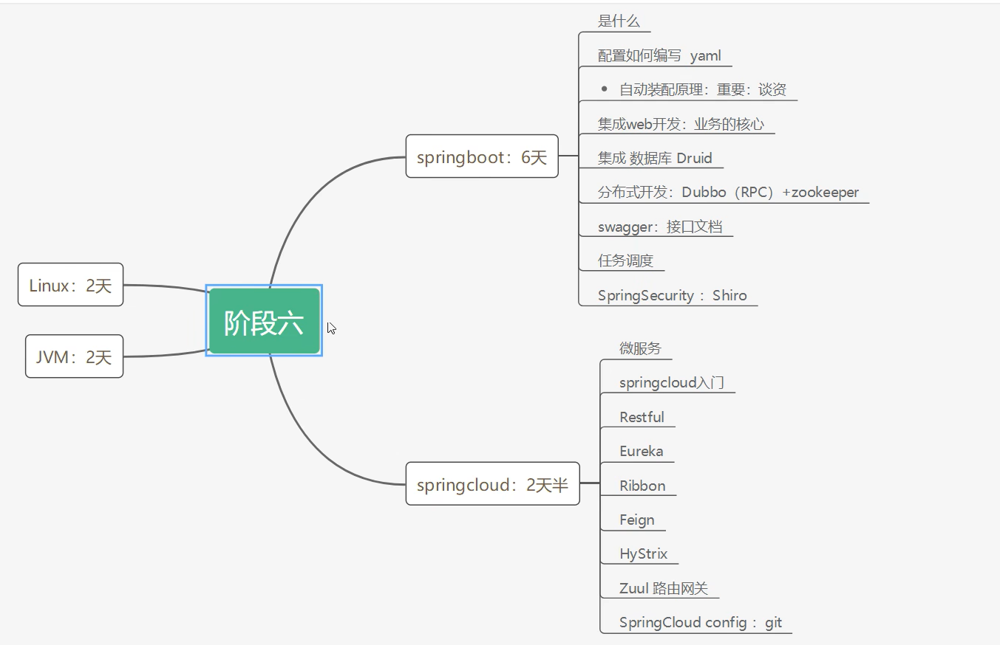

Spring就是为了解决企业级应用开发的复杂性而创建的,简化开发


MVC三层架构,MVVM,微服务架构

业务:service:userService ===> 模块

springmvc,controller==>提供接口

# 第一个SpringBoot程序

- jdk
- maven
- springboot
- IDEA

官方：提供了一个快速生成的网站！IDEA集成了这个网站！

- 可以再官网直接下载后，导入idea开发
- 直接使用idea创建一个springboot项目

# 原理初探

springboot-自动配置


pom.xml

- spring-boot-dependencies:核心依赖在父工程中
- 我们在写或者引入一些springboot依赖的时候，不需要指定版本，是因为有这些版本仓库
- 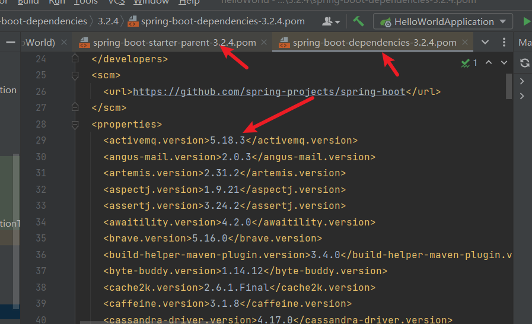

```xml
<!--		web依赖：tomcat，dispatcherServlet，xml-->
<dependency>
    <groupId>org.springframework.boot</groupId>
    <artifactId>spring-boot-starter-web</artifactId>
</dependency>

<!--		springboot依赖都是以spring-boot-starter开头的-->

<!--单元测试-->
<dependency>
    <groupId>org.springframework.boot</groupId>
    <artifactId>spring-boot-starter-test</artifactId>
    <scope>test</scope>
</dependency>
</dependencies>

<build>
    <!--		打jar包插件-->
    <plugins>
        <plugin>
            <groupId>org.springframework.boot</groupId>
            <artifactId>spring-boot-maven-plugin</artifactId>
        </plugin>
    </plugins>
</build>
```

- 项目单元数据信息：创建时候输入的project metadata部分，也就是maven项目的基本元素，包括groupId，artifactId，version，name，description等
- parent：继承spring-boot-parent的依赖管理，控制版本与打包等内容
- dependencies：项目具体依赖，这里包含了`spring-boot-starter-web`用于实现HTTP接口（该依赖包含了springMVC）官网对它的描述是：使用springMVC构建web（包含RestFul）应用程序的入门者，使用tomcat作为默认嵌入式容器；`spring-boot-starter-test`用于编写单元测试的依赖包，
- build：构建配置部分，默认使用了`spring-boot-maven-plugin`，配合`spring-boot-starter-parent`就可以把springboot应用打包成jar来直接运行

测试

```java
//自动装配：原理
@RestController
public class HelloController {
    //接口：http://localhost:8080/hello
    @RequestMapping("/hello")
    public String hello(){
        //调用业务，接收前端参数
        return "helloWorld";
    }
}
```

在application.properties中配置端口号：

```properties
#更改项目的端口号
server.port=8080
```

可以自定义banner

在resources中新建一个banner.txt文件即可

启动器

- ```xml
  <dependency>
      <groupId>org.springframework.boot</groupId>
      <artifactId>spring-boot-starter</artifactId>
  </dependency>
  ```

- 启动器：说白了就是Springboot的启动场景
- 比如spring-boot-starter-web，他就会帮我们自动导入web环境所有的依赖！
- springboot会将所有的功能场景，都变成一个个的启动器
- 我们要使用什么功能，就只需要找到对应的启动器就可以了`start`

**主程序**

```java
//@SpringBootApplication:标注这个类是一个springboot的应用
//本质上还是一个spring项目
@SpringBootApplication
public class FirstProjectApplication {
    public static void main(String[] args) {
        //将springboot应用启动
        //springapplication
        SpringApplication.run(FirstProjectApplication.class, args);
    }
}
```


- 注解

  - ```java
    @SpringBootConfiguration :springboot的配置
        @Configuration：spring配置类
        @Component：说明这也是一个spring的组件
        
    @EnableAutoConfiguration：自动配置
        @AutoConfigurationPackage：自动配置包		
        	@Import({AutoConfigurationPackages.Registrar.class})：导入了选择器`包注册`
        @Import({AutoConfigurationImportSelector.class})：自动配置导入选择
    //获取所有的配置    
    List<String> configurations = this.getCandidateConfigurations(annotationMetadata, attributes);
    
    ```

获取候选配置

```java
protected List<String> getCandidateConfigurations(AnnotationMetadata metadata, AnnotationAttributes attributes) {
    List<String> configurations = ImportCandidates.load(AutoConfiguration.class, this.getBeanClassLoader()).getCandidates();
    Assert.notEmpty(configurations, "No auto configuration classes found in META-INF/spring/org.springframework.boot.autoconfigure.AutoConfiguration.imports. If you are using a custom packaging, make sure that file is correct.");
    return configurations;
}
```

META-INF/spring/org.springframework.boot.autoconfigure.AutoConfiguration.imports自动配置的核心文件

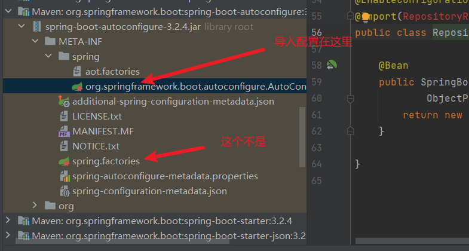

读取了这个配置文件才有的这些配置类

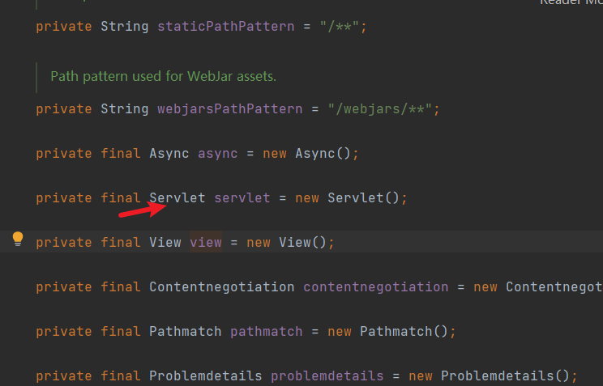


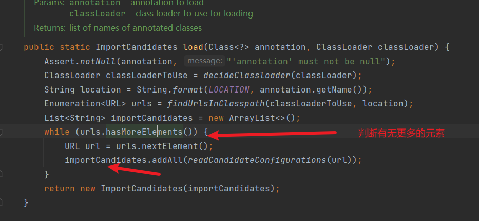


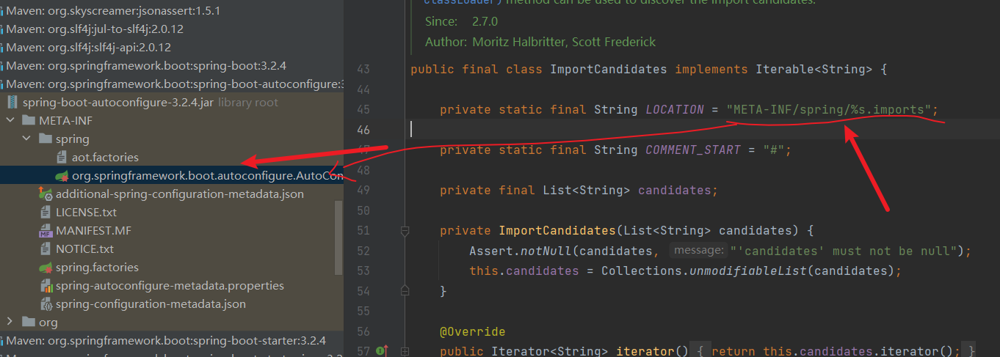


结论：

@ConditionOnxxx()：如果这里面条件成立才导入

springboot所有自动配置都是在启动的时候扫描并加载：所有的自动配置类都在`org.springframework.boot.autoconfigure.AutoConfiguration.imports`这里面，但是不一定会生效，要判断条件是否成立，只要导入了对应的start，就有对应的启动器。我们自动装配就会生效，然后就配置成功！

1. springboot在启动的时候。从类路径下/META-INF/org.springframework.boot.autoconfigure.AutoConfiguration.imports获取指定的值；
2. 将这些自动配置的类导入容器，自动配置就会生效，帮我进行自动配置；
3. 以前需要自动配置的东西，现在springboot做了
4. 整个javaEE，解决方案和自动配置的东西都在spring-boot-autoconfigure-3.2.2.jar这个包下面
5. 它会把所有需要导入的组件，以类名的方式返回。这些组件就会被添加到容器；
6. 容器中也会存在xxxAutoConfiguration的文件（@bean），就是这些类给容器中导入了这些场景需要的所有组件，并自动配置，@Configuration，javaConfig
7. 有了自动配置类，免去手动编写配置文件的工作

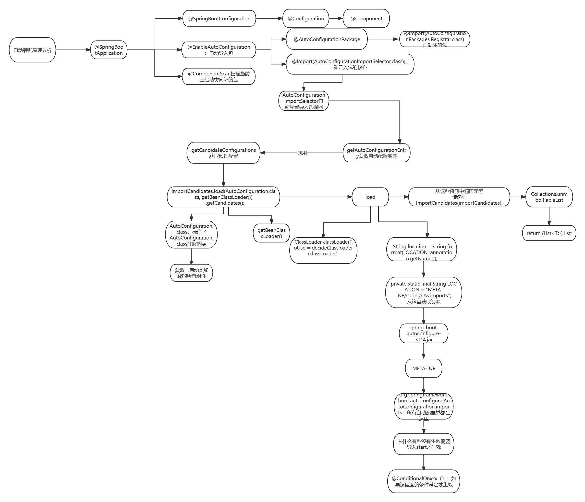

## SpringApplication类和run方法

run方法开启了一个服务

这个类主要做了以下四件事情：

1. 推断应用的类型是普通的项目还是web项目（是否配置javaweb，tomcat等配置）
2. 查找并加载所有可用初始化器，设置到initializers属性中
3. 找出所有的应用程序监听器，设置到listeners属性中
4. 推断并设置main方法的定义类，找到运行的主类

javaConfig	@Configuration（配置）	@Bean（组件）

Docker：进程


关于spring boot，理解：

- 自动装配
- run()

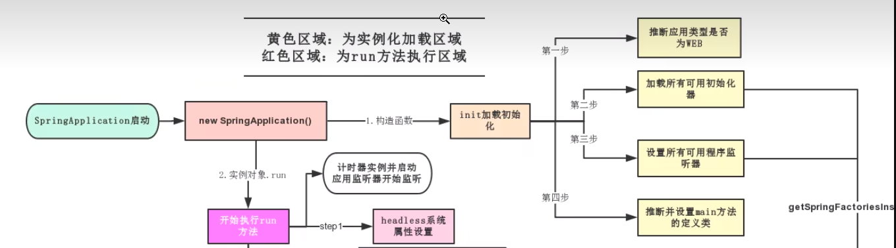

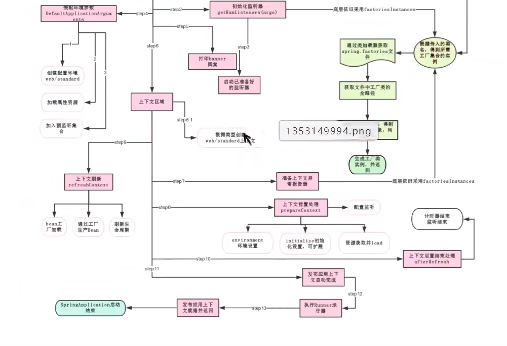

全面接管SpringMVC的配置！

# SpringBoot配置

application.properties可以配置什么东西呢？

查看官方文档

官方配置太多了解原理：

官方不推荐使用properties，推荐使用yaml

springboot使用一个全局的配置文件，配置文件名称是固定的

- application.properties
  - 语法结构：key=value
- application.yaml
  - 语法结构：key: 空格 value

配置文件的作用：

修改springboot自动配置的默认值，有无springboot在底层都给我们自动配置好了

## yaml语法：

基础语法：`k:(空格)value` 

以此来表示一堆键值对（括号不能省略）以空格的缩进来控制层级关系，只要是左边对齐的一列数据都是同一个层级的

注意：属性和值的大小写都是十分敏感的，对空格的要求十分高

```yaml
#普通的key-value
name: xiaoke
#对象
student:
  name: xiaoke
  age: 18
#行内写法：
student1: {name: xiaoke,age: 18}

#数组
pets:
  - cat
  - dog
  - pig

#数组行内写法
pets1: [cat,dog,pig]
```

yaml可以存放对象，数组

yaml配置可以注入到配置类中

强大之处：

- 可以直接给实体类赋值

@Value加在属性上的话是通过反射来赋值的，加在方法上面是通过set方法来赋值的，set性能更高效

@ConfigurationProperties的使用会导致爆红，但是不影响使用

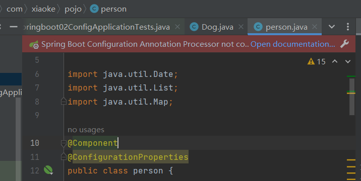


@ConfigurationProperties(prefix = "person")

使用prefix前缀与yaml中的person进行绑定

属性与配置文件的属性要一一对应，然后映射到实体类中

否则配置文件中的值无法赋值到实体类

告诉springboot将本类中的属性和配置文件中相关的配置进行绑定

只有这个组件是容器中的组件，才能使用容器容器提供的@ConfigurationProperties(prefix = "xxx")功能

自定义配置文件，加载指定配置文件@PropertySource(value="classpath:xxx")

properties，不能直接赋值，他不会自动匹配赋值，==yaml就会匹配赋值==

```java
public class person {
    @Value("${name}")
    private String name;
}
```

使用el表达式进行赋值

javaConfig	绑定配置文件的值，可以采取这种方式

- @ConfigurationProperties只需要写一次即可，value需要每个字段都添加

- 松散绑定：yml中写的last-name这个和lastName一样的，-后面跟着字母默认是大写的，这就是松散绑定
- JSR303数据校验，这个就是可以在字段增加一层过滤器验证，可以保证数据的合法性
- 复杂类型封装，yml可以封装对象，使用value就不支持

结论：

- 配置yml和配置properties都可以获取值，强烈推荐yml
- 在业务中，只需要获取配置文件中的某个值可以使用一下@value
- 如果要专门编写一个JavaBean来和配置文件进行映射，不如直接使用

@ConfigurationProperties

## JSR303数据校验

springboot可以用@Validated来校验数据，如果数据异常则会统一抛出异常，方便异常中旬统一处理，这里写个注解让name只能支持Email格式

1. 添加依赖

```java
<!-- https://mvnrepository.com/artifact/org.springframework.boot/spring-boot-starter-validation -->
<dependency>
    <groupId>org.springframework.boot</groupId>
    <artifactId>spring-boot-starter-validation</artifactId>
    </dependency>

```

2. 实体类中加入@Validated

```java
@Component
@ConfigurationProperties(prefix = "person")
//@PropertySource(value="classpath:xiaoke.properties")
@Validated//数据校验
public class person {
    @Email
    private String name;
}
```


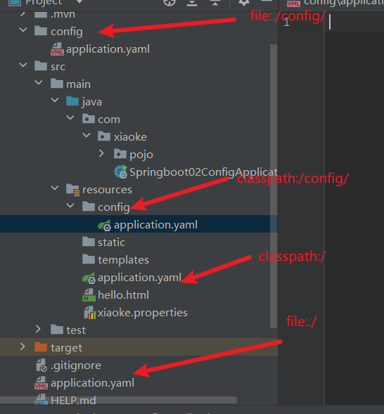

优先级：

1. file:/config/

2. file:/

3. classpath:/config/
4. classpath:/

> #springboot的多环境配置，可以选择激活哪一个配置文件

```yaml
spring:
  profiles:
    active: dev
```

配置文件到底能写什么?

只要有@EnableConfigurationProperties(xxx.class)注解的都是可以用yaml来进行配置xxx.class中的xxx的属性

*#**在**yaml**中能配置的东西，都存在一个规律，
**#**存在**xxxxAutoConfiguration:**有默认值*    *xxxx.properties**：配置文件绑定   就可以使用自定义配置了*

1. springboot启动会加载大量的自动配置类
2. 需要的功能有没有在springboot默认写好的自动配置类中
3. 这个自动配置类中到底配置了那些组件（只要我们要用的组件存在，就不需要自己手动配置）
4. 给容器中自动配置类添加组件的时候，会从properties类中获取某些属性，只需要在配置文件指定这些属性值即可
5. xxxxAutoConfiguration：自动配置类，给容器中添加组件
6.  *xxxx.properties：封装配置文件中相关属性

在yaml中输入debug: true就可以在控制台中看到那些自动配置类生效的，分为三类：自动配置类启动生效了，没有生效的，没有条件的类

# SpringBoot Web开发

jar： webapp

自动装配

1. 创建应用，选择模块
2. 配置springboot配置文件
3. 专注于业务编写代码

springboot到底帮我们配置了什么？能不能修改？，能修改什么内容？，能不能扩展？

- xxxAutoConfiguration----向容器中自动配置文件
- xxxproperties带有@ConfigurationProperties
- 所以xxx下的都是可以使用配置文件进行修改的

要解决的问题：

- 导入静态资源

- 首页
- jsp，模板引擎Thymeleaf
- 装配和扩展springMVC
- 增删改查
- 拦截器
- 国际化

## 静态资源

```java
@Override
public void addResourceHandlers(ResourceHandlerRegistry registry) {
    if (!this.resourceProperties.isAddMappings()) {
        logger.debug("Default resource handling disabled");
        return;
    }
    addResourceHandler(registry, this.mvcProperties.getWebjarsPathPattern(),
                       "classpath:/META-INF/resources/webjars/");
    addResourceHandler(registry, this.mvcProperties.getStaticPathPattern(), (registration) -> {
        registration.addResourceLocations(this.resourceProperties.getStaticLocations());
        if (this.servletContext != null) {
            ServletContextResource resource = new ServletContextResource(this.servletContext, SERVLET_LOCATION);
            registration.addResourceLocations(resource);
        }
    });
}
```

什么是webjars？

两种方式添加资源：一种是webjars，一种是resources文件下的

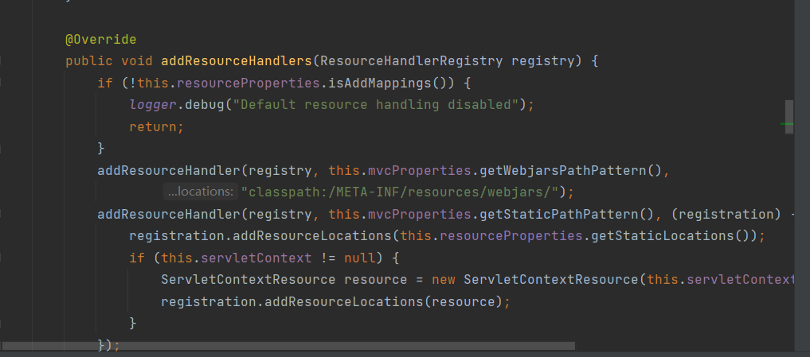


1. 可以导入一个jQuery依赖包

```xml
<dependency>
    <groupId>org.webjars</groupId>
    <artifactId>jquery</artifactId>
    <version>3.7.1</version>
</dependency>
```

2. 访问[localhost:8080/webjars/jquery/3.7.1/jquery.js](http://localhost:8080/webjars/jquery/3.7.1/jquery.js)地址就可以访问到这个jquery.js这个文件

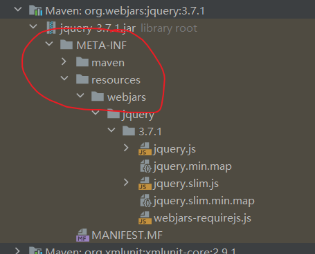


这个目录是用/webjars来替代了/META-INF/resources/webjars/所以就直接访问/webjars/jQuery/3.7.1/jquery.js

读取resources文件下的文件优先级

```java
private static final String[] *CLASSPATH_RESOURCE_LOCATIONS* = { "classpath:/META-INF/resources/",
       "classpath:/resources/", "classpath:/static/", "classpath:/public/" };
```


resources，static，public这三个都是resources下的文件

就是把`"classpath:/META-INF/resources/",
       "classpath:/resources/", "classpath:/static/", "classpath:/public/" `路径下的文件转化为/**，要访问的时候就只需要local host:8080/这里访问

总结：

1. 在springboot中，可以使用以下方式处理静态资源
   1. webjars	访问方式：`localhost:8080/webjars/`
   2. resources下的resources、static、public    访问方式：`localhost:8080/***`

2. 优先级：resources>static（默认）>public

## 首页如何定制

所有配置默认都是在WebMvcutoConfiguration中的


## 模板引擎

springboot默认不支持jsp所有只能用Thymeleaf模板引擎

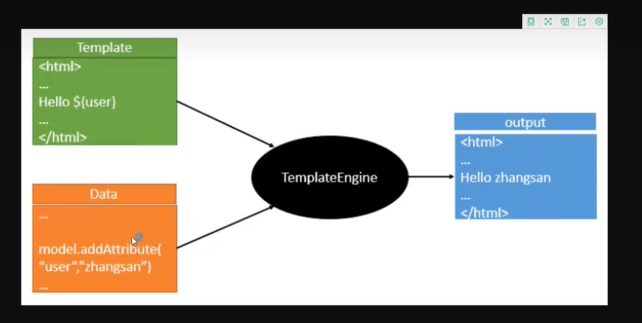

1. 导入Thymeleaf

```xml
<dependency>
<groupId>org.springframework.boot</groupId>
<artifactId>spring-boot-starter-thymeleaf</artifactId>
</dependency>
```

使用Thymeleaf只需要导入对应的依赖！将html页面放在templates文件下

```java
public static final String DEFAULT_PREFIX = "classpath:/templates/";

public static final String DEFAULT_SUFFIX = ".html";
```

## springMVC自动配置

```java
//如果，想diy一些定制化的功能，只要写这个组件，然后将它交给springboot，springboot就会帮我们自动装配
//扩展springmvc
@Configuration
public class MyMvcConfig implements WebMvcConfigurer {
    //public interface ViewResolver 实现了视图解析器接口的类，就可以把他看作视图解析器

    //ViewResolver实现了视图解析器的接口的类，就可以把它看做视图解析器
    @Bean
    public ViewResolver myViewResolver(){
        return new MyViewResolver();
    }

    //自定义了一个自动的视图解析器MyViewResolver
    public static class MyViewResolver implements ViewResolver{
        @Override
        public View resolveViewName(String viewName, Locale locale) throws Exception {
            return null;
        }
    }
}
```

```properties
#自定义的配置日期格式化
spring.mvc.format.date=dd/MM/yyyy
```

在springboot中，有非常多的xxxconfiguration帮助我们进行扩展配置，看到这个就要注意了

# 员工管理系统

根目录下的东西都最好配置到config中（config用来拓展springmvc的）

1. 首页配置：注意点，所有页面的静态资源都需要使用thymeleaf来接管@{}

2. 页面国际化
3. login_zh_CN.properties、login.properties、login_en_US.properties

```properties
login.btn=登录
login.password=密码
login.Remember=记住我
login.tip=请登录
login.username=用户名
```

```properties
login.btn=登录
login.password=密码
login.Remember=记住我
login.tip=请登录
login.username=用户名
```

```properties
login.btn=Sign in
login.password=password
login.Remember=Remember me
login.tip=Please sign in
login.username=username
```


2. 页面国际化：注意点：

   1. 需要配置i18n文件
   2. 如果需要在项目中进行按钮自动切换，需要自定义组件

   ```java
   public class MyLocaleResolver implements LocaleResolver {
       //解析请求
       @Override
       public Locale resolveLocale(HttpServletRequest request) {
           String l = request.getParameter("l");//获得请求中的语言参数
           Locale locale = Locale.getDefault();//如果没有就使用默认的
           //如果请求携带了国际化参数
           if (!StringUtils.isEmpty(l)){
               String[] split = l.split("_");
               //国家，地区
               locale = new Locale(split[0], split[1]);
           }
           return  locale;
       }
   
       @Override
       public void setLocale(HttpServletRequest request, HttpServletResponse response, Locale locale) {
   
       }
   }
   ```

   3. 将自定义组件配置到spring容器中`@Bean`

遇到的问题：

```java
@Override
@Bean
@ConditionalOnMissingBean(name = DispatcherServlet.LOCALE_RESOLVER_BEAN_NAME)
public LocaleResolver localeResolver() {
    if (this.webProperties.getLocaleResolver() == WebProperties.LocaleResolver.FIXED) {
        return new FixedLocaleResolver(this.webProperties.getLocale());
    }
    AcceptHeaderLocaleResolver localeResolver = new AcceptHeaderLocaleResolver();
    localeResolver.setDefaultLocale(this.webProperties.getLocale());
    return localeResolver;
}
```

```java
@Bean
public LocaleResolver localeResolver(){
    return new MyLocaleResolver();
}

```

为什么这个配置@Bean的方法名字只能是localeResolver是因为它的源码规定了如果存在localeResolver那底层的这个localeResolver才会失效，否则就使用源码中的配置

为什么这个viewResolver可以使用别名

```java
//ViewResolver实现了视图解析器的接口的类，就可以把它看做视图解析器
@Bean
public ViewResolver myViewResolver(){
    return new MyViewResolver();
}

//自定义了一个视图解析器MyViewResolver
public static class MyViewResolver implements ViewResolver{
    @Override
    public View resolveViewName(String viewName, Locale locale) throws Exception {
        return null;
    }
}
```

是因为他在底层是通过遍历所有的viewResolver，所有id没有规定一定要是

viewResolver所以可以获取到、

获取候选视图

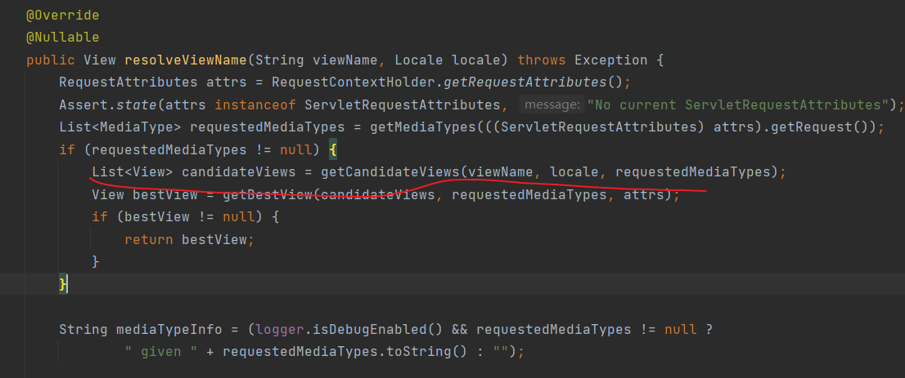

这里初始化过程就会去拿到所有的viewResolvers，通过*beansOfTypeIncludingAncestors*方法拿到多有的viewResolvers

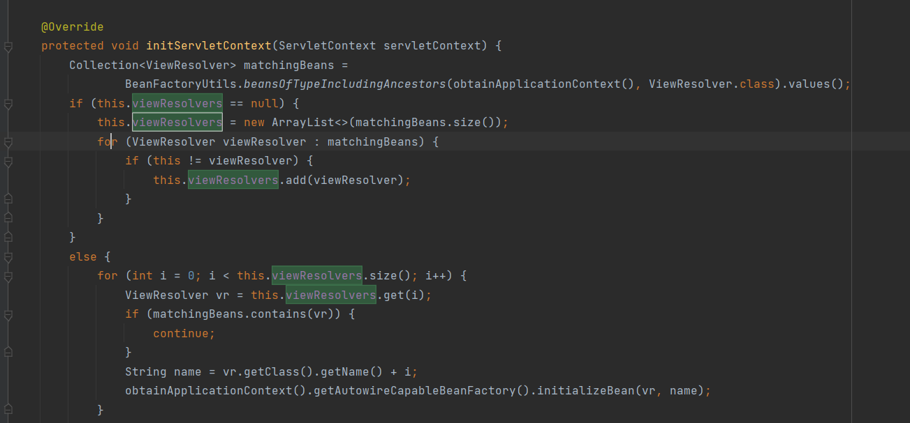


3. 登录+拦截

登录控制器：

```java
@Controller
public class LofinController {
    @RequestMapping("/user/login")
    @ResponseBody
    public String login(
            @RequestParam("username") String username, @RequestParam("password") String password
    , Model model, HttpSession httpSession){
        //具体业务：判断用户是否正确
        if(StringUtils.isEmpty(username)&&"123456".equals(password)){
            httpSession.setAttribute("loginUser",username);
            return "redirect:dashboard";
        }else {
            //告诉用户登录失败了
            model.addAttribute("msg","用户名或者密码错误");
            return "index";
        }
    }
}
```

拦截器

```java
public class LoginHandlerInterceptor implements HandlerInterceptor {
    @Override
    public boolean preHandle(HttpServletRequest request, HttpServletResponse response, Object handler) throws Exception {
        //登录成功之后，应该有用户session
        String loginUser = (String) request.getSession().getAttribute("loginUser");
        if (loginUser==null){//没有登录
            request.setAttribute("msg","没有权限，请先登录");
            request.getRequestDispatcher("/index.html").forward(request,response);
            return false;
        }

        return HandlerInterceptor.super.preHandle(request, response, handler);
    }

}
```

实现了拦截器接口后，要在继承了webmvc的类中重写addInterceptors方法

```java
@Override
public void addInterceptors(InterceptorRegistry registry) {
    registry.addInterceptor(new LoginHandlerInterceptor()).addPathPatterns("/**")
        .excludePathPatterns("/index.html","/","/user/login","/css/*","/img/*","/js/*");
}
```

4. 增删改查

员工列表展示，提取公共页面

5. 404

直接在resources文件夹下新建一个error文件夹，建一个404html就可以了

springboot会自动识别到这个错误页面

6. 注销

前端：

- 模板：别人写的
- 框架：组件：自动动手组合拼接，Bootstrap、Layui、semantic-ui
  - 栅格系统
  - 导航栏
  - 侧边栏
  - 表单

# 如何快速搭建网站

1. 前端搞定：页面长什么样子	：数据
2. 设计数据库（难点）
3. 前端让他能够独立运行，独立化工程
4. 数据接口如何对接：json、对象、all in one
5. 前后端联调测试

- 有自己熟悉的后台模板：工作必要！x-admin
- 前端界面：至少自己通过前端孔家，组合出来一个网站页面
  - index
  - about
  - blog
  - post
  - user
- 网站独立运行

# 回顾

- springboot是什么？
- 微服务
- HelloWorld
-  探究源码，得出自动装配的原理
- springboot配置yaml
- 多文档环境切换
- 静态资源映射
- Thymeleaf
- springboot扩展mvc     javaconfig进行扩展
- 如何修改springboot的默认配置   properties有的属性就可以进行修改
- CRUD
- 国际化
- 拦截器
- 定制首页-错误页


这周：

- 数据库
  - JDBC
  - **Mybatis：重点**
  - **Druid：重点**
  - **Shiro：安全、重点**
  - **Spring Security：安全、重点**
  - 异步任务~邮件发送，定时任务（表达式）
  - swagger（前后端交接文档技术）
  - Dubbo+Zookeeper


# Data

springboot底层都是采用spring Data的方式进行统一处理各种数据库，springdata也是spring中于springboot、springcloud等齐名知名项目

## JDBC

### 数据源

数据源，简单理解为数据源头，提供了应用程序所需要数据的位置。数据源保证了应用程序与目标数据之间交互的规范和协议，它可以是数据库，文件系统等等。其中数据源定义了位置信息，用户验证信息和交互时所需的一些特性的配置，同时它封装了如何建立与数据源的连接，向外暴露获取连接的接口。应用程序连接数据库无需关注其底层是如何如何建立的，也就是说应用业务逻辑与连接数据库操作是松耦合的。 以下只讨论当数据源为数据库的情况，且为Java环境下JDBC规范下的如何建立与数据库的连接，其他情况类似。

```yaml
spring:
  datasource:
    username: root
    password: 123456
    url: jdbc:mysql://localhost:3306/mybatis?autoReconnect=true&useUnicode=true&characterEncoding=utf8&serverTimezone=UTC
    driver-class-name: com.mysql.cj.jdbc.Driver
```

```java
//RestController
@Controller
public class JDBCController {

    private JdbcTemplate jdbcTemplate;
    @Autowired
    public JDBCController(JdbcTemplate jdbcTemplate) {
        this.jdbcTemplate = jdbcTemplate;
    }
    //查询数据库的所有信息
    //没有实体类数据库的东西，怎么获取？---万能map
    //xxxTemplate：springboot已经配置好的模板bean，拿来用即可
    //jbdc  template
    //redis template
    @ResponseBody
    @GetMapping("/userList")
    public List<Map<String, Object>> userList(){
        StringBuffer sql=new StringBuffer();
        sql.append("select * from user");
        List<Map<String, Object>> list_maps = jdbcTemplate.queryForList(String.valueOf(sql));
        return list_maps;
    }
    @ResponseBody
    @GetMapping("/addUser")
    public String userAdd(){
        StringBuffer sql=new StringBuffer();
        sql.append("insert into user(id,name,pwd) values(5,'李','12345');");
        jdbcTemplate.update(String.valueOf(sql));
        return "userAdd-ok";
    }
    @ResponseBody
    @GetMapping("/deleteUser/{id}")
    public String delete(@PathVariable("id") int id){
        StringBuffer sql=new StringBuffer();
        sql.append("delete from user where id=?");

        jdbcTemplate.update(String.valueOf(sql),id);
        return "delete-ok";
    }
    @ResponseBody
    @GetMapping("/updateUser/{id}")
    public String update(@PathVariable("id") int id){
        StringBuffer sql=new StringBuffer();
        sql.append("update user set name=?,pwd=? where id="+id);
        //封装
        Object[] objects = new Object[2];
        objects[0]="小明2";
        objects[1]="1232agdag";
        jdbcTemplate.update(String.valueOf(sql),objects);
        return "update-ok";

    }
}
```

## 自定义数据源DruidDataSource

**DRUID简介**

Druid是阿里巴巴的一个数据库连接池，结合了C3P0\DBCP\PROXOOL等DB池的优点，同时加入日志监控

Druid可以很好的监控DB池连接和SQL的执行情况，

Springboot2.0以上默认使用Hikari数据源

引入依赖

```xml
<!-- https://mvnrepository.com/artifact/com.alibaba/druid -->
<dependency>
    <groupId>com.alibaba</groupId>
    <artifactId>druid</artifactId>
    <version>1.2.22</version>
</dependency>
```

切换连接池：

```yaml
spring:
  datasource:
    username: root
    password: 123456
    url: jdbc:mysql://localhost:3306/mybatis?autoReconnect=true&useUnicode=true&characterEncoding=utf8&serverTimezone=UTC
    driver-class-name: com.mysql.cj.jdbc.Driver
    type: com.alibaba.druid.pool.DruidDataSource
    druid:
      #SpringBoot因为默认是hikari数据源所以对于其他数据源默认是不注入这些属性的，需要手动配置
      #druid数据源专有配置
      initialSize: 5
      minIdle: 5
      maxActive: 20
      maxWait: 600000
      # 主要配置以上几个即可
      timeBetweenEvictionRunsMillis: 600000
      minEvictableIdleTimeMillis: 300000
      validationQuery: SELECT 1 FROM DUAL
      testWhileIdle: true
      testOnBorrow: false
      testOnReturn: false
      poolPreparedStatements: true
      
      #配置监控统计拦截的filters：stat:监控统计、self4j(使用log4j的记得导入log4j的依赖）：日志记录、wall：防御sql注入 此处配置不能遗漏服务sql监控台不能监控sql
      
      filter:
        slf4j:
          enabled: true
        stat:
          enabled: true
          merge-sql: true
          slow-sql-millis: 5000
        wall:
          enabled: true
      #配置stat-view-servlet
      stat-view-servlet:
        enabled: true
        login-username: admin
        login-password: 123456
        reset-enable: false
      #配置web-stat-filter
      web-stat-filter:
        enabled: true
```

```java
@Configuration
public class DruidConfig {
    @Bean
    @ConfigurationProperties("spring.datasource")
    //这里就是用来实现与application.yaml配置文件绑定
    public DataSource druidDataSource(){
        return new DruidDataSource();
    }
    //后台监控: web.xml  ServletRegistrationBean
    //因为springboot 内置了servlet容器，所有没有web.xml，替代方法：把ServletRegistrationBean注册到bean中
    @Bean
    public ServletRegistrationBean statViewServlet(){
        //ServletRegistrationBean<StatViewServlet> bean = new ServletRegistrationBean<>(new StatViewServlet(), "/druid/*");
        ServletRegistrationBean<StatViewServlet> bean =new ServletRegistrationBean<>();
        bean.setServlet(new StatViewServlet());
        bean.setUrlMappings(Collections.singleton("/druid/*"));
        //后台需要有人登录，账户密码
        HashMap<String, String> initParameters = new HashMap<>();
        //增加配置
        initParameters.put("loginUsername","admin");//登录key，是固定的    loginUsername   loginPassword
        initParameters.put("loginPassword","123456");
        //允许谁可以访问
        initParameters.put("allow","");
        //禁止访问
//        initParameters.put("xiaoke","192.186.1.1");

        bean.setInitParameters(initParameters);//设置初始化参数
        return bean;
    }

    //Filter
    public FilterRegistrationBean statViewFilter(){
        FilterRegistrationBean bean = new FilterRegistrationBean<>();
        bean.setFilter(new WebStatFilter());
        HashMap<String, String> initParameters = new HashMap<>();
        //这些不进行统计
        initParameters.put("exclusions","*.js,*.css,/druid/*");
        bean.setInitParameters(initParameters);
        return bean;
    }
}
```

## Mybatis

整合包

mybatis-spring-boot-starter

1. 导入包

```xml
<dependency>
            <groupId>com.mysql</groupId>
            <artifactId>mysql-connector-j</artifactId>
            <scope>runtime</scope>
        </dependency>
```

2. 配置文件

```yaml
spring:
  application:
    name: springboot-05-mybatis
  datasource:
    driver-class-name: com.mysql.cj.jdbc.Driver
    url: jdbc:mysql://localhost:3306/mybatis?useUnicode=true&characterEncoding=utf-8&useSSL=false&serverTimezone = GMT
    username: root
    password: 123456
#??mybatis
mybatis:
  type-aliases-package: com.xiaoke.pojo
  mapper-locations: classpath:mybatis/mapper/*.xml
```

3. mybatis配置，因为UserMapper.xml与UserMapper不在同一个文件下

```java
@Repository
@Mapper
//这个注解表示了这是一个mybatis的注解类
//也可以在启动器主类哪里写@MapperScan("com.xiaoke.mapper")

public interface UserMapper {
    List<User> queryUserList();
    User queryUserById(int id);
    int addUser(User user);
    int updateUser(User user);
    int deleteUser(int id);
}
```

4.编写sql

```xml
<?xml version="1.0" encoding="UTF-8" ?>
<!DOCTYPE mapper
        PUBLIC "-//mybatis.org//DTD Mapper 3.0//EN"
        "http://mybatis.org/dtd/mybatis-3-mapper.dtd">
<mapper namespace="com.xiaoke.mapper.UserMapper">
    <select id="queryUserList" resultType="user">
        select * from user;
    </select>
    <select id="queryUserById" resultType="user" parameterType="_int">
        select * from user where id=#{id}
    </select>
    <insert id="addUser" parameterType="user">
        insert into user(id, name, pwd) values (#{id},#{name},#{pwd});
    </insert>
    <update id="updateUser" parameterType="user">
        update user set name=#{name},pwd=#{pwd} where id=#{id}
    </update>
    <delete id="deleteUser" parameterType="_int">
        delete from user where id=#{id}
    </delete>
</mapper>
```

5. 业务层调用dao层

```java
@Service
public class UserServiceImpl implements UserService {

    private UserMapper userMapper;
    @Resource
    public void setUserMapper(UserMapper userMapper) {
        this.userMapper = userMapper;
    }

    @Override
    public List<User> queryUserList() {
        return userMapper.queryUserList();
    }

    @Override
    public User queryUserById(int id) {
        return userMapper.queryUserById(id);
    }

    @Override
    public int addUser(User user) {
        return userMapper.addUser(user);
    }

    @Override
    public int updateUser(User user) {
        return userMapper.updateUser(user);
    }

    @Override
    public int deleteUser(int id) {
        return userMapper.deleteUser(id);
    }
}
```

6. Controller调用业务层

```java
@RestController
public class UserController {
    @Resource
    private UserService userService;

    @GetMapping("/updateUser")
    public List<User> queryUserList(){
        List<User> users = userService.queryUserList();
        for (User user : users) {
            System.out.println(user);
        }
        return users;
    }
    //增加用户
    @GetMapping("/addUser")
    public String addUser(){
        userService.addUser(new User(5,"阿毛","123"));
        return "ok";
    }
    //修改用户
    @GetMapping("/updateUser")
    public String updateUser(){
        userService.updateUser(new User(5,"阿毛1","123"));
        return "ok";
    }
    //删除用户
    @GetMapping("/deleteUser")
    public String deleteUser(){
        userService.deleteUser(5);
        return "ok";
    }
}
```

# SpringSecurity（安全）

在web开发中，安全第一位！过滤器、拦截器

功能性需求：否

做网站：安全应该放在什么时候考虑

- 漏洞：隐私泄露

- 架构一旦确定

shiro、SpringSecurity：很像~除了类不一样，名字不一样

认证（登录），授权（vip1，vip2，vip3）


- 功能权限
- 访问权限
- 菜单权限
- ... 拦截器、过滤器（大量的原生代码）

MVC--Spring--SpringBoot--框架来简化拦截器、过滤器

Spring Security 是一个功能强大且高度可定制的身份验证和访问控制框架。它是保护基于 Spring 的应用程序的事实标准。

Spring Security 是一个专注于为 Java 应用程序提供身份验证和授权的框架。与所有 Spring 项目一样，Spring Security 的真正强大之处在于它可以轻松地扩展以满足自定义要求

记住几个类：

- WebSrcurityConfigurerAdapter：自定义Security策略
- AuthenticationManagerBuild：自定义认证策略
- @EnableWebSecurity：开启WebSecurity模式

Spring Security主要目标是：认证和授权（访问控制）

**"认证"（Authentication）**：验证当前访问系统的是不是本系统的用户，并且要确认具体是那个用户

**"授权"（Authorization）**：经过认证后判断当前用户是否有权限进行某个操作

1. 导包

```xml
<dependency>
<groupId>org.springframework.boot</groupId>
<artifactId>spring-boot-starter-security</artifactId>
</dependency>
```

2. AOP：横切，配置类

```java
@Configuration
@EnableWebSecurity
public class SecurityConfig {

    @Bean
    public SecurityFilterChain filterChain(@Autowired(required = false) HttpSecurity http) throws Exception {
        // configure HTTP security...
        //首页所有人可以访问，功能页，只能有权限的人才可以访问
        http.authenticationProvider()
            .requestMatchers("/").permitAll()
            .requestMatchers("/level1/**").hasRole("vip1")
            .requestMatchers("/level2/**").hasRole("vip2")
            .requestMatchers("/level3/**").hasRole("vip3");


    }

    @Bean
    public WebSecurityCustomizer webSecurityCustomizer() {
        // configure Web security...


    }
}
```

### 认证：

#### 登录校验流程：

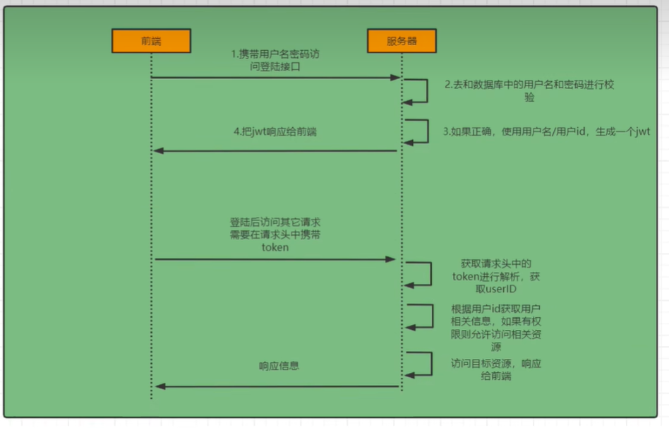

#### 原理初探：

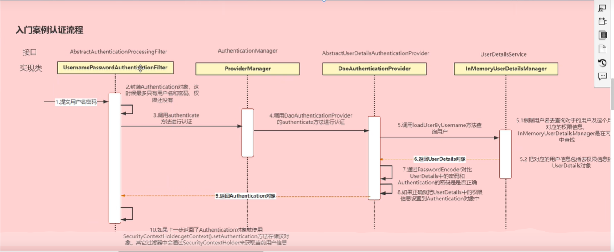

概念：

Authtication接口：它的实现类，表示当前访问系统的用户，封装了用户相关信息。

authenticationManager接口：定义了认证Authentication的方法。

UserDetailsService接口：加载用户特定数据的核心接口，里面定义了一个根据用户名查询用户信息的方法。

UserDetails接口：提供核心用户信息，通过UserDetailsService根据用户名获取处理的用户信息要封装成UserDetails对象放回，然后将这些信息封装到Authtication对象中

流程：

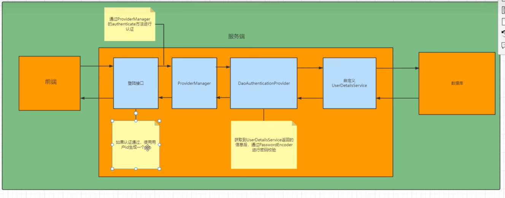

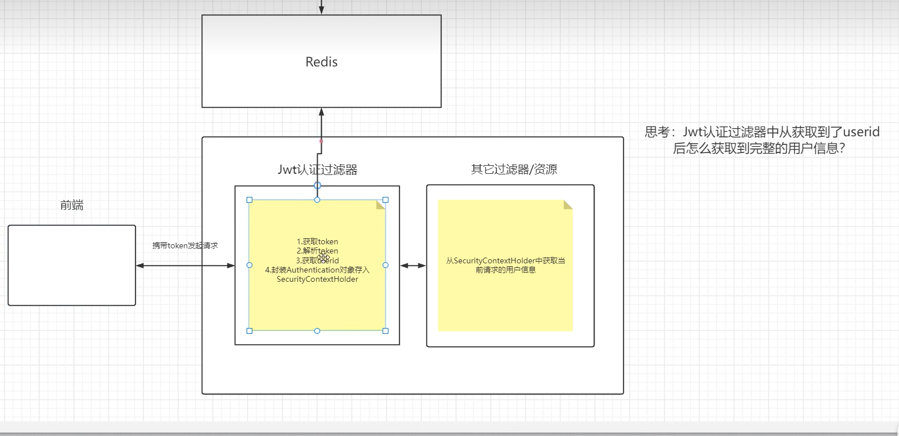

#### 思路分析：

登录：

1. 自定义登录接口调用ProviderManage方法进行认证
   1. 如果认证通过生成jwt
   2. 把用户信息存入redis中
2. 自定义UserDetailsService
   1. 在这里实现去数据库查询

校验：

1. 定义jwt认证过滤器
   1. 获取token
   2. 解析token获取其中的userId
   3. 从redis中获取用户信息
   4. 存入SecurityContextHolder

# Shiro简介

## 1.1、什么是Shiro？

- 是一个java安全（权限）框架
- shiro可以非常容易地开发出足够好的应用，不仅可以用在javase，也可以在javaEE环境
- shiro可以完成认证、授权、加密、会话管理、web集成、缓存等
- 下载：shiro：[Apache Shiro | Simple. Java. Security.](https://shiro.apache.org/)
- 依赖

```xml
<dependency>
  <groupId>org.apache.shiro</groupId>
  <artifactId>shiro-spring-boot-web-starter</artifactId>
  <version>2.0.0</version>
</dependency>
```

## 1.2、有那些功能

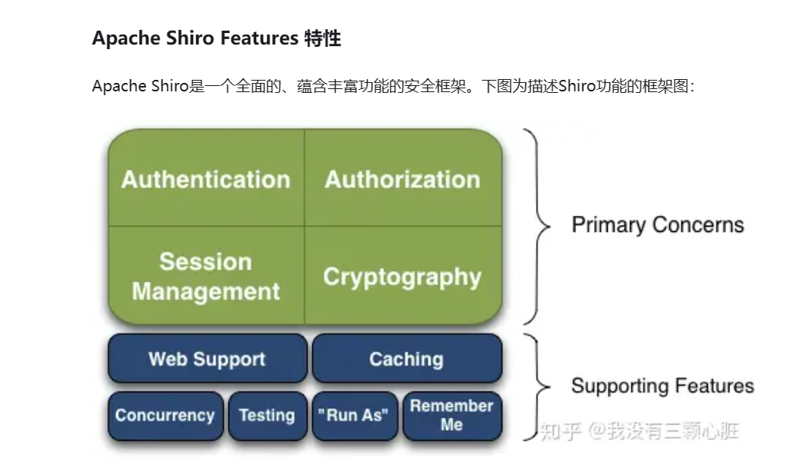

Authentication（认证）, Authorization（授权）, Session Management（会话管理）, Cryptography（加密）被 Shiro 框架的开发团队称之为应用安全的四大基石。那么就让我们来看看它们吧：

- **Authentication（认证）：**用户身份识别，通常被称为用户“登录”
- **Authorization（授权）：**访问控制。比如某个用户是否具有某个操作的使用权限。
- **Session Management（会话管理）：**特定于用户的会话管理,甚至在非web 或 EJB 应用程序。
- **Cryptography（加密）：**在对数据源使用加密算法加密的同时，保证易于使用。

还有其他的功能来支持和加强这些不同应用环境下安全领域的关注点。特别是对以下的功能支持：

- **Web支持：**Shiro的Web支持API有助于保护Web应用程序。
- **缓存：**缓存是Apache Shiro API中的第一级，以确保安全操作保持快速和高效。
- **并发性：**Apache Shiro支持具有并发功能的多线程应用程序。
- **测试：**存在测试支持，可帮助您编写单元测试和集成测试，并确保代码按预期得到保障。
- **“运行方式”：**允许用户承担另一个用户的身份(如果允许)的功能，有时在管理方案中很有用。
- **“记住我”：**记住用户在会话中的身份，所以用户只需要强制登录即可。

> **注意：** Shiro不会去维护用户、维护权限，这些需要我们自己去设计/提供，然后通过相应的接口注入给Shiro

## 1.3、Shiro架构（外部）

在概念层，Shiro 架构包含三个主要的理念：Subject,SecurityManager和 Realm。下面的图展示了这些组件如何相互作用，我们将在下面依次对其进行描述

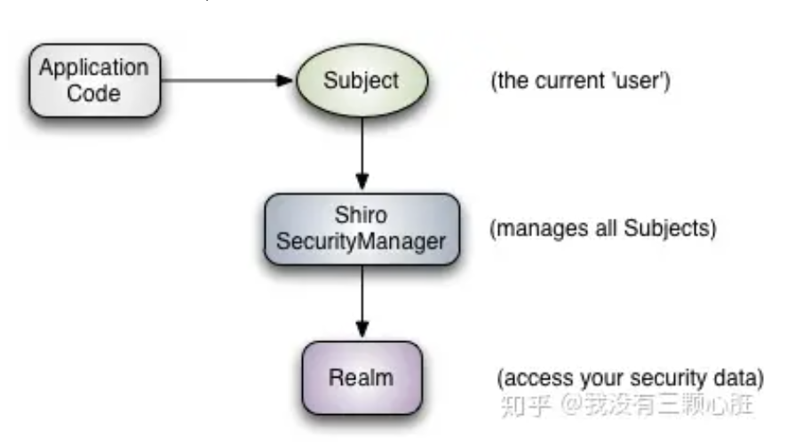

- **Subject：**当前用户，Subject 可以是一个人，但也可以是第三方服务、守护进程帐户、时钟守护任务或者其它–当前和软件交互的任何事件。
- **SecurityManager：**管理所有Subject，SecurityManager 是 Shiro 架构的核心，配合内部安全组件共同组成安全伞。
- **Realms：**用于进行权限信息的验证，我们自己实现。Realm 本质上是一个特定的安全 DAO：它封装与数据源连接的细节，得到Shiro 所需的相关的数据。在配置 Shiro 的时候，你必须指定至少一个Realm 来实现认证（authentication）和/或授权（authorization）。

我们需要实现Realms的Authentication 和 Authorization。其中 Authentication 是用来验证用户身份，Authorization 是授权访问控制，用于对用户进行的操作授权，证明该用户是否允许进行当前操作，如访问某个链接，某个资源文件等。

## 1.4、Shiro框架（内部）

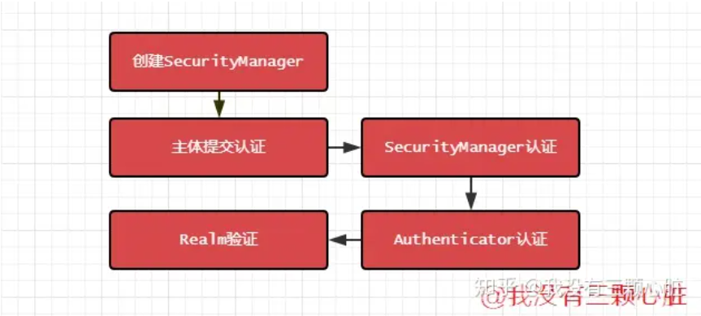

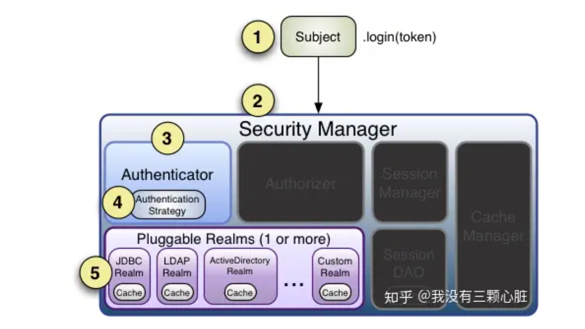

1. 首先调用 Subject.login(token) 进行登录，其会自动委托给 Security Manager，调用之前必须通过 SecurityUtils.setSecurityManager() 设置；
2. SecurityManager 负责真正的身份验证逻辑；它会委托给 Authenticator 进行身份验证；
3. Authenticator 才是真正的身份验证者，Shiro API 中核心的身份认证入口点，此处可以自定义插入自己的实现；
4. Authenticator 可能会委托给相应的 AuthenticationStrategy 进行多 Realm 身份验证，默认 ModularRealmAuthenticator 会调用 AuthenticationStrategy 进行多 Realm 身份验证；
5. Authenticator 会把相应的 token 传入 Realm，从 Realm 获取身份验证信息，如果没有返回 / 抛出异常表示身份验证失败了。此处可以配置多个 Realm，将按照相应的顺序及策略进行访问。

```java
 // 1.构建SecurityManager环境
DefaultSecurityManager defaultSecurityManager = new DefaultSecurityManager();
defaultSecurityManager.setRealm(simpleAccountRealm);
SecurityUtils.setSecurityManager(defaultSecurityManager); // 设置SecurityManager环境
Subject currentUser = SecurityUtils.getSubject(); // 获取当前主体
//通过当前用户获取session
Session session=currentUser.getSession();
currentUser.isAuthenticated();//判断当前的用户是否被认证
current.getPrincipal();//获取当前用户认证
currentUser.hasRole("xxx");//当前用户是否拥有xxx角色
currentUser.isPermitted("");//获得当前用户地权限
currentUser.logout;
```

springboot中集成

subject:用户
securityManage：管理用户
realm:连接数据


# Swaager

学习目标：

- 了解Swaager的作用和概念
- 了解前后端分离
- 在springboot中集成swagger


## Swagger简介

前后端分离

Vue+Springboot

前后端分离：

- 后端：控制层，服务层，数据访问层
- 前端：前端控制层，视图层
- 前后端如何交互：API
- 前后端相对独立：松耦合
- 前后端甚至可以部署到不同服务器上

产生问题：

- 前后端集成联调，前后端无法做到及时协商

解决方案：

- 指定schema【计划】，实时更新API
- 早期：word
- 前后端分离：
  - 前端测试后端接口：早期postman
  - 后端提供接口，需要实时更新最新的消息及改动

## swagger

- API框架
- Restful API文档在线自动生成工具==>Api文档与Api定义同步更新
- 直接允许，在线测试API接口

官网：[API Documentation & Design Tools for Teams | Swagger](https://swagger.io/)

在项目中使用swagger需要springbox

- swagger
- ui


## Springboot集成Swagger

1. 新建springboot-web项目

2. 导包

```xml
<dependency>
    <groupId>io.springfox</groupId>
    <artifactId>springfox-boot-starter</artifactId>
    <version>3.0.0</version>
</dependency>

<dependency>
    <groupId>io.swagger.core.v3</groupId>
    <artifactId>swagger-annotations</artifactId>
    <version>2.2.21</version>
</dependency>
```

3. 编写Hello
4. 配置Swagger==>就可以启动看看效果了 3.0版本后不需要在加入@enableopenapi，和@enableswagger2这两个注解

5. 测试允许

官方文档：[关于Swagger Specification |文档 |斯瓦格](https://swagger.io/docs/specification/about/)


## 配置swagger

swagger的bean实例：GroupedOpenApi

访问地址：[Swagger UI](http://localhost:8080/swagger-ui/index.html)

```java
@Configuration
//配置swagger信息=apiinfo
@OpenAPIDefinition(
        info = @Info(
                title = "xiaoke",
                version = "1.0",
                description = "Swagger3使用演示",
                contact = @Contact(name = "TOM",url = "",email = "1072639798@qq.com")
        ),
        security = @SecurityRequirement(name = "JWT"),
        externalDocs = @ExternalDocumentation(description = "参考文档",
                url = "https://github.com/swagger-api/swagger-core/wiki/Swagger-2.X---Annotations"
        )
)
public class SwaggerConfig {
    //配置了swagger的bean实例
    @Bean
    public GroupedOpenApi publicApi() {
        return GroupedOpenApi.builder()
                .group("public")
                .pathsToMatch("/public/**")
                .build();
    }
    @Bean
    public GroupedOpenApi privateApi() {
        return GroupedOpenApi.builder()
                .group("private")
                .pathsToMatch("/private/**")
                .build();
    }
}
```


## Swagger配置扫描接口

Controller接口

```java
@RestController
@Tag(name = "用户管理",description="123")//前端显示请求的大标题
@RequestMapping("/user")
public class HelloController {
    @PostMapping( "/hello")
    @Operation(summary = "test")//请求的总结
    public String hello(){
        return "hello";
    }
    @PostMapping("/getUserByName/{username}")
    @Operation(summary = "getUserByName",description = "通过用户名字查询对应用户")
    @ApiResponses(value = {
            @ApiResponse(responseCode = "200", description = "请求成功"),
            @ApiResponse(responseCode = "404", description = "用户不存在", content = @Content)
    })//404的时候，200的时候消息描述
    //@Parameter(description = "用户名" ,required = true)
    //作用是可以在swagger前端输入参数
    public String getUserByName(@Parameter(description = "用户名" ,required = true) @PathVariable("username") String name){
        return "user";
    }
}
```

实体类

```java
@Getter
@Setter
@Schema(description = "用户参数实体")
public class User {
    @NotBlank(message = "id不能为空")
    @Schema(description = "id")
    private int id;
    @NotBlank(message = "用户名不能为空")//限制输入参数时不能为空
    @Schema(description = "用户名")//描述
    private String name;
    @NotBlank(message = "密码不能为空")
    @Schema(description = "密码，6-18位，包含大小写、数字及特殊字符")
    @Size(min = 6, max = 18)
    private String pwd;
}
```

SwaggerConfig

```java
@Configuration
//配置swagger信息=apiinfo
@OpenAPIDefinition(
    tags = {
        @Tag(name = "用户管理", description = "用户模块操作11")//好像写不写都可以
    },
    info = @Info(
        title = "xiaoke",
        version = "1.0",
        description = "Swagger3使用演示",
        contact = @Contact(name = "TOM",url = "",email = "1072639798@qq.com")
    ),
    servers = {
        @Server(description = "生产环境服务器", url = "https://xxxx.com/api/v1"),
        @Server(description = "测试环境服务器", url = "https://test.xxxx.com/api/v1")
    },
    security = @SecurityRequirement(name = "JWT"),
    externalDocs = @ExternalDocumentation(description = "参考文档",
                                          url = "https://github.com/swagger-api/swagger-core/wiki/Swagger-2.X---Annotations"
                                         )


)
public class SwaggerConfig {
    //配置了swagger的bean实例
    @Bean
    public GroupedOpenApi publicApi() {
        return GroupedOpenApi
            .builder()
            .group("public")
            //.packagesToScan("com.xiaoke.controller.HelloController")
            //packagesToScan可以不用配置
            .pathsToMatch("/user/**")//通过请求路径进行找到响应的请求
            .build();
    }
}
```

官方文档：https://springdoc.org/

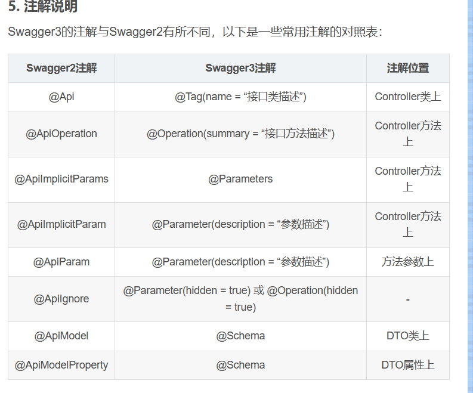

发布的时候：关闭swagger

# 任务

## 异步任务~

服务层：

```java
@Service
public class AsynService {
    //告诉spring这是异步方法
    @Async
    public void hello(){
        try {
            Thread.sleep(3000);
        } catch (InterruptedException e) {
            throw new RuntimeException(e);
        }
        System.out.println("数据正在处理...");
    }

}
```

控制层：

```java
@RestController
public class AsynController {
    @Resource
    AsynService asynService;
    @RequestMapping("/hello")
    public String hello(){
        asynService.hello();
        return "ok";
    }
}

```

主题类：

```java
@SpringBootApplication
//在main方法开启异步注解功能
@EnableAsync
public class Springboot09TaskApplication {

    public static void main(String[] args) {
        SpringApplication.run(Springboot09TaskApplication.class, args);
    }
}
```

## 邮件发送~时间

JavaMailSenderImpl来实现

POP3发送、smtp接收

1. 添加依赖

```xml
<dependency>
    <groupId>org.springframework.boot</groupId>
    <artifactId>spring-boot-starter-mail</artifactId>
</dependency>
```

发送简单邮件

```java
@Autowired
    JavaMailSenderImpl javaMailSender;
    @Test
    void contextLoads1() {
        //简单邮件
        SimpleMailMessage simpleMailMessage = new SimpleMailMessage();
        simpleMailMessage.setSubject("你好");
        simpleMailMessage.setText("学习");
        simpleMailMessage.setTo("2256820559@qq.com");
        simpleMailMessage.setFrom("1072639798@qq.com");
        javaMailSender.send(simpleMailMessage);
    }
```

发送复杂邮件

```java
@Autowired
JavaMailSenderImpl javaMailSender;
@Test
void contextLoads2() throws MessagingException {
    //复杂邮件
    //创建方式： new MimeMessage();
    //
    MimeMessage mimeMessage = javaMailSender.createMimeMessage();
    //组装
    MimeMessageHelper helper = new MimeMessageHelper(mimeMessage,true);
    helper.setSubject("你好");
    helper.setText("<p style='color:red'>你好,刘思帆</p>",true);
    //附件
    helper.addAttachment("1.jpg",new File("C:\\Users\\xiaoke\\Desktop\\新建 文本文档.txt"));
    helper.addAttachment("2.jpg",new File("C:\\Users\\xiaoke\\Desktop\\新建 文本文档.txt"));

    helper.setTo("2256820559@qq.com");
    helper.setFrom("1072639798@qq.com");
    javaMailSender.send(mimeMessage);
}
```


## 定时任务~

TaskExecutor：任务执行

TaskScheduler：任务调度

在主程序中添加两个注解：@EnableScheduling//开启定时功能的注解，@Scheduled//什么时候执行

Cron表达式

两个核心接口


main类

```java
@SpringBootApplication
//在main方法开启异步注解功能
@EnableAsync
@EnableScheduling//开启定时功能的注解
public class Springboot09TaskApplication {

    public static void main(String[] args) {
        SpringApplication.run(Springboot09TaskApplication.class, args);
    }
}
```

定时任务

```java
@Service
public class ScheduledService {
    //在特定的时间执行这个方法
    //cron表达式
    //秒    分    时    日    月    周几 ：可以写个？不知道周几
    //0 34 16 * * ? 每天的16点34分执行
    //30 0/5 10,18 * * ? 每天的10点，18点每个五分钟执行一次
    //0 15 10 ? * 1-6 每个月的周一到周六10点15分执行一次
    @Scheduled(cron="0 34 16 * * ?")
    public void hello(){
        System.out.println("你被执行了");
    }
}
```


# Springboot整合

SpringBoot操作数据：spring-data 	jpa 	jdbc	mongodb	redis

SpringData也是和SpringBoot齐名的项目

> 整合测试

1. 导包

```xml
<dependency>
    <groupId>org.springframework.boot</groupId>
    <artifactId>spring-boot-starter-data-redis</artifactId>
</dependency>
```

说明：springboot 2.x之后，原来的jedis被替换为了lettuce

jedis：采用直连server，多个线程操作的话，是不安全的，如果想避免不安全的，使用jedis pool 连接池  更像BIO（阻塞）

lettuce：采用netty，实例可以在多个线程中，进行共享，不存在线程不安全的情况，可以减少线程数量，更像NIO模式

源码分析

```java
@Bean
@ConditionalOnMissingBean(name = "redisTemplate")
@ConditionalOnSingleCandidate(RedisConnectionFactory.class)//自己可以定义一个RedisTemplate替换默认的
public RedisTemplate<Object, Object> redisTemplate(RedisConnectionFactory redisConnectionFactory) {
    //默认的RedisTemplate没有过多设置，redis对象保存都是需要序列化的，因为是异步的，所以实体都是需要序列化
    //两个泛型都是object类型需要强制类型转换<String, Object> 
    RedisTemplate<Object, Object> template = new RedisTemplate<>();
    template.setConnectionFactory(redisConnectionFactory);
    return template;
}

@Bean
@ConditionalOnMissingBean
@ConditionalOnSingleCandidate(RedisConnectionFactory.class)//由于String是redis中最常用的类型，所以说单独提出来了bean
public StringRedisTemplate stringRedisTemplate(RedisConnectionFactory redisConnectionFactory) {
    return new StringRedisTemplate(redisConnectionFactory);
}
```

2. 配置连接

>#SpringBoot的所有配置类，都有一个自动配置类   RedisAutoConfiguration
>\#自动配置类都会绑定一个properties配置文件  RedisProperties

```yaml
spring:
  application: 
    name: redis-01-SpringBoot
  redis:
    host: 127.0.0.1
    port: 6379
```


3. 测试

```java
@SpringBootTest
class Redis01SpringBootApplicationTests {
    @Autowired
    RedisTemplate redisTemplate;
    @Test
    void contextLoads() {
        //redisTemplate   操作不同的数据类型
        // opsForValue()操作字符串的类似String
        //opsForList() 操作list 类似list
        //opsForSet()
        //opsForHash()
        //opsForGeo() 地图

        //除了基本的操作，常用的方法都可以直接通过redisTemplate来操作
        //比如事务，和CRUD
        //获取redis的连接对象
        /*RedisConnection connection = redisTemplate.getConnectionFactory().getConnection();
        connection.flushDb();
        connection.flushAll();*/
        redisTemplate.opsForValue().set("myKey","xiaoke");
        System.out.println(redisTemplate.opsForValue().get("myKey"));
    }
}
```


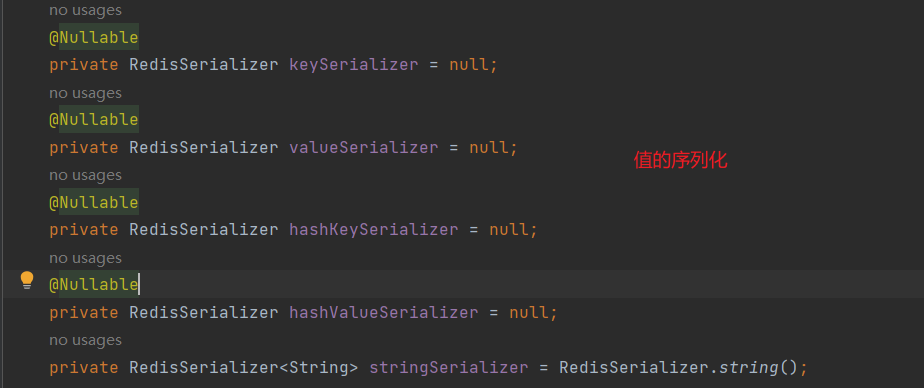


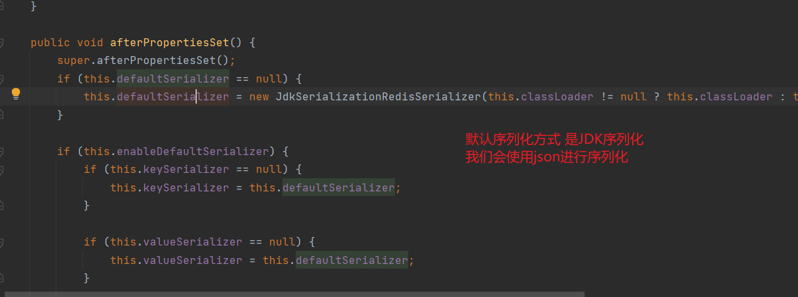

所以需要自己定义一个配置类了

关于对象的保存

==一个类只有实现了Serializable接口，它的对象才能被序列化。==

`String json = new ObjectMapper().writeValueAsString(user);就是转化成为jackson对象`

在企业中，所有的pojo对象都会进行序列化

编写自己的RedisTemplate

```java
@Configuration
public class RedisConfig {
    //编写自己RedisTemplate
    //固定的模板
    @Bean
    public RedisTemplate<String, Object> redisTemplate(RedisConnectionFactory redisConnectionFactory) {
        //为了开发方便一般直接使用<String, Object>类型
        RedisTemplate<String, Object> template = new RedisTemplate<>();
        //连接工厂
        template.setConnectionFactory(redisConnectionFactory);
        //配置自己的jackson序列化
        Jackson2JsonRedisSerializer jackson2JsonRedisSerializer = new Jackson2JsonRedisSerializer(Object.class);
        ObjectMapper mapper = new ObjectMapper();
        mapper.setVisibility(PropertyAccessor.ALL, JsonAutoDetect.Visibility.ANY);
        mapper.enableDefaultTyping(ObjectMapper.DefaultTyping.NON_FINAL);
        jackson2JsonRedisSerializer.setObjectMapper(mapper);
        template.setKeySerializer(jackson2JsonRedisSerializer);
        //String的序列化
        StringRedisSerializer stringRedisSerializer = new StringRedisSerializer();
        //key 采用String的序列化方式
        template.setKeySerializer(stringRedisSerializer);
        //hash的key也采用String的序列化方式
        template.setHashKeySerializer(stringRedisSerializer);
        //value序列化方式采用jackson
        template.setValueSerializer(jackson2JsonRedisSerializer);
        //hash的value序列化方式采用jackson
        template.setHashValueSerializer(jackson2JsonRedisSerializer);

        template.afterPropertiesSet();
        return template;
    }
}
```


# 分布式理论：

## 什么是分布式系统？

分布式系统是若干独立计算机的集合，这些计算机对于用户来说就像单个相关系统。

分布式系统是由一组通过网络进行通信，为了完成共同的任务而切条工作的计算机节点组成的系统。分布式系统的出现是为了用廉价的、普通的及其完成单个计算机无法完成的计算、存储任务。其目的是利用更多的及其，处理更多的数据

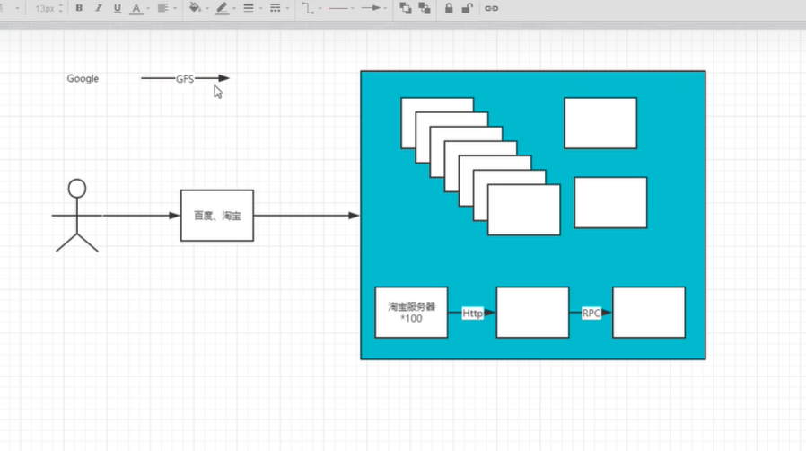

单个节点的处理能力无法满足日益增长的计算、存储任务的时候，才需要考虑分布式

## Dubbo

Dubbo 是一款 RPC 服务开发框架，用于解决微服务架构下的服务治理与通信问题，官方提供了 Java、Golang 等多语言 SDK 实现。使用 Dubbo 开发的微服务原生具备相互之间的远程地址发现与通信能力， 利用 Dubbo 提供的丰富服务治理特性，可以实现诸如服务发现、负载均衡、流量调度等服务治理诉求。Dubbo 被设计为高度可扩展，用户可以方便的实现流量拦截、选址的各种定制逻辑。

- **不是应用开发框架的替代者**

Dubbo 设计为让开发者以主流的应用开发框架的开发模式工作，它不是各个语言应用开发框架的替代者，如它不是 Spring/Spring Boot 的竞争者，当你使用 Spring 时，Dubbo 可以无缝的与 Spring & Spring Boot 集成在一起。

- **不仅仅只是一款 RPC 框架**

Dubbo 提供了内置 RPC 通信协议实现，但它不仅仅是一款 RPC 框架。首先，它不绑定某一个具体的 RPC 协议，开发者可以在基于 Dubbo 开发的微服务体系中使用多种通信协议；其次，除了 RPC 通信之外，Dubbo 提供了丰富的服务治理能力与生态。

- **不是 gRPC 协议的替代品**

Dubbo 支持基于 gRPC 作为底层通信协议，在 Dubbo 模式下使用 gRPC 可以带来更好的开发体验，享有统一的编程模型和更低的服务治理接入成本

- **不只有 Java 语言实现**

自 Dubbo3 开始，Dubbo 提供了 Java、Golang、Rust、Node.js 等多语言实现，未来会有更多的语言实现。


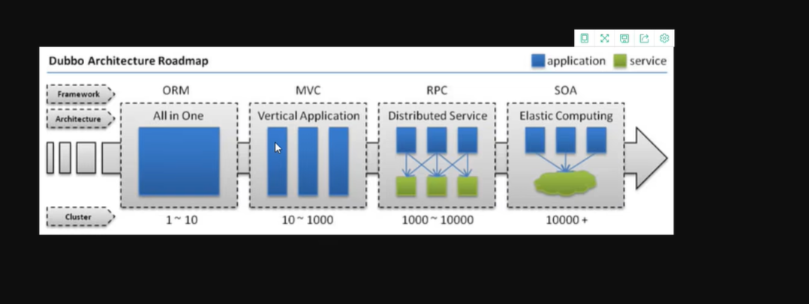

## 通信：Http、RPC

http：无状态通信协议

什么是RPC？

RPC：通信协议：通信的

RPC：是指远程过程调用，是一种进程间通信方式，它是一种技术思想，而不是规范。它允许程序调用另一个地址空间（通常是共享网络的另一台机器上）的过程或者函数，而不是程序员显式编码这个远程调用的细节，即程序员无论是调用本地还是远程的函数，本质上变得的调用代码基本相同

也就是说两台服务器A、B一个部署在A服务器上，想要调用B服务器上应用提供的函数/方法，由于不在一个内存空间不能直接调用，需要通过网络来表达调用的语义和传达调用的数据。

为什么要用RPC？

就是无法在一个进程内，甚至一个计算机内通过本地调用的方式完成的需求，比如不同系统间的通讯，甚至不同的组织间的通讯，由于计算能力需要横向扩展，需要在多台及其组成的集群上部署应用。RPC就是要像调用本地的函数一样去调用远程函数

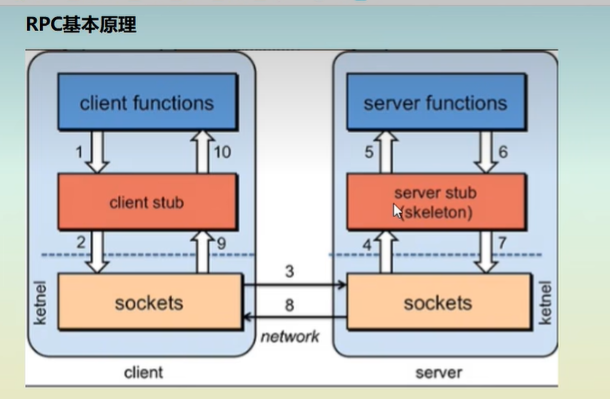

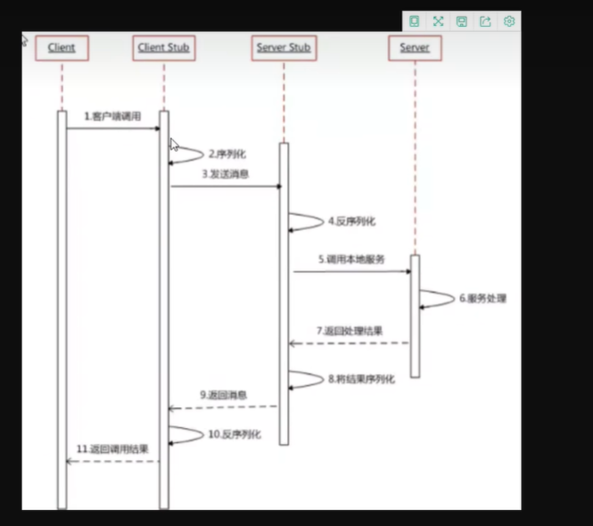

RPC的核心：通讯、序列化

Dubbo的三大核心能力：面向接口的远程方法调用，智能容错和负载均衡，以及服务自动注册和发现

序列化的作用：为了数据的传输

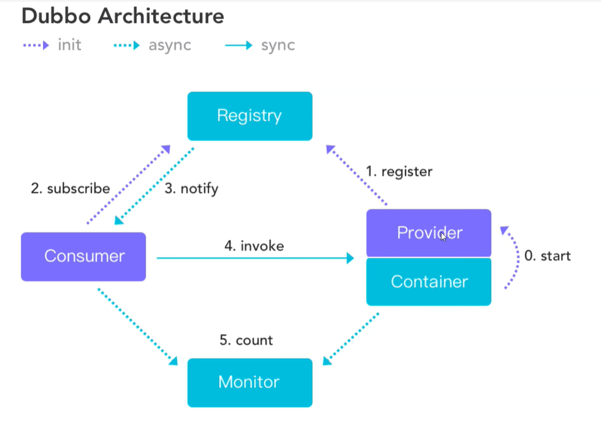

**服务提供者**：暴露服务的服务提供方，服务提供者在启动时，向注册中心注册自己提供的服务

**服务消费者**：调用远程服务的服务消费者，服务消费者在启动时，向注册中心订阅自己所需的服务，服务消费者，从提供者地址列表中，基于软负载均衡算发，选一台提供者进行调用，如果调用失败，再选另一台调用

**注册中心**：注册中心返回服务提供者地址列表给消费者，如果由变更，注册中心将基于长连接推送变更数据给消费者

**监控中心**：服务消费者和提供者，在内存中累计调用次数和调用时间，定时每分钟发送一次统计数据到监控中心

**调用关系说明**：

服务容器负责启动，加载，允许服务提供者。

服务提供者在启动时，向注册中心注册自己提供的服务。

服务消费者在启动时，向注册中心订阅自己所需的服务。

注册中心返回服务提供者地址列表给消费者，如果有变更，注册中心将基于长连接推送变更数据给消费者。

服务消费者，从提供者地址列表中，基于软负载均衡算发，选一台提供者进行调用，如果调用失败，再选另一台调用

服务消费者和提供者，再内存中累计调用次数和调用时间，定时每分钟发送一次统计数据到监控中心


## Dubbo环境搭建


### 什么是 ZooKeeper？

ZooKeeper 是一个集中式服务，用于维护配置信息、命名、提供分布式同步和提供组服务。分布式应用程序以某种形式使用所有这些类型的服务。每次实现它们时，都需要做很多工作来修复不可避免的错误和竞争条件。由于实现这些类型的服务的困难，应用程序最初通常会吝啬它们，这使得它们在存在变化时很脆弱并且难以管理。即使操作正确，这些服务的不同实现也会导致部署应用程序时的管理复杂性。


dubbo 本身并不是一个服务软件，它其实就是一个jar包，能够帮你的java程序连接到zookeeper，并利用zookeeper消费、提供服务

但是为了让用户更好的管理监控众多的dubbo服务，官方提供了一个可视化的监控程序：dubbo-admin，不过这个监控即使不装也不影响使用


zookeeper：注册中心

dubbo-admin：时一个监控管理后台~查看我们注册了那些服务，那些服务消费了

Dubbo：jar包

provider-server

1. 导入依赖

```xml
<dependency>
    <groupId>org.springframework.boot</groupId>
    <artifactId>spring-boot-starter-test</artifactId>
    <scope>test</scope>
</dependency>

<dependency>
    <groupId>org.apache.dubbo</groupId>
    <artifactId>dubbo-spring-boot-starter</artifactId>
    <version>3.2.11</version>
</dependency>
```

```yaml
spring:
  application:
    name: springboot-dubbo_zookeeper_provider
server:
  port: 8001

  #服务应用的名字
dubbo:
  application:
    name: provider-server
  #注册中心地址
  registry:
    address: zookeeper://127.0.0.1:2181
  #那些服务需要注册
  scan:
    base-packages: com.xiaoke.service
```

实现接口TicketService

```java
//@Service//使用了Dubbo后尽量不要使用@Service因为dubbo里面也有一个@Service
//zookeeper：服务注册与发现
@Component
@Service//加了这个注解就会被扫描到，项目一启动就自动注册到注册中心（zookeeper）
public class TicketServiceImpl implements TicketService{
    @Override
    public String getTicket() {
        return "xiaoke学习java";
    }
}

```

consumer也要导入相同依赖

配置dubbo

```yaml
spring:
  application:
    name: springboot-dubbo_zookeeper_consumer
server:
  port: 8002

#消费者去哪里拿，暴露自己的名字
dubbo:
  application:
    name: consumer-server
#注册中心的地址
  registry:
    address: zookeeper://127.0.0.1:2181
```

```java

public class UserService {
    //拿到provider提供的票，要去注册中心拿到服务
    @Reference//引用  pom坐标，也可以定义路径相同的接口名
    TicketService ticketService;
    public void buyTicket(){
       String ticket= ticketService.getTicket;
        System.out.println("注册中心拿到的票"+ticket);
    }
}
```

步骤：

前提zookeeper服务开启

1. 提供者提供服务
   1. 导入依赖
   2. 配置注册中心的地址，以及服务发现名，和要扫描的包
   3. 在想要注册的服务上加上注解@Service（dubbo的）
2. 消费者消费
   1. 导入依赖
   2. 配置注册中心的地址，配置自己的服务名
   3. 从远程注入服务@Referece
