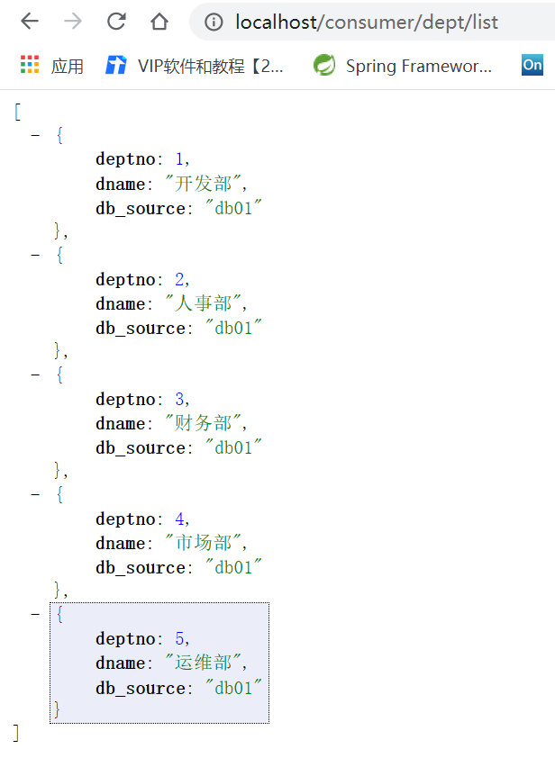
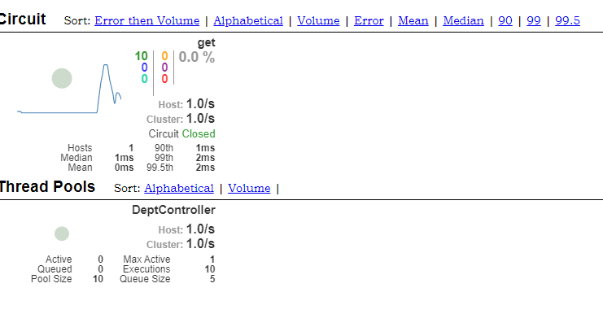
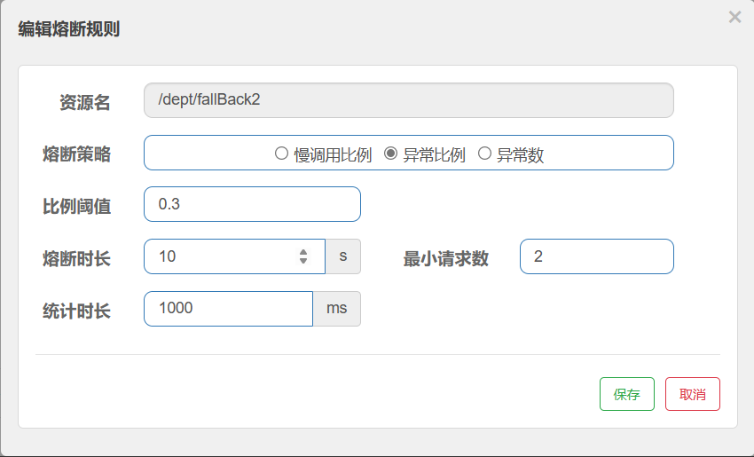

SpringCloud笔记

## 1、前言

### 1.1、回顾

回顾之前的知识

- JavaSE
- 数据库
- 前端
- Servlet
- Http
- Mybatis
- Spring
- SpringMVC
- SpringBoot
- Dubbo、Zookeeper、分布式基础
- Maven、Git
- Ajax、Json
- ...


串一下自己会的东西

- 数据库

- Mybatis
- Spring
- SpringMVC
- SpringBoot
- Dubbo、Zookeeper、分布式基础
- Maven、Git
- Ajax、Json


**这个阶段该如何学习**

```
三层架构 + MVC

框架：
	Spring IOC AOP
	
	SpringBoot：新一代的javaEE开发标准，自动装配
	
	模块化 all in one
	
	模块化的开发=====>all in one 代码没有变化
	
微服务的四个核心问题？
	1.服务很多，客户端怎么访问？
	2.这么多服务？服务之间如何通信？
	3.这么多服务？如何治理？
	4.服务挂了怎么办？
	
解决方案：
	Spring Cloud （为了解决上面的四个核心问题） 生态！ SprintBoot
	
	1.Spring Cloud NetFlix 一站式解决方案
		api网关：zuul组件
		通信：Feign ---- HttpClient ---- Http通信方式,同步,阻塞
		服务注册和发现：Eureka
		熔断机制：Hystrix
		......

    2. Apache Dubbo Zookeeper：半自动！需要整合别人的
    	API网关：没有,找第三方组件(比如整合zull组件),或者自己实现
    	通信：Dubbo 是一个基于Java的高性能的RPC通信框架(性能比Feign强大)
    	服务注册和发现：Zookeeper
    	熔断机制：没有,需要借助Hystrix
    	
    	Dubbo这个方案并不完善

    3. Spring Cloud Alibaba：目前最新的一站式解决方案！可解决上述4个核心问题,更简单
    	API网关：
    	通信：
		服务注册和发现：
		熔断机制：
		
新概念：服务网格~ Server Mesh
	istio
	
万变不离其宗4个问题：
	1. API网关
	2. HTTP,RPC通信
	3. 注册和发现
	4. 熔断机制
	
网络不可靠！
```

### 1.2 、常见面试题

1.1、 什么是微服务？

1.2 、微服务之间是如何独立通讯的？

1.3 、SpringCloud 和 Dubbo有那些区别？

1.4 、SpringBoot 和 SpringCloud，请谈谈你对他们的理解

1.5 、什么是服务熔断？什么是服务降级？

1.6 、微服务的优缺点分别是什么？说下你在项目开发中遇到的坑

1.7 、你所知道的微服务技术栈有哪些？列举一二

1.8、 Eureka和Zookeeper都可以提供服务注册与发现的功能，请说说两者的区别

## 2. 微服务概述

#### 2.1 什么是微服务？

**什么是微服务？**微服务(Microservice Architecture) 是近几年流行的一种架构思想，关于它的概念很难一言以蔽之。

究竟什么是微服务呢？我们在此引用ThoughtWorks 公司的首席科学家 Martin Fowler 于2014年提出的一段话：

原文：[https://martinfowler.com/articles/microservices.html](https://martinfowler.com/articles/microservices.html)

汉化：[https://www.cnblogs.com/liuning8023/p/4493156.html](https://www.cnblogs.com/liuning8023/p/4493156.html)

- 就目前而言，对于微服务，业界并没有一个统一的，标准的定义。
- 但通常而言，微服务架构是一种架构模式，或者说是一种架构风格，**它体长将单一的应用程序划分成一组小的服务**，每个服务运行在其独立的自己的进程内，服务之间互相协调，互相配置，为用户提供最终价值，服务之间采用轻量级的通信机制(**HTTP**)互相沟通，每个服务都围绕着具体的业务进行构建，并且能狗被独立的部署到生产环境中，另外，应尽量避免统一的，集中式的服务管理机制，对具体的一个服务而言，应该根据业务上下文，选择合适的语言，工具(**Maven**)对其进行构建，可以有一个非常轻量级的集中式管理来协调这些服务，可以使用不同的语言来编写服务，也可以使用不同的数据存储。

**再来从技术维度角度理解下：**

- 微服务化的核心就是将传统的一站式应用，根据业务拆分成一个一个的服务，彻底地去耦合，每一个微服务提供单个业务功能的服务，一个服务做一件事情，从技术角度看就是一种小而独立的处理过程，类似进程的概念，能够自行单独启动或销毁，拥有自己独立的数据库。

#### 2.2 微服务与微服务架构

**微服务**

强调的是服务的大小，它关注的是某一个点，是具体解决某一个问题/提供落地对应服务的一个服务应用，狭义的看，可以看作是IDEA中的一个个微服务工程，或者Moudel。

```
IDEA 工具里面使用Maven开发的一个个独立的小Moudel，它具体是使用SpringBoot开发的一个小模块，专业的事情交给专业的模块来做，一个模块就做着一件事情。
强调的是一个个的个体，每个个体完成一个具体的任务或者功能。
```

**微服务架构**

一种新的架构形式，Martin Fowler 于2014年提出。

微服务架构是一种架构模式，它体长将单一应用程序划分成一组小的服务，服务之间相互协调，互相配合，为用户提供最终价值。每个服务运行在其独立的进程中，服务与服务之间采用轻量级的通信机制**(如HTTP)**互相协作，每个服务都围绕着具体的业务进行构建，并且能够被独立的部署到生产环境中，另外，应尽量避免统一的，集中式的服务管理机制，对具体的一个服务而言，应根据业务上下文，选择合适的语言、工具**(如Maven)**对其进行构建。

#### 2.3 微服务优缺点

**优点**

- 单一职责原则；
- 每个服务足够内聚，足够小，代码容易理解，这样能聚焦一个指定的业务功能或业务需求；
- 开发简单，开发效率高，一个服务可能就是专一的只干一件事；
- 微服务能够被小团队单独开发，这个团队只需2-5个开发人员组成；
- 微服务是松耦合的，是有功能意义的服务，无论是在开发阶段或部署阶段都是独立的；
- 微服务能使用不同的语言开发；
- 易于和第三方集成，微服务允许容易且灵活的方式集成自动部署，通过持续集成工具，如jenkins，Hudson，bamboo；
- 微服务易于被一个开发人员理解，修改和维护，这样小团队能够更关注自己的工作成果，无需通过合作才能体现价值；
- 微服务允许利用和融合最新技术；
- **微服务只是业务逻辑的代码，不会和HTML，CSS，或其他的界面混合;**
- **每个微服务都有自己的存储能力，可以有自己的数据库，也可以有统一的数据库；**

**缺点**

- 开发人员要处理分布式系统的复杂性；
- 多服务运维难度，随着服务的增加，运维的压力也在增大；
- 系统部署依赖问题；
- 服务间通信成本问题；
- 数据一致性问题；
- 系统集成测试问题；
- 性能和监控问题；

#### 2.4 微服务技术栈有那些？

| **微服务技术条目**                     | 落地技术                                                     |
| -------------------------------------- | ------------------------------------------------------------ |
| 服务开发                               | SpringBoot、Spring、SpringMVC等                              |
| 服务配置与管理                         | Netfix公司的Archaius、阿里的Diamond等                        |
| 服务注册与发现                         | Eureka、Consul、Zookeeper等                                  |
| 服务调用                               | Rest、PRC、gRPC                                              |
| 服务熔断器                             | Hystrix、Envoy等                                             |
| 负载均衡                               | Ribbon、Nginx等                                              |
| 服务接口调用(客户端调用服务的简化工具) | Fegin等                                                      |
| 消息队列                               | Kafka、RabbitMQ、ActiveMQ等                                  |
| 服务配置中心管理                       | SpringCloudConfig、Chef等                                    |
| 服务路由(API网关)                      | Zuul等                                                       |
| 服务监控                               | Zabbix、Nagios、Metrics、Specatator等                        |
| 全链路追踪                             | Zipkin、Brave、Dapper等                                      |
| 数据流操作开发包                       | SpringCloud Stream(封装与Redis，Rabbit，Kafka等发送接收消息) |
| 时间消息总栈                           | SpringCloud Bus                                              |
| 服务部署                               | Docker、OpenStack、Kubernetes等                              |

#### 2.5 为什么选择SpringCloud作为微服务架构

1. 选型依据

   - 整体解决方案和框架成熟度
   - 社区热度
   - 可维护性
   - 学习曲线

2. 当前各大IT公司用的微服务架构有那些？

   - 阿里：dubbo+HFS

   - 京东：JFS

   - 新浪：Motan

   - 当当网：DubboX

     …

3. 各微服务框架对比

| **功能点/服务框架** | Netflix/SpringCloud                                          | Motan                                                       | gRPC                      | Thrift   | Dubbo/DubboX                        |
| ------------------- | ------------------------------------------------------------ | ----------------------------------------------------------- | ------------------------- | -------- | ----------------------------------- |
| 功能定位            | 完整的微服务框架                                             | RPC框架，但整合了ZK或Consul，实现集群环境的基本服务注册发现 | RPC框架                   | RPC框架  | 服务框架                            |
| 支持Rest            | 是，Ribbon支持多种可拔插的序列号选择                         | 否                                                          | 否                        | 否       | 否                                  |
| 支持RPC             | 否                                                           | 是(Hession2)                                                | 是                        | 是       | 是                                  |
| 支持多语言          | 是(Rest形式)                                                 | 否                                                          | 是                        | 是       | 否                                  |
| 负载均衡            | 是(服务端zuul+客户端Ribbon)，zuul-服务，动态路由，云端负载均衡Eureka（针对中间层服务器） | 是(客户端)                                                  | 否                        | 否       | 是(客户端)                          |
| 配置服务            | Netfix Archaius，Spring Cloud Config Server 集中配置         | 是(Zookeeper提供)                                           | 否                        | 否       | 否                                  |
| 服务调用链监控      | 是(zuul)，zuul提供边缘服务，API网关                          | 否                                                          | 否                        | 否       | 否                                  |
| 高可用/容错         | 是(服务端Hystrix+客户端Ribbon)                               | 是(客户端)                                                  | 否                        | 否       | 是(客户端)                          |
| 典型应用案例        | Netflix                                                      | Sina                                                        | Google                    | Facebook |                                     |
| 社区活跃程度        | 高                                                           | 一般                                                        | 高                        | 一般     | 2017年后重新开始维护，之前中断了5年 |
| 学习难度            | 中等                                                         | 低                                                          | 高                        | 高       | 低                                  |
| 文档丰富程度        | 高                                                           | 一般                                                        | 一般                      | 一般     | 高                                  |
| 其他                | Spring Cloud Bus为我们的应用程序带来了更多管理端点           | 支持降级                                                    | Netflix内部在开发集成gRPC | IDL定义  | 实践的公司比较多                    |

## 3. SpringCloud入门概述

### 3.1 SpringCloud是什么？

Spring官网：https://spring.io/


**原文**

Spring Cloud provides tools for developers to quickly build some of the common patterns in distributed systems (e.g. configuration management, service discovery, circuit breakers, intelligent routing, micro-proxy, control bus, one-time tokens, global locks, leadership election, distributed sessions, cluster state). Coordination of distributed systems leads to boiler plate patterns, and using Spring Cloud developers can quickly stand up services and applications that implement those patterns. They will work well in any distributed environment, including the developer’s own laptop, bare metal data centres, and managed platforms such as Cloud Foundry.

**翻译：**
SpringCloud,基于SpringBoot提供了一套微服务解决方案，包括服务注册与发现，配置中心，全链路监控，服务网关，负载均衡，熔断器等组件，除了基于NetFlix的开源组件做高度抽象封装之外，还有一些选型中立的开源组件。

SpringCloud利用SpringBoot的开发便利性，巧妙地简化了分布式系统基础设施的开发，SpringCloud为开发人员提供了快速构建分布式系统的一些工具，**包括配置管理，服务发现，断路器，路由，微代理，事件总线，全局锁，决策竞选，分布式会话等等**，他们都可以用SpringBoot的开发风格做到一键启动和部署。

SpringBoot并没有重复造轮子，它只是将目前各家公司开发的比较成熟，经得起实际考研的服务框架组合起来，
通过SpringBoot风格进行再封装，屏蔽掉了复杂的配置和实现原理，**最终给开发者留出了一套简单易懂，易部署和易维护的分布式系统开发工具包**

SpringCloud是分布式微服务架构下的一站式解决方案，是各个微服务架构落地技术的集合体，俗称微服务全家桶。

### 3.2 SpringCloud和SpringBoot的关系

- SpringBoot专注于开苏方便的开发单个个体微服务；
- SpringCloud是关注全局的微服务协调整理治理框架，它将SpringBoot开发的一个个单体微服务，整合并管理起来，为各个微服务之间提供：配置管理、服务发现、断路器、路由、为代理、事件总栈、全局锁、决策竞选、分布式会话等等集成服务；
- SpringBoot可以离开SpringCloud独立使用，开发项目，但SpringCloud离不开SpringBoot，属于依赖关系；
- SpringBoot专注于快速、方便的开发单个个体微服务，SpringCloud关注全局的服务治理框架；

### 3.3 Dubbo 和 SpringCloud技术选型

**1. 分布式+服务治理Dubbo**

目前成熟的互联网架构，应用服务化拆分+消息中间件


**2. Dubbo 和 SpringCloud对比**

可以看一下社区活跃度：

https://github.com/dubbo

https://github.com/spring-cloud

**对比结果：**

|              | Dubbo         | SpringCloud                  |
| ------------ | ------------- | ---------------------------- |
| 服务注册中心 | Zookeeper     | Spring Cloud Netfilx Eureka  |
| 服务调用方式 | RPC           | REST API                     |
| 服务监控     | Dubbo-monitor | Spring Boot Admin            |
| 断路器       | 不完善        | Spring Cloud Netfilx Hystrix |
| 服务网关     | 无            | Spring Cloud Netfilx Zuul    |
| 分布式配置   | 无            | Spring Cloud Config          |
| 服务跟踪     | 无            | Spring Cloud Sleuth          |
| 消息总栈     | 无            | Spring Cloud Bus             |
| 数据流       | 无            | Spring Cloud Stream          |
| 批量任务     | 无            | Spring Cloud Task            |

**最大区别：Spring Cloud 抛弃了Dubbo的RPC通信，采用的是基于HTTP的REST方式**

严格来说，这两种方式各有优劣。虽然从一定程度上来说，后者牺牲了服务调用的性能，但也避免了上面提到的原生RPC带来的问题。而且REST相比RPC更为灵活，服务提供方和调用方的依赖只依靠一纸契约，不存在代码级别的强依赖，这个优点在当下强调快速演化的微服务环境下，显得更加合适。

**品牌机和组装机的区别**

很明显，Spring Cloud的功能比DUBBO更加强大，涵盖面更广，而且作为Spring的拳头项目，它也能够与SpringFramework、Spring Boot、Spring Data、Spring Batch等其他Spring项目完美融合，这些对于微服务而言是至关重要的。使用Dubbo构建的微服务架构就像组装电脑，各环节我们的选择自由度很高，但是最终结果很有可能
因为一条内存质量不行就点不亮了，总是让人不怎么放心，但是如果你是一名高手，那这些都不是问题;而SpringCloud就像品牌机，在Spring Source的整合下，做了大量的兼容性测试，保证了机器拥有更高的稳定性，但是如果要在使用非原装组件外的东西，就需要对其基础有足够的了解。

**社区支持与更新力度的区别**

最为重要的是，DUBBO停止了5年左右的更新，虽然2017.7重启了。对于技术发展的新需求，需要由开发者自行拓展升级（比如当当网弄出了DubboX)，这对于很多想要采用微服务架构的中小软件组织，显然是不太合适的，中小公司没有这么强大的技术能力去修改Dubbo源码+周边的一整套解决方案，并不是每一个公司都有阿里的大牛+真实的线上生产环境测试过。

**设计模式+微服务拆分思想：不一定善于表达，软实力**

**总结：**

 **二者解决的问题域不一样：Dubbo的定位是一款RPC框架，而SpringCloud的目标是微服务架构下的一站式解决方案。**

### 3.4 SpringCloud能干嘛？

- Distributed/versioned configuration 分布式/版本控制配置
- Service registration and discovery 服务注册与发现
- Routing 路由
- Service-to-service calls 服务到服务的调用
- Load balancing 负载均衡配置
- Circuit Breakers 断路器
- Distributed messaging 分布式消息管理
- …

### 3.5 SpringCloud下载

官网：http://projects.spring.io/spring-cloud/

版本号有点特别：


spring cloud是一个由众多独立子项目组成的大型综合项目，每个子项目有不同的发行节奏，都维护着自己的发布版木号。spring cloud通过一个资源清单BOM(Bil1 of Materials）来管理每个版木的子项目清单。为避免与子项目的发布号混淆，所以没有采用版本号的方式，而是通过命名的方式。

SpringCloud没有采用数字编号的方式命名版本号，而是采用了伦敦地铁站的名称，**同时根据字母表的顺序来对应版本时间顺序**，比如最早的Realse版本：Angel，第二个Realse版本：Brixton，然后是Camden、Dalston、Edgware，目前最新的是Hoxton SR4 CURRENT GA通用稳定版。

**自学参考书：**

- SpringCloud Netflix 中文文档：https://springcloud.cc/spring-cloud-netflix.html
- SpringCloud 中文API文档(官方文档翻译版)：https://springcloud.cc/spring-cloud-dalston.html
- SpringCloud中国社区：http://springcloud.cn/
- SpringCloud中文网：https://springcloud.cc

## 4. SpringCloud Rest学习环境搭建：服务提供者

### 4.1 介绍

- 我们会使用一个Dept部门模块做一个微服务通用案例Consumer消费者(Client)通过REST调用Provider提供者(Server)提供的服务。
- 回顾Spring，SpringMVC，Mybatis等以往学习的知识。
- Maven的分包分模块架构复习。

```
一个简单的Maven模块结构是这样的：

-- app-parent: 一个父项目(app-parent)聚合了很多子项目(app-util\app-dao\app-web...)
  |-- pom.xml
  |
  |-- app-core
  ||---- pom.xml
  |
  |-- app-web
  ||---- pom.xml
  ......
1234567891011
```

一个父工程带着多个Moudule子模块

MicroServiceCloud父工程(Project)下初次带着3个子模块(Module)

- microservicecloud-api 【封装的整体entity/接口/公共配置等】
- microservicecloud-consumer-dept-80 【服务提供者】
- microservicecloud-provider-dept-8001 【服务消费者】

### 4.2 SpringCloud版本选择

**大版本说明**

| SpringBoot | SpringCloud             | 关系                                     |
| ---------- | ----------------------- | ---------------------------------------- |
| 1.2.x      | Angel版本(天使)         | 兼容SpringBoot1.2x                       |
| 1.3.x      | Brixton版本(布里克斯顿) | 兼容SpringBoot1.3x，也兼容SpringBoot1.4x |
| 1.4.x      | Camden版本(卡姆登)      | 兼容SpringBoot1.4x，也兼容SpringBoot1.5x |
| 1.5.x      | Dalston版本(多尔斯顿)   | 兼容SpringBoot1.5x，不兼容SpringBoot2.0x |
| 1.5.x      | Edgware版本(埃奇韦尔)   | 兼容SpringBoot1.5x，不兼容SpringBoot2.0x |
| 2.0.x      | Finchley版本(芬奇利)    | 兼容SpringBoot2.0x，不兼容SpringBoot1.5x |
| 2.1.x      | Greenwich版本(格林威治) |                                          |

**实际开发版本关系**

| spring-boot-starter-parent |              | spring-cloud-dependencles |              |
| -------------------------- | ------------ | ------------------------- | ------------ |
| **版本号**                 | **发布日期** | **版本号**                | **发布日期** |
| 1.5.2.RELEASE              | 2017-03      | Dalston.RC1               | 2017-x       |
| 1.5.9.RELEASE              | 2017-11      | Edgware.RELEASE           | 2017-11      |
| 1.5.16.RELEASE             | 2018-04      | Edgware.SR5               | 2018-10      |
| 1.5.20.RELEASE             | 2018-09      | Edgware.SR5               | 2018-10      |
| 2.0.2.RELEASE              | 2018-05      | Fomchiey.BULD-SNAPSHOT    | 2018-x       |
| 2.0.6.RELEASE              | 2018-10      | Fomchiey-SR2              | 2018-10      |
| 2.1.4.RELEASE              | 2019-04      | Greenwich.SR1             | 2019-03      |

**使用后两个**

### 4.3 创建工程

**1、创建父工程**

- 新建父工程项目springcloud，切记**Packageing是pom模式**
- 主要是定义POM文件，将后续各个子模块公用的jar包等统一提取出来，类似一个抽象父类


- **父工程pom.xml**

  ```xml
  <?xml version="1.0" encoding="UTF-8"?>
  <project xmlns="http://maven.apache.org/POM/4.0.0"
           xmlns:xsi="http://www.w3.org/2001/XMLSchema-instance"
           xsi:schemaLocation="http://maven.apache.org/POM/4.0.0 http://maven.apache.org/xsd/maven-4.0.0.xsd">
      <modelVersion>4.0.0</modelVersion>
  
      <groupId>nuc.ss</groupId>
      <artifactId>springcloud</artifactId>
      <version>1.0-SNAPSHOT</version>
      <modules>
  
      </modules>
  
      <!--打包方式 pom-->
      <packaging>pom</packaging>
  
      <properties>
          <project.build.sourceEncoding>UTF-8</project.build.sourceEncoding>
          <maven.compiler.source>1.8</maven.compiler.source>
          <maven.compiler.target>1.8</maven.compiler.target>
          <junit.version>4.12</junit.version>
          <lombok.version>1.18.12</lombok.version>
          <log4j.version>1.2.17</log4j.version>
      </properties>
  
      <dependencyManagement>
          <dependencies>
              <!--springcloud的依赖-->
              <dependency>
                  <groupId>org.springframework.cloud</groupId>
                  <artifactId>spring-cloud-dependencies</artifactId>
                  <version>Hoxton.SR8</version>
                  <type>pom</type>
                  <scope>import</scope>
              </dependency>
              <!--springboot的依赖-->
              <dependency>
                  <groupId>org.springframework.boot</groupId>
                  <artifactId>spring-boot-dependencies</artifactId>
                  <version>2.3.1.RELEASE</version>
                  <type>pom</type>
                  <scope>import</scope>
              </dependency>
              <!--数据库-->
              <dependency>
                  <groupId>mysql</groupId>
                  <artifactId>mysql-connector-java</artifactId>
                  <version>8.0.20</version>
              </dependency>
              <dependency>
                  <groupId>com.alibaba</groupId>
                  <artifactId>druid</artifactId>
                  <version>1.0.9</version>
              </dependency>
              <!--springboot启动器-->
              <dependency>
                  <groupId>org.mybatis.spring.boot</groupId>
                  <artifactId>mybatis-spring-boot-starter</artifactId>
                  <version>2.1.3</version>
              </dependency>
  
              <!--日志测试~-->
              <dependency>
                  <groupId>ch.qos.logback</groupId>
                  <artifactId>logback-core</artifactId>
                  <version>1.2.3</version>
              </dependency>
              <dependency>
                  <groupId>junit</groupId>
                  <artifactId>junit</artifactId>
                  <version>${junit.version}</version>
              </dependency>
              <dependency>
                  <groupId>log4j</groupId>
                  <artifactId>log4j</artifactId>
                  <version>${log4j.version}</version>
              </dependency>
              <!--lombok-->
              <dependency>
                  <groupId>org.projectlombok</groupId>
                  <artifactId>lombok</artifactId>
                  <version>${lombok.version}</version>
              </dependency>
          </dependencies>
      </dependencyManagement>
      
      <build>
          <resources>
              <resource>
                  <directory>src/main/java</directory>
                  <includes>
                      <include>**/*.yml</include>
                      <include>**/*.properties</include>
                      <include>**/*.xml</include>
                  </includes>
                  <filtering>false</filtering>
              </resource>
              <resource>
                  <directory>src/main/resources</directory>
                  <includes>
                      <include>**/*.yml</include>
                      <include>**/*.properties</include>
                      <include>**/*.xml</include>
                  </includes>
                  <filtering>false</filtering>
              </resource>
          </resources>
      </build>
  </project>
  ```

**2、创建子模块springcloud-api**


- **pom配置：**

  ```xml
  <?xml version="1.0" encoding="UTF-8"?>
  <project xmlns="http://maven.apache.org/POM/4.0.0"
           xmlns:xsi="http://www.w3.org/2001/XMLSchema-instance"
           xsi:schemaLocation="http://maven.apache.org/POM/4.0.0 http://maven.apache.org/xsd/maven-4.0.0.xsd">
      <parent>
          <artifactId>springcloud</artifactId>
          <groupId>nuc.ss</groupId>
          <version>1.0-SNAPSHOT</version>
      </parent>
      <modelVersion>4.0.0</modelVersion>
  
      <artifactId>sprintcloud-api</artifactId>
  
      <!--当前的module自己需要的依赖，如果父依赖中已经配置了版本，这里就不用写了-->
      <dependencies>
          <dependency>
              <groupId>org.projectlombok</groupId>
              <artifactId>lombok</artifactId>
          </dependency>
      </dependencies>
  </project>
  ```

- **数据库的创建**

  

- **实体类的编写**

  

    ```java
    package nuc.ss.springcloud.pojo;
  
    import lombok.Data;
    import lombok.NoArgsConstructor;
    import lombok.experimental.Accessors;
    import java.io.Serializable;
  
    @Data
    @NoArgsConstructor
    @Accessors(chain = true)
    public class Dept implements Serializable {//实体类  orm 类表关系映射
  
        private long deptno;//主键
        private String dname;
  
        //这个数据存在那个数据库的字段，微服务，一个服务对应一个数据库，同一个信息可能存在不同的数据库
        private String db_source;
  
        public Dept(String dname) {
            this.dname = dname;
        }
  
        /*
        * 链式写法：
        * Dept dept = new Dept();
        *
        * dept.setDeptNo(11).setDname('ssss').setDb_source('db01')
        * */
    }
    ```

**3、子模块springcloud-provider-dept-8081服务的提供者的编写**

	

**pom配置：**

```xml
<?xml version="1.0" encoding="UTF-8"?>
<project xmlns="http://maven.apache.org/POM/4.0.0"
         xmlns:xsi="http://www.w3.org/2001/XMLSchema-instance"
         xsi:schemaLocation="http://maven.apache.org/POM/4.0.0 http://maven.apache.org/xsd/maven-4.0.0.xsd">
    <parent>
        <artifactId>springcloud</artifactId>
        <groupId>nuc.ss</groupId>
        <version>1.0-SNAPSHOT</version>
    </parent>
    <modelVersion>4.0.0</modelVersion>

    <artifactId>springcloud-provider-dept-8081</artifactId>

    <dependencies>
        <!--我们需要拿到实体类，所以要配置api module-->
        <dependency>
            <groupId>nuc.ss</groupId>
            <artifactId>springcloud-api</artifactId>
            <version>1.0-SNAPSHOT</version>
        </dependency>
        <!--junit-->
        <dependency>
            <groupId>junit</groupId>
            <artifactId>junit</artifactId>
        </dependency>
        <dependency>
            <groupId>mysql</groupId>
            <artifactId>mysql-connector-java</artifactId>
        </dependency>
        <dependency>
            <groupId>com.alibaba</groupId>
            <artifactId>druid</artifactId>
        </dependency>
        <dependency>
            <groupId>ch.qos.logback</groupId>
            <artifactId>logback-core</artifactId>
        </dependency>
        <dependency>
            <groupId>org.mybatis.spring.boot</groupId>
            <artifactId>mybatis-spring-boot-starter</artifactId>
        </dependency>

        <!--test-->
        <dependency>
            <groupId>org.springframework.boot</groupId>
            <artifactId>spring-boot-test</artifactId>
        </dependency>

        <dependency>
            <groupId>org.springframework.boot</groupId>
            <artifactId>spring-boot-starter-web</artifactId>
        </dependency>

        <!--jetty-->
        <dependency>
            <groupId>org.springframework.boot</groupId>
            <artifactId>spring-boot-starter-jetty</artifactId>
        </dependency>

        <!--热部署工具-->
        <dependency>
            <groupId>org.springframework.boot</groupId>
            <artifactId>spring-boot-devtools</artifactId>
        </dependency>
    </dependencies>
</project>
```

**application.yml的配置**

```yaml
server:
  port: 8081

# mybatis的配置
mybatis:
  type-aliases-package: nuc.ss.springcloud.pojo
  config-location: classpath:mybatis/mybatis-config.xml
  mapper-locations: classpath:mybatis/mapper/*.xml

# spring的配置
spring:
  application:
    name: springcloud-provider-dept
  datasource:
    type: com.alibaba.druid.pool.DruidDataSource #数据库
    driver-class-name: com.mysql.jdbc.Driver
    url: jdbc:mysql//localhost:3306/db01?useUnicode=true&characterEncoding=utf-8
    username: root
    password: admin
```

**mybatis-config.xml的配置**

```xml
<?xml version="1.0" encoding="UTF-8" ?>
<!DOCTYPE configuration
        PUBLIC "-//mybatis.org//DTD Config 3.0//EN"
        "http://mybatis.org/dtd/mybatis-3-config.dtd">

<configuration>
    <settings>
        <setting name="cacheEnabled" value="true"/>
    </settings>
</configuration>
```

**DeptMapper.xml的编写**

```xml
<?xml version="1.0" encoding="UTF-8" ?>
<!DOCTYPE mapper
        PUBLIC "-//mybatis.org//DTD Mapper 3.0//EN"
        "http://mybatis.org/dtd/mybatis-3-mapper.dtd">

<mapper namespace="nuc.ss.springcloud.dao.DeptDao">

    <insert id="addDept" parameterType="Dept">
        insert into dept (dname,db_source)
        values (#{dname},DATABASE())
    </insert>

    <select id="queryById" resultType="Dept" parameterType="Long">
        select * from dept where deptno = #{id}
    </select>
    
    <select id="queryAll" resultType="Dept">
        select * from dept
    </select>

</mapper>
```

**接口DeptController的编写**

```java
//视图Restful服务
@RestController
public class DeptController {
    @Autowired
    DeptService deptService;

    @PostMapping("/dept/add")
    public boolean addDept(Dept dept) {
        return deptService.addDept(dept);
    }

    @GetMapping("/dept/get/{id}")
    public Dept get(@PathVariable("id") Long id) {
        return deptService.queryById(id);
    }

    @GetMapping("/dept/list")
    public List<Dept> queryAll() {
        return deptService.queryAll();
    }
}
```

**整体目录结构**


**4、子模块springcloud-consumer-dept-80的编写**


- pom依赖编写

  ```xml
  <?xml version="1.0" encoding="UTF-8"?>
  <project xmlns="http://maven.apache.org/POM/4.0.0"
           xmlns:xsi="http://www.w3.org/2001/XMLSchema-instance"
           xsi:schemaLocation="http://maven.apache.org/POM/4.0.0 http://maven.apache.org/xsd/maven-4.0.0.xsd">
      <parent>
          <artifactId>springcloud</artifactId>
          <groupId>nuc.ss</groupId>
          <version>1.0-SNAPSHOT</version>
      </parent>
      <modelVersion>4.0.0</modelVersion>
  
      <artifactId>springcloud-consumer-dept-80</artifactId>
  
      <dependencies>
          <dependency>
              <groupId>nuc.ss</groupId>
              <artifactId>springcloud-api</artifactId>
              <version>1.0-SNAPSHOT</version>
          </dependency>
  
          <dependency>
              <groupId>org.springframework.boot</groupId>
              <artifactId>spring-boot-starter-web</artifactId>
          </dependency>
      </dependencies>
  </project>
  ```

- application.yml

  ```yaml
  server:
    port: 80
  ```

- **将RestTemplate注册到spring中：**ConfigBean.java

  ```java
  @Configuration
  public class ConfigBean {   //Cofiguration -- spring applicationContext.xml
  
      @Bean
      public RestTemplate getRestTemplate() {
          return new RestTemplate();
      }
  }
  ```

- DeptConsumerController.java

  ```java
  @RestController
  public class DeptConsumerController {
      // 理解：消费者，不应该有service层
      // RestTemplate ... 供我们直接调用就可以了！注解到spring中
  
      // (url,实体:Map, Class<T> responseType)
      @Autowired
      private RestTemplate restTemplate;//提供多种便捷访问Http的方法
  
      private static final String REST_URL_PREFIX = "http://localhost:8081";
  
      @RequestMapping("/consumer/dept/add")
      public boolean add(Dept dept) {
          return restTemplate.postForObject(REST_URL_PREFIX+"/dept/add",dept,Boolean.class);
      }
  
      @RequestMapping("/consumer/dept/get/{id}")
      public Dept get(@PathVariable("id") Long id) {
          return restTemplate.getForObject(REST_URL_PREFIX+"/dept/get/"+id,Dept.class);
      }
  
      @RequestMapping("/consumer/dept/list")
      public List<Dept> list() {
          return restTemplate.getForObject(REST_URL_PREFIX+"/dept/list",List.class);
      }
  }
  ```

- **启动服务: **DeptConsumer_80

  ```java
  @SpringBootApplication
  public class DeptConsumer_80 {
      public static void main(String[] args) {
          SpringApplication.run(DeptConsumer_80.class,args);
      }
  }
  ```

- 整体目录结构

  

## 5、Eureka服务注册与发现

### 5.1 什么是Eureka

- Eureka：怎么读
- Netflix在涉及Eureka时，遵循的就是API原则.
- Eureka是Netflix的有个子模块，也是核心模块之一。Eureka是基于REST的服务，用于定位服务，以实现云端中间件层服务发现和故障转移，服务注册与发现对于微服务来说是非常重要的，有了服务注册与发现，只需要使用服务的标识符，就可以访问到服务，而不需要修改服务调用的配置文件了，功能类似于Dubbo的注册中心，比如Zookeeper.

### 5.2 原理理解

- **Eureka基本的架构**

  - Springcloud 封装了Netflix公司开发的Eureka模块来实现服务注册与发现 (对比Zookeeper).

  - Eureka采用了C-S的架构设计，EurekaServer作为服务注册功能的服务器，他是服务注册中心.

  - 而系统中的其他微服务，使用Eureka的客户端连接到EurekaServer并维持心跳连接。这样系统的维护人员就可以通过EurekaServer来监控系统中各个微服务是否正常运行，Springcloud 的一些其他模块 (比如Zuul) 就可以通过EurekaServer来发现系统中的其他微服务，并执行相关的逻辑.

    

  - 和Dubbo架构对比

    

  - Eureka 包含两个组件：**Eureka Server** 和 **Eureka Client**.

  - Eureka Server 提供服务注册，各个节点启动后，回在EurekaServer中进行注册，这样Eureka Server中的服务注册表中将会储存所有课用服务节点的信息，服务节点的信息可以在界面中直观的看到.

  - Eureka Client 是一个Java客户端，用于简化EurekaServer的交互，客户端同时也具备一个内置的，使用轮询负载算法的负载均衡器。在应用启动后，将会向EurekaServer发送心跳 (默认周期为30秒) 。如果Eureka Server在多个心跳周期内没有接收到某个节点的心跳，EurekaServer将会从服务注册表中把这个服务节点移除掉 (默认周期为90s).

- **三大角色**

  - Eureka Server：提供服务的注册与发现
  - Service Provider：服务生产方，将自身服务注册到Eureka中，从而使服务消费方能狗找到
  - Service Consumer：服务消费方，从Eureka中获取注册服务列表，从而找到消费服务

- 目前工程状况

### 5.3 构建步骤

**1. eureka-server**

1. springcloud-eureka-7001 模块建立

2. pom.xml 配置

   ```xml
   <dependencies>
       <!-- https://mvnrepository.com/artifact/org.springframework.cloud/spring-cloud-starter-eureka-server -->
       <dependency>
           <groupId>org.springframework.cloud</groupId>
           <artifactId>spring-cloud-starter-eureka-server</artifactId>
           <version>1.4.6.RELEASE</version>
       </dependency>
   
       <!--热部署-->
       <dependency>
           <groupId>org.springframework.boot</groupId>
           <artifactId>spring-boot-devtools</artifactId>
       </dependency>
   </dependencies>
   ```

3. application.yml

   ```yaml
   server:
     port: 7001
   
   # Eureka配置
   eureka:
     instance:
       hostname: localhost # Eureka服务端的名字
     client:
       register-with-eureka: false # 表示是否想Eureka中心注册自己
       fetch-registry: false # fetch-registry如果为false，则表示自己为注册中心
       service-url:
         defaultZone: http://${eureka.instance.hostname}:${server.port}/eureka/
   ```

   源码中Eureka的默认端口以及访问路径:

   

4. 主启动类EurekaServer_7001.java

   ```java
   @SpringBootApplication
   @EnableEurekaServer
   public class EurekaServer_7001 {
       public static void main(String[] args) {
           SpringApplication.run(EurekaServer_7001.class,args);
       }
   }
   ```

5. 启动成功后访问 http://localhost:7001/ 得到以下页面

   

**2. eureka-client**

- **调整之前创建的springlouc-provider-dept-8081**

  - **导入Eureca依赖**

    ```xml
    <!-- https://mvnrepository.com/artifact/org.springframework.cloud/spring-cloud-starter-eureka -->
    <dependency>
        <groupId>org.springframework.cloud</groupId>
        <artifactId>spring-cloud-starter-eureka</artifactId>
        <version>1.4.7.RELEASE</version>
    </dependency>
    ```

  - application.yml中新增Eureca配置

    ```yaml
    # Eureka的配置
    eureka:
      client:
        service-url:
          defaultZone: http://localhost:7001/eureka/
    ```

  - 为主启动类添加@EnableEurekaClient注解

    ```java
    //启动类
    @SpringBootApplication
    @EnableEurekaClient //在服务启动后自动注册到Eureka中
    public class DeptProvider_8081 {
        public static void main(String[] args) {
            SpringApplication.run(DeptProvider_8081.class,args);
        }
    }
    ```

  - 先启动7001服务端后启动8001客户端进行测试，然后访问监控页http://localhost:7001/ 产看结果如图，成功

    

  - **修改Eureka上的默认描述信息**

    ```yaml
    # Eureka的配置
    eureka:
      client:
        service-url:
          defaultZone: http://localhost:7001/eureka/
      instance:
        instance-id: springcloud-provider-dept-8081 #修改Eureka上的默认描述信息
    ```

    **结果如图：**

    

    **等30s后 监控会开启保护机制**

    

  - **配置关于服务加载的监控信息**

    

    **pom.xml中添加依赖**

    ```xml
    <!--actuator完善监控信息-->
    <dependency>
        <groupId>org.springframework.boot</groupId>
        <artifactId>spring-boot-starter-actuator</artifactId>
    </dependency>
    ```

    **application.yml中添加配置**

    ```yaml
    #info配置
    info:
      app.name: lzh-springcloud #项目的名称
      company.name: com.lzh #公司的名称
    ```

    **刷新页面，点击**

    

**3. EureKa自我保护机制：好死不如赖活着**

一句话总结就是：**某时刻某一个微服务不可用，eureka不会立即清理，依旧会对该微服务的信息进行保存！**

- 默认情况下，当eureka server在一定时间内没有收到实例的心跳，便会把该实例从注册表中删除（**默认是90秒**），但是，如果短时间内丢失大量的实例心跳，便会触发eureka server的自我保护机制，比如在开发测试时，需要频繁地重启微服务实例，但是我们很少会把eureka server一起重启（因为在开发过程中不会修改eureka注册中心），**当一分钟内收到的心跳数大量减少时，会触发该保护机制**。可以在eureka管理界面看到Renews threshold和Renews(last min)，当后者（最后一分钟收到的心跳数）小于前者（心跳阈值）的时候，触发保护机制，会出现红色的警告：**EMERGENCY!EUREKA MAY BE INCORRECTLY CLAIMING INSTANCES ARE UP WHEN THEY’RE NOT.RENEWALS ARE LESSER THAN THRESHOLD AND HENCE THE INSTANCES ARE NOT BEGING EXPIRED JUST TO BE SAFE.**从警告中可以看到，eureka认为虽然收不到实例的心跳，但它认为实例还是健康的，eureka会保护这些实例，不会把它们从注册表中删掉。
- 该保护机制的目的是避免网络连接故障，在发生网络故障时，微服务和注册中心之间无法正常通信，但服务本身是健康的，不应该注销该服务，如果eureka因网络故障而把微服务误删了，那即使网络恢复了，该微服务也不会重新注册到eureka server了，因为只有在微服务启动的时候才会发起注册请求，后面只会发送心跳和服务列表请求，这样的话，该实例虽然是运行着，但永远不会被其它服务所感知。所以，eureka server在短时间内丢失过多的客户端心跳时，会进入自我保护模式，该模式下，eureka会保护注册表中的信息，不在注销任何微服务，当网络故障恢复后，eureka会自动退出保护模式。自我保护模式可以让集群更加健壮。
- 但是我们在开发测试阶段，需要频繁地重启发布，如果触发了保护机制，则旧的服务实例没有被删除，这时请求有可能跑到旧的实例中，而该实例已经关闭了，这就导致请求错误，影响开发测试。所以，在开发测试阶段，我们可以把自我保护模式关闭，只需在eureka server配置文件中加上如下配置即可：**eureka.server.enable-self-preservation=false**·

**4. 注册进来的微服务，获取一些消息（团队开发会用到）**

- 启动类添加注解`@EnableDiscoveryClient`

  ```java
  //启动类
  @SpringBootApplication
  @EnableEurekaClient //在服务启动后自动注册到Eureka中
  @EnableDiscoveryClient
  public class DeptProvider_8081 {
      public static void main(String[] args) {
          SpringApplication.run(DeptProvider_8081.class,args);
      }
  }
  ```

- DeptController.java新增方法

  ```java
  //获取一些配置的信息，得到具体的微服务！
  @Autowired
  private DiscoveryClient client;
  
   //注册进来的微服务~，获取一些消息~
   @GetMapping("/dept/discovery")
   public Object discovery() {
       //获取微服务列表的清单
       List<String> services = client.getServices();
       System.out.println("discovery=>services:" + services);
       //得到一个具体的微服务信息,通过具体的微服务id，applicaioinName；
       List<ServiceInstance> instances = client.getInstances("SPRINGCLOUD-PROVIDER-DEPT");
       for (ServiceInstance instance : instances) {
           System.out.println(
                   instance.getHost() + "\t" + // 主机名称
                           instance.getPort() + "\t" + // 端口号
                           instance.getUri() + "\t" + // uri
                           instance.getServiceId() // 服务id
           );
       }
       return this.client;
   }
  
  ```

- 结果

  


### 5.4 Eureka：集群环境配置

**1.初始化**

- 新建springcloud-eureka-7002、springcloud-eureka-7003 模块

- 为pom.xml添加依赖 (与springcloud-eureka-7001相同)

  ```xml
  <dependencies>
      <!-- https://mvnrepository.com/artifact/org.springframework.cloud/spring-cloud-starter-eureka-server -->
      <dependency>
          <groupId>org.springframework.cloud</groupId>
          <artifactId>spring-cloud-starter-eureka-server</artifactId>
          <version>1.4.7.RELEASE</version>
      </dependency>
  
      <!--热部署-->
      <dependency>
          <groupId>org.springframework.boot</groupId>
          <artifactId>spring-boot-devtools</artifactId>
      </dependency>
  </dependencies>
  ```

- application.yml配置(与springcloud-eureka-7001相同)

  端口号分别换成7002和7003

- 主启动类(与springcloud-eureka-7001相同)

**2.集群成员相互关联**

- 配置一些自定义本机名字，找到本机hosts文件并打开

  

- 在hosts文件最后加上，要访问的本机名称，默认是localhost

  

- 修改application.yml的配置，如图为springcloud-eureka-7001配置，springcloud-eureka-7002/springcloud-eureka-7003同样分别修改为其对应的名称即可

  

- 在集群中使springcloud-eureka-7001关联springcloud-eureka-7002、springcloud-eureka-7003

  以7001为例：完整的springcloud-eureka-7001下的application.yml如下

  ```yaml
  server:
    port: 7001
  
  # Eureka配置
  eureka:
    instance:
      hostname: eureka7001.com # Eureka服务端的名字
    client:
      register-with-eureka: false # 表示是否想Eureka中心注册自己
      fetch-registry: false # fetch-registry如果为false，则表示自己为注册中心
      service-url:  #监控页面~
        #重写Eureka的默认端口以及访问路径 --->http://localhost:7001/eureka/
        # 单机 defaultZone: http://${eureka.instance.hostname}:${server.port}/eureka/
        # 集群（关联）：7001关联7002、7003
        defaultZone: http://eureka7002.com:7002/eureka/,http://eureka7003.com:7003/eureka/
  
  ```

- 通过springcloud-provider-dept-8081下的yml配置文件，修改**Eureka配置：配置服务注册中心地址**

  ```yaml
  # Eureka的配置
  eureka:
    client:
      service-url:
        defaultZone: http://eureka7001.com:7001/eureka/,http://eureka7002.com:7002/eureka/,http://eureka7003.com:7003/eureka/
    instance:
      instance-id: springcloud-provider-dept-8081 #修改Eureka上的默认描述信息
  ```

- 这样模拟集群就搭建号了，就可以把一个项目挂载到三个服务器上了

  

### 5.5 对比和Zookeeper区别

**1. 回顾CAP原则**

- RDBMS (MySQL\Oracle\sqlServer) ===> ACID

- NoSQL (Redis\MongoDB) ===> CAP

**2. ACID是什么？**

- A (Atomicity) 原子性
- C (Consistency) 一致性
- I (Isolation) 隔离性
- D (Durability) 持久性

**3. CAP是什么?**

- C (Consistency) 强一致性
- A (Availability) 可用性
- P (Partition tolerance) 分区容错性

CAP的三进二：CA、AP、CP

**4. <font color=red>CAP理论的核心</font>**

- 一个分布式系统不可能同时很好的满足一致性，可用性和分区容错性这三个需求
- 根据CAP原理，将NoSQL数据库分成了满足CA原则，满足CP原则和满足AP原则三大类
  - CA：单点集群，满足一致性，可用性的系统，通常可扩展性较差
  - CP：满足一致性，分区容错的系统，通常性能不是特别高
  - AP：满足可用性，分区容错的系统，通常可能对一致性要求低一些

**5. 作为分布式服务注册中心，Eureka比Zookeeper好在哪里？**

著名的CAP理论指出，一个分布式系统不可能同时满足C (一致性) 、A (可用性) 、P (容错性)，由于分区容错性P再分布式系统中是必须要保证的，因此我们只能再A和C之间进行权衡。

- Zookeeper 保证的是CP
- Eureka 保证的是AP

**Zookeeper保证的是CP**

 当向注册中心查询服务列表时，我们可以容忍注册中心返回的是几分钟以前的注册信息，但不能接收服务直接down掉不可用。也就是说，**服务注册功能对可用性的要求要高于一致性**。但zookeeper会出现这样一种情况，当master节点因为网络故障与其他节点失去联系时，剩余节点会重新进行leader选举。问题在于，选举leader的时间太长，30-120s，且选举期间整个zookeeper集群是不可用的，这就导致在选举期间注册服务瘫痪。在云部署的环境下，因为网络问题使得zookeeper集群失去master节点是较大概率发生的事件，虽然服务最终能够恢复，但是，漫长的选举时间导致注册长期不可用，是不可容忍的。

**Eureka保证的是AP**

 Eureka看明白了这一点，因此在设计时就优先保证可用性。**Eureka各个节点都是平等的**，几个节点挂掉不会影响正常节点的工作，剩余的节点依然可以提供注册和查询服务。而Eureka的客户端在向某个Eureka注册时，如果发现连接失败，则会自动切换至其他节点，只要有一台Eureka还在，就能保住注册服务的可用性，只不过查到的信息可能不是最新的，除此之外，Eureka还有之中自我保护机制，如果在15分钟内超过85%的节点都没有正常的心跳，那么Eureka就认为客户端与注册中心出现了网络故障，此时会出现以下几种情况：

- Eureka不在从注册列表中移除因为长时间没收到心跳而应该过期的服务
- Eureka仍然能够接受新服务的注册和查询请求，但是不会被同步到其他节点上 (即保证当前节点依然可用)
- 当网络稳定时，当前实例新的注册信息会被同步到其他节点中

<font color=red>因此，Eureka可以很好的应对因网络故障导致部分节点失去联系的情况，而不会像zookeeper那样使整个注册服务瘫痪</font>


## 6. Ribbon：负载均衡(基于客户端)

### 6.1 负载均衡以及Ribbon


**Ribbon是什么？**

- Spring Cloud Ribbon 是基于Netflix Ribbon 实现的一套**客户端负载均衡的工具**。
- 简单的说，Ribbon 是 Netflix 发布的开源项目，主要功能是提供客户端的软件负载均衡算法，将 Netflix 的中间层服务连接在一起。Ribbon 的客户端组件提供一系列完整的配置项，如：连接超时、重试等。简单的说，就是在配置文件中列出 LoadBalancer (简称LB：负载均衡) 后面所有的及其，Ribbon 会自动的帮助你基于某种规则 (如简单轮询，随机连接等等) 去连接这些机器。我们也容易使用 Ribbon 实现自定义的负载均衡算法！
- 面试造飞机，工作拧螺丝

**Ribbon能干嘛？**

- LB，即负载均衡 (LoadBalancer) ，在微服务或分布式集群中经常用的一种应用。
- ==负载均衡简单的说就是将用户的请求平摊的分配到多个服务上，从而达到系统的HA (高用)。==
- 常见的负载均衡软件有 Nginx、Lvs 等等。
- Dubbo、SpringCloud 中均给我们提供了负载均衡，**SpringCloud 的负载均衡算法可以自定义**。
- 负载均衡简单分类：
  - 集中式LB
    - 即在服务的提供方和消费方之间使用独立的LB设施，如Nginx，由该设施负责把访问请求通过某种策略转发至服务的提供方！
  - 进程式LB
    - 将LB逻辑集成到消费方，消费方从服务注册中心获知有哪些地址可用，然后自己再从这些地址中选出一个合适的服务器。
    - <font color=red>Ribbon 就属于进程内LB</font>，它只是一个类库，集成于消费方进程，消费方通过它来获取到服务提供方的地址！

### 6.2 集成Ribbon

- **springcloud-consumer-dept-80**向pom.xml中添加Ribbon和Eureka依赖

  ```xml
  
  <!--eureka ，eureka中已经集成了Ribbon-->
  <dependency>
      <groupId>org.springframework.cloud</groupId>
      <artifactId>spring-cloud-starter-eureka</artifactId>
      <version>1.4.7.RELEASE</version>
  </dependency>
  ```
  
- 在application.yml文件中配置Eureka

  ```yaml
  # Eureka配置
  eureka:
    client:
      register-with-eureka: false # 不向 Eureka注册自己
      service-url: # 从三个注册中心中随机取一个去访问
        defaultZone: http://eureka7001.com:7001/eureka/,http://eureka7002.com:7002/eureka/,http://eureka7003.com:7003/eureka/
  ```

- 主启动类加上@EnableEurekaClient注解，开启Eureka

  ```java
  @SpringBootApplication
  @EnableEurekaClient //开启Eureka 客户端
  public class DeptConsumer_80 {
      public static void main(String[] args) {
          SpringApplication.run(DeptConsumer_80.class,args);
      }
  }
  ```

- 自定义Spring配置类：ConfigBean.java 配置负载均衡实现RestTemplate

  ```java
  @Configuration
  public class ConfigBean {   //Cofiguration -- spring applicationContext.xml
  
      @LoadBalanced //配置负载均衡实现RestTemplate
      @Bean
      public RestTemplate getRestTemplate() {
          return new RestTemplate();
      }   
  }
  ```

  


	

### 6.3 使用Ribbon实现负载均衡

**1.实现负载均衡**

- 流程图：

  

- 创建db02和db03数据库(一样的)

  ```mysql
  CREATE DATABASE `db02`
  
  USE `db02`;
  
  DROP TABLE IF EXISTS `dept`;
  
  CREATE TABLE `dept` (
    `deptno` BIGINT(20) NOT NULL AUTO_INCREMENT,
    `dname` VARCHAR(60) DEFAULT NULL,
    `db_source` VARCHAR(60) DEFAULT NULL,
    PRIMARY KEY (`deptno`)
  ) ENGINE=INNODB AUTO_INCREMENT=1 DEFAULT CHARSET=utf8 COMMENT='部门表';
  
  
  INSERT  INTO `dept`(`dname`,`db_source`) 
  VALUES ('开发部',DATABASE()),('人事部',DATABASE()),('财务部',DATABASE()),('市场部',DATABASE()),('运维部',DATABASE());
  ```

- 新建两个服务提供者Moudle：springcloud-provider-dept-8082、springcloud-provider-dept-8083

- 参照springcloud-provider-dept-8081 依次为另外两个Moudle添加pom.xml依赖 、resourece下的mybatis和application.yml配置，Java代码

  <font color=red>三个服务（spring.application.name）的名称必须一致</font>

- 启动所有服务测试(根据自身电脑配置决定启动服务的个数)，访问http://eureka7001.com:7001/查看结果

  

- 测试访问http://localhost/consumer/dept/list 这时候随机访问的是服务提供者8081

  

- 再次访问http://localhost/consumer/dept/list这时候随机的是服务提供者8083

  

- 再次访问http://localhost/consumer/dept/list这时候随机的是服务提供者8082

  

以上这种**每次访问http://localhost/consumer/dept/list随机访问集群中某个服务提供者，这种情况叫做轮询**，轮询算法在SpringCloud中可以自定义。

**2.如何切换或者自定义规则呢？**

- 在springcloud-provider-dept-80模块下的ConfigBean中进行配置，切换使用不同的规则

  ```java
  @Configuration
  public class ConfigBean {//@Configuration -- spring  applicationContext.xml
  
      /**
       * IRule:
       * RoundRobinRule 轮询
       * RandomRule 随机
       * AvailabilityFilteringRule ： 会先过滤掉，跳闸，访问故障的服务~，对剩下的进行轮询~
       * RetryRule ： 会先按照轮询获取服务~，如果服务获取失败，则会在指定的时间内进行，重试
       */
      @LoadBalanced //配置负载均衡实现RestTemplate
      @Bean
      public RestTemplate getRestTemplate() {
          return new RestTemplate();
      }
  
      @Bean
      public IRule myRule(){
          return new RandomRule();//使用随机规则
      }
  }
  
  ```

- 也可以自定义规则，在myRule包下自定义一个配置类MyRule.java，注意：**<font color=red>该包不要和主启动类所在的包同级，要跟启动类所在包同级</font>**：
  

- MyRule.java

  ```java
  @Configuration
  public class MyRule {
  
      @Bean
      public IRule lzhMyRule() {
          return new MyRandomRule();//默认是轮循，现在我们自定义
      }
  }
  ```

- 主启动类开启负载均衡并指定自定义的MyRule配置类

  ```java
  // Ribbon和Eureka整合之后，客户端可以直接调用，不用关系IP地址
  @SpringBootApplication
  @EnableEurekaClient //开启Eureka 客户端
  //在微服务启动的时候就能加载自定义的Ribbon类(自定义的规则会覆盖原有默认的规则)
  @RibbonClient(name = "SPRINGCLOUD-PROVIDER-DEPT",configuration = MyRule.class)//开启负载均衡,并指定自定义的规则
  public class DeptConsumer_80 {
      public static void main(String[] args) {
          SpringApplication.run(DeptConsumer_80.class,args);
      }
  }
  ```

- 自定义的规则(这里我们参考Ribbon中默认的规则代码自己稍微改动)：MyRandomRule.java

  ```java
  package nuc.ss.myrule;
  
  import com.netflix.client.config.IClientConfig;
  import com.netflix.loadbalancer.AbstractLoadBalancerRule;
  import com.netflix.loadbalancer.ILoadBalancer;
  import com.netflix.loadbalancer.Server;
  
  import java.util.List;
  import java.util.concurrent.ThreadLocalRandom;
  
  public class MyRandomRule extends AbstractLoadBalancerRule {
  
      /**
       * 每个服务访问5次，则换下一个服务(总共3个服务)
       * total=0,默认=0,如果=5,指向下一个服务节点
       * index=0,默认=0,如果total=5,index+1
       */
  
      private int total = 0;          //被调用的次数
      private int currentIndex = 0;   //当前是谁在提供服务
  
      public Server choose(ILoadBalancer lb, Object key) {
          if (lb == null) {
              return null;
          }
          Server server = null;
  
          while (server == null) {
              if (Thread.interrupted()) {
                  return null;
              }
              List<Server> upList = lb.getReachableServers(); //获得当前活着的服务
              List<Server> allList = lb.getAllServers(); //获取所有的服务
  
              int serverCount = allList.size();
              if (serverCount == 0) {
                  return null;
              }
  
              //int index = chooseRandomInt(serverCount);//生成区间随机数
              //server = upList.get(index);//从或活着的服务中,随机获取一个
  
              //=====================自定义代码=========================
  
              if (total < 5) {
                  server = upList.get(currentIndex);
                  total++;
              } else {
                  total = 0;
                  currentIndex++;
                  if (currentIndex >= upList.size()) {
                      currentIndex = 0;
                  }
                  //server = upList.get(currentIndex);//从活着的服务中,获取指定的服务来进行操作
              }
  
              //======================================================
  
              if (server == null) {
                  Thread.yield();
                  continue;
              }
  
              if (server.isAlive()) {
                  return (server);
              }
              server = null;
              Thread.yield();
          }
  
          return server;
  
      }
  
      protected int chooseRandomInt(int serverCount) {
          return ThreadLocalRandom.current().nextInt(serverCount);
      }
  
  	@Override
  	public Server choose(Object key) {
  		return choose(getLoadBalancer(), key);
  	}
  
  	@Override
  	public void initWithNiwsConfig(IClientConfig clientConfig) {
  		// TODO Auto-generated method stub
  		
  	}
  }
  ```

  

## 7.Feign：负载均衡(基于服务端)

### 7.1 Feign简介

Feign是声明式Web Service客户端，它让微服务之间的调用变得更简单，类似controller调用service。SpringCloud集成了Ribbon和Eureka，可以使用Feigin提供负载均衡的http客户端

**只需要创建一个接口，然后添加注解即可~**

Feign，主要是社区版，大家都习惯面向接口编程。这个是很多开发人员的规范。调用微服务访问两种方法

1. 微服务名字 【ribbon】
2. 接口和注解 【feign】

**Feign能干什么？**

- Feign旨在使编写Java Http客户端变得更容易
- 前面在使用Ribbon + RestTemplate时，利用RestTemplate对Http请求的封装处理，形成了一套模板化的调用方法。但是在实际开发中，由于对服务依赖的调用可能不止一处，往往一个接口会被多处调用，所以通常都会针对每个微服务自行封装一个客户端类来包装这些依赖服务的调用。所以，Feign在此基础上做了进一步的封装，由他来帮助我们定义和实现依赖服务接口的定义，<font color=red>在Feign的实现下，我们只需要创建一个接口并使用注解的方式来配置它 (类似以前Dao接口上标注Mapper注解，现在是一个微服务接口上面标注一个Feign注解即可</font>)，即可完成对服务提供方的接口绑定，简化了使用Spring Cloud Ribbon 时，自动封装服务调用客户端的开发量。

**Feign默认集成了Ribbon**

- 利用Ribbon维护了MicroServiceCloud-Dept的服务列表信息，并且通过轮询实现了客户端的负载均衡，而与Ribbon不同的是，通过Feign只需要定义服务绑定接口且以声明式的方法，优雅而简单的实现了服务调用。

### Feign的原理

启动类中添加了@EnableFeignClients，扫描当前包及其子包下所有的@FeignClient注解的接口

给这些接口创建动态代理类对象

调用动态代理类的方法的时候，可以基于反射的机制，可以拿到当前对象的所有接口，可以获取到接口上的注解信息，后进行URL的拼接，最终使用RestTemplate对路径做解析，把服务名替换成具体的ip信息

发起http请求，实现远程调用，根据接口方法的返回值，将返回结果解析返回值的类型，最终返回给调用者

### 7.2 Feign的使用步骤

1. 改造springcloud-api模块

   pom.xml添加feign依赖

   ```xml
   <dependency>
       <groupId>org.springframework.cloud</groupId>
       <artifactId>spring-cloud-starter-feign</artifactId>
       <version>1.4.7.RELEASE</version>
   </dependency>
   ```

   新建service层，并新建DeptClientService.java接口，

   ```java
   @Service
   //@FeignClient:微服务客户端注解,value:指定微服务的名字,这样就可以使Feign客户端直接找到对应的微服务
   @FeignClient(value = "SPRINGCLOUD-PROVIDER-DEPT")
   public interface DeptClientService {
   
       @GetMapping("/dept/get/{id}")
       Dept queryById(@PathVariable("id") Long id);
   
       @GetMapping("/dept/list")
       List<Dept> queryAll();
   
       @PostMapping("/dept/add")
       boolean addDept(Dept dept);
   }
   ```

   

2. 创建springcloud-consumer-dept-feign模块

   拷贝springcloud-consumer-dept-80模块下的pom.xml，resource，以及java代码到springcloud-consumer-feign模块，并添加feign依赖。

   ```xml
   <!-- https://mvnrepository.com/artifact/org.springframework.cloud/spring-cloud-starter-feign -->
   <dependency>
       <groupId>org.springframework.cloud</groupId>
       <artifactId>spring-cloud-starter-feign</artifactId>
       <version>1.4.7.RELEASE</version>
   </dependency>
   ```

   通过Feign实现DeptConsumerController.java

   ```java
   @RestController
   public class DeptConsumerController {
   
       @Autowired
       private DeptClientService deptClientService = null;
   
       @RequestMapping("/consumer/dept/add")
       public boolean add(Dept dept) {
           return this.deptClientService.addDept(dept);
       }
   
       @RequestMapping("/consumer/dept/get/{id}")
       public Dept get(@PathVariable("id") Long id) {
          return this.deptClientService.queryById(id);
       }
   
       @RequestMapping("/consumer/dept/list")
       public List<Dept> list() {
           return this.deptClientService.queryAll();
       }
   }
   
   ```

   主配置类

   ```java
   @SpringBootApplication
   @EnableEurekaClient //开启Eureka 客户端
   @EnableFeignClients(basePackages = {"nuc.ss.springcloud"})
   public class FeignDeptConsumer_80 {
       public static void main(String[] args) {
           SpringApplication.run(FeignDeptConsumer_80.class,args);
       }
   }
   ```

3. 结果

   

### 7.3 Feign和Ribbon如何选择？

**根据个人习惯而定，如果喜欢REST风格使用Ribbon；如果喜欢社区版的面向接口风格使用Feign.**


## 8. Hystrix：服务熔断

**分布式系统面临的问题**

复杂分布式体系结构中的应用程序有数十个依赖关系，每个依赖关系在某些时候将不可避免失败！

### 8.1 服务雪崩

 多个微服务之间调用的时候，假设微服务A调用微服务B和微服务C，微服务B和微服务C又调用其他的微服务，这就是所谓的“扇出”，如果扇出的链路上**某个微服务的调用响应时间过长，或者不可用**，对微服务A的调用就会占用越来越多的系统资源，进而引起系统崩溃，所谓的“雪崩效应”。

 对于高流量的应用来说，单一的后端依赖可能会导致所有服务器上的所有资源都在几十秒内饱和。比失败更糟糕的是，这些应用程序还可能导致服务之间的延迟增加，备份队列，线程和其他系统资源紧张，导致整个系统发生更多的级联故障，这些都表示需要对故障和延迟进行隔离和管理，以便单个依赖关系的失败，不能取消整个应用程序或系统。

 **我们需要，弃车保帅**

### 8.2 什么是Hystrix？

 Hystrix是一个应用于处理分布式系统的延迟和容错的开源库，在分布式系统里，许多依赖不可避免的会调用失败，比如超时，异常等，Hystrix能够保证在一个依赖出问题的情况下，不会导致整个体系服务失败，避免级联故障，以提高分布式系统的弹性。

 “断路器”本身是一种开关装置，当某个服务单元发生故障之后，通过断路器的故障监控 (类似熔断保险丝) ，**向调用方方茴一个服务预期的，可处理的备选响应 (FallBack) ，而不是长时间的等待或者抛出调用方法无法处理的异常，这样就可以保证了服务调用方的线程不会被长时间，不必要的占用**，从而避免了故障在分布式系统中的蔓延，乃至雪崩。

### 8.3 Hystrix能干嘛？

- 服务降级
- 服务熔断
- 服务限流
- 接近实时的监控
- …

当一切正常时，请求流可以如下所示：


当许多后端系统中有一个潜在时，它可以阻止整个用户请求：


随着大容量通信量的增加，单个后端依赖项的潜在性会导致所有服务器上的所有资源在几秒钟内饱和。

应用程序中通过网络或客户端库可能导致网络请求的每个点都是潜在故障的来源。比失败更糟糕的是，这些应用程序还可能导致服务之间的延迟增加，从而备份队列、线程和其他系统资源，从而导致更多跨系统的级联故障。


当使用hystrix包装每个基础依赖项时，上面的图表中所示的体系结构会发生类似于以下关系图的变化。每个依赖项是相互隔离的，限制在延迟发生时它可以填充的资源中，并包含在回退逻辑中，该逻辑决定在依赖项中发生任何类型的故障时要做出什么样的响应：


[**官网资料**](https://github.com/Netflix/Hystrix/wiki)：https://github.com/Netflix/Hystrix/wiki，图片加载不出来请看另一篇文章   [github加载图片失败问题](https://blog.csdn.net/weixin_44635198/article/details/108902671)

### 8.4、服务熔断

#### **8.4.1、什么是服务熔断**

 熔断机制是赌赢雪崩效应的一种微服务链路保护机制。

 在微服务架构中，微服务之间的数据交互通过远程调用完成，微服务A调用微服务B和微服务C，微服务B和微服务C又调用其它的微服务，此时如果链路上某个微服务的调用响应时间过长或者不可用，那么对微服务A的调用就会占用越来越多的系统资源，进而引起系统崩溃，导致“雪崩效应”。

服务熔断是应对雪崩效应的一种微服务链路保护机制。例如在高压电路中，如果某个地方的电压过高，熔断器就会熔断，对电路进行保护。同样，在微服务架构中，熔断机制也是起着类似的作用。当调用链路的某个微服务不可用或者响应时间太长时，会进行服务熔断，不再有该节点微服务的调用，快速返回错误的响应信息。当检测到该节点微服务调用响应正常后，恢复调用链路。

 当扇出链路的某个微服务不可用或者响应时间太长时，会进行服务的降级，**进而熔断该节点微服务的调用，快速返回错误的响应信息**。检测到该节点微服务调用响应正常后恢复调用链路。在SpringCloud框架里熔断机制通过Hystrix实现。Hystrix会监控微服务间调用的状况，当失败的调用到一定阀值缺省是5秒内20次调用失败，就会启动熔断机制。熔断机制的注解是：**<font color=red>@HystrixCommand</font>** 。

服务熔断解决如下问题： 

- 当所依赖的对象不稳定时，能够起到快速失败的目的
- 快速失败后，能够根据一定的算法动态试探所依赖对象是否恢复

#### 8.4.2、入门案例

新建springcloud-provider-dept-hystrix-8081模块并拷贝springcloud-provider-dept–8081内的pom.xml、resource和Java代码进行初始化并调整。

**导入hystrix依赖**

```xml
<!-- https://mvnrepository.com/artifact/org.springframework.cloud/spring-cloud-starter-hystrix -->
<dependency>
    <groupId>org.springframework.cloud</groupId>
    <artifactId>spring-cloud-starter-hystrix</artifactId>
    <version>1.4.7.RELEASE</version>
</dependency>
```

**调整yml配置文件**

```yaml
# Eureka的配置
eureka:
  client:
    service-url:
      defaultZone: http://eureka7001.com:7001/eureka/,http://eureka7002.com:7002/eureka/,http://eureka7003.com:7003/eureka/
  instance:
    instance-id: springcloud-provider-dept-hystrix-8081 #修改Eureka上的默认描述信息
    prefer-ip-address: true #改为true后默认显示的是ip地址而不再是localhost
```

prefer-ip-address: false：


prefer-ip-address: true：


**修改controller**

```java
//视图Restful服务
@RestController
public class DeptController {
    @Autowired
    private DeptService deptService;

    //获取一些配置的信息，得到具体的微服务！
    @Autowired
    private DiscoveryClient client;

    @HystrixCommand(fallbackMethod = "hystrixGet")//如果根据id查询出现异常,走这段代码
    @GetMapping("/dept/get/{id}")
    public Dept get(@PathVariable("id") Long id) {
        Dept dept = deptService.queryById(id);
        if (dept==null){
            throw new RuntimeException("这个id=>"+id+",不存在该用户，或信息无法找到~");
        }
        return dept;
    }

    //根据id查询备选方案(熔断)
    public Dept hystrixGet(@PathVariable("id") Long id){

        return new Dept().setDeptno(id)
                .setDname("这个id=>"+id+",没有对应的信息,null---@Hystrix~")
                .setDb_source("在MySQL中没有这个数据库");
    }
}
```

**为主启动类添加对熔断的支持注解@EnableCircuitBreaker**

```java
//启动类
@SpringBootApplication
@EnableEurekaClient //在服务启动后自动注册到Eureka中
@EnableDiscoveryClient //服务发现~
@EnableCircuitBreaker//添加对熔断的支持
public class DeptProviderHystrix_8081 {
    public static void main(String[] args) {
        SpringApplication.run(DeptProviderHystrix_8081.class,args);
    }
}
```

**测试**：

使用熔断后，当访问一个存在的id时，前台页展示数据如下


使用熔断后，当访问一个不存在的id时，前台页展示数据如下


而不适用熔断的springcloud-provider-dept–8081模块访问相同地址会出现下面状况


因此，**为了避免因某个微服务后台出现异常或错误而导致整个应用或网页报错，使用熔断是必要的**

### 8.5 服务降级

#### 什么是服务降级

         服务降级是指 当服务器压力剧增的情况下，根据实际业务情况及流量，对一些服务和页面有策略的不处理或换种简单的方式处理，从而释放服务器资源以保证核心业务正常运作或高效运作。说白了，就是尽可能的把系统资源让给优先级高的服务。
  资源有限，而请求是无限的。如果在并发高峰期，不做服务降级处理，一方面肯定会影响整体服务的性能，严重的话可能会导致宕机某些重要的服务不可用。所以，一般在高峰期，为了保证核心功能服务的可用性，都要对某些服务降级处理。比如当双11活动时，把交易无关的服务统统降级，如查看蚂蚁深林，查看历史订单等等。

服务降级主要用于什么场景呢？当整个微服务架构整体的负载超出了预设的上限阈值或即将到来的流量预计将会超过预设的阈值时，为了保证重要或基本的服务能正常运行，可以将一些 不重要 或 不紧急 的服务或任务进行服务的 延迟使用 或 暂停使用。
  降级的方式可以根据业务来，可以延迟服务，比如延迟给用户增加积分，只是放到一个缓存中，等服务平稳之后再执行 ；或者在粒度范围内关闭服务，比如关闭相关文章的推荐。


由上图可得，**当某一时间内服务A的访问量暴增，而B和C的访问量较少，为了缓解A服务的压力，这时候需要B和C暂时关闭一些服务功能，去承担A的部分服务，从而为A分担压力，叫做服务降级**。

#### 服务降级需要考虑的问题

- 1）那些服务是核心服务，哪些服务是非核心服务
- 2）那些服务可以支持降级，那些服务不能支持降级，降级策略是什么
- 3）除服务降级之外是否存在更复杂的业务放通场景，策略是什么？

#### 自动降级分类

1）超时降级：主要配置好超时时间和超时重试次数和机制，并使用异步机制探测回复情况

2）失败次数降级：主要是一些不稳定的api，当失败调用次数达到一定阀值自动降级，同样要使用异步机制探测回复情况

3）故障降级：比如要调用的远程服务挂掉了（网络故障、DNS故障、http服务返回错误的状态码、rpc服务抛出异常），则可以直接降级。降级后的处理方案有：默认值（比如库存服务挂了，返回默认现货）、兜底数据（比如广告挂了，返回提前准备好的一些静态页面）、缓存（之前暂存的一些缓存数据）

4）限流降级：秒杀或者抢购一些限购商品时，此时可能会因为访问量太大而导致系统崩溃，此时会使用限流来进行限制访问量，当达到限流阀值，后续请求会被降级；降级后的处理方案可以是：排队页面（将用户导流到排队页面等一会重试）、无货（直接告知用户没货了）、错误页（如活动太火爆了，稍后重试）。

#### 入门案例

在springcloud-api模块下的service包中新建降级配置类DeptClientServiceFallBackFactory.java

```java
//降级 ~
@Component
public class DeptClientServiceFallBackFactory implements FallbackFactory {

    @Override
    public Object create(Throwable throwable) {
        return new DeptClientService() {
            @Override
            public Dept queryById(Long id) {
                return new Dept()
                        .setDeptno(id)
                        .setDname("id=>" + id + "没有对应的信息，客户端提供了降级的信息，这个服务现在已经被关闭")
                        .setDb_source("没有数据~");
            }

            @Override
            public List<Dept> queryAll() {
                return null;
            }

            @Override
            public boolean addDept(Dept dept) {
                return false;
            }
        };
    }
}
```

在DeptClientService中指定降级配置类DeptClientServiceFallBackFactory

```java
@Service
//@FeignClient:微服务客户端注解,value:指定微服务的名字,这样就可以使Feign客户端直接找到对应的微服务
@FeignClient(value = "SPRINGCLOUD-PROVIDER-DEPT",fallbackFactory = DeptClientServiceFallBackFactory.class)
public interface DeptClientService {

    @GetMapping("/dept/get/{id}")
    Dept queryById(@PathVariable("id") Long id);

    @GetMapping("/dept/list")
    List<Dept> queryAll();

    @PostMapping("/dept/add")
    boolean addDept(Dept dept);
}
```

在springcloud-consumer-dept-feign模块中开启降级

```yaml
# 开启降级feign.hystrix
feign:
  hystrix:
    enabled: true
```

**测试**

正常访问


关掉服务DeptProvider_8081继续访问


### 8.6 服务熔断和降级的区别

- **服务熔断—>服务端**：某个服务超时或异常，引起熔断~，类似于保险丝(自我熔断)
- **服务降级—>客户端**：从整体网站请求负载考虑，当某个服务熔断或者关闭之后，服务将不再被调用，此时在客户端，我们可以准备一个 FallBackFactory ，返回一个默认的值(缺省值)。会导致整体的服务下降，但是好歹能用，比直接挂掉强。
- 触发原因不太一样，服务熔断一般是某个服务（下游服务）故障引起，而服务降级一般是从整体负荷考虑；管理目标的层次不太一样，熔断其实是一个框架级的处理，每个微服务都需要（无层级之分），而降级一般需要对业务有层级之分（比如降级一般是从最外围服务开始）
- 实现方式不太一样，服务降级具有代码侵入性(由控制器完成/或自动降级)，熔断一般称为**自我熔断**。


限流：限制并发的请求访问量，超过阈值则拒绝；
降级：服务分优先级，牺牲非核心服务（不可用），保证核心服务稳定；从整体负荷考虑；
熔断：依赖的下游服务故障触发熔断，避免引发本系统崩溃；系统自动执行和恢复


### 8.7 Dashboard 流监控

新建springcloud-consumer-hystrix-dashboard模块

**添加依赖**

```xml
<dependencies>

    <!-- https://mvnrepository.com/artifact/org.springframework.cloud/spring-cloud-starter-hystrix -->
    <dependency>
        <groupId>org.springframework.cloud</groupId>
        <artifactId>spring-cloud-starter-hystrix</artifactId>
        <version>1.4.7.RELEASE</version>
    </dependency>

    <dependency>
        <groupId>org.springframework.cloud</groupId>
        <artifactId>spring-cloud-starter-hystrix-dashboard</artifactId>
        <version>1.4.7.RELEASE</version>
    </dependency>

    <!-- Ribbon -->
    <dependency>
        <groupId>org.springframework.cloud</groupId>
        <artifactId>spring-cloud-starter-ribbon</artifactId>
        <version>1.4.7.RELEASE</version>
    </dependency>

    <!--eureka-->
    <dependency>
        <groupId>org.springframework.cloud</groupId>
        <artifactId>spring-cloud-starter-eureka</artifactId>
        <version>1.4.7.RELEASE</version>
    </dependency>

    <dependency>
        <groupId>nuc.ss</groupId>
        <artifactId>springcloud-api</artifactId>
        <version>1.0-SNAPSHOT</version>
    </dependency>

    <dependency>
        <groupId>org.springframework.boot</groupId>
        <artifactId>spring-boot-starter-web</artifactId>
    </dependency>
</dependencies>
```

**主启动类**

```java
@SpringBootApplication
@EnableHystrixDashboard //开启
public class DeptConsumerDashboard_9001 {
    public static void main(String[] args) {
        SpringApplication.run(DeptConsumerDashboard_9001.class,args);
    }
}

```

启动应用程序，访问：localhost:9001/hystrix


**服务端8081是否有监控应用程依赖，没有添加**

```xml
<!--actuator完善监控信息-->
<dependency>
    <groupId>org.springframework.boot</groupId>
    <artifactId>spring-boot-starter-actuator</artifactId>
</dependency>
```

给springcloud-provider-dept-hystrix-8081模块下的主启动类添加如下代码,添加监控

```java
//启动类
@SpringBootApplication
@EnableEurekaClient //在服务启动后自动注册到Eureka中
@EnableDiscoveryClient //服务发现~
@EnableCircuitBreaker//添加对熔断的支持
public class DeptProviderHystrix_8081 {
    public static void main(String[] args) {
        SpringApplication.run(DeptProviderHystrix_8081.class,args);
    }

    //增加一个 Servlet
    @Bean
    public ServletRegistrationBean hystrixMetricsStreamServlet(){
        ServletRegistrationBean registrationBean = new ServletRegistrationBean(new HystrixMetricsStreamServlet());
        //访问该页面就是监控页面
        registrationBean.addUrlMappings("/actuator/hystrix.stream");
        return registrationBean;
    }
}
```

**<font color=red>注意：先访问localhost:8081/dept/get/1，在访问localhost:8081/actuator/hystrix.stream，不然也会报错</font>**

在springcloud-consumer-hystrix-dashboard中的yml中添加配置（<font color=red>刚开始没加，一直报这个错: Unable to connect to Command Metric Stream</font>）

```yml
hystrix:
  dashboard:
    proxy-stream-allow-list: "*"
```


运行结果：（注意心跳和圆的大小变化）



**如何看运行结果**

- 七色

  

  绿色：成功数

  蓝色：熔断数

  浅绿色：错误请求数

  黄色：超时数

  紫色：线程池拒绝数

  红色：失败/异常数

  Hosts：服务请求频率

  Circuit Closed：断路状态

- 一圈
  实心圆:公有两种含义，他通过颜色的变化代表了实例的健康程度
  它的健康程度从绿色<黄色<橙色<红色  **递减**
  该实心圆除了颜色的变化之外，它的大小也会根据实例的请求流量发生变化，流量越大，该实心圆就
  越大，所以通过该实心圆的展示，就可以在大量的实例中快速发现**故障实例和高压力实例**。
  
  

- 一线
  曲线：用来记录2分钟内流量的相对变化，可以通过它来观察到流量的上升和下降趋势!
  


# 9. Sentinel

## 9.1 高并发带来的问题

由于网络或者自身问题，导致服务不可用，调用这个服务就会出现网络延迟，若有大量的网络涌入，会形成任务堆积，最终导致服务瘫痪

**接下来，模拟高并发场景**

1. 新建一个controller

​	进行压力测试

结论：由于sentinel1方法堆积大量请求，导致sentinel2方法的访问出现了问题，这就是服务雪崩的雏形

## 9.1.1 服务器雪崩效应

​	在分布式系统中，由于网络原因或自身原因，服务一般无法保证100%可用，如果一个服务出现了问题，调用这个服务就会出现线程阻塞的情况，此时若有大量的请求涌入，就会出现多条线程阻塞等待，进而导致服务瘫痪

​	由于服务于服务之间的依赖性，故障会传播，会对整个微服务系统造成灾难行的严重后果，这就是微服务故障的“雪崩效应”

​	场景1：微服务之间相互调用，关系复杂

​	场景2：某个时刻，服务A挂了，服务B和服务C依赖在调用服务A

​	场景3：由于服务A挂了，导致服务C和服务B无法得到服务A的相应，这时候服务C和服务B由于大量线程积压，最终导致服务C和服务B挂掉

​	场景4：相同道理，由于服务之间有关联，所以会导致整个调用链上的所有服务都挂掉

  服务器的雪崩由于某个微小的服务挂了，导致一整片的服务都不可用，核心在于资源被消耗尽

## 9.2常见容错方案

​	要防止雪崩的扩散，就要做好服务的容错，容错说白了就是保护自己不被错误拖垮，下面介绍服务容错思想和组件

**常见的容错思想**

常见的容错思路有隔离、超时、限流、熔断、降级这几种，下面分别介绍

- **隔离机制：**比如服务A内总共有100个线程，现在服务A可能会调用服务B，服务C，服务D。我们在服务A进行远程调用的时候，给不同的服务分配固定的线程。不会把所有线程都分配给某个微服务，比如调用服务B分配30个线程，调用服务C分配30个线程，调用服务D分配30个线程，这样进行资源的隔离，保证即使下游某个服务挂了，也不至于把服务A的线程消耗完，比如服务B挂了这时候最多只会占用服务A的30个线程，服务A还有70个线程可以调用服务C、D。


- **超时机制：**在上有服务调用下游服务的时候，设置一个最大响应时间，如果超过整个事件，下游未作出反应，就断开请求，释放掉线程。


- **限流机制：**限流就是限制系统的输入和输出流量已达到保护系统的目的，为了保证系统的稳固运行，一旦达到需要限制的阈值，就需要限制流量并才去少量措施以完成限流目的


- **熔断机制：**在互联网系统中，当下游服务因访问压力过大而响应变慢，或失效，上有服务为了保护系统整体的可用性，可以暂时切断对下游服务的调用，这种牺牲局部，包全整体的措施就叫做熔断


服务熔断一般有三种状态：

- 熔断关闭状态（closed）

服务没有故障时，熔断所处的状态，对调用方的调用不做任何限制

- 熔断开启状态（Open）

后续对该服务接口的调用不再经过网络，直接执行本地的fallback方法

- 半熔断状态（Half-open）

  尝试恢复服务调用，允许有限的流量调用该服务，并监控调用成功率，如果成功率达到顶期，则说明服务已恢复，进入熔断关闭状态，如果成功率仍旧很低，则重新进入熔断关闭状态

  - 降级机制：降级其实就是为服务提供一个兜底方案，一旦服务无法正常调用，就使用兜底方案。

  


## 9.3 常见容错方案

- Hystrix

​	   Hystrix 是一款优秀的服务容错与保护组件,也是 Spring Cloud 中最重要的组件之一。

- Resilience4j

  Hystrix停更之后，Netflix官方推荐移步至[resilience4j](https://link.zhihu.com/?target=https%3A//github.com/resilience4j/resilience4j)，它是一个轻量、易用、可组装的高可用框架，支持***熔断***、***高频控制***、***隔离***、***限流***、***限时***、***重试***等多种高可用机制。

- Sentinel

​		Sentinel 以流量为切入点，从流量控制、熔断降级、系统负载保护等多个维度保护服务的稳定性。

## 9.4 Sentinel入门

### 9.4.1 什么是sentinel

Sentinel 以流量为切入点，从流量控制、熔断降级、系统负载保护等多个维度保护服务的稳定性。


Sentinel 具有以下特征:

- **丰富的应用场景**：Sentinel 承接了阿里巴巴近 10 年的双十一大促流量的核心场景，例如秒杀（即突发流量控制在系统容量可以承受的范围）、消息削峰填谷、集群流量控制、实时熔断下游不可用应用等。
- **完备的实时监控**：Sentinel 同时提供实时的监控功能。您可以在控制台中看到接入应用的单台机器秒级数据，甚至 500 台以下规模的集群的汇总运行情况。
- **广泛的开源生态**：Sentinel 提供开箱即用的与其它开源框架/库的整合模块，例如与 Spring Cloud、Apache Dubbo、gRPC、Quarkus 的整合。您只需要引入相应的依赖并进行简单的配置即可快速地接入 Sentinel。同时 Sentinel 提供 Java/Go/C++ 等多语言的原生实现。
- **完善的 SPI 扩展机制**：Sentinel 提供简单易用、完善的 SPI 扩展接口。您可以通过实现扩展接口来快速地定制逻辑。例如定制规则管理、适配动态数据源等。

### 9.4.2 微服务集成Sentinel

为微服务集成sentinel非常简单，只需要加入Sentinel的依赖即可

再server项目的pom中添加依赖

```xml
<dependency>
    <groupId>com.alibaba.cloud</groupId>
    <artifactId>spring-cloud-starter-alibaba-sentinel</artifactId>
    <version>2023.0.1.0</version>
</dependency>
```

### 9.4.3 安装Sentinel控制台

sentinel提供了一个轻量级的控制台，它提供机器发现，的那几资源实时监控一级规则管理等功能

1. 下载jar包：[Release v1.8.7 · alibaba/Sentinel (github.com)](https://github.com/alibaba/Sentinel/releases/tag/1.8.7)
2. 启动控制台

```shell
#直接使用jar命令启动项目（控制台本身就是一个springboot项目）
java -Dserver.port=6060 -Dcsp.sentinel.dashboard.server=localhost:6060 -Dproject.name=sentinel-dashboard -jar sentinel-dashboard-1.8.7.jar
```

3. 修改server项目中的配置文件application.yml 新增如下配置

```yml
spring:
  cloud:
    sentinel:
      transport:
        port: 8080
        dashboard: localhost:6060
```

### 9.4.4 接口限流


### 9.4.5 Sentinel容错的维度


**流量控制：**

​	流量控制在网络传输中是一个常用的概念，它用于调整网络包的数据。任意时间到来的请求往往是随即不可控的，而系统的处理能力是有限的，需要根据系统的处理能力对流量进行控制

**熔断降级：**

​	当检测到调用链路中某个资源出现不稳定的现象，例如请求响应时间过长或异常比例升高的时候，则对这个资源的调用机械能限制，让请求快速失败，避免影响到其他的资源而导致级联故障

**系统负载保护：**

​	sentinel同时提供系统维度的自适应保护能力，当系统负载较高的时候，如果还持续让请求进入

### 9.4.6 Sentinel规则种类

Sentinel主要提供了5种流量控制


## 9.5 Sentinel规则-流控

### 9.5.1 流控规则

流量控制，其原理就是监控应用流量的QPS（每秒查询率）或并发线程数等指标，当达到指定的阈值时，对流量进行控制，以免被瞬时的流量高峰冲垮，从而保障应用的高可用性。


**资源名：**唯一名称，默认时请求路径，可自定义。

**针对来源：**指定对那个微服务进行限流，默认Default，意思是不区分来源，全部限制。

**阈值类型/单机阈值：**

- QPS（每秒请求数量）：当调用接口的QPS达到阈值的时候，进行限流。
- 线程数：当调用该接口的线程数达到阈值的时候，进行限流。

**是否集群：**暂不需要集群

#### 9.5.1.1 QPS 流控

  签名9.4.4案例就是QPS流控

#### 9.5.1.2 线程数流控

1. 删除掉之前的QPS流控，新增线程数流控


2. 在jmeter中新增线程


### 9.5.2 流控模式

点击上面设置流控规则的编辑按钮，然后在编辑页面点击高级选项，会看到由流控模式一栏


sentinel共有三种流控模式，分别是：

- 直接（默认）：接口达到限流条件时，开启限流
- 关联：当关联的资源达到限流条件时，开启限流（适合做应用让步）

- 链路：当从某个接口过来的资源达到限流条件时，开启限流

#### 9.5.2.1 直连模式

前面演示的就是

#### 9.5.2.2 关联流控模式

关联流控模式指的是：当指定接口关联的接口达到限流条件时，开启对指定接口开启限流

场景：当两个资源之间具有资源争抢或依赖关系的时候，这两个资源便具有了关联，比如对数据库同一个字段进行读写操作【核心请求】，读的速度过高会影响到写的速度，写的速度过高会影响到读的速度。如果放任读写操作争抢，则争抢本身带来的开销会降低整体的吞吐量。可以使用关联限流来避免具有关联关系的资源之间过度争抢。

1. 在Controller中增加两个方法

```java
@GetMapping("/sentinel-read")
public String readReq(){
    return "读请求";
}
@GetMapping("/sentinel-write")
public String writeReq(){
    return "写请求";
}
```

2. 配置限流规则，将流控模式设置为关联，关联资源设置为/dept/sentinel-write,当写的请求大于3的时候，read就不能在进行请求了==规则中关联资源，链路入口都要写服务端的接口==


3. 通过jmeter软件向/consumer/sentinel-write连续发送请求，注意QPS一定要大于3


#### 9.5.2.3 链路模式


链路流控模式指的是，当从某个接口过来的资源达到限流条件时，开启限流。

**场景：**有查询和创建订单的两个业务，两者都需要查询商品，针对从查询订单进入查询商品的请求统计，并设置限流。（也就是查询订单的查询商品进限流）

1. 新增GoodService.java

默认情况下，GoodService的方法是不会被Sentinel监控的，需要通过注解来标记要监控的方法（服务端）

```java
@Service
public class GoodServiceImpl extends ServiceImpl<DeptMapper, Dept> implements GoodService {
    @SentinelResource("queryGood")//service也可以被sentinel进行流控，就加上这个注解
    @Override
    public void queryGood() {
        System.out.println("查询商品");
    }
}
```

2. 在service中增加两个接口

```java
@GetMapping("/queryOrder")
String queryOrder();
@GetMapping("/createOrder")
String createOrder();
```

3. 在Controller中增加两个方法（消费端）

```java
@GetMapping("queryOrder")
public String queryOrder(){
    return deptClientService.queryOrder();
}
@GetMapping("createOrder")
public String createOrder(){
    return deptClientService.createOrder();
}
```

4. 链路模式中，是针对不同的两个链路做监控，但是sentinel默认会给进入SpringMVC的所有请求设置一个root资源，会导致链路模式失效，需要关闭这种资源聚合，在服务端中的application.yml中添加如下配置：

```yml
spring: 
  cloud:
    sentinel:
	  web-context-unify: false
```

### 9.5.3 流控效果

- **快速失败：**直接失败，抛出异常，不做任何额外的处理，是最简单的效果
- **Warm up：**它从开始阈值到最大QPS阈值会有一个缓存阶段，一开始的阈值时最大QPS阈值的1/3，然后慢慢增长，直到最大阈值，适用于将突然增大的流量转换为缓慢增长的场景


- **排队等待：**让请求以均匀的速度通过，单机阈值为每秒通过数量，其余的排队等待，它还会让设置一个超时时间，当请求超过时间还未处理，则会被丢弃

- **是否集群：**

  

## 9.6 sentinel规则-降级

降级规则就是设置当满足条件的时候，对服务进行降级，Sentinel提供了三个衡量条件。

- **慢调用比例：**选择以慢调用比例作为阈值，需要设置允许的慢调用RT（最大的响应时间），请求的响应时间大于该值则统计为慢调用，当单位统计时长内请求数目大于设置的最小请求数目，并且慢调用的比例大于阈值，则接下来熔断时长内请求会自动被熔断，经过熔断时长后熔断器会进入探测恢复状态（half-open状态），若接下来的一个请求响应时间小于设置的慢调用RT则结束熔断，若大于设置的慢调用RT则会再次被熔断
- **异常比例：**当单位统计时长内请求数目大于设置的最小请求数目，并且异常的比例大于阈值，则接下来的熔断时长内请求会自动被熔断，经过熔断时长后熔断器会进入探测恢复状态（half-open状态），若接下来的一个请求成功完成（没有错误）则结束熔断，否则会被再次熔断，异常比率的阈值范围是【0.0，1.0】代表0%~100%
- **异常数：**当单位统计时长内的以场数目超过阈值之后会自动进行熔断，经过熔断时长后熔断器会进入探测恢复状态（half-open状态），若接下来的请求完成（没有错误），则结束熔断，否则会被再次熔断

### 9.6.1 慢调用比例案例


### 9.6.2 异常比例案例

1. 在controller中新增fallBack2方法：

```java
int i=0;
@RequestMapping("fallBack2")
public String fallBack2(){
    log.info("fallback2执行业务逻辑");
    if(++i%2==0){
        throw new RuntimeException();
    }
    return "fallBack2";
}
```

2. 新增降级规则：



**说明：**

最少请求2次才触发熔断，2次请求中超过30%错误就熔断，熔断10s

### **9.6.3 异常数**

1. 在controller中添加fallBack3方法：

```java
@RequestMapping("/fallBack3")
public String fallBack3(String name){
    log.info("fallback3执行业务逻辑");
    if("uplooking".equals(name)){
        throw new RuntimeException();
    }
    return "fallBack3";
}
```


**说明：**1s内至少请求两次次就会去触发，而且如果有1个异常则直接熔断10s

## 9.7 Sentinel规则-热点

何为热点？热点即经常访问的数据，很多时候我们希望统计某个热点数据中访问频次最高的Top K数据，并对其访问进行限制。比如：

- 商品ID为参数，统计一段时间内最常购买的商品ID并进行限制
- 用户ID为参数，针对一段时间内频繁访问的用户ID进行限制

热点参数限流会统计传入参数中的热点参数，并根据匹配的限流阈值与模式，对包含热点参数的资源调用进行限流，热点参数限流可以看作是一种特殊的流量控制，仅对包含热点参数的资源调用生效


1. 在HootController.java中新增方法：消费端

```java
@RestController
@Slf4j
@RequestMapping("/hotController")
@RefreshScope
public class HotController {
    @Resource
    DeptClientService deptClientService;
    @GetMapping("/hotSpot1/{productId}")
    public String hotSpot1(@PathVariable("productId") Long productId){
        return deptClientService.hotSpot1(productId);
    }

}
```

服务端：

```java
//controller层
@GetMapping("/hotSpot1/{productId}")
public String hotSpot(@PathVariable("productId") Long productId){
    return hotSpotService.hotSpot(productId);
}
```

```java
@Service
@Slf4j
public class HotSpot extends ServiceImpl<DeptMapper, Dept> implements HotSpotService {
    @Override
    @SentinelResource(value = "hotSpot")
    public String hotSpot(@Param("productId") Long productId) {
        log.info("访问编号为：{}的商品",productId);
        return "hotSpot1";
    }
}
```

​	注意：service层一定要加上 @SentinelResource(value = "hotSpot")，否则热点规则无效

2. 添加热点规则


**参数引用：**消费端传递的第一个参数

**单机阈值：**在这个请求中一共可以请求100，参数任意

**参数例外项：**

- 参数类型：Long
- 参数值：那个参数进来会进行统计限流
- 限流阈值：超过一个后就开始限流

## 9.8 Sentinel规则-授权

很多时候，需要根据调用来源判断该次请求是否允许放行，这时候可以使用Sentinel的来源访问控制（黑白名单控制）的功能，来源访问控制根据资源的请求来源（origin）限制资源是否通过，若配置白名单则只有请求来源于白名单内时才可以通过，若配置黑名单则请求来源位于黑名单时不通过，其余的请求通过。

1. RequestOriginParseDefinition.java中定义请求来源获取的类

```java
@Component
public class RequestOriginParseDefinition implements RequestOriginParser {
    @Override
    public String parseOrigin(HttpServletRequest request) {
        /**
         * 定义从请求的什么地方获取来源信息
         * 比如我们可以要求所有的客服端需要在请求中携带来源信息
         */
        String serviceName = request.getParameter("serviceName");
        return serviceName;
    }
}
```

2. 在Controller代码如下：服务端

```java
@GetMapping("/auth1/{serviceName}")
public String auth(@PathVariable("serviceName") String serviceName){
    return authService.auth(serviceName);
}
```

消费端：Service

```java
@GetMapping("/auth1/{serviceName}")
String auth(@PathVariable("serviceName") String serviceName);
```

消费端：controller

```java
@RestController
@Slf4j
@RequestMapping("/auth")
@RefreshScope
public class AuthController {
    private final DeptClientService deptClientService;

    public AuthController(DeptClientService deptClientService) {
        this.deptClientService = deptClientService;
    }

    @GetMapping("/{serviceName}")
    public String auth(@PathVariable("serviceName") String serviceName){
        return deptClientService.auth(serviceName);
    }
}
```


## 9.9 Sentinel规则-系统规则

系统保护规则是从应用级别的入口流量进行控制，从单台机器的load、cpu使用率、平均RT、入口QPS和并发线程数等几个维度监控应用指标，让系统尽可能跑在最大吞吐量的同时保证系统整体的稳定性。

系统保护规则是应用整体维度的，而不是资源维度的，并且仅对入口流量生效，入口流量指的是进入应用的流量（EntryType.IN），比如web服务器或Dubbo服务端接收的请求，都属于入口流量

系统规则支持以下的模式：

- **Load自适应（仅对Linux/Unix-like及其生效）：**系统的load1作为启发指标，进行自适应系统保护。当系统load1超过设定的启发值，且系统当前的并发线程数超过估算的系统容量时才会触发系统保护（BBR阶段）。系统容量由系统的maxQps*minRt估算得出。设定参考值一般是 CPU cores *2.5.
- **CPU usage（1.5.0+版本）：**当系统CPU使用率超过阈值即触发系统保护（取值范围：0.0-1.0）比较灵敏
- **平均RT：**当单台机器上所有入口流量的平均RT达到阈值即触发系统保护，单位是毫秒
- **并发线程数：**当单台机器上所有入口流量的并发线程数达到阈值即触发系统保护
- **入口QPS：**当单台机器上所有入口流量的QPS达到阈值即触发系统保护


## 9.10 Sentinel自定义异常返回

当前吗设定的规则没有满足时，我们可以自定义异常返回

- FlowException 限流异常（流控规则）
- DegradeException 降级异常（熔断规则）
- ParamFlowException 参数限流异常（热点规则）
- AuthorityException 授权异常（授权规则）
- SystemBlockException 系统负载异常（系统规则）

在服务端中的config自定义异常返回处理类

```java
@Component
public class ExceptionHandlerPage implements BlockExceptionHandler {
    @Override
    public void handle(HttpServletRequest request, HttpServletResponse response, BlockException e) throws Exception {
        response.setContentType("application/json;charset=utf-8");
        ResultData data=null;
        if (e instanceof FlowException){
            data=new ResultData(-1,"接口被限流了");
        }else if (e instanceof DegradeException){
            data=new ResultData(-2,"接口被降级了");
        }else if(e instanceof ParamFlowException){
            data=new ResultData(-3,"参数限流异常");
        }else if(e instanceof AuthorityException){
            data=new ResultData(-4,"授权限流异常");
        }else if (e instanceof SystemBlockException){
            data=new ResultData(-5,"系统保护限流");
        }
        response.getWriter().write(JSON.toJSONString(data));
    }
}
```

ResultData对象：

```java
@AllArgsConstructor
@NoArgsConstructor
@Data
public class ResultData {
    private int code;
    private String message;
}
```

## 9.11 @SentinelResource的使用

在定义了资源点之后，我们可以通过Dasboard来设置限流和降级策略来对资源点进行保护。同时还能通过@SentinelResource来指定出现异常时的处理策略。

@SentinelResource用于定于资源，并提供可选的异常处理和fallback配置项。

出现了错误时，会优先调用blockHandler但是如果没有定义则直接报错，不会走9.10的自定义异常返回。

其主要参数如下：

|        属性        |                             作用                             |
| :----------------: | :----------------------------------------------------------: |
|       value        |                           资源名称                           |
|     entryType      |       entry类型，标记流量的方向，取值IN/OUT，默认是OUT       |
|    blockHandler    | 处理BlockException的函数名称,函数要求:1. 必须是 public2.返回类型 参数与原方法一致3. 默认需和原方在同一个类中。若希望使用其他类的函数，可配置 blockHandlerClass ，并指定blockHandlerClass里面的方法。 |
| blockHandlerClass  |      存放blockHandler的类,对应的处理函数必须static修饰       |
|      fallback      | 用于在抛出异常的时候提供fallback处理逻辑。fallback函数可以针对所 有类型的异常(除了 exceptionsToIgnore 里面排除掉的异常类型)进 行处理。函数要求:1. 返回类型与原方法一致 2. 参数类型需要和原方法相匹配3. 默认需和原方法在同一个类中。若希望使用其他类的函数，可配置 fallbackClass ，并指定fallbackClass里面的方法。 |
|   fallbackClass    |       存放fallback的类。对应的处理函数必须static修饰。       |
|  defaultFallback   | 用于通用的 fallback 逻辑。默认fallback函数可以针对所有类型的异常进 行处理。若同时配置了 fallback 和 defaultFallback，以fallback为准。函数要求:1. 返回类型与原方法一致 2. 方法参数列表为空，或者有一个 Throwable 类型的参数。3. 默认需要和原方法在同一个类中。若希望使用其他类的函数，可配置 fallbackClass ，并指定 fallbackClass 里面的方法。 |
| exceptionsToIgnore | 指定排除掉哪些异常。排除的异常不会计入异常统计，也不会进入 fallback逻辑，而是原样抛出 |
| exceptionsToTrace  |                       需要trace的异常                        |

==首先在使用blockHandler、fallback的时候要注意！！！：==

- 方法的返回值、参数类型要一致（blockHandler、fallback）
- fallback中的异常出现是要在service层中的不能在controller因为我们的@SentinelResource在service，如果直接在controller中抛出异常则@SentinelResource无法捕捉到，就直接抛出异常了，但是如果写在service层中抛出异常，则@SentinelResource可以捕捉到异常，并且进行处理

## 9.12 Feign整合sentinel（服务端（消费端）调用服务端，其中一个服务端出错）

==暂时有问题无法解决==

在消费端（服务端）中开启feign对sentinel的支持

1. 创建容错类

```java
@Component
public class ProductFeignFallback implements ProductFeignApi {
    @Override
    public String get(Long id) {
        System.out.println("远程服务不可用，走降级方法");
        return "null";
    }
}
```

3. 在feign接口中定义容错类

```java
@FeignClient(value = "SpringCloudProp-dept1",fallback = ProductFeignFallback.class) //从那里去拿方法,远程调用的服务名称,远程调用不可用。则调用降级类的方法
public interface ProductFeignApi {
    @GetMapping("/dept/queryById/{id}")
    public String get(@PathVariable("id")Long id);
}
```

比如在购物的时候，查看商品下详情页面的时候，里面包含库存信息、商品详情信息、评论信息，这个需求包含的微服务如下：


假设评论服务宕机了，那意味着用户发出的商品请求也无法正常显示了，所有这时候需要对评论服务进行降级处理，返回一个兜底数据（空数据）这样用户的查看商品请求才能正常显示，至少评论数据看不到而已


# 10. Zull路由网关

### 概述

**什么是zuul?**

 Zull包含了对请求的**路由**(用来跳转的)和**过滤**两个最主要功能：

 其中**路由功能负责将外部请求转发到具体的微服务实例上，是实现外部访问统一入口的基础**，而过**滤器功能则负责对请求的处理过程进行干预，是实现请求校验，服务聚合等功能的基础**。Zuul和Eureka进行整合，将Zuul自身注册为Eureka服务治理下的应用，同时从Eureka中获得其他服务的消息，也即以后的访问微服务都是通过Zuul跳转后获得。


<font color=red> 注意：Zuul服务最终还是会注册进Eureka</font>

 提供：代理+路由+过滤 三大功能！

**Zuul能干嘛？**

- 路由
- 过滤

官方文档：https://github.com/Netflix/zuul/

### 入门案例

**新建springcloud-zuul模块，并导入依赖**

```xml
<dependencies>
        <!--zuul-->
        <dependency>
            <groupId>org.springframework.cloud</groupId>
            <artifactId>spring-cloud-starter-zuul</artifactId>
            <version>1.4.7.RELEASE</version>
        </dependency>
        <!-- Hystrix依赖 -->
        <dependency>
            <groupId>org.springframework.cloud</groupId>
            <artifactId>spring-cloud-starter-hystrix</artifactId>
            <version>1.4.7.RELEASE</version>
        </dependency>
        <dependency>
            <groupId>org.springframework.cloud</groupId>
            <artifactId>spring-cloud-starter-hystrix-dashboard</artifactId>
            <version>1.4.7.RELEASE</version>
        </dependency>

        <!-- Ribbon -->
        <dependency>
            <groupId>org.springframework.cloud</groupId>
            <artifactId>spring-cloud-starter-ribbon</artifactId>
            <version>1.4.7.RELEASE</version>
        </dependency>

        <!--eureka-->
        <dependency>
            <groupId>org.springframework.cloud</groupId>
            <artifactId>spring-cloud-starter-eureka</artifactId>
            <version>1.4.7.RELEASE</version>
        </dependency>

        <dependency>
            <groupId>nuc.ss</groupId>
            <artifactId>springcloud-api</artifactId>
            <version>1.0-SNAPSHOT</version>
        </dependency>

        <dependency>
            <groupId>org.springframework.boot</groupId>
            <artifactId>spring-boot-starter-web</artifactId>
        </dependency>
    </dependencies>
```

**application.yml**

```yaml
server:
  port: 9527
spring:
  application:
    name: springcloud-zuul
eureka:
  client:
    service-url:
      defaultZone: http://eureka7001.com:7001/eureka/,http://eureka7002.com:7002/eureka/,http://eureka7003.com:7003/eureka/
  instance:
    instance-id: zuul9527.com
    prefer-ip-address: true

info:
  app.name: springcloud
  company.name: blog.kuangstudy.com
```

启动如下图三个服务（先去host文件里面添加www.kuangstudy.com的服务）


访问http://localhost:8081/dept/get/1和http://www.kuangstudy.com:9527/springcloud-provider-dept/dept/get/1都可以获得数据


隐藏微服务springcloud-provider-dept的名称在地址栏，application.yml中添加配置

```yaml
zuul:
  routes:
    mydept.serviceId: springcloud-provider-dept
    mydept.path: /mydept/**
```

访问这个地址即可http://www.kuangstudy.com:9527/mydept/dept/get/1

但是原路径http://www.kuangstudy.com:9527/springcloud-provider-dept/dept/get/1也能访问


继续配置application.yml,原来的http://www.kuangstudy.com:9527/springcloud-provider-dept/dept/get/1不能访问了

```yaml
zuul:
  routes:
    mydept.serviceId: springcloud-provider-dept
    mydept.path: /mydept/**
  ignored-services: "*"  # 不能再使用某个(*：全部)路径访问了，ignored ： 忽略,隐藏全部的~
```


继续想application添加公共的访问前缀,访问路径变为http://www.kuangstudy.com:9527/kuang/mydept/dept/get/1

```yaml
zuul:
  routes:
    mydept.serviceId: springcloud-provider-dept
    mydept.path: /mydept/**
  ignored-services: "*"  # 不能再使用某个(*：全部)路径访问了，ignored ： 忽略,隐藏全部的~
  prefix: /kuang # 设置公共的前缀,实现隐藏原有路由
```


## 10. Spring Cloud Config 分布式配置

### 概述

**分布式系统面临的–配置文件问题**

微服务意味着要将单体应用中的业务拆分成一个个子服务，每个服务的粒度相对较小，因此系统中会出现大量的服务，由于每个服务都需要必要的配置信息才能运行，所以一套集中式的，动态的配置管理设施是必不可少的。spring cloud提供了configServer来解决这个问题，我们每一个微服务自己带着一个application.yml，那上百个的配置文件修改起来，令人头疼！

**什么是SpringCloud config分布式配置中心？**


spring cloud config 为微服务架构中的微服务提供集中化的外部支持，配置服务器为各个不同微服务应用的所有环节提供了一个**中心化的外部配置**。

 spring cloud config 分为**服务端**和**客户端**两部分。

 服务端也称为 **分布式配置中心**，它是一个独立的微服务应用，用来连接配置服务器并为客户端提供获取配置信息，加密，解密信息等访问接口。

 客户端则是**通过指定的配置中心来管理应用资源，以及与业务相关的配置内容，并在启动的时候从配置中心获取和加载配置信息**。配置服务器默认采用git来存储配置信息，这样就有助于对环境配置进行版本管理。并且可用通过git客户端工具来方便的管理和访问配置内容。

**spring cloud config 分布式配置中心能干嘛？**

- 集中式管理配置文件
- 不同环境，不同配置，动态化的配置更新，分环境部署，比如 /dev /test /prod /beta /release
- 运行期间动态调整配置，不再需要在每个服务部署的机器上编写配置文件，服务会向配置中心统一拉取配置自己的信息
- 当配置发生变动时，服务不需要重启，即可感知到配置的变化，并应用新的配置
- 将配置信息以REST接口的形式暴露

**spring cloud config 分布式配置中心与GitHub整合**

 由于spring cloud config 默认使用git来存储配置文件 (也有其他方式，比如自持SVN 和本地文件)，但是最推荐的还是git ，而且使用的是 http / https 访问的形式。

### 入门案例

#### **服务端**

编写application.yml提交到github上或者码云上面（<font color=red>注意：---和空格的输入，否则之后访问补到</font>）

```yaml
spring:
  profiles:
    active: dev

---
spring:
  profiles: dev
  application:
    name: springcloud-config-dev

---
spring:
  profiles: test
  application:
    name: springcloud-config-test
```


新建springcloud-config-server-3344模块导入pom.xml依赖

```xml
<dependencies>
    <!--web-->
    <dependency>
        <groupId>org.springframework.boot</groupId>
        <artifactId>spring-boot-starter-web</artifactId>
    </dependency>
    <!--config-->
    <dependency>
        <groupId>org.springframework.cloud</groupId>
        <artifactId>spring-cloud-config-server</artifactId>
        <version>2.2.5.RELEASE</version>
    </dependency>

    <!--eureka-->
    <dependency>
        <groupId>org.springframework.cloud</groupId>
        <artifactId>spring-cloud-starter-eureka</artifactId>
        <version>1.4.7.RELEASE</version>
    </dependency>
</dependencies>
```

resource下创建application.yml配置文件，Spring Cloud Config服务器从git存储库（必须提供）为远程客户端提供配置：

```yaml
server:
  port: 3344

spring:
  application:
    name: springcloud-config-server
  # 连接github远程仓库
  cloud:
    config:
      server:
        git:
          # 注意是https的而不是ssh
          uri: https://github.com/lzh66666/spring-cloud-kuang.git
          # 通过 config-server可以连接到git，访问其中的资源以及配置~
          default-label: main

# 不加这个配置会报Cannot execute request on any known server 这个错：连接Eureka服务端地址不对
# 或者直接注释掉eureka依赖 这里暂时用不到eureka
eureka:
  client:
    register-with-eureka: false
    fetch-registry: false
```

<font color=red>注意：default-label属性，默认是master提交，我改成main提交之后页面死活出不来</font>


可以输入`git status`查看自己的分支


访问：http://localhost:3344/application-dev.yml页面


访问：http://localhost:3344/application-test.yml页面


**HTTP服务具有以下格式的资源：**（main是我的分支，默认为master）

```java
/{application}/{profile}[/{label}]   		//	http://localhost:3344/application/test/main
/{application}-{profile}.yml				//	http://localhost:3344/application-test.yml
/{label}/{application}-{profile}.yml		//	http://localhost:3344/main/application-test.yml
/{application}-{profile}.properties
/{label}/{application}-{profile}.properties
```

#### **客户端**

将本地git仓库springcloud-config文件夹下新建的config-client.yml提交到github或码云仓库：（千万别加注释，否则路径找不到）

```yaml
spring:
  profiles:
    active: dev
---
server:
  port: 8201
spring:
  profiles: dev
  application:
    name: springcloud-provider-dept

eureka:
  client:
    service-url:
      defaultZone: http://eureka7001.com:7001/eureka/
---
server:
  port: 8202
spring:
  profiles: test
  application:
    name: springcloud-provider-dept

eureka:
  client:
    service-url:
      defaultZone: http://eureka7001.com:7001/eureka/
```


新建一个springcloud-config-client-3355模块，并导入依赖

```xml
<dependencies>
    <!--web-->
    <dependency>
        <groupId>org.springframework.boot</groupId>
        <artifactId>spring-boot-starter-web</artifactId>
    </dependency>

    <!--config-->
    <dependency>
        <groupId>org.springframework.cloud</groupId>
        <artifactId>spring-cloud-starter-config</artifactId>
        <version>2.1.1.RELEASE</version>
    </dependency>

    <!--actuator-->
    <dependency>
        <groupId>org.springframework.boot</groupId>
        <artifactId>spring-boot-starter-actuator</artifactId>
    </dependency>
</dependencies>
```

resources下创建application.yml和bootstrap.yml配置文件

- bootstrap.yml是系统级别的配置

  ```yaml
  # 系统级别的配置
  spring:
    cloud:
      config:
        name: config-client # 需要从git上读取的资源名称，不要后缀
        profile: dev
        label: main
        uri: http://localhost:3344
  
  ```

- application.yml是用户级别的配置

  ```yaml
  # 用户级别的配置
  spring:
    application:
      name: springcloud-config-client
  ```

创建controller包下的ConfigClientController.java用于测试

```java
@RestController
public class ConfigClientController {
    @Value("${spring.application.name}")
    private String applicationName; //获取微服务名称

    @Value("${eureka.client.service-url.defaultZone}")
    private String eurekaServer; //获取Eureka服务

    @Value("${server.port}")
    private String port; //获取服务端的端口号


    @RequestMapping("/config")
    public String getConfig(){
        return "applicationName:"+applicationName +
                "eurekaServer:"+eurekaServer +
                "port:"+port;
    }
}
```

主启动类

```java
@SpringBootApplication
public class ConfigClient_3355 {
    public static void main(String[] args) {
        SpringApplication.run(ConfigClient_3355.class,args);
    }
}
```

测试：

启动服务端Config_server_3344 再启动客户端ConfigClient

访问：http://localhost:8201/config/


### **小案例**

**本地新建config-dept.yml和config-eureka.yml并提交到码云仓库**

- config-dept.yml

  ```yaml
  spring:
    profiles: 
      active: dev
  ---
  server:
    port: 8081
  
  mybatis:
    type-aliases-package: nuc.ss.springcloud.pojo
    config-location: classpath:mybatis/mybatis-config.xml
    mapper-locations: classpath:mybatis/mapper/*.xml
  
  spring:
    profiles: dev
    application:
      name: springcloud-config-dept
    datasource:
      type: com.alibaba.druid.pool.DruidDataSource
      driver-class-name: org.gjt.mm.mysql.Driver
      url: jdbc:mysql://localhost:3306/db01?characterEncoding=utf-8&useUnicode=true
      username: root
      password: admin
  
  eureka:
    client:
      service-url:
        defaultZone: http://eureka7001.com:7001/eureka/,http://eureka7002.com:7002/eureka/,http://eureka7003.com:7003/eureka/
    instance:
      instance-id: springcloud-provider-dept-8081
  
  info:
    app.name: lzh-springcloud
    company.name: com.lzh
  
  ---
  server:
    port: 8081
  
  mybatis:
    type-aliases-package: nuc.ss.springcloud.pojo
    config-location: classpath:mybatis/mybatis-config.xml
    mapper-locations: classpath:mybatis/mapper/*.xml
  
  spring:
    profiles: test
    application:
      name: springcloud-config-dept
    datasource:
      type: com.alibaba.druid.pool.DruidDataSource
      driver-class-name: org.gjt.mm.mysql.Driver
      url: jdbc:mysql://localhost:3306/db02?characterEncoding=utf-8&useUnicode=true
      username: root
      password: admin
  
  eureka:
    client:
      service-url:
        defaultZone: http://eureka7001.com:7001/eureka/,http://eureka7002.com:7002/eureka/,http://eureka7003.com:7003/eureka/
    instance:
      instance-id: springcloud-provider-dept-8081
  
  info:
    app.name: lzh-springcloud
    company.name: com.lzh
  
  ```

- config-eureka.yml

  ```yaml
  spring:
    profiles: 
      active: dev
  ---
  server:
    port: 7001
  
  spring:
    profiles: dev
    application:
      name: springcloud-config-eureka
  
  eureka:
    instance:
      hostname: eureka7001.com
    client:
      register-with-eureka: false
      fetch-registry: false
      service-url:
        defaultZone: http://eureka7002.com:7002/eureka/,http://eureka7003.com:7003/eureka/
  ---
  server:
    port: 7001
  
  spring:
    profiles: test
    application:
      name: springcloud-config-eureka
  
  eureka:
    instance:
      hostname: eureka7001.com
    client:
      register-with-eureka: false
      fetch-registry: false
      service-url:
        defaultZone: http://eureka7002.com:7002/eureka/,http://eureka7003.com:7003/eureka/
  ```

- 上传成功
  

**新建springcloud-config-eureka-7001模块，并将原来的springcloud-eureka-7001模块下的内容拷贝的该模块。**

- 清空该模块的application.yml配置

  ```yaml
  spring:
    application:
      name: springcloud-config-eureka-7001
  ```

- 并新建bootstrap.yml连接远程配置

  ```yaml
  spring:
    cloud:
      config:
        name: config-eureka # 仓库中的配置文件名称
        label: main
        profile: dev
        uri: http://localhost:3344
  ```

**在pom.xml中添加spring cloud config依赖**

```xml
<dependency>
    <groupId>org.springframework.cloud</groupId>
    <artifactId>spring-cloud-starter-config</artifactId>
    <version>2.1.1.RELEASE</version>
</dependency>
```

**主启动类**

```java
@SpringBootApplication
@EnableEurekaServer
public class EurekaServer_7001 {
    public static void main(String[] args) {
        SpringApplication.run(EurekaServer_7001.class,args);
    }
}
```

**测试**

- 启动 Config_Server_3344，并访问 http://localhost:3344/master/config-eureka-dev.yml 测试
  
- 启动ConfigEurekaServer_7001，访问 http://localhost:7001/ 测试
  
- 显示上图则成功

新建springcloud-config-dept-8081模块并拷贝springcloud-provider-dept-8081的内容

同理导入spring cloud config依赖、清空application.yml 、新建bootstrap.yml配置文件并配置

```yaml
spring:
  cloud:
    config:
      name: config-dept
      label: main
      profile: dev
      uri: http://localhost:3344
```

主启动类

```java
//启动类
@SpringBootApplication
@EnableEurekaClient //在服务启动后自动注册到Eureka中
@EnableDiscoveryClient //服务发现~
@EnableCircuitBreaker//添加对熔断的支持
public class DeptProvider_8081 {
    public static void main(String[] args) {
        SpringApplication.run(DeptProvider_8081.class,args);
    }

    //增加一个 Servlet
    @Bean
    public ServletRegistrationBean hystrixMetricsStreamServlet(){
        ServletRegistrationBean registrationBean = new ServletRegistrationBean(new HystrixMetricsStreamServlet());
        //访问该页面就是监控页面
        registrationBean.addUrlMappings("/actuator/hystrix.stream");
        return registrationBean;
    }
}
```

只需更改github远程即可实现部署

# SpringCloud的最新配置：

父项目依赖

```xml
<!--            SpringCloud的依赖-->
<dependency>
    <groupId>org.springframework.cloud</groupId>
    <artifactId>spring-cloud-dependencies</artifactId>
    <version>2023.0.1</version>
    <type>pom</type>
    <scope>import</scope>
</dependency>
```

子项目依赖：

```xml
<dependency>
    <groupId>org.springframework.cloud</groupId>
    <artifactId>spring-cloud-starter-netflix-eureka-client</artifactId>
</dependency>
```

