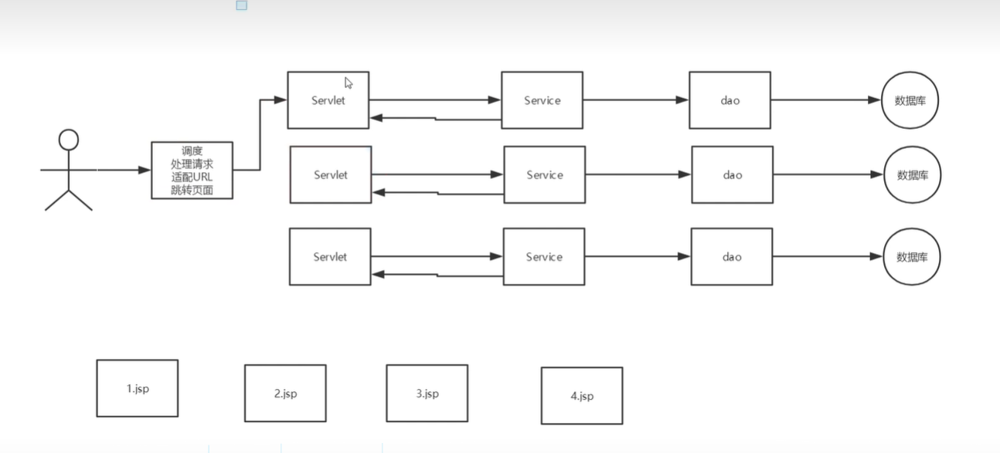
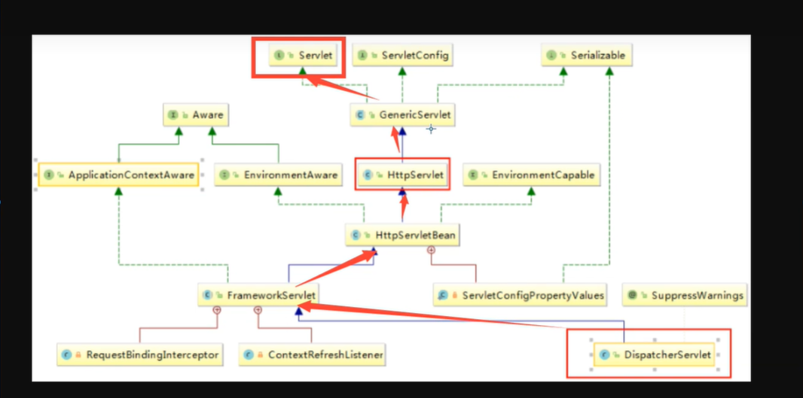
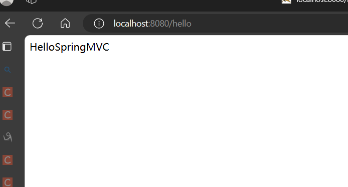
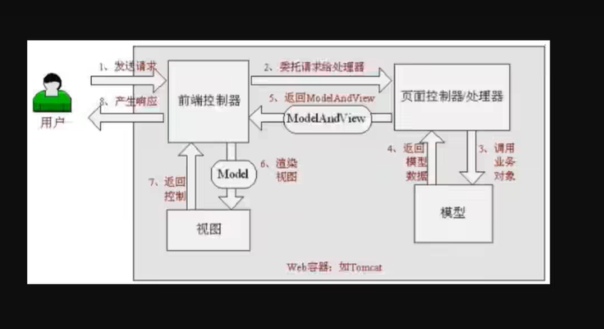
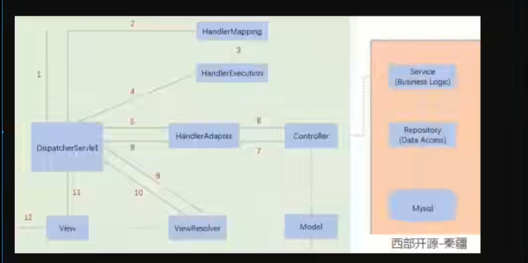
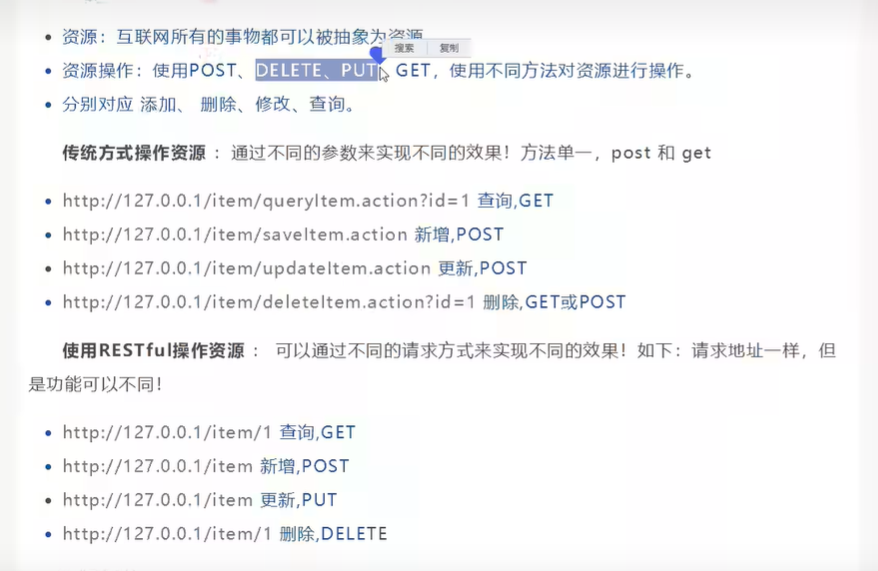

# SpringMVC

ssm：mybatis+Spring+SpringMVC  **MVC三层架构**

SSM框架：研究官方文档


SpringMVC+Vue+Springboot+SpringCloud+LInux

SSM=JavaWeb做项目

Spring：IOC和AOP【重点】

SpringMVC：SpringMVC执行流程【重点】

SpringMVC：SSM框架整合

MVC：model（dao，service）+view（jsp）+controller（Servlet）

MVC是一种软件设计规范（架构模式）

dao->service->servlet（转发和重定向）->jsp/html

前端，数据传输，实体类

实体类：属性有很多个

前端：需要用户名、密码

没有必要把整个实体类都传给前端

所以把pojo（User）细分：vo（UserVo）简化版实体类

假设：项目的架构式设计好的，还是演进的？

# 回顾servlet

1. 新建一个maven项目
2. 导入相关依赖
3. 新建添加web支持

servlet：要继承HttpServlet重写doget、dopost方法

1. 获取前端参数

```java
String method=req.getParameter("method");
if (method.equals("add")){
    req.getSession().setAttribute("msg","执行了add方法");
}
if (method.equals("delete")){
    req.getSession().setAttribute("msg","执行了delete方法");
}
```

2. 调用业务层：无

3. 视图转发或者重定向

```java
        req.getRequestDispatcher("/WEB-INF/jsp/test.jsp").forward(req,resp);
```

MVC框架需要做的：

1. 将url映射到java类或java类的方法
2. 封装用户提交的数据
3. 处理请求--调用相关业务处理--封装响应数据
4. 将响应的数据进行渲染.jsp/html等表示层数据


MVVM：M  V  VM（viewModel：双向绑定）

为什么要学习SpringMVC？

1. 轻量级、简单易学
2. 高效，基于请求响应的MVC框架
3. 与Spring兼容性好，无缝结合
4. 约定大于配置
5. 功能强大：RESETFUL（不用问号传参），数据验证，格式化，本地化，主体等
6. 简单灵活

Spring的web框架围绕DispatcherServlet设计

Spring：可以将SpringMVC中所有要用到的bean，注册到Spring中

SpringMVC简单原理就是加一层：调度



底层原理：




# 配置SpringMVC

1. 新建一个model，添加web支持

2. 确定导入了SpringMVC的依赖

3. 配置web.xml，注册DispatcherServlet

   1. 注册DispatcherServlet

   ```xml
   <!--1.注册DispatcherServlet-->
     <servlet>
       <servlet-name>springmvc</servlet-name>
       <servlet-class>org.springframework.web.servlet.DispatcherServlet</servlet-class>
   <!--    关联一个springmvc的配置文件：【servlet-name】-servlet.xml-->
       <init-param>
         <param-name>contextConfigLocation</param-name>
         <param-value>classpath:spring-servlet.xml</param-value>
       </init-param>
   <!--    启动级别-1-->
       <load-on-startup>1</load-on-startup>
     </servlet>
   <!-- / 匹配所有的请求：（不包括：.jsp）-->
   <!-- /* 匹配所有的请求：（包括：.jsp）-->
     <servlet-mapping>
       <servlet-name>springmvc</servlet-name>
       <url-pattern>/</url-pattern>
     </servlet-mapping>
   ```

4.编写SpringMVC的配置文件：springmvc-servlet.xml：【servletname】-servlet.xml名字按官方来的

```xml
<?xml version="1.0" encoding="UTF-8"?>
<beans xmlns="http://www.springframework.org/schema/beans"
       xmlns:xsi="http://www.w3.org/2001/XMLSchema-instance"
       xmlns:p="http://www.springframework.org/schema/p"
       xmlns:context="http://www.springframework.org/schema/context"
       xsi:schemaLocation="http://www.springframework.org/schema/beans
                           http://www.springframework.org/schema/beans/spring-beans-3.0.xsd ">
    <bean class="org.springframework.web.servlet.handler.BeanNameUrlHandlerMapping"/>
    <bean class="org.springframework.web.servlet.mvc.SimpleControllerHandlerAdapter"/>
    <!--    视图解析器：DispatcherServlet给他的ModelAndView-->
    <bean class="org.springframework.web.servlet.view.InternalResourceViewResolver" id="internalResourceViewResolver">
        <!--        前缀-->
        <property name="prefix" value="/WEB-INF/jsp/"/>
        <property name="suffix" value=".jsp"/>
    </bean>
    <!--    handler-->
    <bean id="/hello" class="com.xiaoke.controller.HelloServlet"/>
</beans>
```

5. 添加处理映射器

```xml
<bean class="org.springframework.web.servlet.handler.BeanNameUrlHandlerMapping"/>
```

6. 添加处理器适配器

```xml
<bean class="org.springframework.web.servlet.mvc.SimpleControllerHandlerAdapter"/>
```

7. 添加视图解析器

```xml
<!--    视图解析器：DispatcherServlet给他的ModelAndView-->
<bean class="org.springframework.web.servlet.view.InternalResourceViewResolver" id="internalResourceViewResolver">
    <!--        前缀-->
    <property name="prefix" value="/WEB-INF/jsp/"/>
    <property name="suffix" value=".jsp"/>
</bean>
```

8. 编写要操作业务的controller，要么实现controller接口，要么增加注解；需要返回一个ModelAndView，装数据，封视图

```java
//注意：这里先导入Controller接口
public class HelloServlet implements Controller {
    @Override
    public ModelAndView handleRequest(HttpServletRequest request, HttpServletResponse response) throws Exception {
        //ModelAndView 模型和视图
        ModelAndView mv=new ModelAndView();
         //调用业务层
        //封装对象，放在ModelAndView中。model
        mv.addObject("msg","HelloSpringMVC");
        //封装要跳转的视图，放在ModelAndView中
        mv.setViewName("hello");//：/WEB-INF/jsp/hello.jsp
        return mv;
    }
}
```

9. 将自己的类交给SpringIOC容器，注册bean

```xml
<!--    handler-->
    <bean id="/hello" class="com.xiaoke.controller.HelloServlet"/>
```

10. 写要跳转的jsp页面，显示ModelAndView存放的数据，以及正常页面

```jsp
<html>
<body>
${msg}
</body>
</html>
```

11. 配置tomcat启动测试



访问出现404：排查步骤：

1. 查看控制台报什么错误
2. 如果jar包存在，显示无法输出，就在IDEA的项目发布中，添加lib依赖
3. 重启tomcat解决

执行的原理：





面试回答：前端控制器接受用户的请求并拦截，根据对应的请求找到对应的Controller处理器，处理器调用业务层并返回信息给前端控制器，然后前端控制器调用视图解析器找到对应视图并将数据渲染

1. 映射前端控制器
2. 映射器
3. 适配器
4. controller控制器
5. 视图解析器

但是在实际中springMVC已经做好了，所有只需要

第一步：controller调用业务层

第二步：设置视图返回的名字

==BeanNameUrlHandlerMapping这个映射器会去根据输入
(http://localhost:8080/hello)的url(/hello) 去匹配bean的id寻找controller==

# 使用注解进行开发springmvc

1. 先在web.xml中注册dispacherservlet

```xml
<?xml version="1.0" encoding="UTF-8"?>
<web-app xmlns="https://jakarta.ee/xml/ns/jakartaee"
         xmlns:xsi="http://www.w3.org/2001/XMLSchema-instance"
         xsi:schemaLocation="https://jakarta.ee/xml/ns/jakartaee https://jakarta.ee/xml/ns/jakartaee/web-app_6_0.xsd"
         version="6.0">
    <!--  1.注册dispacherservlet  -->
    <servlet>
        <servlet-name>springmvc</servlet-name>
        <servlet-class>org.springframework.web.servlet.DispatcherServlet</servlet-class>
        <init-param>
            <param-name>contextConfigLocation</param-name>
            <param-value>classpath:springmvc-servlet.xml</param-value>
        </init-param>
    </servlet>
    <servlet-mapping>
        <servlet-name>springmvc</servlet-name>
        <url-pattern>/</url-pattern>
    </servlet-mapping>
</web-app>
```

2. 在resources中创建一个文件springmvc-servlet.xml

```xml
<?xml version="1.0" encoding="UTF-8"?>
<beans xmlns="http://www.springframework.org/schema/beans"
       xmlns:context="http://www.springframework.org/schema/context"
       xmlns:mvc="http://www.springframework.org/schema/mvc" xmlns:xsi="http://www.w3.org/2001/XMLSchema-instance"
       xsi:schemaLocation="http://www.springframework.org/schema/beans
    http://www.springframework.org/schema/beans/spring-beans-3.2.xsd
    http://www.springframework.org/schema/context
    http://www.springframework.org/schema/context/spring-context-3.2.xsd
    http://www.springframework.org/schema/mvc
    http://www.springframework.org/schema/mvc/spring-mvc-3.2.xsd
    ">
<!--   由于现在使用注解进行开发所以不用上面的形式-->
<!--    自动扫描包，让指定包下的注解生效-->
    <context:component-scan base-package="com.xiaoke.controller"/>

    <!--    让spring MVC 不处理静态资源     .css    .js     .html   .mp3    .mp4-->
    <mvc:default-servlet-handler/>
<!--相当于上面两个bean的作用
    支持mvc注解驱动
        在spring中一般采用@RequestMapping注解来完成映射关系
        要想使@RequestMapping生效
        必须向上下文中注册DefaultAnnotationHandlerMapping
        和一个AnnotationMethodHandlerAdapter实例
        这两个实例分别在类级别和方法级别处理
        而annotation-driver配置帮助自动完成上述两个实例的注入
-->
    <mvc:annotation-driven/>
<!--    视图解析器-->
    <bean class="org.springframework.web.servlet.view.InternalResourceViewResolver" id="internalResourceViewResolver">
        <property name="prefix" value="/WEB-INF/jsp/"/>
        <property name="suffix" value=".jsp"/>
    </bean>
</beans>
```

3. 在web下的WEB-INF中创建相对应的jsp文件

4. 创建controller

```java
@Controller
//@RequestMapping("hello")
//在类上加入了@RequestMapping("hello")那真实路径访问就得加上hello/h1才能访问
public class HelloController {

    //使用了@Controller后不用再去springmvc-servlet.xml中去配置bean
    // （<bean id="/hello" class="com.xiaoke.controller.HelloServlet"/>）
    //真实访问地址：项目名/HelloController/hello
    @RequestMapping("/h1")
    public String hello(Model model){
        //向模型中添加属性msg与值，可以在jsp页面中获取并且渲染
        //封装数据
        model.addAttribute("msg","HelloSpringMVCAnnotation");
        return "hello";//会被视图解析器处理 /WEB-INF/jsp/hello.jsp
    }

}
```

使用注解开发步骤：

1. 新建一个web项目
2. 导入jar包
3. 编写web.xml，注册dispatcherservlet
4. 编写springmvc配置文件
5. 去创建对应的控制类，controller
6. 完善前端视图和controller之间的对应
7. 测试运行

使用springmvc必须配置的三大件：

1. 处理器映射器
2. 处理器适配器
3. 视图解析器

通常只需手动配置视图解析器，而处理器映射器和处理器适配器只需要开启注解驱动就可以，如下：

```xml
<!--    自动扫描包，让指定包下的注解生效-->
    <context:component-scan base-package="com.xiaoke.controller"/>
    <!--    让spring MVC 不处理静态资源     .css    .js     .html   .mp3    .mp4-->
    <mvc:default-servlet-handler/>
<!--相当于上面两个bean的作用
    支持mvc注解驱动
        在spring中一般采用@RequestMapping注解来完成映射关系
        要想使@RequestMapping生效
        必须向上下文中注册DefaultAnnotationHandlerMapping
        和一个AnnotationMethodHandlerAdapter实例
        这两个实例分别在类级别和方法级别处理
        而annotation-driver配置帮助自动完成上述两个实例的注入
-->
    <mvc:annotation-driven/>
```

# SpringMVC：Controller及Restful风格

## 1、Controller

- 注解和接口进行实现

- 控制器负责解析用户的请求并将其转换为一个模型
- 在SpringMVC中一个控制器类可以包含多个方法
- 在SpringMVC中，对于Controller的配置方式有很多种 

### 1.1、使用接口进行开发

1. 先配置web.xml文件

```xml
<?xml version="1.0" encoding="UTF-8"?>
<web-app xmlns="https://jakarta.ee/xml/ns/jakartaee"
         xmlns:xsi="http://www.w3.org/2001/XMLSchema-instance"
         xsi:schemaLocation="https://jakarta.ee/xml/ns/jakartaee https://jakarta.ee/xml/ns/jakartaee/web-app_6_0.xsd"
         version="6.0">
    <!--    1配置dispatcherServlet-->
    <servlet>
        <servlet-name>springmvc</servlet-name>
        <servlet-class>org.springframework.web.servlet.DispatcherServlet</servlet-class>
        <init-param>
            <param-name>contextConfigLocation</param-name>
            <param-value>classpath:springmvc-servlet.xml</param-value>
        </init-param>
        <load-on-startup>1</load-on-startup>
    </servlet>
    <servlet-mapping>
        <servlet-name>springmvc</servlet-name>
        <url-pattern>/</url-pattern>
    </servlet-mapping>

</web-app>
```

2. 在resources文件下新建一个springmvc-servlet.xml文件

```xml
<?xml version="1.0" encoding="UTF-8"?>
<beans xmlns="http://www.springframework.org/schema/beans"
       xmlns:context="http://www.springframework.org/schema/context"
       xmlns:mvc="http://www.springframework.org/schema/mvc" xmlns:xsi="http://www.w3.org/2001/XMLSchema-instance"
       xsi:schemaLocation="http://www.springframework.org/schema/beans
                           http://www.springframework.org/schema/beans/spring-beans-3.2.xsd
                           http://www.springframework.org/schema/context
                           http://www.springframework.org/schema/context/spring-context-3.2.xsd
                           http://www.springframework.org/schema/mvc
                           http://www.springframework.org/schema/mvc/spring-mvc-3.2.xsd
                           ">
    <!--
&lt;!&ndash;    扫描该包下的注解&ndash;&gt;
    <context:component-scan base-package="com.xiaoke.controller"/>
&lt;!&ndash;    过滤静态文件&ndash;&gt;
    <mvc:default-servlet-handler />
&lt;!&ndash;    开启注解驱动&ndash;&gt;
    <mvc:annotation-driven/>
    -->
    <!--    视图解析器-->
    <bean class="org.springframework.web.servlet.view.InternalResourceViewResolver" id="internalResourceViewResolver">
        <property name="prefix" value="/WEB-INF/jsp/"/>
        <property name="suffix" value=".jsp"/>
    </bean>
    <bean id="/t1" class="com.xiaoke.controller.ControllerTest01"/>
</beans>
```

3. 在web/WEB-INF/jsp中新建test.jsp文件
4. 编写controllerTest01实现controller接口

```java
public class ControllerTest01 implements Controller {
    @Override
    public ModelAndView handleRequest(HttpServletRequest request, HttpServletResponse response) throws Exception {
        ModelAndView mv=new ModelAndView();
        mv.addObject("msg","ControllerTest01");
        mv.setViewName("test");
        return mv;
    }
}
```

5. 测试

这上面在springmvc-servlet中缺少了==处理器映射器和处理器适配器==

但是可以使用

前面要是因为要看原理，真实开发没有

缺点：

1. 实现controller接口是老的写法
2. 一个控制器只能写一个方法，如果要多个方法则需多个controller，定义的方式比较麻烦

### 1.2、使用注解进开发【实际开发】

1. 先配置web.xml文件

```xml
<?xml version="1.0" encoding="UTF-8"?>
<web-app xmlns="https://jakarta.ee/xml/ns/jakartaee"
         xmlns:xsi="http://www.w3.org/2001/XMLSchema-instance"
         xsi:schemaLocation="https://jakarta.ee/xml/ns/jakartaee https://jakarta.ee/xml/ns/jakartaee/web-app_6_0.xsd"
         version="6.0">
    <!--    1配置dispatcherServlet-->
    <servlet>
        <servlet-name>springmvc</servlet-name>
        <servlet-class>org.springframework.web.servlet.DispatcherServlet</servlet-class>
        <init-param>
            <param-name>contextConfigLocation</param-name>
            <param-value>classpath:springmvc-servlet.xml</param-value>
        </init-param>
        <load-on-startup>1</load-on-startup>
    </servlet>
    <servlet-mapping>
        <servlet-name>springmvc</servlet-name>
        <url-pattern>/</url-pattern>
    </servlet-mapping>

</web-app>
```

2. 在resources文件下新建一个springmvc-servlet.xml文件

```xml
<?xml version="1.0" encoding="UTF-8"?>
<beans xmlns="http://www.springframework.org/schema/beans"
       xmlns:context="http://www.springframework.org/schema/context"
       xmlns:mvc="http://www.springframework.org/schema/mvc" xmlns:xsi="http://www.w3.org/2001/XMLSchema-instance"
       xsi:schemaLocation="http://www.springframework.org/schema/beans
    http://www.springframework.org/schema/beans/spring-beans-3.2.xsd
    http://www.springframework.org/schema/context
    http://www.springframework.org/schema/context/spring-context-3.2.xsd
    http://www.springframework.org/schema/mvc
    http://www.springframework.org/schema/mvc/spring-mvc-3.2.xsd
    ">
<!--    扫描该包下的注解-->
    <context:component-scan base-package="com.xiaoke.controller"/>
<!--    过滤静态文件-->
    <mvc:default-servlet-handler />
<!--    开启注解驱动-->
    <mvc:annotation-driven/>
<!--    视图解析器-->
    <bean class="org.springframework.web.servlet.view.InternalResourceViewResolver" id="internalResourceViewResolver">
        <property name="prefix" value="/WEB-INF/jsp/"/>
        <property name="suffix" value=".jsp"/>
    </bean>
<!--    <bean id="/t1" class="com.xiaoke.controller.ControllerTest01"/>-->
</beans>
```

3. 在web/WEB-INF/jsp中新建test.jsp文件
4. 编写controllerTest02实现controller，使用注解@Controller

@Controller//代表这个类会被spring进行托管,这个注解的类,中所有的方法,如果返回值是String,并且有具体页面可以跳转
//那么会被视图解析器解析

```java
@Controller//代表这个类会被spring进行托管,这个注解的类,中所有的方法,如果返回值是String,并且有具体页面可以跳转
//那么会被视图解析器解析
public class ControllerTest02 {
    @RequestMapping("/t2")
    public String test01(Model model){
        model.addAttribute("msg","ControllerTest02");
        return "test";//会被视图解析器处理 /WEB-INF/jsp/hello.jsp
    }
}
```

可以发现两个请求都可以指向同一个视图，但是返回的结果不一样，从这里看出视图是可以被复用的，而控制器与视图之间是弱耦合关系

#### 1.2.1、RequestMapping

RequestMapping用于映射url导控制器类或一个特定的处理程序方法，可用于类或者方法上，用于类上，表示类中的所有响应请求的方法都是以该地址作为父路径

```java
@Controller
@RequestMapping("admin")
public class ControllerTest03 {
    @RequestMapping("t3")
    public String test03(Model model){
        model.addAttribute("msg","ControllerTest03");
        return "admin/login";
    }
}
```

## 2、Restful风格

### 2.1、是什么？

Restful就是一个资源定位及资源操作的风格，不是标准也不是协议，只是一种风格，基于这个风格设计的软件可以更加简介，更有层次，更易于实现缓存等机制

### 2.2、有什么用？

- 资源：互联网所有的事务都可以被抽象为资源
- 资源操作：使用post、delete、put、get，使用不同方法对资源进行操作
- 分别对应增加、删除、修改、查询

localhost:8080method?add=1&

localhost:8080/method/add/1/2/3




1. 新建一个类RestFulController

```java
@Controller
public class RestFulController {
    @RequestMapping("/add")
    public String test1(int a, int b, Model model){
        int res=a+b;
        model.addAttribute("msg","结果为"+res);
        return"test";
    }
}
```

2. 在Springmvc中可以使用@PathVariable注解，让方法参数的值对应绑定到一个url模板变量上

1、若方法参数名称和需要绑定的url中变量名称一致时,可以简写:

```java
@RequestMapping("/getUser/{name}")
    public User getUser(@PathVariable String name){
        return userService.selectUser(name);
    }
```

2、若方法参数名称和需要绑定的url中变量名称不一致时，写成:

```java
@RequestMapping("/getUserById/{name}")
    public User getUser(@PathVariable("name") String userName){
        return userService.selectUser(userName);
    }
```


因为java版本问题所以无法使用restful风格

使用注解也无法解决

```java
@Controller
public class RestFulController {
    //原来的:http://localhost:8080/add?a=1&b=2
    //RestFul:在参数前加上@PathVariable注解http://localhost:8080/add/a/b
    //@RequestMapping(value = "/add/{id}",method = RequestMethod.GET)
    @RequestMapping(value = "/add/{id}")
    public String test1(@PathVariable String id, Model model){
        model.addAttribute("msg","结果为"+id);
        return"test";
    }
}
```

好处：

- 高效
- 安全

# SpringMVC：结果跳转方式

## 1、ModelAndView

设置ModelAndView对象，根据view的名字，和视图解析器跳转指定的页面。

页面：{视图解析器前缀}+viewName+{视图解析器后缀}

```xml
<!--    视图解析器-->
<bean class="org.springframework.web.servlet.view.InternalResourceViewResolver" id="internalResourceViewResolver">
    <property name="prefix" value="/WEB-INF/jsp/"/>
    <property name="suffix" value=".jsp"/>
</bean>
```

对应的controller类

```java
public class ControllerTest01 implements Controller {
    @Override
    public ModelAndView handleRequest(HttpServletRequest request, HttpServletResponse response) throws Exception {
        ModelAndView mv=new ModelAndView();
        mv.addObject("msg","ControllerTest01");
        mv.setViewName("test");
        return mv;
    }
}
```

## 1.2、ServletAPI

通过设置ServletAPI，不需要视图解析器

1. 通过HttpServletResponse进行输出
2. 通过HttpServletResponse实时重定向
3. 通过HttpServletResponse实现转发

```java
resp.getWriter().println();
resp.sendRedirect();
req.getRequestDispatcher().forward(req,resp);
```

## SpringMVC

通过SpringMVC来实现转发和重定向-无需视图解析器

```xml
<!--    视图解析器-->
<bean class="org.springframework.web.servlet.view.InternalResourceViewResolver" id="internalResourceViewResolver">
    <property name="prefix" value="/WEB-INF/jsp/"/>
    <property name="suffix" value=".jsp"/>
</bean>
```

这个可以注释掉

可以用这种方式来转发

方式一：

```java
@Controller
public class ModelTest01 {
    @RequestMapping("/m1/t1")
    public String test1(Model model){
        model.addAttribute("msg","ModelTest01");
        return "/WEB-INF/jsp/test.jsp";
    }
}
```

方式二：

```java
@Controller
public class ModelTest01 {
    @RequestMapping("/m1/t1")
    public String test1(Model model){
        model.addAttribute("msg","ModelTest01");
        return "forward:/WEB-INF/jsp/test.jsp";
    }
}
```

方式三：

```java
@Controller
public class ModelTest01 {
    @RequestMapping("/m1/t1")
    public String test1(Model model){
        model.addAttribute("msg","ModelTest01");
        return "redirect:index.jsp";
    }
}/
```

# SpringMVC数据处理

## 处理提交数据

1. 提交的域名称和处理方法的参数名一致

提交数据：http://localhost:8080/hell0?name=xiaoke

处理方式：

```java
@RequestMapping("/hello")
public String hello(String name){
      System.out.println(name);
    return "hello";
}
```

2. 提交的域名称和处理方法的参数名不一致

提交数据：http://localhost:8080/hell0?username=xiaoke

@RequestMapping("/hello")

```java
//@RequestParam("username")：username提交的域的名称
@RequestMapping("/hello")
public String hello(@RequestParam("username") String name){
      System.out.println(name);
    return "hello";
}
```

3. 提交的是一个对象

要求提交的表单域和对象的属性名一致，参数使用对象即可，否则为null

1. 实体类

```java
public class User(){
    private int id;
    private String name;
    private int age;
}
```

2. 提交处理：http://localhost:8080/mcvc04/user?name=xiaoke&id=1&age=18
3. 处理方法：

```java
@RequestMapping("/user")
public String user(User user){
      System.out.println(name);
    return "hello";
}
```

>1. 接收前端用户传递的参数，判断参数名字，假设名字直接在方法上，可以直接使用
>
>2. 假设传递的是一个对象User，匹配User对象中的字段名，如果名字一致则ok，否则匹配失败，就接受不到

## 数据显示到前端

第一种：通过ModelAndView

第二种：通过ModelMap

```java
@Controller
@RequestMapping("/user")
public class UserController {
    @GetMapping("/t1")
    public String test1(User user){
        //1. 接收前端参数
        System.out.println("接收到的参数为:"+user);
        //2. 将返回的结果传递给前端
        //model.addAttribute("msg",name);
        //3. 视图跳转
        return "test";
    }

    @GetMapping("t2")
    public String test3(ModelMap modelMap){
        modelMap.addAttribute("msg","modelmap");
        return "test";
    }
}
```


第三种：通过model

>LinkedHashMap
>
>ModeMap：继承了LinkedHashMap，所有有LinkedHashMap的全部功能
>
>Model：精简版（大部分情况下使用model）

# 乱码问题

测试步骤：

1. 可以在首页编写一个提交的订单

```jsp
<%@ page contentType="text/html;charset=UTF-8" language="java" %>
<html>
<head>
    <title>Title</title>
</head>
<body>
<form action="/e/t1" method="post">
  <input type="text" name="name">
  <input type="submit">
</form>
</body>
</html>
```

2. 后台编写对应的处理类

```java
@Controller
//过滤器解决乱码
public class EncodingController {
    @PostMapping("/e/t1")
    public String test1(String name, Model model){
        System.out.println(name);
        model.addAttribute("msg",name);
        return "test";
    }
}
```

3. 输入中文测试，发现乱码

解决方式：

过滤器解决乱码

1. 编写一个过滤器类

```java
public class EncondingFilter implements Filter {
    @Override
    public void init(FilterConfig filterConfig) throws ServletException {
        Filter.super.init(filterConfig);
    }

    @Override
    public void doFilter(ServletRequest request, ServletResponse response, FilterChain chain) throws IOException, ServletException {
        request.setCharacterEncoding("utf-8");
        response.setContentType("text/html");
        response.setCharacterEncoding("utf-8");
        chain.doFilter(request,response);
    }

    @Override
    public void destroy() {
        Filter.super.destroy();
    }
}
```

2. 在web.xml中配置

```xml
<filter>
    <filter-name>encoding</filter-name>
    <filter-class>com.xiaoke.filter.EncondingFilter</filter-class>
</filter>
<filter-mapping>
    <filter-name>encoding</filter-name>
    <url-pattern>/*</url-pattern>
</filter-mapping>
```

但是也没有解决

但是接收方式改为get方式乱码就可以解决，或者在filter的xml配置中的url-pattern使用/*

乱码问题：

SpringMVC给我们提供了一个过滤器，可以在web.xml中配置

```xml
<!--    配置spring的乱码过滤器-->
<filter>
    <filter-name>encoding</filter-name>
    <filter-class>org.springframework.web.filter.CharacterEncodingFilter</filter-class>
</filter>
<filter-mapping>
    <filter-name>encoding</filter-name>
    <url-pattern>/*</url-pattern>
</filter-mapping>
```

有些情况下springmvc不起作用

那就在tomcat配置文件中，设置编码

```xml
<Connector URIEncoding="utf-8" port="8080" protocol="HTTP/1.1"
           connectionTimeout="20000"
           redirectPort="8443"
           maxParameterCount="1000"
           />
```

然后网上找一个过滤器类，然后在web.xml中配置即可

# Json

前后端分离：

后端部署，提供接口，提供数据

json（数据格式）

前端独立部署，负责渲染后端数据

## json是什么？

- js对象标记，是一种轻量级的数据交换格式
- 采用完全独立域编程语言的==文本格式==来存储和表示数据
- 简介和清晰的层次结构使得json称为理想的数据交换语言
- 易于人阅读和编写，同时也易于机器解析和生成，并有效地提升网络传输效率

在JavaScript中，一切皆对象，因此，任何JavaScript支持地类型都可以通过json来表示，例如：字符串、数字、对象、数组等

- 对象表示为键值对，数据由逗号分割
- 花括号保存对象
- 方括号保存数组

JSON键值对是用来存放JavaScript对象地一种方式，和JavaScript对象地写法也大同小异，键值对组合中地键名写在前面并用双引号""包裹，使用冒号：分割，然后紧接着值

```json
{"name":"xiaoke"}
{"age":"18"}
{"sex":"男"}
```


本质上：json就是字符串

```javascript
let user={
    name:"小柯",
    age:10,
    sex:"男"
}
console.log(user);
//将js对象转换为json对象
let changeuser_json=JSON.stringify(user);
console.log(changeuser_json);
//将json对象转化为JavaScript对象
let obj=JSON.parse(changeuser_json);
console.log(obj);
```

## Controller返回json数据

- jackson应该时目前比较好的json解析工具
- 工具还有阿里巴巴的fastjson等待
- 这里使用jackson，使用需要导入包

```xml
<!-- https://mvnrepository.com/artifact/com.fasterxml.jackson.core/jackson-databind -->
<dependency>
    <groupId>com.fasterxml.jackson.core</groupId>
    <artifactId>jackson-databind</artifactId>
    <version>2.17.0</version>
</dependency>
```

一样要配置web.xml（dispatcherservlet）然后再配置springmvc-servlet，注解驱动，扫描包，过滤静态文件，视图解析器

然后在创建一个user类，最后在controller中创建一个UserController类

```java
@Controller
public class User2Controller {
    @RequestMapping("/j1")
    @ResponseBody//只要写了这个注解就不会走视图解析器，会直接返回一个字符串
    public String json1(){
        //创建一个对象
        User2 user2=new User2("小柯",3,"男");

        return  user2.toString();
    }
}
```

出现500错误：

- 需要在project structure中地artifacts中把lib中的文件添加完全

出现乱码问题：

- 需要设置以下编码格式为utf-8，以及它的返回类型

- 通过@RequestMapping的produces属性来实现
- 最终版本如下：

```java
@Controller
public class User2Controller {
    @RequestMapping(value="/j1",produces = "text/plain;charset=UTF-8")
    @ResponseBody//只要写了这个注解就不会走视图解析器，会直接返回一个字符串
    public String json1() throws JsonProcessingException {
        //jackson，ObjectMapper
        ObjectMapper mapper=new ObjectMapper();

        //创建一个对象
        User2 user2=new User2("小柯",3,"男");

        //通过jackson下objectmapper对象下的writeValueAsString方法把对象转化为json
        String str=mapper.writeValueAsString(user2);
        return  str;
    }
}
```

Springmvc中解决方式：

直接在springmvc-servlet.xml中配置

```xml
<!-- JSON乱码问题配置 -->
<mvc:annotation-driven>
    <mvc:message-converters register-defaults="true">
        <bean class="org.springframework.http.converter.StringHttpMessageConverter">
            <constructor-arg value="UTF-8"/>
        </bean>
        <bean class="org.springframework.http.converter.json.MappingJackson2HttpMessageConverter">
            <property name="objectMapper">
                <bean class="org.springframework.http.converter.json.Jackson2ObjectMapperFactoryBean">
                    <property name="failOnEmptyBeans" value="false"/>
                </bean>
            </property>
        </bean>
    </mvc:message-converters>
</mvc:annotation-driven>
```

步骤：

1. 导入jackson包
2. 配置解决乱码问题的springmvc配置
3. 创建一个ObjectMapper对象，调用writeValueAsString方法

```java
 @ResponseBody//只要写了这个注解就不会走视图解析器，会直接返回一个字符串，写在方法上
与
@RestController//和@ResponseBody作用一样，不会走视图解析器，但是要写在类上
@Controller会走视图解析器//所以这个@Controller与@ResponseBody作用一样配合使用
```

传输日期：传统的方式

```java
@RequestMapping("/j3")
@ResponseBody
public String json3() throws JsonProcessingException {

    //jackson，ObjectMapper
    ObjectMapper mapper=new ObjectMapper();
    Date date = new Date();//timestamp返回的是时间戳
    SimpleDateFormat sdf=new SimpleDateFormat("yyyy-MM-dd HH:mm:ss");
    //通过jackson下objectmapper对象下的writeValueAsString方法把对象转化为json
     //ObjectMapper，时间解析后的默认格式为：timestamp，时间戳
    String str=mapper.writeValueAsString(sdf.format(date));
    return  str;
}
```

传输日期：使用objectmapper的方式

```java
@RequestMapping("/j3")
@ResponseBody
public String json3() throws JsonProcessingException {

    //jackson，ObjectMapper
    ObjectMapper mapper=new ObjectMapper();
    mapper.configure(SerializationFeature.WRITE_DATE_KEYS_AS_TIMESTAMPS,false);
    SimpleDateFormat sdf=new SimpleDateFormat("yyyy-MM-dd HH:mm:ss");
    mapper.setDateFormat(sdf);
    Date date = new Date();
    //通过jackson下objectmapper对象下的writeValueAsString方法把对象转化为json
    //ObjectMapper，时间解析后的默认格式为：timestamp，时间戳
    String str=mapper.writeValueAsString(date);
    return  str;
}
```

因为上面有多个重复部分，所以可以抽象出一个JSONUtil类来进行复用

```java
public class JsonUtil {
    public static String getJson(Object object){
        return getJson(object,"yyyy-MM-dd HH:mm:ss");
    }
    public static String getJson(Object object,String dataFormate){
        ObjectMapper mapper=new ObjectMapper();
        mapper.configure(SerializationFeature.WRITE_DATE_KEYS_AS_TIMESTAMPS,false);
        SimpleDateFormat sdf=new SimpleDateFormat(dataFormate);
        mapper.setDateFormat(sdf);
        try {
            return mapper.writeValueAsString(object);
        } catch (JsonProcessingException e) {
            e.printStackTrace();
        }
        return null;
    }
}
```

## FastJSON

fastJSON.jar是阿里巴巴开发的一款专门用于java开发的包，可以方便的实现json对象与JavaBean对象的转换，实现JavaBean对象与json字符串的转换，实现json对象与json字符串的转换，实现json的转换方法很多，最后实现结果都一样

fastjson依赖

```xml
<!-- https://mvnrepository.com/artifact/com.alibaba/fastjson -->
<dependency>
    <groupId>com.alibaba</groupId>
    <artifactId>fastjson</artifactId>
    <version>2.0.48</version>
</dependency>

```

fastjson三个主要的类：

- JsonObject代表java对象
  - JsonObject实现类Map接口，猜想JsonObject底层操作是由Map实现
  - JsonObject对应json对象，通过各种形式的get()方法获取json对象中的数据，也可利用诸如size()，isEmpty()等方法获取"键:值"对的个数和判断是否为空，其本质是通过实现Map接口并调用接口中的方法实现的
- JSONArray代表json对象数组
  - 内部是由List接口中的方法来完成操作的
- JSON代表JSONObject和JSONArray的转化
  - JSON类源码分析与使用
  - 仔细观察这些方法，主要是实现json对象，json对象数组，javabean对象，json字符串之间的相互转化

使用方式：

```java
@ResponseBody
@RequestMapping("/j6")
public String json5_use_fastjson(){
    List<User2> user2List=new ArrayList<User2>();
    //创建一个对象
    User2 user2=new User2("小柯1",3,"男");
    User2 user22=new User2("小柯2",3,"男");
    User2 user23=new User2("小柯3",3,"男");
    User2 user24=new User2("小柯4",3,"男");
    user2List.add(user2);
    user2List.add(user22);
    user2List.add(user23);
    user2List.add(user24);
    String jsonString = JSON.toJSONString(user2List);
    return jsonString;
}
```

# 拦截器

# 拦截器与过滤器

SpringMVC的处理器拦截器类似于servlet开发中的过滤器Filter，用于对处理器进行预处理和后处理，开发可以定义写拦截器来试下你特定的功能

过滤器与拦截器的区别：拦截器是AOP思想的具体应用

过滤器：

- servlet规范中的一部分，任何javaweb工程都可以使用
- 在url-pattern配置了/*之后，可以对所有要访问的资源进行拦截

拦截器：

- 拦截器是SpringMVC框架自己的，只有使用了SpringMVC框架的工程才能使用
- 拦截器只会拦截访问控制器的方法，如果访问的是jsp/html/css/image/js是不会进行拦截的

## 自定义拦截器

如何实现拦截器？

想要自定义拦截器，必须实现HandlerInterceptor接口

1. 新建一个module，springmvc-07-Interceptor，添加文本支持
2. 配置web.xml和spring-servlet.xml文件
3. 编写一个拦截器

```java
@RestController
public class TestController {
    @RequestMapping("t1")
    public String test1(){
        System.out.println("TestController执行了");
        return "ok";
    }
}
```


```java
public class MyInterceptor implements HandlerInterceptor {
    //return true 会执行下一个拦截器，放行
    //return false 不会执行下一个拦截器
    @Override
    public boolean preHandle(HttpServletRequest request, HttpServletResponse response, Object handler) throws Exception {
        System.out.println("=================处理前====================");
        return true;
    }
	//后面是拦截日志
    @Override
    public void postHandle(HttpServletRequest request, HttpServletResponse response, Object handler, ModelAndView modelAndView) throws Exception {
        System.out.println("=================处理后====================");

    }

    @Override
    public void afterCompletion(HttpServletRequest request, HttpServletResponse response, Object handler, Exception ex) throws Exception {
        System.out.println("=================清理====================");
    }
}

```


```xml
<!--    拦截器配置-->
    <mvc:interceptors>
        <mvc:interceptor>
<!--            /** :包括这个请求下面的所有请求比如：/admin/ad/adf
                现在的意思所有文件下的请求
-->
            <mvc:mapping path="/**"/>
            <bean class="com.xiaoke.config.MyInterceptor"/>
        </mvc:interceptor>
    </mvc:interceptors>
```

在WEB-INF下的所有页面或者资源，只能通过controller或者servlet进行访问

登录拦截：

LoginController

```java
@Controller
@RequestMapping("/user")
public class LoginController {
    @RequestMapping("/login")
    public String login(String username, String password, HttpSession session){
        //把用户的信息存在session中
        session.setAttribute("userLoginInfo",username);
        return "main";
    }
    @RequestMapping("goLogin")
    public String goLogin(){
        return "login";
    }
    @RequestMapping("main")
    public String main(){
        return "main";
    }
    @RequestMapping("/logOut")
    public String LogOut( HttpSession session){
        session.removeAttribute("userLoginInfo");
        return "login";
    }
}
```

拦截器

```java
public class LoginInterceptor implements HandlerInterceptor {
    @Override
    public boolean preHandle(HttpServletRequest request, HttpServletResponse response, Object handler) throws Exception {
        HttpSession session = request.getSession();
        //登录页面也需要放行
        if(request.getRequestURI().contains("goLogin")){
            return true;
        }
        //放行的判断：什么情况下登录

        if(session.getAttribute("userLoginInfo")!=null){
            return true;
        }
        //第一次登录无session
        //说明在提交登录
        if (request.getRequestURI().contains("login")){
            return true ;
        }

        //判断什么情况下没有登录
        //1，没有session
        request.getRequestDispatcher("/WEB-INF/jsp/login.jsp").forward(request,response);
        return false;
    }
}
```

拦截器在applicationContext.xml配置

```xml
<!--    拦截器配置-->
<mvc:interceptors>
    <mvc:interceptor>
        <!--            /** :包括这个请求下面的所有请求比如：/admin/ad/adf
                现在的意思所有文件下的请求
-->
        <mvc:mapping path="/**"/>
        <bean class="com.xiaoke.config.MyInterceptor"/>

    </mvc:interceptor>
    <mvc:interceptor>
        <!--            /** :包括这个请求下面的所有请求比如：/admin/ad/adf
                            现在的意思所有文件下的请求
            -->
        <mvc:mapping path="/user/**"/>
        <bean class="com.xiaoke.config.LoginInterceptor"/>

    </mvc:interceptor>
</mvc:interceptors>
