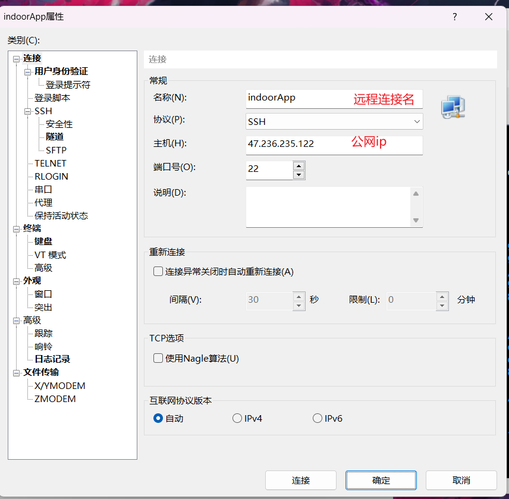
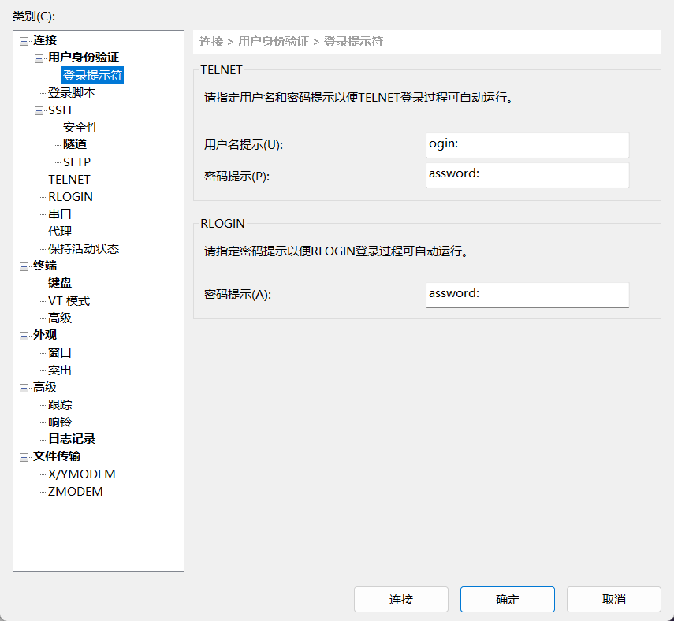

# Docker部署

首先在阿里云购买服务器，我现在选用的是centor OS8

使用Xshell来连接远程服务器



然后再输入相应的用户名和密码



安装docker官网地址：[Install Docker Engine on CentOS | Docker Docs](https://docs.docker.com/engine/install/centos/)

```bash
sudo yum install -y yum-utils #先安装utils
```

换源

```bash
sudo yum-config-manager \
    --add-repo \
    https://mirrors.aliyun.com/docker-ce/linux/centos/docker-ce.repo
```

就可以直接安装docker了

```bash
sudo yum install docker-ce docker-ce-cli containerd.io docker-buildx-plugin docker-compose-plugin
```

安装完成，启动

```bash
sudo systemctl start docker
```

由于在application.yml中数据库和redis中的地址都换为了名称，docker支持在同一网络下使用名称来访问应用，所以需要自己创建一个网络。

```bash
docker network create indoorApp
```

## java的dockerfile

```bash
# 使用17镜像作为基础镜像
FROM openjdk:17
# 指定允许文件路径
# 作者：xiaoke
WORKDIR /usr/local/java
# 设定时区
ENV TZ=Asia/Shanghai
RUN ln -snf /usr/share/zoneinfo/$TZ /etc/localtime && echo $TZ > /etc/timezone
# 把jar包复制到镜像中
COPY indoorapp_backend.jar ./app.jar
# 暴露端口号
EXPOSE 8080
# 启动应用
CMD ["java","-jar","/usr/local/java/indoorapp_backend.jar"]
```

## java应用镜像构建

```bash
docker build -t indoorapp:v1 .
```

## Redis 运行（如果没有它会自动安装）

```bash
docker run --name redis --network indoorApp -p 6379:6379 -d redis:latest
```


## 如果需要删除使用：

```bash
docker rm -f mysql
```

## 查看运行的容器

```bash
docker ps -a #查看所有的容器
```

Mysql 运行（如果没有它会自动安装）

```bash
docker run -d --name mysql -v mysqldata:/var/lib/mysql -v mysqlconf:/etc/mysql/conf.d -v mysqllog:/var/log/mysql -p 3306:3306 --network indoorApp -e TZ=Asia/Shanghai -e MYSQL_ROOT_PASSWORD=123456 mysql:8
```

## 删除容器：

`docker rm NAME/CONTAINER ID`
意思是：删除一个容器
NAME：这里是自己要删除容器的名字
CONTAINER ID：这里是自己要删除容器的ID

## 运行后端：

```bash
docker run -d -it --name indoorapp --network indoorApp -v /usr/local/java:/usr/local/java -p 8080:8080 indoorapp:v1
```


安装阿里云插件：云监控插件

**curl http://100.100.100.200/latest/meta-data/region-id**

```bash
sudo ARGUS_VERSION=3.5.11 /bin/bash -c "$(curl -s https://cms-agent-ap-southeast-1.oss-ap-southeast-1-internal.aliyuncs.com/Argus/agent_install-1.10.sh)"
```

docker run --name mysql -e MYSQL_ROOT_PASSWORD=123456 -d mysql:latest

## 出现1251错误

进入mysql设置

1、进入容器可使用 `docker exec -it mysql bash`进入，这里不再贴代码了。
2、登录进入mysql ，使用 `mysql -uroot -p123456`登录mysql数据库
3、给root用户设置密码

`alter user 'root'@'%' identified with caching_sha2_password by '123456';`

4、刷新权限
`flush privileges;`

查看容器启动信息：

```bash
docker logs -f indoorapp
```


## Nginx

```bash
docker run -d --name nginx --network indoorApp -v /usr/local/nginx/html:/usr/local/nginx/html -v /usr/local/nginx/nginx/conf:/etc/nginx/nginx/conf -v /usr/local/nginx/nginx.conf:/usr/share/nginx/https -p 8000:8000 -p 443:443 nginx:latest
```

部署前端参考文档：[Docker容器部署前端Vue服务——手把手教学_docker vue-CSDN博客](https://blog.csdn.net/xiaolong124/article/details/123458100)

```
server {
    listen       8848;
    server_name  localhost; # 修改为docker服务宿主机的ip
 
    location / {
        root   /usr/share/nginx/html;
        index  index.html index.htm;
        try_files $uri $uri/ /index.html =404;
    }
 
    error_page   500 502 503 504  /50x.html;
    location = /50x.html {
        root   html;
    }
}
```

