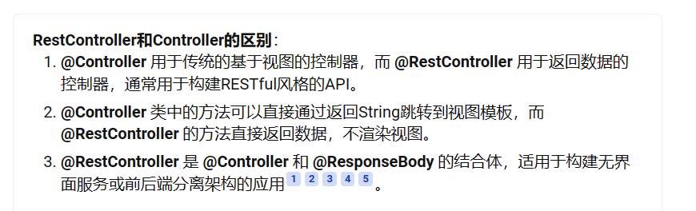

# Mybatis

如果==在application.yml中配置了configuration就不能在resources中写mybatis-config.xml文件了==他们两个==会冲突==，如果有其他配置文件要写就去写一个配置类进行对mybatis配置


# SpringBoot

继承spring-boot-starter-parent其实也算是继承自spring-boot-dependencies,我们点开spring-boot-starter-parent,可以看到parent其实也是继承dependencies,parent里面就增加了一些插件,然后指定了maven编译版本:



RestFul风格的请求，从request中获取参数：

```java
Map serviceName = (Map) request.getAttribute(HandlerMapping.URI_TEMPLATE_VARIABLES_ATTRIBUTE);
System.out.println(serviceName.get("serviceName"));
return (String) serviceName.get("serviceName");
```


## **思路：**

### 大型项目配置：

1、导入依赖			

2、编写配置文件

3、开启这个功能 	@EnableXXXX

4、配置类


# 微服务与分布式区别

**分布式：**将一个项目中的各个服务分散部署在不同的机器上的，一个服务可能负责几个功能，是一种面向服务的架构（SOA）。

**微服务：**微服务是一种架构风格，微服务就是很小的一个服务，服务即应用，亦即我们俗称的一个项目。相较于以往常见的单体应用，微服务的核心思想是将一个大项目的各个业务模块甚至某个单一功能抽离出来，作为一个单独的完整项目，单独部署，该应用只需要为该大项目或者其他项目的业务模块提供服务即可。缺点：开发成本高，众多服务出错的处理（容错），分布式事务的问题

**分布式和微服务的区别总结**
从分布式和微服务的概念来看，都是对一个项目系统进行了拆分，一个是在部署层面，一个是在架构设计层面。但是微服务相较于分布式来说，细粒度更小，服务间的耦合度更低，并且可以说微服务一定是分服务分开部署的，所以其实微服务是基于分布式的，更像是对分布式系统的一种优化，因此很多时候微服务架构也被称为是分布式的架构，区别于分布式系统。

并且可以预见的是，分布式系统最后都会向微服务架构演化，这是一种趋势， 不过服务微服务化后带来的挑战也是显而易见的，例如服务粒度小，数量大，后期运维将会很难等问题。