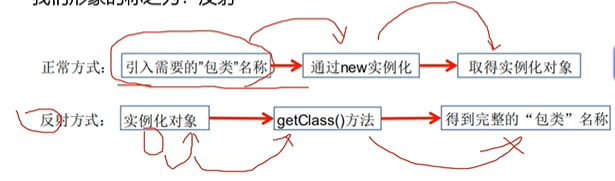
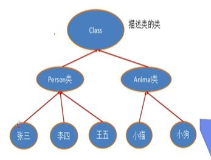
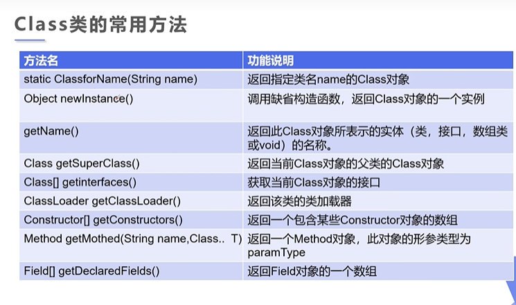
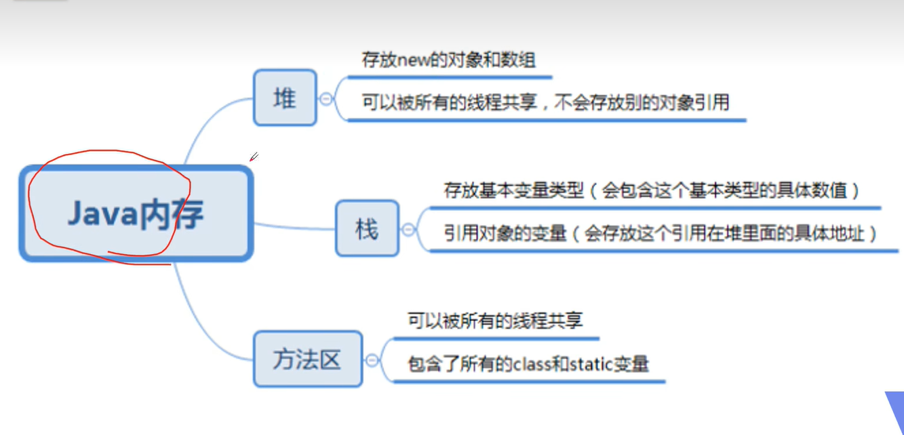
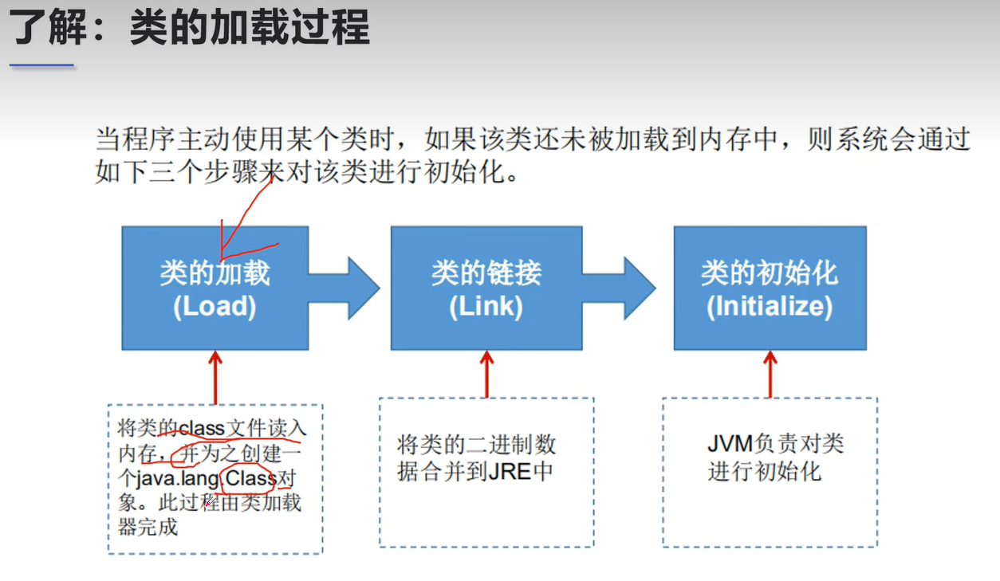
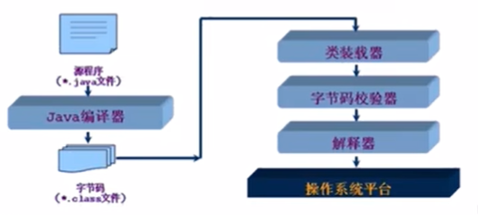
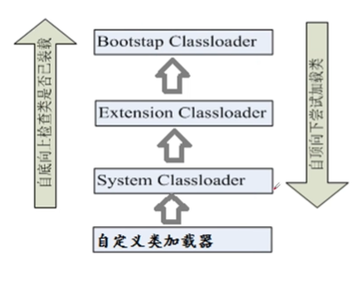
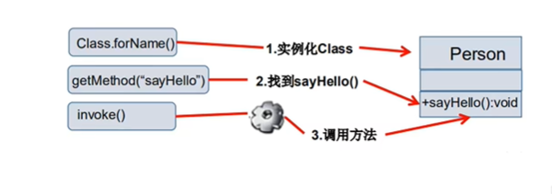
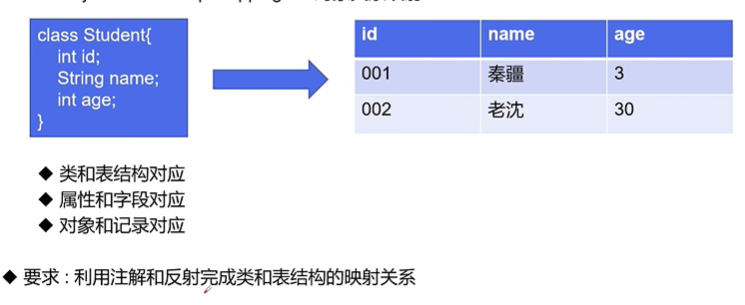

# 注解(Annotation)和反射(Reflection)

## 注解

所有框架的底层也用到

mybatis，spring

注释（comment）与注解（Annotation）

都是给人看

**注解也可以给程序看**

### 注解入门

- Annotation时从JDK5.0开始
- Annotation的作用：
  - 不是程序本身，可以对对程序作出解释（这一点和注释（comment）没什么区别）
  - 可以被其他程序（比如：编译器等）读取
- Annotation的格式：
  - 注解时以’@注解名‘在代码中存在的，还可以添加一些参数值，例如：@Suppress Waenings(value="unchecked")

- Annotation在那里使用？
  - 可以附加在package，class，method，field等上面，相当于给他们添加了额外的辅助信息，我们可以通过反射机制编程实现对这些元数据的访问

### 内置注解

常见的3类内置注解

- @Override：定义在Java.lang.Override中，此注解只适用于修饰方法，表示一个方法声明打算重写超类中的另一个方法声明

- @Deprecated：定义在java.lang.Deprecated中，此注解可以用于修饰方法，属性，类，表示不鼓励程序员使用这样的元素，通常是因为它很危险或者存在更好的选择

- @SuppressWarnings：定义在java.lang.SuppressWarnings中，用来抑制编译时的警告信息
  - 与前两个注解有所不同，需要添加一个参数才能正确使用，这些参数都是已经定义好了的，选择性的使用即可
    - @SuppressWarnings("all")
    - @SuppressWarnings("unchecked")
    - @SuppressWarnings(value={"unchecked","deprecation"})
    - 等等...

```java
package com.xiaoke.annotation;

import java.util.ArrayList;
import java.util.List;

public class Test01 extends Object{
    //@Override重写的注解
    @Override//重写的注解
    public String toString() {
        return super.toString();
    }

    //不推荐程序员使用，但可以使用，或者存在更好的方式
    @Deprecated
    public static void test(){
        System.out.println("Deprecated");
    }
    // @SuppressWarnings抑制警告
    @SuppressWarnings("all")
    public void test02(){
        List list=new ArrayList();
    }
    public static void main(String[] args) {
        test();
    }
}
```

### 自定义注解，元注解

#### 元注解

- 元注解的作用就是负责注解其他注解，java定义了4个标准的meta-annotation类型，他们被用来提供对其他annotation类型作说明
- 这些类型和它们所支持的类在java.lang.annotation包中可以找到(@Target,@Retention,@Documented,@Inherited)
  - @Target：用于描述注解的适用范围（即：被描述的注解可以用在什么地方）
  - @Retention：表示需要在什么级别保存该注解信息，用于描述注解的生命周期
    - （SOURCE<CLASS<RUNTIME）
  - @Document：说明该注解将被包含在javadoc中
  - @Inherited：说明子类可以继承父类中的该注解

*一个类中只能有一个public*

#### 自定义注解

- 使用@interface自定义注解时，自动继承了java.lang.annotation.Annotation接口
- 分析：
  - @interface用来声明一个注解，格式：public @interface 注解名{定义内容}
  - 其中的每一个方法实际上时声明了一个配置参数
  - 方法的名称就是参数的名称
  - 返回值类型就是参数的类型（返回值只能时基本类型，class，String，enum）
  - 可以通过default来声明参数的默认值
  - 如果只有一个参数成员，一般参数名为value
  - 注解元素必须要有值，定义注解元素时，经常使用空格字符串，0作为默认值

```java
package com.xiaoke.annotation;

import java.lang.annotation.ElementType;
import java.lang.annotation.Retention;
import java.lang.annotation.RetentionPolicy;
import java.lang.annotation.Target;

public class Test03 {
    @MyAnnotation02(age=22,schools={"清华大学","武汉大学"})
    public void test01(){
        
    }
    @MyAnnotation03("xiaoke")
    public void test02(){
        
    }
}
@Target({ElementType.TYPE,ElementType.METHOD})
@Retention(RetentionPolicy.RUNTIME)
@interface MyAnnotation02{
    //注解参数：参数类型+参数名()
    String name() default "xiaoke";
    int age();
    String[] schools();
}

@Target({ElementType.TYPE,ElementType.METHOD})
@Retention(RetentionPolicy.RUNTIME)
@interface MyAnnotation03{
    String value();
}
```

## 反射机制

### java反射机制概述

- Reflection（反射）时java被视为动态语言的关键，反射机制允许程序在执行期间借助于Reflection API取得任何类的内部信息，并能直接操作任意对象的内部属性及方法
  - Class c=Class.forName("java.lang.String")
- 加载完类之后，在堆内存的方法区中就产生了一个class类型的对象（一个类只有一个class对象），这个对象就包含了完整的类的结构信息。可以通过这个对象看到类的结构，这个对象就像一面镜子，透过这个镜子看到类的结构，所有，形象的称之为：反射
- 

```java
package com.xiaoke.reflection;

//什么叫反射
public class Test extends Object{
    public static void main(String[] args) {
        //通过反射获取类的Class对象
        try {
            Class c1=Class.forName("com.xiaoke.reflection.User");
            Class c2=Class.forName("com.xiaoke.reflection.User");
            Class c3=Class.forName("com.xiaoke.reflection.User");
            Class c4=Class.forName("com.xiaoke.reflection.User");
            System.out.println(c1);
            //一个类在内存中只有一个class对象
            //一个类被加载后，类的整个结构都会被封装在class对象中
            System.out.println(c2.hashCode());
            System.out.println(c3.hashCode());
            System.out.println(c4.hashCode());
        } catch (ClassNotFoundException e) {
            throw new RuntimeException(e);
        }

    }
}

//实体类（pojo）： 类要有set，get方法
class User{
    private String name;
    private int id;
    private int age;

    public User() {
    }

    public User(String name, int id, int age) {
        this.name = name;
        this.id = id;
        this.age = age;
    }

    public String getName() {
        return name;
    }

    public void setName(String name) {
        this.name = name;
    }

    public int getId() {
        return id;
    }

    public void setId(int id) {
        this.id = id;
    }

    public int getAge() {
        return age;
    }

    public void setAge(int age) {
        this.age = age;
    }

    @Override
    public String toString() {
        return "User{" +
                "name='" + name + '\'' +
                ", id=" + id +
                ", age=" + age +
                '}';
    }
}
```

**反射相关的主要API**

- java.lang.Class：代表一个类
- java.lang.reflect.Method：代表类的方法
- java.lang.reflect.Field：代表类的成员变量
- java.lang.reflect.Constructor：代表类的构造器

### 理解Class类并获取Class实例

**实体类**

写实体类的规范：

1. 根据设计，定义一组需要的private属性。

2. 根据这些属性，创建它们的setter和getter方法。

3. 提供带参数的构造器和无参数的构造器。

4. 重写toString、equals、hashcode等方法（optional）。

5. 实现序列化（Serializable接口、Parcelable接口也可以），并赋予一个版本号。

**Class类**

在Object类中定义了以下的方法，此方法将被所有子类继承

`public final Class getClass()`

- 以上的方法返回值的类型是一个Class类，此类是java反射的源头，实际上所谓反射从程序的允许结果来看也很好理解，即：可以通过对象反射求出类的名称
- 

对象照镜子后可以得到的信息：某个类的属性，方法和构造器，某个类到底实现了哪些接口，对于每个类而言，JRE都为其保留一个不变的Class类型的对象。一个Class对象包含了特定某个结构(class/interface/enum/annotation/primitive type/void/[])的有关信息

- Class本身也是一个类
- Class对象只能由系统建立对象
- 一个加载的类在JVM中只会有一个Class实例
- 一个Class对象对应的是一个加载到JVM中的一个class文件
- 每个类的实例都会记得自己是由哪个Class实例所生成
- 通过Class可以完整地得到一个类中地所有被加载的结构
- Class类是Reflection的根源，针对任何想动态加载，运行的类，唯有先获得相应的Class对象
- 

**获取Class实例**

- 若已知具体的类，通过类的class属性获取，该方法最为安全可靠，程序性能最高
  - `Class claz=zPerson.class`
- 已知某个类的实例，调用该实例的getClass()方法获取Class对象
  - `Class clazz=person.getClass()`
- 已知一个类的全类名，但该类在类路径下，可通过Class类的静态方法forName()获取，可能抛出ClassNotFoundException
  - `Class clazz=Class.forName("demo01.Student")`
- 内置基本数据类型可以直接用类名.Type
- 还可以利用ClassLoader

```java
package com.xiaoke.reflection;

import java.security.PublicKey;

//测试Class类的创建方式有那些
public class Test03 {
    public static void main(String[] args) throws ClassNotFoundException {
        Person person=new Student();
        System.out.println("这个人是："+person.name);
        //方式一：通过对象获得
        Class c1=person.getClass();
        System.out.println(c1.hashCode());
        //方式二：forName()
        Class c2=Class.forName("com.xiaoke.reflection.Student");
        System.out.println(c2.hashCode());
        //方式三：通过类名.class获得
        Class c3 = Student.class;
        System.out.println(c3.hashCode());
        //方式四：基本内置类型的包装类都有一个Type属性
        Class c4 = Integer.TYPE;
        System.out.println(c4);
        //获得父类类型
        Class c5=c1.getSuperclass();
        System.out.println(c5);
    }
}

class Person{
    public String name;

    public Person(String name) {
        this.name = name;
    }

    public Person() {
    }

    @Override
    public String toString() {
        return "Person{" +
                "name='" + name + '\'' +
                '}';
    }
}

class Student extends Person{
    public Student(){
        this.name="学生";
    }
}
class Teacher extends Person{
    public Teacher(){
        this.name="老师";
    }
}
```

**哪些类型可以有Class对象？：**

- class：外部类。成员（成员内部类，静态内部类），局部内部类，匿名内部类
- interface：接口
- []：数组
- enum：枚举
- annotation：注解@interface
- primitive type：基本数据类型
- void

**只要元素类型与维度一样，就是同一个Class**

```java
package com.xiaoke.reflection;

import java.lang.annotation.ElementType;

//所有类型的Class
public class Test04 {
    public static void main(String[] args) {
        Class c1 = Object.class; //类
        Class c2= Comparable.class;//接口
        Class c3=String[].class;//一维数组
        Class c4=int[][].class;//二维数组
        Class c5=Override.class;//注解
        Class c6= ElementType.class;//枚举
        Class c7=Integer.class;//基本数据类型
        Class c8=void.class;//void
        Class c9=Class.class;//Class
        System.out.println(c1);
        System.out.println(c2);
        System.out.println(c3);
        System.out.println(c4);
        System.out.println(c5);
        System.out.println(c6);
        System.out.println(c7);
        System.out.println(c8);
        System.out.println(c9);
        //只要元素类型与维度一样，就是同一个Class
        int[] a=new int[10];
        int[] b=new int[100];
        System.out.println(a.getClass().hashCode());
        System.out.println(b.getClass().hashCode());
    }
}
```

### 类的加载与ClassLoader

#### java内存分析



#### 类的加载



- 加载：将class文件字节码内容记载到内存中，并将这些静态数据转换成方法区的运行时数据结构，然后生成一个代表这个类的java.lang.Class对象

- 链接：将java类的二进制代码合并到JVM的运行状态之中的过程
  - 验证：确保加载的类信息复合JVM规范，没有安全方面的问题
  - 准备：正式为类变量（static）分配内存到设置类变量默认初始值的阶段，这些内容都将在方法区中进行分配
  - 解析：虚拟机额常量池内的符号引用（常量名）替换为直接引用（地址）的过程
- 初始化：
  - 执行类构造器```<clinit>()```方法的过程，类构造器```<clinit>()```方法时由编译期自动收集类中所有类变量的赋值动作和静态代码块中的语句合并产生的（类构造器是构造类信息的，不是构造该类对象的构造器）
  - 当初始化一个类的时候，如果发现其父类还没有进行初始化，则需要先触发其父类的初始化
  - 虚拟机会保证一个类的```<clinit>()```方法在多线程环境中被正确加锁和同步

```java
package com.xiaoke.reflection;

public class Test05 {
    public static void main(String[] args){
        A a=new A();
        System.out.println(A.m);
    }
}

class A{
    static{
        System.out.println("A类静态代码块初始值");
        m=300;
    }
    static int m=100;
    public A(){
        System.out.println("A类的无参构造初始化");
    }
}
```

#### 什么时候会发生类初始化？

- 类的主动引用（一定会发生类的初始化）
  - 当虚拟机启动，先初始化main方法所在的类
  - new一个类的对象
  - 调用类的静态成员（除了final常量）和静态方法
  - 使用java.lang.reflect包的方法对类进行反射调用
  - 当初始化一个类，如果其父类没有被初始化，则先会初始化它的父类
- 类的被动引用（不会发生类的初始化）
  - 当访问一个静态域时，只有真正声明这个域的类才会被初始化，如：当通过子类引用父类的静态变量，不会导致子类初始化
  - 通过数组定义类引用，不会触发此类的初始化
  - 引用常量不会触发此类的初始化（常量在链接阶段就存入调用类的常量池中了）

**为什么static final修饰的常量类未初始化就可以有值**

*static final修饰的字段在javac编译时生成comstantValue属性，
在类加载的准备阶段直接把constantValue的值赋给该字段。
可以理解为在编译期即把结果放入了常量池中。
ConstantValue属性的作用是通知虚拟机自动为静态变量赋值，
只有被static修饰的变量才可以使用这项属性。
所以在准备阶段其余的static变量初始值是零，但final static修饰的变量在准备阶段直接赋值为指定值，所以在读取static变量需要类初始化，但读取final static被视为常量直接在常量池中读取*

```java
package com.xiaoke.reflection;

import org.w3c.dom.ls.LSOutput;

//测试类什么时候会初始化
public class Test06 {
    static {
        System.out.println("Main类被加载");
    }
    public static void main(String[] args) throws ClassNotFoundException {
        //1.主动引用
        //Son son=new Son();
        //反射也会产生主动引用
        //Class.forName("com.xiaoke.reflection.Son");
        //不会产生类的引用方法-不会发生类的初始化
        //System.out.println(Son.b);

        //Son[] array=new Son[10];

        System.out.println(Son.M);
    }

}

class Father{
    static int b=2;
    static {
        System.out.println("父类被加载");
    }
}
class Son extends Father{
    static {
        System.out.println("子类被加载");
        m=300;
    }
    static int m=100;
    static final int M=1;
}
```

#### 类加载器的作用

- 类加载的作用：将class文件字节码内容记载到内存中，并将这些静态数据转换成方法区的运行时数据结构，然后生成一个代表这个类的java.lang.Class对象。作为方法区中类数据的访问入口
- 类缓存：标准的JavaSE类加载器可以按要求查找类，但一旦某个类被加载到类加载器中，它将维持加载（缓存）一段时间，不过JVM垃圾回收机制可以回收这些Class对象



类加载器作用是用来把类(class)加载进内存的。JVM规范定义了如下类型的类的加载器

- 引导类加载器(根加载器)：用C++编写的，时JVM自带的类加载器，**负责java平台核心库**(rt.jar)，用来装载核心类库，该加载器无法直接获取
- 扩展类加载器：负责jre/lib/ext目录下的jar包或-D java.ext.dirs指定目录下的jar包装入工作库
- 系统类加载器(用户类)：负责java-classpath或-D java.class.path所指的目录下的类域jar包装入工作，时最常用的加载器



### 创建运行时类的对象

#### 获取运行时类的完整结构

通过反射获取运行时类的完整结构

Field，Method，Constructor，Superclass，interface，Annotation

- 实现的全部接口
- 所继承的父类
- 全部的构造器
- 全部的方法
- 全部的Field
- 注解
- ...

```java
package com.xiaoke.reflection;


import java.lang.reflect.Constructor;
import java.lang.reflect.Field;
import java.lang.reflect.Method;

//获得类的信息
public class Test08 {
    public static void main(String[] args) throws ClassNotFoundException, NoSuchFieldException, NoSuchMethodException {
        Class c1= Class.forName("com.xiaoke.reflection.User");

        User user=new User();
        c1= user.getClass();

        //获得类的名字
        System.out.println(c1.getName());//获得包名，+类名
        System.out.println(c1.getSimpleName());//获得类名

        //获得类的属性
        //有Declared字眼的都是获取本类所有任何访问级别的数据,
        //没有的可以获取本类及父类所有公共级别的数据
        System.out.println("==========================11");
        Field[] fields=c1.getFields();//只能找到public属性
       /* for (Field field : fields) {
            System.out.println(field);
        }*/
        fields=c1.getDeclaredFields();//找到全部的属性（公有和私有）
        for (Field field : fields) {
            System.out.println(field);
        }
        //获得指定属性的值
        //Field name=c1.getField("name");
        Field name=c1.getDeclaredField("name");
        System.out.println(name);

        //获得类的方法
        System.out.println("==========================");
        Method[] methods=c1.getMethods();//获得本类及其父类的全部public方法
        for (Method method : methods) {
            System.out.println("正常的："+method);
        }
        methods=c1.getDeclaredMethods();//获取本类的所有方法(私有方法也打印出来)
        System.out.println("==========================");
        for (Method method : methods) {
            System.out.println("getDeclaredMethods："+method);
        }
        //获得指定方法
        Method getName=c1.getMethod("getName",null);
        System.out.println(getName);
        Method setName=c1.getMethod("setName", String.class);
        System.out.println(setName);

        //获得类的构造器
        System.out.println("==========================");
        Constructor[] constructors=c1.getConstructors();//只能获取public构造器方法
        for (Constructor constructor : constructors) {
            System.out.println(constructor);
        }
        Constructor[] declaredConstructors=c1.getDeclaredConstructors();//获取全部的构造器方法（公有和私有）
        for (Constructor declaredConstructor : declaredConstructors) {
            System.out.println("declaredConstructor："+declaredConstructor);
        }

        //获得指定的构造器
        Constructor declaredConstructor=c1.getDeclaredConstructor(String.class,int.class,int.class);
        System.out.println("指定：" + declaredConstructor);
    }
}

```

#### 小结

- 在实际操作中，取得类的信息的操作代码，并不会经常开发
- 一定要熟悉java.lang.reflect包的作用，反射机制
- 如何取得属性、方法、构造器的名称，修饰符等

#### 有了Class对象，能做什么

- 创建类的对象：调用Class对象的newInstance()方法
  - 类必须有一个无参数的构造器
  - 类的构造器的访问权限需要足够
- 只要在操作的时候明确的调用类中的构造器，并将参数传递进去之后，就可以实例化操作
- 步骤如下：
  - 通过Class类的getDeclaredConstructor(Class ...parameterTypes)取得本类的指定形参类型的构造器
  - 向构造器的形参中传递一个对象数组进去，里面包含了构造器中所需的各个参数
  - 通过Constructor实例化对象

`JDK9以后可以考虑用：xxx.getDeclaredConstructor().newInstance()`

#### 调用指定的方法

- 通过反射，调用类中的方法，通过Method类完成
  - 通过Class类的getMethod(String name,Class...parameterTypes)方法取得一个Method对象，并设置此方法操作时所需要的参数类型
  - 之后使用Object invoke(Object obj,Object[] args)进行调用，并向方法中传递要设置的obj对象的参数信息
    - Object对应原方法的返回值，若原方法无返回值，此时返回null
    - 若原方法为静态方法，次数形参Object obj可为null
    - 若元方法形参列表为空，则Object[] args为null
    - 若原方法声明为private，则需要在调用此invoke()方法前，显示调用方法对象的setAccessible(true)方法，将可访问private的方法



#### setAccessible

- Method和Field、Constructor对象都有setAccessible()方法
- setAccessible作用是启动和禁用访问安全检查的开关
- 参数值为true则指示反射的对象在使用时应该取消java语言访问检查
  - 提高反射的效率，如果代码中必须用反射，而该句代码需要频繁的被调用，那么设置为true
  - 使得原本无法访问的私有成员也可以访问
- 参数值为false则指示反射的对象应该实施java语言访问检查

```java
package com.xiaoke.reflection;

import java.lang.reflect.Constructor;
import java.lang.reflect.Field;
import java.lang.reflect.InvocationTargetException;
import java.lang.reflect.Method;

//动态的创建对象，通过反射
public class Test09 {
    public static void main(String[] args) throws ClassNotFoundException, InstantiationException, IllegalAccessException, NoSuchMethodException, InvocationTargetException, NoSuchFieldException {
        //获取Class对象
        Class c1=Class.forName("com.xiaoke.reflection.User");

        //构造一个对象
        User user= (User) c1.newInstance();//本质上是调用无参构造器
        System.out.printf(String.valueOf(user));

        //通过构造器创建对象
        Constructor getDeclaredConstructor=c1.getConstructor(String.class,int.class,int.class);
        User user2= (User) getDeclaredConstructor.newInstance("xiaoke",001,18);
        System.out.printf(String.valueOf(user2));

        //通过反射调用普通方法
        User user3=(User) c1.newInstance();
        //通过反射获得一个方法
        Method setName = c1.getDeclaredMethod("setName", String.class);
        //invoke：激活的意思
        //（对象，“方法值”）
        setName.invoke(user3,"xiaoke");
        System.out.println(user3.getName());

        System.out.println("=======================================");
        //传统的setName这个字段是你的代码，而反射中是作为一个String，是一个可变的参数，所以可以实现动态的执行代码
        //通过反射操作属性
        User user4= (User) c1.newInstance();
        //不能直接操作私有属性。需要关闭程序的安全检测，属性或方法的setAccessible(true)
        Field name = c1.getDeclaredField("name");
        name.setAccessible(true);//设置访问性
        name.set(user4,"小白");
        System.out.println(user4.getName());
    }
}
```

#### 性能比对

```java
package com.xiaoke.reflection;

import java.lang.reflect.InvocationTargetException;
import java.lang.reflect.Method;

//分析性能问题
public class Test10 {
    //普通方式调用
    public static void test01(){
        User user=new User();
        long startTime=System.currentTimeMillis();
        for (int i = 0; i < 1000000000; i++) {
            user.getName();
        }
        long endTime=System.currentTimeMillis();
        System.out.println("普通方式调用"+(endTime-startTime)+"ms");
    }

    //反射方式调用
    public static void test02() throws ClassNotFoundException, NoSuchMethodException, InvocationTargetException, IllegalAccessException {
        User user=new User();
        Class c1=Class.forName("com.xiaoke.reflection.User");
        Method getName = c1.getDeclaredMethod("getName", null);
        long startTime=System.currentTimeMillis();
        for (int i = 0; i < 1000000000; i++) {
            getName.invoke(user,null);
        }
        long endTime=System.currentTimeMillis();
        System.out.println("反射方式调用"+(endTime-startTime)+"ms");
    }

    //反射方式调用，关闭检测
    public static void test03() throws ClassNotFoundException, NoSuchMethodException, InvocationTargetException, IllegalAccessException {
        User user=new User();
        Class c1=Class.forName("com.xiaoke.reflection.User");
        Method getName = c1.getDeclaredMethod("getName", null);
        getName.setAccessible(true);
        long startTime=System.currentTimeMillis();
        for (int i = 0; i < 1000000000; i++) {
            getName.invoke(user,null);
        }
        long endTime=System.currentTimeMillis();
        System.out.println("反射方式调用，关闭检测"+(endTime-startTime)+"ms");
    }

    public static void main(String[] args) throws ClassNotFoundException, InvocationTargetException, NoSuchMethodException, IllegalAccessException {
        test01();
        test02();
        test03();
    }
}
```

#### 反射操作泛型

- java采用泛型擦除的机制来引入泛型，java中的泛型仅仅是给编译器javac使用的，确保数据的安全性和免去强制类型转换的问题，但是一旦编译完成，所有和泛型有关的类型全部擦除
- 为了通过反射操作这些类型，java新增了ParameterizedType，GenericArrayType，TypeVariable和WildcardType几种类型来代表不能被归一到Class类中的类型但是又和原始类型齐名的类型
- ParameterizedType：表示一种参数化类型，比如Collection```<String>```
- GnericArrayType：表示一种元素类型是参数化类型或者类型是变量的数组类型
- TypeVariable：是各种类型变量的公共父接口
- WildcardType：代表一种通配符类型表达式

### 反射操作注解

- getAnnotations
- getAnnotation

#### ORM

ORM-- Object relationship Mapping-->对象关系映射



```java
package com.xiaoke.reflection;

import java.lang.annotation.*;
import java.lang.reflect.Field;

//练习反射操作注解
public class Test12 {
    public static void main(String[] args) throws ClassNotFoundException, NoSuchFieldException {
        Class c1=Class.forName("com.xiaoke.reflection.Student2");
        //通过反射获得注解
        Annotation[] annotations = c1.getAnnotations();
        for (Annotation annotation : annotations) {
            System.out.println(annotation);
        }
        //获得注解的value值
        //不强制转换的话无法有value方法，因为annotation向上转型丟失了子类新增的
        Tableke tableke=(Tableke)c1.getAnnotation(Tableke.class);
        System.out.println(tableke.value());

        //获得类指定的注解
        Field field=c1.getDeclaredField("id");
        System.out.println(field);
        Fieldke annotation=(Fieldke) field.getAnnotation(Fieldke.class);
        System.out.println(annotation.columnName());
        System.out.println(annotation.type());
        System.out.println(annotation.length());
    }

}
@Tableke("db_student")
class Student2{
    @Fieldke(columnName = "db_id",type = "int",length =10)
    private int id;
    @Fieldke(columnName = "db_age",type = "int",length =10)
    private int age;
    @Fieldke(columnName = "db_name",type = "varchar",length =3 )
    private String name;

    public Student2() {
    }

    public Student2(int id, int age, String name) {
        this.id = id;
        this.age = age;
        this.name = name;
    }

    public int getId() {
        return id;
    }

    public void setId(int id) {
        this.id = id;
    }

    public int getAge() {
        return age;
    }

    public void setAge(int age) {
        this.age = age;
    }

    public String getName() {
        return name;
    }

    public void setName(String name) {
        this.name = name;
    }

    @Override
    public String toString() {
        return "Student2{" +
                "id=" + id +
                ", age=" + age +
                ", name='" + name + '\'' +
                '}';
    }
}

//类名的注解
@Target(ElementType.TYPE)
@Retention(RetentionPolicy.RUNTIME)
@interface Tableke{
    String value();
}

//属性的注解
@Target(ElementType.FIELD)
@Retention(RetentionPolicy.RUNTIME)
@interface Fieldke{
    String columnName();
    String type();
    int length();
}
```


